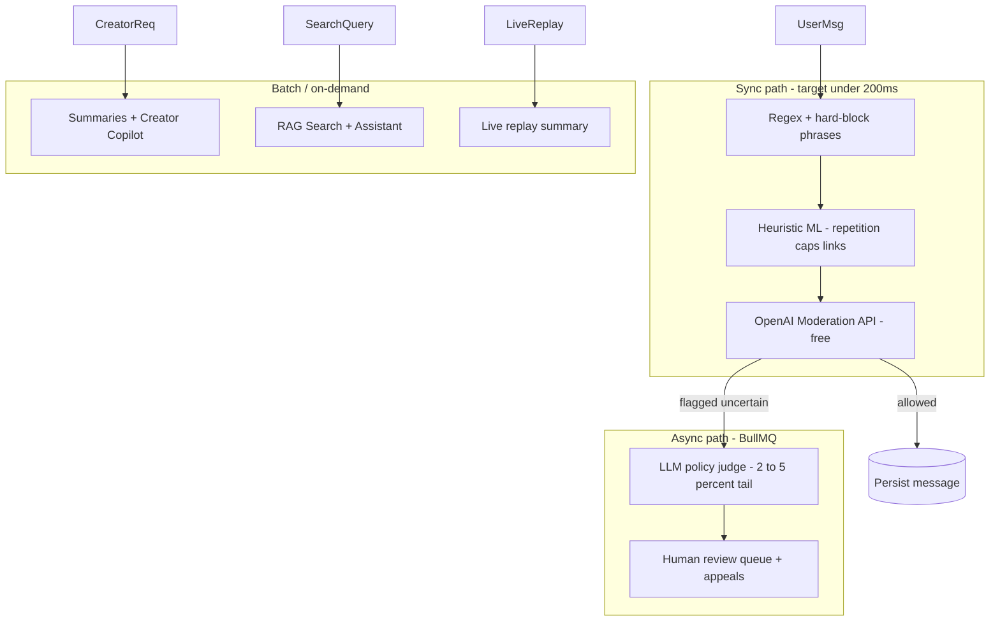
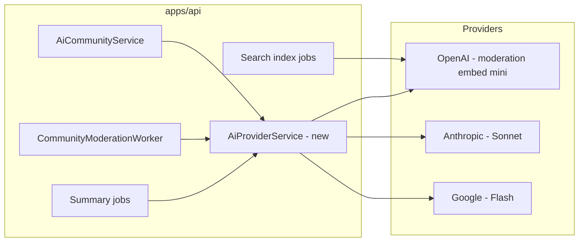

# FORGE AI / LLM Strategy — Audit, Provider Selection & Implementation Plan

**Vision reference:** [COMMUNITY-MODULE-2.0.md §Phase 9](../COMMUNITY-MODULE-2.0.md) (AI-Powered Community)  
**Implementation tracker:** [COMMUNITY-2.0-IMPLEMENTATION.md](./COMMUNITY-2.0-IMPLEMENTATION.md) (Phase I backlog)  
**Live AI moderation (shipped):** [LIVE.md](./LIVE.md)  
**Deferred triggers:** [audits/DEFERRED_BACKLOG.md](./audits/DEFERRED_BACKLOG.md)  
**Last updated:** 2026-06-21  
**Status:** Strategy doc — LLM pipeline **partial** (~48% AI module); production recommendation for Phase I rollout

---

## Executive Summary

There is **no single “best” LLM** for FORGE. Frontier model capability converged across providers in 2026; the decision is **which model for which workload**, not which vendor wins overall.

**Recommended FORGE stack:**

| Role | Provider / Model | Why |
|------|------------------|-----|
| **Primary provider** | **OpenAI** | Already integrated; free Moderation API; cheapest embeddings; best ecosystem |
| **Sync moderation** | OpenAI Moderation (`omni-moderation-latest`) | Free, ~10–50ms, text + image |
| **Async moderation judge** | Gemini 2.5 Flash or GPT-4.1-mini | Cheap; policy-as-prompt on ~2–5% tail only |
| **Creator copilot & summaries** | Claude Sonnet 4.x | Best writing quality; prompt caching for repeated context |
| **High-volume / live replay** | Gemini 2.5 Flash | Lowest cost; native multimodal (video/audio) |
| **Semantic search (RAG)** | OpenAI `text-embedding-3-small` + Neon pgvector | No new infra; deferred search sidecar fits here |
| **Churn / health scoring** | **Not LLM** — SQL + heuristics → optional ML classifier | Tabular prediction; LLM only for NL explanations |

**Architecture principle:** Multi-tier cascade — regex/heuristics + free Moderation API on the **sync hot path** (<200ms); expensive LLM only on the **async tail** via BullMQ. Model routing cuts API bills **60–80%** vs sending everything to a frontier model.

**If you must pick one provider to start:** **OpenAI** (lowest friction given existing code).  
**If you must pick one general workhorse model:** **GPT-4.1-mini** (or current GPT-5-mini equivalent).

---

## Table of Contents

1. [Scope & Planned Features](#1-scope--planned-features)
2. [Current Implementation Audit](#2-current-implementation-audit)
3. [Industry Research (June 2026)](#3-industry-research-june-2026)
4. [Provider Comparison](#4-provider-comparison)
5. [Feature-by-Feature Recommendations](#5-feature-by-feature-recommendations)
6. [Target Architecture](#6-target-architecture)
7. [Data Flow](#7-data-flow)
8. [Cost Analysis](#8-cost-analysis)
9. [Privacy & Compliance](#9-privacy--compliance)
10. [Environment Variables](#10-environment-variables)
11. [Phased Rollout Plan](#11-phased-rollout-plan)
12. [Known Gaps (Pre-Rollout)](#12-known-gaps-pre-rollout)
13. [What NOT to Do](#13-what-not-to-do)
14. [Testing & Validation](#14-testing--validation)
15. [Observability & Rollback](#15-observability--rollback)
16. [References](#16-references)

---

## 1. Scope & Planned Features

From [COMMUNITY-MODULE-2.0.md §Phase 9](../COMMUNITY-MODULE-2.0.md):

| Feature | LLM Required? | Priority | Phase |
|---------|---------------|----------|-------|
| Spam detection | Partial (classifier + optional LLM tail) | P0 | I-1 |
| AI moderator | Yes (async judge) | P0 | I-1 |
| Discussion summaries | Yes | P1 | I-2 |
| Creator copilot | Yes | P1 | I-2 |
| Live stream summaries | Yes (multimodal) | P2 | I-2 |
| AI content tagging | Yes (cheap model) | P2 | I-2 |
| Community assistant (RAG) | Yes (embed + generate) | P2 | J (search sidecar) |
| AI search | Yes (embeddings) | P2 | J-1 |
| Community health scoring | No (analytics/ML) | P3 | I-2 |
| Member risk prediction | No (analytics/ML) | P3 | I-2 |
| Subscription churn prediction | No (analytics/ML) | P3 | I-2 |
| Engagement prediction | No (analytics/ML) | P3 | I-2 |

**Implementation tracker status** ([COMMUNITY-2.0-IMPLEMENTATION.md](./COMMUNITY-2.0-IMPLEMENTATION.md)):

| Phase | Item | Status |
|-------|------|--------|
| I | I-1 ML moderation pipeline | Product priority — **this doc** |
| I | I-2 AI summaries, churn prediction, creator copilot | Phase I roadmap |
| J | J-1 Search sidecar (F-1302) | Trigger: 500K videos or FTS p95 degrade |

---

## 2. Current Implementation Audit

### 2.1 Module Completion Matrix

| Surface | Backend | Web | Mobile | Overall |
|---------|---------|-----|--------|---------|
| AI community | ~55% | ~40% studio copilot | — | **~48%** |

### 2.2 Shipped vs Stubbed

| Surface | File(s) | Implementation | LLM Used? | Status |
|---------|---------|----------------|-----------|--------|
| **Live stream chat** | `apps/api/src/common/chat/ai-moderation.util.ts`, `stream-chat.service.ts`, `stream-chat-ingest.worker.ts` | Hard-block phrases → OpenAI Moderation API | Yes (when `OPENAI_API_KEY` set) | **Production-ready** |
| **Community room messages** | `community-room-messages.service.ts`, `ai-community.service.ts` | Regex + heuristics; blocks sync | No | **Partial** |
| **Community posts/channels** | `communities.service.ts`, `ai-moderation.service.ts` | Regex patterns + length heuristics | No | **Partial** |
| **Async moderation queue** | `community-moderation.worker.ts`, BullMQ `COMMUNITY_MODERATION_QUEUE` | Creates auto spam report only | No LLM in worker | **Partial** |
| **Creator copilot (summaries)** | `ai-community.service.ts` → `summarizeDiscussion()` | Word-frequency + last-3-messages fallback | No | **Stub** |
| **Studio AI preview UI** | `StudioCreatorOpsPanel.tsx`, `community-ai.controller.ts` | Calls `/creators/me/ai/moderation/score` | Heuristic only | **UI exists** |
| **Audit logs** | `creator-audit.service.ts`, `community-ai.controller.ts` | Creator action history | N/A | **Shipped** |
| **AI Search / RAG** | — | Not implemented | — | **Deferred** |
| **Churn / health scoring** | — | Not implemented | — | **Deferred** |

### 2.3 Key Code Paths

**Live chat moderation (production pattern to replicate):**

```
stream-chat.service.ts / stream-chat-ingest.worker.ts
  → moderateChatMessage(body, { openAiKey, enabled })
    → hard-block phrase list (<1ms)
    → OpenAI POST /v1/moderations (if key set)
    → fail-open on API error (allowed: true)
```

**Community room messages (heuristic-only today):**

```
community-room-messages.service.ts → sendMessage()
  → aiCommunityService.scoreContent(trimmed)
    → AiModerationService.scoreSpam() — regex patterns
    → heuristics: repetition, caps, link spam
    → if flagged: enqueue BullMQ + throw ForbiddenException (sync block)
    → LLM hook: debug log only when ai.moderationLlmEnabled (config not wired)
```

**Async moderation worker (no LLM yet):**

```
community-moderation.worker.ts
  → moderationService.createAutoSpamReport(...)
```

### 2.4 Configuration State

| Config key | Env var | Wired? | Notes |
|------------|---------|--------|-------|
| `openai.apiKey` | `OPENAI_API_KEY` | ✅ | Used by live chat only |
| `stream.aiModerationEnabled` | `STREAM_AI_MODERATION_ENABLED` | ✅ | Default true |
| `ai.moderationLlmEnabled` | — | ❌ | Referenced in code; **not in `configuration.ts`** |
| `ai.*` provider keys | — | ❌ | Anthropic, Google not configured |
| Daily budget caps | — | ❌ | Not implemented |

### 2.5 API Routes (Community AI)

| Method | Route | Purpose | LLM? |
|--------|-------|---------|------|
| `POST` | `/creators/me/ai/moderation/score` | Score text for spam/toxicity (studio preview) | Heuristic |
| `GET` | `/creators/me/communities/:communityId/rooms/:roomId/summary` | Summarize recent room discussion | Deterministic stub |
| `GET` | `/creators/me/audit-logs` | Creator audit history | N/A |

---

## 3. Industry Research (June 2026)

### 3.1 Frontier Provider Landscape

Capability at the frontier tier (Opus, GPT-5.x, Gemini Pro) has **converged**. Production decisions in 2026 are driven by:

- **Cost per token** at your actual volume tier
- **Latency** (P50/P95 under concurrent load)
- **Ecosystem fit** (SDK, structured outputs, tool calling)
- **Prompt caching** economics (Anthropic: up to ~90% discount on cached input)
- **Multimodal** needs (Gemini leads on native video/audio)
- **Data retention / compliance** posture

Sources: [APIScout OpenAI vs Anthropic vs Gemini 2026](https://apiscout.dev/guides/openai-api-vs-anthropic-api-vs-gemini-api-2026), [Applied AI Studio enterprise comparison](https://studio.appliedai.club/blog/comparison/openai-vs-anthropic-vs-google-enterprise-llm), [SpiderHunts SaaS comparison](https://spiderhunts.com/blog/llm-api-comparison-openai-anthropic-gemini-saas-2026).

### 3.2 Approximate Pricing (June 2026 — verify before commit)

| Provider | Model | Input / Output (per MTok) | Context | Best For |
|----------|-------|----------------------------|---------|----------|
| OpenAI | GPT-5 nano | $0.05 / $0.40 | 128K | Edge, ultra-cheap |
| OpenAI | GPT-5 mini / GPT-4.1-mini | $0.25–1.75 / $2–14 | 128–400K | Lightweight production |
| OpenAI | GPT-5.2 / GPT-5.4 | $1.75–21 / $14–168 | 400K–1M | Mid/frontier general |
| OpenAI | text-embedding-3-small | $0.02 / — | 8K | RAG value pick |
| OpenAI | text-embedding-3-large | $0.13 / — | 8K | Higher-quality embeddings |
| OpenAI | Moderation API | **Free** | — | Sync safety classifier |
| Anthropic | Haiku 4.5 | $1 / $5 | 200K | High-volume low-latency |
| Anthropic | Sonnet 4.5/4.6 | $3 / $15 | 200K–1M | Creator-facing quality |
| Anthropic | Opus 4.6 | $5 / $25 | 1M | Reasoning, agentic |
| Google | Gemini 2.5/3 Flash | $0.30–0.50 / $2–3 | 1M | Highest volume / cheapest |
| Google | Gemini 3.1 Pro | $2 / $12 | 1M | Multimodal production |

**Note:** Pricing shifts frequently. Benchmark on your data and model current vendor pages before locking budgets.

### 3.3 Content Moderation Best Practices (2026)

Industry-standard **cascade architecture**:

| Tier | Method | Latency | Traffic handled |
|------|--------|---------|-----------------|
| 1 | Regex, blocklists, hard phrases | <10ms | Obvious violations |
| 2 | Lightweight classifier (OpenAI Moderation, heuristics) | 10–100ms | 85–97% of safe content |
| 3 | LLM policy-as-prompt judge | 1–3s (async) | Ambiguous 2–5% tail |
| 4 | Human review queue | Minutes–hours | 0.1–2% residue |

**Key insight:** Classifiers are cheap and fast but context-blind; LLM judges read nuance but cost ~100× more per decision. Production teams **cascade**, not choose one.

Sources: [Digital Applied AI Content Moderation 2026](https://www.digitalapplied.com/blog/ai-content-moderation-2026-llm-trust-safety-guide), [EHGA moderation pipelines 2026](https://ehga.org/building-content-moderation-pipelines-for-llms-a-2026-security-guide), [TianPan safety layer latency design](https://tianpan.co/blog/2026-04-16-safety-layer-latency-guardrails-design), [LLMversus moderation architecture](https://llmversus.com/architecture/content-moderation).

**Migration note:** Google **Perspective API sunsets December 31, 2026** with no extensions. Migrate to OpenAI Moderation, Azure Content Safety, or Hive if still referenced anywhere.

### 3.4 Embedding Models for RAG (2026)

| Model | MTEB (approx) | Dimensions | Cost/MTok | Best For |
|-------|---------------|------------|-----------|----------|
| Voyage voyage-3-large | ~68 | 1024 | $0.12 | Max retrieval quality |
| OpenAI text-embedding-3-large | ~64.6 | 3072 | $0.13 | OpenAI stack default |
| OpenAI text-embedding-3-small | ~62.3 | 1536 | **$0.02** | **Best value — FORGE default** |
| Cohere embed-v4 | — | 1024 | $0.10 | Multilingual + reranking |
| nomic-embed-text-v1.5 | ~62.4 | 768 | Free (self-host) | Zero-cost if ops acceptable |

Sources: [APIScout embedding comparison](https://apiscout.dev/guides/embedding-models-compared-openai-cohere-voyage-2026), [BulkMD RAG benchmark](https://bulkmd.app/blog/openai-voyage-cohere-embeddings-benchmark).

**FORGE fit:** Neon Postgres + pgvector (no new vector DB infra). Index community posts, wiki pages, course lessons async via BullMQ.

### 3.5 Model Routing (Multi-Provider)

| Option | Type | Pros | Cons | FORGE timing |
|--------|------|------|------|--------------|
| **Direct SDK calls** | In-app | Simplest; matches current `fetch` pattern | Manual failover | **Phase 0–2** |
| **OpenRouter** | Managed gateway | 400+ models, fast setup | ~5.5% markup; no native eval routing | Dev/staging optional |
| **LiteLLM** | Self-hosted proxy | Full control, BYOK, no markup | DevOps overhead; scale tuning | **Phase 4+** when 3+ providers in prod |

Sources: [Braintrust LLM routers 2026](https://www.braintrust.dev/articles/best-llm-routers-2026), [LLM API OpenRouter alternatives](https://llmapi.ai/best-openrouter-alternatives-2026-pick-the-right-ai-gateway-for-real-production-work/).

---

## 4. Provider Comparison

### 4.1 Summary Matrix (FORGE Workloads)

| Provider | Best FORGE Use Cases | Weakness | Verdict |
|----------|---------------------|----------|---------|
| **OpenAI** | Moderation (free), embeddings, tool calling, live chat (shipped) | Higher frontier cost | **Default — extend existing integration** |
| **Anthropic** | Creator copilot, summaries, policy-as-prompt judge | No free moderation API | **Secondary — quality-critical creator features** |
| **Google Gemini** | Bulk tagging, async judge, live replay multimodal | Weaker enterprise tooling vs OpenAI | **Cost optimizer + live replay** |
| **Azure Content Safety** | Custom moderation categories, enterprise compliance | Paid ($0.38/1K text) | Consider if creators need custom policy |
| **Self-hosted (Llama Guard, Ollama)** | Data sovereignty | Fly GPU ops, scaling, maintenance | **Skip for now** — ops > API savings at current scale |
| **Hive** | Dedicated T&S dashboards, custom policies | Commercial vendor cost | Enterprise tier option |

### 4.2 When to Pick Each (Decision Tree)

```
Need sync moderation on user messages?
  → OpenAI Moderation API (free) — already in live chat

Need creator-quality writing (summaries, copilot)?
  → Claude Sonnet (primary) + GPT-4.1-mini (fallback)

Need cheapest high-volume classification/tagging?
  → Gemini 2.5 Flash

Need semantic search over community content?
  → OpenAI text-embedding-3-small + Neon pgvector

Need video/audio replay summaries?
  → Gemini multimodal (or Whisper + text summary)

Need tabular churn/health prediction?
  → SQL analytics + ML classifier — NOT frontier LLM

Need custom brand-specific moderation rules only?
  → Azure Custom Categories OR async policy-as-prompt LLM judge
```

---

## 5. Feature-by-Feature Recommendations

### 5.1 Real-Time Moderation (Chat, Rooms, Posts)

**Recommendation:** OpenAI Moderation API (sync) + optional async LLM judge (tail).

| Aspect | Detail |
|--------|--------|
| **Sync path** | Hard-block list → OpenAI Moderation → allow/block (<200ms) |
| **Model** | `omni-moderation-latest` (text + image for post attachments) |
| **Cost** | **$0** — free for OpenAI API users; does not count toward usage limits |
| **Fail behavior** | Fail-open (match live chat) — log + allow on API error |
| **Gap** | Wire `moderateChatMessage()` into `CommunityRoomMessagesService` and posts pipeline |

**Async tail judge (2–5% ambiguous cases):**

| Model | Use when |
|-------|----------|
| Gemini 2.5 Flash | Default — lowest cost at volume |
| GPT-4.1-mini / GPT-5-mini | Need structured JSON policy output |
| Claude Haiku 4.5 | Harassment/satire/context edge cases |

**Creator-specific rules** (e.g. “no competitor links”): encode as policy-as-prompt in async judge only — not on sync hot path.

### 5.2 Discussion Summaries & Creator Copilot

**Recommendation:** Claude Sonnet 4.x (primary), GPT-4.1-mini (fallback/batch).

| Aspect | Detail |
|--------|--------|
| **Replace** | Deterministic `summarizeDiscussion()` in `ai-community.service.ts` |
| **Trigger** | Creator request via studio; optional scheduled digest (BullMQ) |
| **Caching** | Anthropic prompt caching for repeated community rules/context |
| **Guardrails** | Daily token budget per creator; feature flag `AI_SUMMARIES_ENABLED` |

### 5.3 AI Search & Community Assistant (RAG)

**Recommendation:** OpenAI embeddings + Neon pgvector + cheap generation model.

| Component | Choice |
|-----------|--------|
| Embeddings | `text-embedding-3-small` ($0.02/MTok) |
| Upgrade path | Voyage `voyage-3` if retrieval quality insufficient |
| Vector store | pgvector on Neon Postgres |
| Chunk sources | Posts, wiki, course lessons, announcements |
| Indexing | Async BullMQ job on create/update |
| Generation | Gemini Flash or GPT-4.1-mini |
| Reranking (optional) | Cohere `rerank-v3.5` on top-20 hits |

**Trigger:** [DEFERRED_BACKLOG.md J-1](./audits/DEFERRED_BACKLOG.md) — 500K videos or FTS p95 degrade.

### 5.4 Live Stream Summaries

**Recommendation:** Google Gemini (multimodal) or Whisper + text summary.

| Pipeline step | Tool |
|---------------|------|
| Input | Mux replay URL, existing chat archive, or transcript |
| Transcription (if needed) | OpenAI Whisper |
| Draft summary | Gemini 2.5 Flash (native video/audio) |
| Creator polish (optional) | Claude Sonnet pass |

### 5.5 AI Content Tagging

**Recommendation:** Gemini 2.5 Flash or GPT-4.1-mini — batch via BullMQ on post publish.

Low complexity classification; route to cheapest model with structured output schema.

### 5.6 Churn, Health, Engagement Prediction

**Recommendation:** **Not LLM-first.**

| Layer | Approach |
|-------|----------|
| Features | Login frequency, message count, subscription tenure, tier changes, live attendance |
| Model | SQL aggregations → heuristics → optional XGBoost/logistic regression |
| LLM role | Natural-language explanation of scores in creator dashboard only |

---

## 6. Target Architecture

### 6.1 Multi-Tier Cascade



### 6.2 Provider Abstraction (Target)



**Phase 0–2:** Thin `AiProviderService` with direct SDK/fetch calls — **not** LiteLLM on Fly initially (ops overhead).  
**Phase 4+:** LiteLLM sidecar or OpenRouter if multi-provider failover is required at scale.

### 6.3 Module Layout (Proposed)

```
apps/api/src/modules/ai/
  ai.module.ts
  ai-provider.service.ts       # unified call + routing + budget caps
  ai-moderation.service.ts     # move/extend from communities
  ai-summary.service.ts
  ai-embedding.service.ts      # Phase 3
  dto/
  constants/
```

Keep community-specific orchestration in `communities/`; shared provider logic in `ai/`.

---

## 7. Data Flow

### 7.1 Community Room Message Send (Target)

```
1. Client POST /communities/:id/rooms/:roomId/messages
2. Auth + entitlement + ban check
3. SYNC (<200ms):
   a. Hard-block phrases
   b. Heuristic score (existing AiCommunityService)
   c. OpenAI Moderation API (new — parity with live chat)
   d. If any tier flags → reject + enqueue async job (do NOT wait for LLM judge)
4. Rate limit (Redis 3s NX)
5. Persist message + Socket.IO broadcast
6. ASYNC (BullMQ community-moderation):
   a. If heuristic score in uncertainty band (e.g. 0.35–0.55) → LLM judge
   b. LLM confirms violation → create report, optional retroactive action
   c. Log decision to creator_audit_logs
```

### 7.2 Live Chat (Shipped — Reference)

```
stream-chat.service / stream-chat-ingest.worker
  → moderateChatMessage(body, { openAiKey, enabled: stream.aiModerationEnabled })
  → fail-open on error
```

### 7.3 Creator Summary Request

```
1. GET /creators/me/communities/:id/rooms/:roomId/summary
2. Load last N messages (paginated, max 50)
3. Check creator daily budget (Redis counter)
4. Call AiProviderService.summarize({ messages, communityContext })
5. Cache result 5–15 min (Redis) keyed by roomId + lastMessageId
6. Audit log: action=ai_summary, resourceType=room
7. Return summary text
```

### 7.4 RAG Search Index (Future)

```
1. On post/wiki/lesson create or update → enqueue search-index job
2. Worker: chunk text → embed via OpenAI → upsert pgvector
3. On search query: embed query → vector similarity + optional BM25 (Postgres FTS)
4. Top-K → optional Cohere rerank → LLM generate answer with citations
5. Return sources + answer to client
```

---

## 8. Cost Analysis

### 8.1 Assumptions

| Parameter | Value |
|-----------|-------|
| DAU | 100,000 |
| Messages/day | 500,000 |
| Moderation sync | OpenAI Moderation — **$0** |
| Async LLM judge rate | 2% of messages = 10,000/day |
| Summary requests/day | 1,000 |
| Avg summary tokens | ~2,000 in + 500 out |

### 8.2 Estimated Daily Cost (100K DAU)

| Workload | Model | Est. daily cost |
|----------|-------|-----------------|
| Sync moderation | OpenAI Moderation | **$0** |
| Async judge (10K msgs × ~500 tok) | Gemini Flash | $2–5 |
| Creator summaries (1K × 2.5K tok) | Claude Sonnet | $15–25 |
| Embeddings (10K docs/month amortized) | embedding-3-small | ~$0.02/day |
| **Total** | | **~$20–35/day** |

At **10K DAU:** likely **<$5/day** with routing and caching.

### 8.3 Cost Controls (Required)

| Control | Mechanism |
|---------|-----------|
| Per-creator daily token budget | Redis counter + `AiProviderService` gate |
| Feature flags | Env toggles per capability |
| Model routing | Cheap model default; escalate only on low confidence |
| Prompt caching | Anthropic cached system prompts for copilot |
| Result caching | Redis TTL on summaries (5–15 min) |
| Async-only LLM | Never block Socket.IO/API on frontier model |
| Idempotent index jobs | BullMQ jobId on content version hash |

### 8.4 Self-Hosting Break-Even

Running Llama Guard / Ollama on Fly GPU typically **exceeds** API costs until very high volume (>1M moderated messages/day) **and** dedicated ML ops. **Not recommended** for FORGE Phase I.

---

## 9. Privacy & Compliance

### 9.1 Data Sent to Providers

| Data type | Sent to LLM? | Mitigation |
|-----------|--------------|------------|
| User chat/room messages | Yes (moderation, summaries) | Minimize payload; truncate in logs |
| Creator policy/rules | Yes (copilot system prompt) | Prompt caching; no PII in rules |
| Payment/billing data | **Never** | Hard exclude from AI pipelines |
| Email/phone | **Never** in prompts | Redact before send |
| Live replay video | Optional (Gemini) | Creator opt-in; retention policy |

### 9.2 Provider Data Retention

| Provider | Zero retention option | Notes |
|----------|----------------------|-------|
| OpenAI | API data controls / ZDR for enterprise | Review [OpenAI API data usage](https://platform.openai.com/docs/guides/your-data) |
| Anthropic | Commercial terms | No training on API inputs by default |
| Google Vertex | GCP contract controls | Prefer Vertex for regulated workloads |

### 9.3 FORGE Product Requirements

| Requirement | Implementation |
|-------------|----------------|
| User disclosure | Terms/privacy update — AI moderation + optional AI features |
| Audit trail | `creator_audit_logs` + new `ai_decision_logs` table (recommended) |
| Appeals path | Human review queue for false positives (existing report flow) |
| Creator opt-in | Summaries/copilot behind creator settings flag |
| Fail-open vs fail-closed | **Fail-open on provider outage** (match live chat) for availability; log all skips |
| Log retention | Align with `STREAM_CHAT_ARCHIVE_DAYS` / community retention policy |

### 9.4 Security Checklist

- [ ] API keys in Fly secrets only — never commit
- [ ] Rate limit AI endpoints (creator copilot abuse)
- [ ] Input max length before LLM call (token budget)
- [ ] Output sanitization (no HTML/script in summaries shown in UI)
- [ ] Prompt injection awareness for RAG (community wiki content is untrusted)

---

## 10. Environment Variables

### 10.1 Shipped Today

```bash
# apps/api/.env.example (existing)
OPENAI_API_KEY=sk-...                    # Live chat moderation
STREAM_AI_MODERATION_ENABLED=true        # Default true
```

### 10.2 Proposed (Phase I)

```bash
# --- AI core ---
AI_ENABLED=true                          # Master kill switch
AI_MODERATION_LLM_ENABLED=false          # Async LLM judge (Phase 1)
AI_MODERATION_SYNC_OPENAI=true           # OpenAI Moderation on community rooms/posts
AI_SUMMARIES_ENABLED=false               # Phase 2
AI_SEARCH_ENABLED=false                  # Phase 3

# --- Provider keys ---
OPENAI_API_KEY=sk-...
ANTHROPIC_API_KEY=sk-ant-...             # Phase 2 — summaries/copilot
GOOGLE_AI_API_KEY=...                    # Phase 1 async judge / Phase 2 live summary

# --- Model selection (override defaults) ---
AI_MODERATION_JUDGE_MODEL=gemini-2.5-flash
AI_SUMMARY_MODEL=claude-sonnet-4-6
AI_EMBEDDING_MODEL=text-embedding-3-small

# --- Budget caps ---
AI_DAILY_TOKEN_BUDGET_PER_CREATOR=100000 # Tokens/day/creator for on-demand AI
AI_SUMMARY_CACHE_TTL_SEC=600             # Redis cache for room summaries

# --- Community moderation thresholds ---
AI_MODERATION_UNCERTAINTY_MIN=0.35       # Async LLM judge band lower bound
AI_MODERATION_UNCERTAINTY_MAX=0.55       # Async LLM judge band upper bound
AI_MODERATION_BLOCK_THRESHOLD=0.45       # Sync heuristic block (existing)
```

Add corresponding entries to `apps/api/src/config/configuration.ts` under an `ai` namespace.

---

## 11. Phased Rollout Plan

### Phase 0 — Parity & Config (Small, merge-worthy)

| Task | Detail |
|------|--------|
| Add `ai` config block | `configuration.ts` + `.env.example` |
| Wire OpenAI Moderation into community rooms | Reuse `moderateChatMessage()` in `community-room-messages.service.ts` |
| Wire OpenAI Moderation into posts | Same util in `community-posts.service.ts` |
| Unit tests | Extend `ai-community.service.spec.ts`, room message specs |
| Smoke | `scripts/smoke-community-2.0.sh` — moderation path |

**Provider:** OpenAI only. **Risk:** Low.

### Phase 1 — Async LLM Judge (Medium)

| Task | Detail |
|------|--------|
| Implement `AiProviderService` | Single provider (Gemini Flash or GPT-4.1-mini) |
| Update `CommunityModerationWorker` | Call LLM for uncertainty band; structured policy JSON |
| `ai_decision_logs` migration | Audit model, score, reasons, latency |
| Creator audit integration | Log async decisions |

**Provider:** OpenAI + Google (or OpenAI only). **Risk:** Medium — tune false positive rate.

### Phase 2 — Summaries & Copilot (Medium)

| Task | Detail |
|------|--------|
| Replace `summarizeDiscussion()` | Real LLM via `AiProviderService` |
| Budget caps + Redis cache | Per-creator limits |
| Studio UI | Show model used, refresh, token budget indicator |
| Anthropic integration | Sonnet for quality |

**Provider:** OpenAI + Anthropic. **Risk:** Medium — cost if uncapped.

### Phase 3 — RAG Search (Large)

| Task | Detail |
|------|--------|
| pgvector migration on Neon | Embeddings table + indexes |
| BullMQ index worker | Posts, wiki, lessons |
| Search API | `/communities/:id/search?q=` |
| Community assistant endpoint | Optional chat over retrieved context |

**Trigger:** J-1 in deferred backlog OR product priority. **Provider:** OpenAI embed + Gemini/Sonnet gen.

### Phase 4 — Multi-Provider Router (When justified)

| Task | Detail |
|------|--------|
| Failover routing | Primary → fallback provider |
| LiteLLM sidecar OR OpenRouter | Evaluate at 3+ providers in prod |
| Cost dashboard | Per-feature token spend |

**Trigger:** Provider outage impact or >$500/day AI spend.

---

## 12. Known Gaps (Pre-Rollout)

| # | Gap | File / Area | Priority |
|---|-----|-------------|----------|
| 1 | `ai.moderationLlmEnabled` referenced but not in config | `configuration.ts` | P0 |
| 2 | Community rooms lack OpenAI Moderation (live chat has it) | `community-room-messages.service.ts` | P0 |
| 3 | Community posts lack OpenAI Moderation | `community-posts.service.ts` | P0 |
| 4 | Moderation worker does not call LLM | `community-moderation.worker.ts` | P1 |
| 5 | Summaries are deterministic stub | `ai-community.service.ts` | P1 |
| 6 | No Anthropic/Google keys or config | `configuration.ts` | P1 |
| 7 | No per-creator token budget | New | P1 |
| 8 | No AI-specific observability metrics | `OBSERVABILITY.md` | P1 |
| 9 | No `ai_decision_logs` table | New migration | P2 |
| 10 | Mobile studio copilot UI | `studio_*` screens | P2 |

---

## 13. What NOT to Do

| Anti-pattern | Why |
|--------------|-----|
| Run frontier LLM on every message synchronously | 300–500ms+ latency; cost scales linearly with traffic |
| Self-host Llama Guard on Fly at current scale | GPU ops cost > API savings |
| Deploy LiteLLM before 2+ providers in prod | Operational overhead without benefit |
| Use LLM for churn/health prediction | Tabular ML is cheaper and more accurate |
| Fail-closed on moderation API outage | Blocks all chat — match live chat fail-open |
| Send billing/PII to LLM prompts | Compliance risk |
| Skip human review queue | 0.1–2% of content needs human judgment for nuanced policy |
| Block community messages on heuristic only without Moderation API | Higher false positive rate vs live chat |

---

## 14. Testing & Validation

### 14.1 Unit Tests

| Module | Spec file | Coverage |
|--------|-----------|----------|
| Heuristic moderation | `ai-moderation.service.spec.ts` | Pattern match, length |
| Layered scoring | `ai-community.service.spec.ts` | Heuristic + model tag |
| Chat moderation util | New spec for `ai-moderation.util.ts` | Hard-block, fail-open |
| AiProviderService | New | Mock provider responses, budget gate |

### 14.2 Integration / E2E

| Test | Location |
|------|----------|
| AI score endpoint | `community-http.e2e-spec.ts` (existing) |
| Room summary endpoint | e2e (existing) |
| Moderation block path | smoke `scripts/smoke-community-2.0.sh` |

### 14.3 Golden Dataset (Recommended)

Maintain **2,000–5,000 labeled examples** for quarterly eval:

| Category | Examples |
|----------|----------|
| Clean messages | General community chat |
| Spam | Links, repetition, caps |
| Harassment edge cases | Satire vs attack |
| Creator policy violations | Custom rules per community type |

Run regression when switching models or updating policy prompts.

### 14.4 Validation Gates (per `COMMUNITY-2.0-IMPLEMENTATION.md`)

| Dimension | AI-specific checks |
|-----------|-------------------|
| API | Auth (creator guards), input length limits, budget exceeded → 429 |
| Security | No PII in logs; key rotation documented |
| Performance | Sync path P95 <200ms; LLM async only |
| Cost | Budget cap enforced in tests |
| Rollback | Feature flags disable AI without code deploy |

---

## 15. Observability & Rollback

### 15.1 Metrics (Add to OBSERVABILITY.md)

| Metric | Type | Labels |
|--------|------|--------|
| `ai_moderation_sync_total` | Counter | result, surface (live/room/post) |
| `ai_moderation_async_total` | Counter | model, decision |
| `ai_provider_latency_ms` | Histogram | provider, model, operation |
| `ai_tokens_total` | Counter | provider, model, feature |
| `ai_budget_exceeded_total` | Counter | creator_id |
| `ai_provider_errors_total` | Counter | provider, error_code |

### 15.2 Logging

Structured logs (no raw message body in prod):

```json
{
  "event": "ai_moderation_decision",
  "surface": "community_room",
  "communityId": "...",
  "model": "omni-moderation-latest",
  "flagged": true,
  "categories": ["harassment"],
  "latencyMs": 42,
  "messageHash": "sha256:..."
}
```

### 15.3 Rollback

| Scenario | Action |
|----------|--------|
| High false positive rate | Set `AI_MODERATION_SYNC_OPENAI=false`; heuristics only |
| Provider outage | Automatic fail-open (existing behavior) |
| Cost spike | Set `AI_ENABLED=false` or reduce `AI_DAILY_TOKEN_BUDGET_PER_CREATOR` |
| Bad summary quality | Set `AI_SUMMARIES_ENABLED=false`; revert to deterministic stub |

All toggles via env — no redeploy required if Fly secrets updated + restart.

---

## 16. References

### Internal

- [COMMUNITY-MODULE-2.0.md §Phase 9](../COMMUNITY-MODULE-2.0.md) — AI feature spec
- [COMMUNITY-2.0-IMPLEMENTATION.md](./COMMUNITY-2.0-IMPLEMENTATION.md) — Phase I/J tracker
- [LIVE.md](./LIVE.md) — Shipped live chat AI moderation
- [audits/DEFERRED_BACKLOG.md](./audits/DEFERRED_BACKLOG.md) — Search sidecar trigger
- [OBSERVABILITY.md](./OBSERVABILITY.md) — Metrics baseline
- [operations/REDIS_CONNECTIONS.md](./operations/REDIS_CONNECTIONS.md) — Redis for budget/cache

### External (June 2026)

- [OpenAI vs Anthropic vs Gemini API 2026 — APIScout](https://apiscout.dev/guides/openai-api-vs-anthropic-api-vs-gemini-api-2026)
- [Enterprise LLM provider comparison — Applied AI Studio](https://studio.appliedai.club/blog/comparison/openai-vs-anthropic-vs-google-enterprise-llm)
- [LLM API comparison for SaaS — SpiderHunts](https://spiderhunts.com/blog/llm-api-comparison-openai-anthropic-gemini-saas-2026)
- [AI Content Moderation 2026 — Digital Applied](https://www.digitalapplied.com/blog/ai-content-moderation-2026-llm-trust-safety-guide)
- [Moderation pipeline security guide — EHGA](https://ehga.org/building-content-moderation-pipelines-for-llms-a-2026-security-guide)
- [Safety layer latency design — TianPan](https://tianpan.co/blog/2026-04-16-safety-layer-latency-guardrails-design)
- [Realtime moderation architecture — LLMversus](https://llmversus.com/architecture/content-moderation)
- [OpenAI Moderation API pricing — Evolink](https://evolink.ai/blog/openai-moderation-api-pricing)
- [OpenAI vs Azure Content Safety — AI Safety Directory](https://aisecurityandsafety.org/compare/openai-moderation-api-vs-azure-ai-content-safety/)
- [Embedding models compared — APIScout](https://apiscout.dev/guides/embedding-models-compared-openai-cohere-voyage-2026)
- [LLM routers 2026 — Braintrust](https://www.braintrust.dev/articles/best-llm-routers-2026)
- [LLM selection guide + benchmarks — Iternal](https://iternal.ai/llm-selection-guide)

### Code References

| File | Purpose |
|------|---------|
| `apps/api/src/common/chat/ai-moderation.util.ts` | OpenAI Moderation (live chat) |
| `apps/api/src/modules/communities/ai-community.service.ts` | Heuristic + summary stub |
| `apps/api/src/modules/communities/ai-moderation.service.ts` | Regex spam patterns |
| `apps/api/src/modules/communities/community-ai.controller.ts` | Creator AI API routes |
| `apps/api/src/modules/workers/community-moderation/community-moderation.worker.ts` | Async queue worker |
| `apps/api/src/config/configuration.ts` | `openai.apiKey` (extend with `ai` block) |
| `apps/web/src/components/Community/StudioCreatorOpsPanel.tsx` | Studio AI preview UI |

---

## Maintenance

| Change | Update |
|--------|--------|
| New AI feature shipped | This doc + `COMMUNITY-2.0-IMPLEMENTATION.md` Phase I/J |
| New env vars | `apps/api/.env.example` + §10 here |
| Provider pricing shift | §3.2 + §8 cost tables |
| New provider integrated | §4 + §6.2 architecture |
| AI metrics added | `OBSERVABILITY.md` |

*Pricing and model names change frequently — re-verify vendor pages before each rollout phase.*
