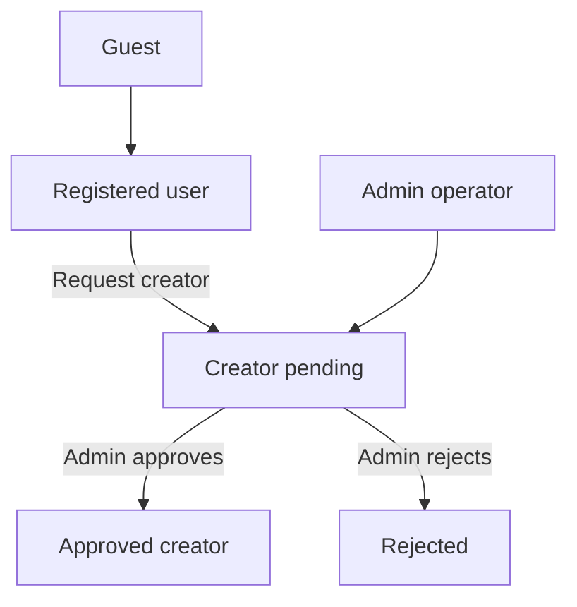

# FORGE — Client Overview

**Document type:** Executive summary for stakeholders  
**Version:** 1.0 · **Date:** May 2026  
**Full specification:** [FORGE_PROJECT_MASTER.md](./FORGE_PROJECT_MASTER.md)

---

## 1. What is FORGE?

**FORGE** is a **skill-first live creator platform**. It helps people who teach crafts, trades, and tutorials to:

- Publish **on-demand video lessons** (upload → automatic processing → adaptive streaming)
- **Go live** to teach in real time
- Build an **audience around expertise**, not only viral entertainment

Learners discover content through **categories, search, and personalized feeds**, follow creators, and track progress with **watch history** and **continue watching**.

The platform is delivered as **one integrated product** across four surfaces, all powered by a single backend:

| Surface | Who uses it | Technology |
|---------|-------------|------------|
| **Web app** | Learners and creators (browser) | Next.js 14 |
| **Mobile app** | Learners and creators (iOS / Android) | Flutter |
| **Admin panel** | Platform operators | Next.js 14 |
| **API & workers** | All clients + background jobs | NestJS, PostgreSQL, Redis |

---

## 2. Business goals

| Goal | How FORGE delivers |
|------|-------------------|
| **Skill-first discovery** | Categories, skill tags, search, feeds (latest / popular / personalized) |
| **Trusted creator supply** | Users request creator status; admins approve before upload and live |
| **Professional video delivery** | Secure upload to cloud storage → transcoding to multi-quality HLS → CDN playback |
| **Live teaching** | Integrated live streaming with industry-standard provider (Mux) |
| **Engagement** | Likes, comments, follows, playlists, notifications, watch history |
| **Platform control** | Admin dashboard: users, content moderation, reports, creator queue, analytics |
| **Multi-device reach** | Same account and API for web, mobile, and admin |

---

## 3. User roles

| Role | Capabilities |
|------|----------------|
| **Guest** | Browse public feed and search; sign in required to like, comment, follow, or upload |
| **User** | Full consumption: watch, engage, playlists, notifications, profile, request creator access |
| **Creator (approved)** | Upload videos, go live, creator studio (web + mobile shells) |
| **Admin** | Separate admin app: approve creators, moderate content, manage categories, handle reports |

---

## 4. What has been delivered (MVP)

The following **core product loop** is implemented end-to-end:

1. **Sign up / sign in** — email and password, JWT sessions, password reset  
2. **Discover** — home feed, search, categories, explore (web + mobile)  
3. **Watch** — adaptive HLS playback, comments, realtime updates  
4. **Engage** — like, comment, follow, playlists, notifications  
5. **Become a creator** — request → admin approval workflow with dedicated UX  
6. **Upload & process video** — presigned cloud upload → background transcoding → playback ready notification  
7. **Go live** — API and Mux integration; live directory on web and mobile  
8. **Operate the platform** — admin dashboard, user management, creator queue, content and reports moderation  

### Delivery status by area

| Area | API & database | Web | Mobile | Admin |
|------|:------------:|:---:|:------:|:-----:|
| Authentication & accounts | ✅ | ✅ | ✅ | ✅ |
| Feed & discovery | ✅ | ✅ | ✅ | — |
| Search | ✅ | ✅ | ✅ | ✅ |
| Watch & engagement | ✅ | ✅ | ✅ | — |
| Creator approval flow | ✅ | ✅ | ✅ | ✅ |
| Video upload & processing | ✅ | ✅ | ⚠️ placeholder UI | — |
| Creator studio | ✅ | ✅ | ✅ | — |
| Live streaming | ✅ | ⚠️ partial UX | ⚠️ partial UX | — |
| Playlists | ✅ | ✅ | — | — |
| Notifications | ✅ | ✅ | ✅ | — |
| Watch history / continue watching | ✅ | ✅ | ✅ | — |
| Reports & moderation | ✅ | — | — | ✅ |
| Analytics (events + admin summary) | ⚠️ partial | — | — | ⚠️ partial |

**Legend:** ✅ Complete for MVP · ⚠️ Partial (backend or one client ahead of others) · — Not applicable on that surface

*Detailed matrix: [FORGE_PROJECT_MASTER.md §24](./FORGE_PROJECT_MASTER.md#24-implementation-status-mvp-audit)*

---

## 5. Technology foundation (summary)

| Layer | Choice | Why it matters for you |
|-------|--------|------------------------|
| Backend | NestJS modular monolith | One deployable API; clear modules; can split later if scale requires |
| Database | PostgreSQL 16 | Reliable relational data; full-text search built in |
| Cache & jobs | Redis + BullMQ | Fast feeds; reliable video processing queue |
| Media | AWS S3 + CloudFront | Secure uploads; global video delivery |
| Live | Mux | Production-grade live streaming without building encoders |
| Realtime | Socket.IO | Instant notifications (video ready, comments, stream started) |
| Containers & CI | Docker, GitHub Actions | Repeatable deploys and automated quality checks |

The architecture is intentionally **pragmatic**: proven stack first; advanced services (dedicated search engine, ML recommendations, data warehouse) only when metrics justify cost. See [phase4-platform-evaluation.md](./phase4-platform-evaluation.md).

---

## 6. Security and compliance posture (MVP)

- Password hashing (bcrypt), short-lived access tokens, refresh token rotation  
- Rate limiting on authentication and sensitive routes  
- Role-based access: user, creator, admin; creator upload/live gated on approval + verification  
- Presigned uploads with size and content-type limits  
- User reports flow into admin moderation queue  
- Correlation IDs on API errors for support and debugging  
- Production checklist before go-live: [FORGE_PROJECT_MASTER.md §25](./FORGE_PROJECT_MASTER.md#25-production-readiness)

---

## 7. Roadmap (high level)

| Phase | Focus |
|-------|--------|
| **Now (MVP hardening)** | Client parity (mobile upload, live UX polish), email verification completeness, test coverage |
| **Production scale** | Connection pooling, horizontal API/workers, monitoring (Sentry, metrics), multi-instance realtime |
| **Growth features** | Creator analytics dashboards, schedule publish UI, push notifications, social login |
| **Platform scale (metrics-gated)** | Dedicated search, recommendation ML, analytics warehouse, transcoding scale-out |

Full roadmap: [FORGE_PROJECT_MASTER.md §26](./FORGE_PROJECT_MASTER.md#26-growth-and-scale-roadmap)

---

## 8. Design and brand

- **Positioning:** Modern learning product — familiar video-app patterns, **distinct** visual identity (not a YouTube clone)  
- **Design system:** Shared tokens and components (`packages/design-system`)  
- **Screen specifications:** [ui-ux-design-prompt-any-ai.md](./ui-ux-design-prompt-any-ai.md)

---

## 9. Demo and handoff

**Local demo (engineering):** See root [README.md](../README.md) — Docker for Postgres/Redis, `npm run dev:api|web|admin`, Flutter for mobile.

| Service | Local URL |
|---------|-----------|
| Web | http://localhost:3000 |
| API | http://localhost:3001/api/v1 |
| API docs (dev) | http://localhost:3001/api/docs |
| Admin | http://localhost:3002 |

**Production:** Fly.io (API) + Vercel (web/admin) via GitHub Actions; optional VPS path with `docker-compose.prod.yml`. See [MVP_GO_LIVE.md](./MVP_GO_LIVE.md) and [CI_CD.md](./CI_CD.md).

---

## 10. Document index

| Need | Document |
|------|----------|
| This overview | `CLIENT_OVERVIEW.md` (this file) |
| Full product + technical spec | [FORGE_PROJECT_MASTER.md](./FORGE_PROJECT_MASTER.md) |
| Setup & run | [README.md](../README.md) |
| UI/UX for design tools | [ui-ux-design-prompt-any-ai.md](./ui-ux-design-prompt-any-ai.md) |
| CI/CD & deploy | [CI_CD.md](./CI_CD.md) |
| All docs listed | [README.md](./README.md) |

---

*Questions or scope changes should be reflected in FORGE_PROJECT_MASTER.md first, then the status table in §4 of this overview.*
