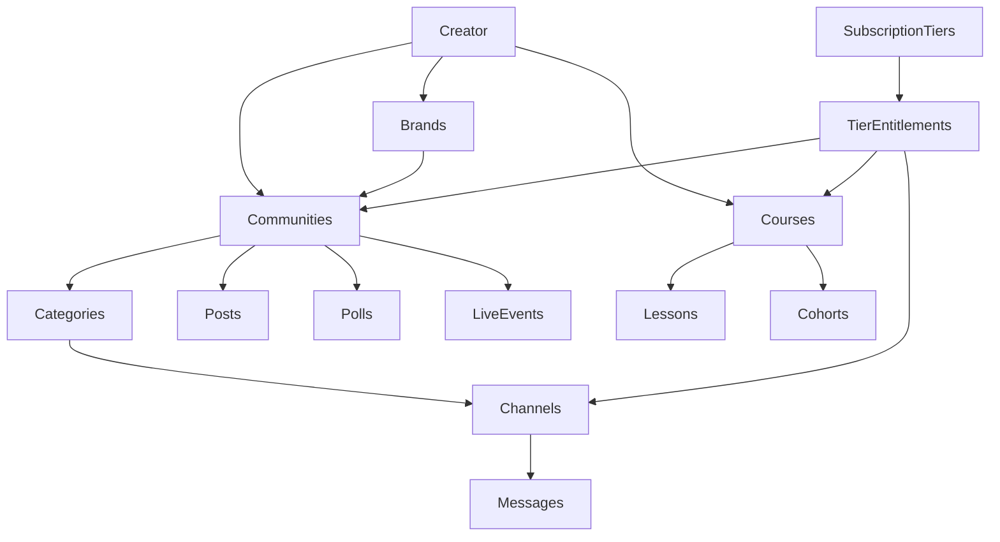
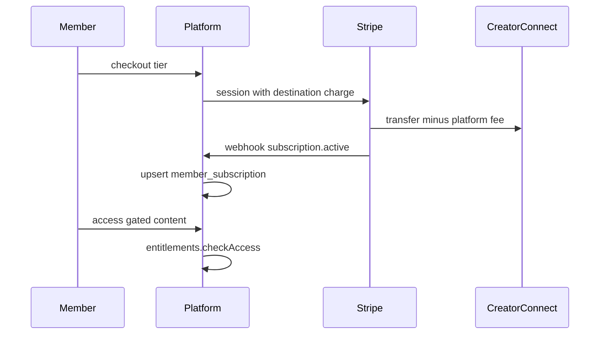
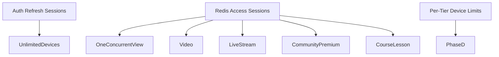
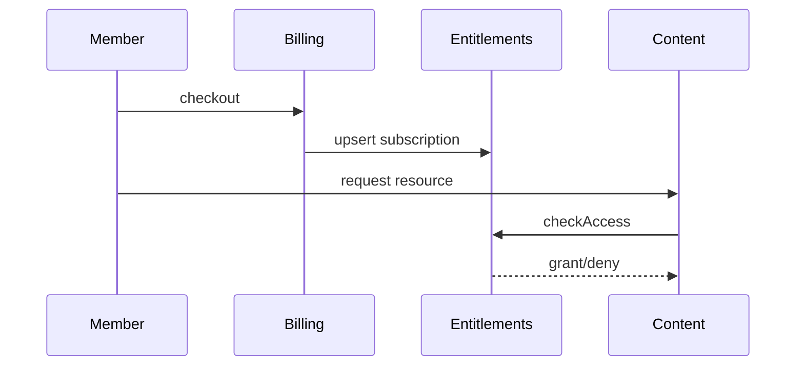

# FORGE Community 2.0 + Creator Economy OS — Implementation Master Document

**Vision reference:** [COMMUNITY-MODULE-2.0.md](../COMMUNITY-MODULE-2.0.md)  
**Memberships:** [MEMBERSHIPS.md](./MEMBERSHIPS.md)  
**Last updated:** 2026-06-19 (Phase D substantially complete)  
**Overall progress:** ~90% of full Creator Economy OS vision

---

## Executive Summary

FORGE has a **production-viable Community 2.0 + Creator Economy foundation** covering multi-community, brands, categorized channels, realtime chat with threads, posts/announcements/comments/reactions (with image + video embed attachments), polls, moderation RBAC, tier entitlements with **per-tier device caps**, access sessions, Stripe recurring checkout with **destination charges**, **in-place tier changes**, Connect onboarding, community analytics with retention + cohort charts, creator BI funnel, discovery search, gamification (XP, streaks, badges), courses LMS (API + web/mobile UI), community-scoped live, async moderation queue, durable announcement outbox, stage-mode raise hand, and mobile parity.

**Strengths:** Unified entitlement engine, creator studio (web + mobile), access session enforcement, async announcement fan-out via outbox, Stripe Connect payouts, in-place subscription tier changes, creator BI funnel + cohort retention.  
**Remaining gaps (deferred):** Search sidecar (500K videos trigger), ML moderation pipeline, voice/breakout rooms, formal 50K MAU load validation.

---

## Recent Ship Log

| Date | Items |
|------|-------|
| 2026-06-19 | **Phase B complete:** M-1 destination charges, M-3 in-place tier change, S5-1 courses LMS, G-3 badges/streaks, L-2 community-scoped live, mobile parity (X-M1–X-M4) |
| 2026-06-19 | **Phase C foundation:** L-3 raise hand/stage mode, BI-1 retention metrics, AI-2 async moderation queue, CR-M mobile moderation UI |
| 2026-06-19 | Migration `1827000000000` — course lessons/enrollments/progress, member_xp last_check_in_at, streams.community_id |
| 2026-06-19 | **Mobile parity pass:** course publish/tier access, gamification check-in/badges, poll vote %, analytics funnel/cohorts |
| 2026-06-19 | **Courses polish:** publish API, tier access panel on course detail, resource pickers on tiers page |
| 2026-06-19 | **Mobile polish:** cohort retention bars in studio analytics, community Go Live picker |
| 2026-06-19 | **Phase D continued:** Subscriber cohort retention (weekly/monthly) + studio/mobile BI charts |
| 2026-06-19 | **Phase D continued:** Creator BI funnel API + web chart, video embed attachments, mobile lesson editor, load-test script |
| 2026-06-19 | **Phase D continued:** C-4 post media attachments, SC-1 platform event outbox, creator BI daily trends, mobile courses UI |
| 2026-06-19 | **Phase D started:** D-3 per-tier device limits, courses web UI, global Communities nav, COURSE access sessions |
| 2026-06-19 | **Polish pass:** smoke script repair, e2e expanded to 11 routes, raise-hand UI sync |
| 2026-06-19 | Sprints 0–6 foundation shipped (schema, access sessions, posts, polls, Connect onboarding) |

---

## Development Workflow

1. Review this document before starting work
2. Pick highest-priority item from **Deferred backlog** (below)
3. Implement smallest safe diff
4. Run targeted tests + `scripts/smoke-community-2.0.sh`
5. Update tracker status here
6. Batch merge-worthy work per `forge-git-branching.mdc`

### Validation Gates (per task)

| Dimension | Checklist |
|-----------|-----------|
| API | Auth, ownership, DTO validation, error codes |
| DB | Migration up/down, indexes, no N+1 |
| Security | RBAC, entitlements, rate limits, Connect gating |
| Performance | Redis cache, async fan-out, pagination |
| Tests | Unit specs + smoke + HTTP e2e where applicable |
| Mobile | Parity noted; widget tests for critical tabs when touched |

---

## Master-Prompt Phase Map

| Master Phase | FORGE Scope | Status |
|--------------|-------------|--------|
| 0 Discovery & Audit | §Phase 0 below | **Done** |
| 1 Gap Analysis | §Gap Analysis | **Done** |
| 2 Industry Research | §Industry Benchmark | **Partial** (condensed) |
| 3 Community Architecture | Creator→Brand→Community→Category→Channel | **Partial** (Room deferred) |
| 4 Membership System | Tiers, checkout, portal, destination charges, tier change | **Done** |
| 5 Content System | Posts, polls, announcements, courses LMS, media + video embeds | **Partial** (native upload deferred) |
| 6 Live Community | Platform live + community link + raise hand | **Partial** (VIP/breakout deferred) |
| 7 Account Sharing / Devices | Per-tier device caps + one premium session | **Partial** (caps done; JWT sessionId deferred) |
| 8 Creator Management | Studio tools, moderation, analytics | **Done** |
| 9 Engagement Engine | Announcements, polls, gamification | **Partial** (wiki/challenges deferred) |
| 10 Gamification | XP, leaderboard, badges, streaks | **Done** |
| 11 AI Community | Regex spam + async mod queue | **Partial** (ML pipeline deferred) |
| 12 Creator Business OS | Funnel + cohort retention + daily trends | **Done** |
| 13 Enterprise RBAC | Community RBAC done; room overrides deferred | **Partial** |
| 14 Scale 10M+ | Fan-out chunking + durable outbox | **Partial** (search sidecar deferred) |
| 15 Implementation Execution | Phases A–D tracker | **Done** (living) |

---

## Phase 0 — Audit Summary

### Module Completion Matrix

| Module | Backend | Web | Mobile | Overall |
|--------|---------|-----|--------|---------|
| Communities core | ~92% | ~92% studio / ~85% member | ~80% member / ~50% creator | **~82%** |
| Membership / billing | ~85% | ~80% | ~55% | **~73%** |
| Entitlements | ~88% | ~78% | ~65% | **~77%** |
| Moderation / RBAC | ~92% | ~92% | ~45% | **~76%** |
| Gamification | ~85% | ~70% | ~55% | **~70%** |
| Live streaming | ~90% platform / ~75% community-linked | ~75% | ~68% | **~77%** |
| Courses / cohorts | ~70% | ~55% | ~55% | **~60%** |
| Analytics / Creator BI | ~68% | ~82% | ~70% | **~73%** |
| Device / session control | ~75% | ~80% | ~70% | **~75%** |
| AI community | ~35% | ~0% | ~0% | **~12%** |
| Tests / integration | ~75% unit + HTTP e2e (12 routes) | — | — | **~75%** |

### Industry Benchmark (condensed)

| Platform | FORGE Has | FORGE Missing |
|----------|-----------|---------------|
| YouTube | Channels, live, memberships, community posts | Community tab full parity |
| Patreon | Tiers, checkout, portal, destination payouts, tier change | — |
| Discord | Categories/channels, roles, threads | Voice/stage/breakout rooms |
| Circle | Communities + posts + courses LMS stub | Full LMS UI, bundles |
| Kajabi | Courses CRUD + lessons/enrollment API | Course web/mobile UI |
| Twitch | Live chat, subs, community-scoped live, raise hand | Loyalty sub badges |
| Netflix/Disney+ | One concurrent premium session | Per-tier device caps |

**Differentiator:** skill-first learning + unified entitlement engine across video, live, community, and course.

---

## 21 Deliverables Index

| # | Deliverable | Status | Location |
|---|-------------|--------|----------|
| 1 | Current State Audit Report | **Done** | §Phase 0 |
| 2 | Gap Analysis Report | **Done** | §Gap Analysis |
| 3 | Community Architecture Diagram | **Partial** | §Architecture (Room deferred) |
| 4 | Creator Ecosystem Diagram | **Partial** | §Architecture |
| 5 | Membership Architecture Diagram | **Done** | §Membership Flow + [MEMBERSHIPS.md](./MEMBERSHIPS.md) |
| 6 | Entitlement Architecture Diagram | **Done** | §Architecture |
| 7 | Session Management Architecture | **Partial** | Login vs viewing session split documented |
| 8 | Device Management Architecture | **Partial** | D-3 per-tier caps pending |
| 9 | Permission Matrix | **Partial** | §Permission Matrix |
| 10 | Database Schema Recommendations | **Partial** | Migrations through `1827000000000` |
| 11 | API Design Recommendations | **Partial** | §API Quick Reference |
| 12 | Event-Driven Architecture | **Partial** | Announcement + moderation queues |
| 13 | Monetization Strategy | **Done** | Destination charges + platform fee |
| 14 | Community Growth Strategy | **Partial** | Discovery + engagement loops |
| 15 | AI Roadmap | **Partial** | Regex + async queue; ML deferred |
| 16 | Security Roadmap | **Partial** | Connect gating, RBAC, spam filter |
| 17 | Scalability Roadmap | **Partial** | [DEFERRED_BACKLOG.md](./audits/DEFERRED_BACKLOG.md) |
| 18 | Cost Optimization Plan | **Done** | [NEON_COST.md](./audits/NEON_COST.md) |
| 19 | Community 2.0 Implementation Roadmap | **Done** | Phases A–D |
| 20 | Creator Economy OS Roadmap | **Partial** | Deferred: search sidecar, ML, voice rooms |
| 21 | Prioritized Action Plan | **Done** | §Roadmap |

---

## Permission Matrix (Community scope)

| Action | Platform Admin | Owner | Admin | Moderator | Coach | Paid Member | Free Member | Guest |
|--------|:--------------:|:-----:|:-----:|:---------:|:-----:|:-----------:|:-----------:|:-----:|
| View public community | ✅ | ✅ | ✅ | ✅ | ✅ | ✅ | ✅ | ✅ |
| View paid channels | ✅ | ✅ | ✅ | ✅ | ✅ | ✅* | ❌ | ❌ |
| Post in channels | ✅ | ✅ | ✅ | ✅ | ✅ | ✅* | ✅† | ❌ |
| Create posts/announcements | ✅ | ✅ | ✅ | ❌ | ❌ | ❌ | ❌ | ❌ |
| Comment on posts | ✅ | ✅ | ✅ | ✅ | ✅ | ✅* | ✅† | ❌ |
| Moderate (ban/report resolve) | ✅ | ✅ | ✅ | ✅ | ✅‡ | ❌ | ❌ | ❌ |
| Assign roles | ✅ | ✅ | ✅ | ❌ | ❌ | ❌ | ❌ | ❌ |

\* Requires active membership + entitlement · † Public channels only · ‡ Coach: reports only

---

## Frontend Parity Matrix

| Feature | Web | Mobile |
|---------|-----|--------|
| Community chat + threads | **Done** | **Done** |
| Posts + comments + likes | **Done** | **Done** |
| Polls + leaderboard + badges | **Done** | **Done** |
| Discovery search UI | **Done** | **Done** |
| Moderator UI | **Done** | **Done** |
| Billing portal + Stripe checkout | **Done** | **Done** (external browser) |
| Community-scoped Go Live | **Done** | **Done** |
| Courses LMS UI | **Partial** | **Partial** |
| Creator BI funnel + cohorts | **Done** | **Done** |

---

## Progress Tracker

Legend: **Done** | **Partial** | **Pending** | **Blocked** | **Deferred**

### Sprint 0–6 (Foundation) — Done

All S0-1 through S6-6 items remain **Done**. See prior tracker entries.

### Phase A — Done

All Phase A items (C-2, M-2, M-4, CR-6, X-4, etc.) remain **Done**.

### Phase B — Monetization + Engagement — Done

| ID | Task | Status | Verification |
|----|------|--------|--------------|
| M-1 | Stripe destination charges | **Done** | `stripe-payment.provider.ts` transfer_data + application_fee_percent; Connect gating in `billing.service.ts` |
| M-3 | In-place tier upgrade/downgrade | **Done** | `subscription-change.service.ts` + Stripe `subscriptions.update` |
| S5-1 | Courses LMS (lessons, enrollment, progress) | **Done** | Migration `1827000000000`, `courses.service.ts`, API routes |
| G-3 | Badges + streaks UI | **Done** | `gamification.service.ts`, web leaderboard badges, unit tests |
| L-2 | Community-scoped live events | **Done** | `streams.community_id`, studio Go Live, `GET /communities/:id/live` |
| X-M1 | Mobile post like/comment | **Done** | `community_screen.dart` |
| X-M2 | Mobile chat categories + threads | **Done** | Categories + parentId replies |
| X-M3 | Mobile Stripe checkout | **Done** | `membership_panel.dart` + url_launcher |
| X-M4 | Mobile discovery + moderation | **Done** | `discover_communities_screen.dart`, `studio_moderation_screen.dart` |

### Phase C — Live + Creator OS — Partial (foundation shipped)

| ID | Task | Status | Verification |
|----|------|--------|--------------|
| L-3 | Stage mode / raise hand | **Done** | Redis raise-hand in `stream-live.service.ts`, API routes |
| BI-1 | Creator BI retention + funnel + cohorts | **Done** | `getCommunityAnalytics`, `getCreatorBusinessAnalytics`, studio charts |
| AI-2 | Async moderation queue | **Done** | `community-moderation` BullMQ worker + auto-reports |
| CR-M | Mobile moderation UI | **Done** | `studio_moderation_screen.dart` |

### Phase D — Scale + Enterprise — Substantially complete

| ID | Task | Status | Verification |
|----|------|--------|--------------|
| D-3 | Per-tier device limits | **Done** | Migration `1828000000000`, `maxConcurrentDevices`, multi-device access sessions |
| SC-1 | Durable event outbox | **Done** | `platform_event_outbox` + worker; announcements routed via outbox |
| C-4 | Rich media post attachments | **Done** | `media_urls` on posts; https images + YouTube/Vimeo embeds |
| Courses UI | Web + mobile studio/viewer | **Partial** | Publish + tier gating web + mobile; lesson editor both platforms |
| BI funnel | Creator engagement funnel | **Done** | `GET /creators/me/business-analytics` |
| BI cohorts | Weekly/monthly retention | **Done** | `cohortRetention` in business analytics + charts |
| Load test script | Community read probe | **Done** | `scripts/load-test-community.sh` (staging) |
| SC-2 | Search sidecar F-1302 | **Deferred** | Trigger: 500K videos |
| Load test | 50K MAU validation | **Deferred** | Script ready; formal run at scale |
| ML moderation | Spam classifier | **Deferred** | Regex + async queue shipped |
| Voice/breakout | Discord-style rooms | **Deferred** | Backlog |

---

## Architecture Diagrams

### Creator Hierarchy (Target)

### Membership + Payout Flow

### Session Architecture (Two Layers)

### Entitlement Flow

---

## Gap Analysis (Updated)

| Gap | Status | Notes |
|-----|--------|-------|
| Stripe destination charges | **Resolved** | M-1 Phase B |
| In-place tier change | **Resolved** | M-3 Phase B |
| Courses LMS API | **Resolved** | S5-1; UI pending |
| Gamification badges/streaks | **Resolved** | G-3 |
| Community-scoped live | **Resolved** | L-2 |
| Mobile parity (core) | **Resolved** | X-M1–X-M4 |
| Async AI moderation | **Resolved** | AI-2 queue |
| Stage mode raise hand | **Resolved** | L-3 |
| Per-tier device caps | **Done** | D-3 — `maxConcurrentDevices` on tiers |
| Event outbox | **Done** | SC-1 — `platform_event_outbox` + worker |
| Search sidecar | Open | Phase D deferred (F-1302 trigger) |
| Room entity / voice channels | Open | Backlog |
| Full creator BI dashboards | **Done** | Funnel + weekly/monthly cohort retention |
| Courses UI | **Partial** | Publish + tier gating web/mobile; native upload deferred |
| Video embed attachments | **Done** | YouTube/Vimeo iframe embed on web; external link on mobile |

---

## Edge Cases & Sync Issues

| Issue | Status | Mitigation |
|-------|--------|------------|
| JWT revocation lag after session revoke | Known | Documented; optional sessionId in JWT for Phase D |
| Mobile billing via external browser | By design | Stripe Checkout deep-link; App Store rules |
| Connect required before paid checkout | **Done** | `chargesEnabled` gate in billing.service |
| Discovery page not in web nav | **Done** | SideNav + mobile nav link to `/discover/communities` |
| Poll/user report member UI missing on web | Open | Moderator panel handles; member UI P2 |

---

## Performance Checklist

| Area | Status | Notes |
|------|--------|-------|
| Announcement fan-out | **Done** | 1000/chunk BullMQ |
| CommunityRoleGuard cache | **Done** | 60s Redis |
| Post comments N+1 | Monitor | Paginate if needed |
| Leaderboard query | OK | Top N with limit |
| Raise-hand Redis | **Done** | 1h TTL per stream |

---

## Test Coverage Matrix

| Module | Unit tests | HTTP e2e | Notes |
|--------|------------|----------|-------|
| Communities | 11+ specs | 12 routes | Business analytics + cohorts covered |
| Billing | 5 specs | 0 | Destination charges + tier change |
| Platform outbox | 2 specs | 0 | Announcement dispatch |
| Gamification | 2 specs | 2 routes | Badges + streak dedupe |
| Courses | 6 specs | 4 routes | Publish PATCH + LMS in courses-http e2e |
| Access sessions | 7 specs | 0 | Multi-device limits |

---

## Deployment Concerns

| Item | Notes |
|------|-------|
| Migrations | Run `1822000000000`–`1829000000000` on staging before deploy |
| Worker | Fly worker `WORKER_ONLY=true` consumes `community-announcement-notify`, `community-moderation`, `platform-event-outbox` |
| Stripe Connect | Creators must complete onboarding before accepting paid memberships |
| Platform fee | `STRIPE_PLATFORM_FEE_PERCENT` (default 10) |

---

## Blockers & Observations

| Item | Status | Notes |
|------|--------|-------|
| Stripe destination charges | **Done** | Requires active Connect account |
| Production worker | Documented | Two community queues on worker |
| Search sidecar F-1302 | Deferred | Trigger: 500K videos |
| Load test 100K | Deferred | Trigger: 50K MAU |

---

## Roadmap (Deferred backlog)

| Item | Trigger / notes |
|------|-----------------|
| SC-2 Search sidecar | 500K videos (F-1302) |
| ML moderation pipeline | Product priority |
| Voice/breakout rooms | Backlog |
| Formal 50K MAU load test | Run `scripts/load-test-community.sh` on staging |
| JWT sessionId binding | Optional hardening |
| Courses native mobile editor polish | P2 |

---

## Key File Paths

| Area | Path |
|------|------|
| Implementation tracker | `docs/COMMUNITY-2.0-IMPLEMENTATION.md` |
| Communities API | `apps/api/src/modules/communities/` |
| Billing / Connect | `apps/api/src/modules/billing/` |
| Subscription tier change | `apps/api/src/modules/billing/subscription-change.service.ts` |
| Courses LMS | `apps/api/src/modules/courses/` |
| Gamification | `apps/api/src/modules/gamification/` |
| Moderation queue | `apps/api/src/modules/workers/community-moderation/` |
| Web community UI | `apps/web/src/components/Community/` |
| Mobile community | `apps/mobile/lib/features/community/` |
| Smoke script | `scripts/smoke-community-2.0.sh` |
| Migrations | `apps/api/src/database/migrations/182*.ts` |

---

## API Quick Reference (Community 2.0 + Phase B)

| Method | Path | Notes |
|--------|------|-------|
| GET | `/communities/search?q=` | Public community discovery |
| GET | `/communities/:id/live` | Community-scoped live streams |
| GET | `/communities/:id/gamification/me` | XP, streak, badges |
| POST | `/communities/:id/gamification/check-in` | Daily streak check-in |
| POST | `/billing/subscriptions/change-tier` | In-place tier change |
| POST | `/creators/me/courses/:id/lessons` | Create lesson |
| PATCH | `/creators/me/courses/:id` | Publish/unpublish, update title/description |
| GET | `/courses/:id/lessons` | List lessons (entitlement gated) |
| POST | `/courses/:id/enroll` | Enroll in course |
| POST | `/courses/:id/lessons/:lessonId/progress` | Update lesson progress |
| POST | `/streams/start` | Optional `communityId` for scoped live |
| POST | `/streams/:id/raise-hand` | Stage mode raise hand |
| GET | `/streams/:id/raise-hands` | List raised hands |
| GET | `/creators/me/business-analytics` | Funnel + weekly/monthly cohort retention |
| GET | `/creators/me/communities/:id/analytics` | Community metrics + daily trends |
| GET | `/creators/me/moderated-communities` | Delegated moderation roles |
| POST | `/communities/:id/posts/:postId/reactions` | Toggle like |
| POST | `/billing/portal` | Stripe billing portal session |

---

## AI Roadmap (Stub)

| Phase | Capability | Status |
|-------|------------|--------|
| Now | Regex spam filter (sync block) | **Done** |
| Now | Async moderation queue → auto-reports | **Done** |
| Phase D | ML spam classifier | Pending |
| Phase D | Discussion summaries | Pending |
| Phase D | Churn prediction | Pending |
| Future | Creator copilot | Pending |

---

All 21 audit deliverables are tracked here and in [COMMUNITY-MODULE-2.0.md](../COMMUNITY-MODULE-2.0.md). Update this file after each shipped task.
