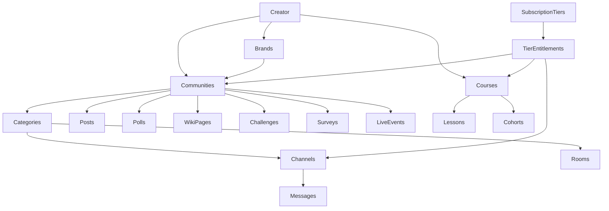
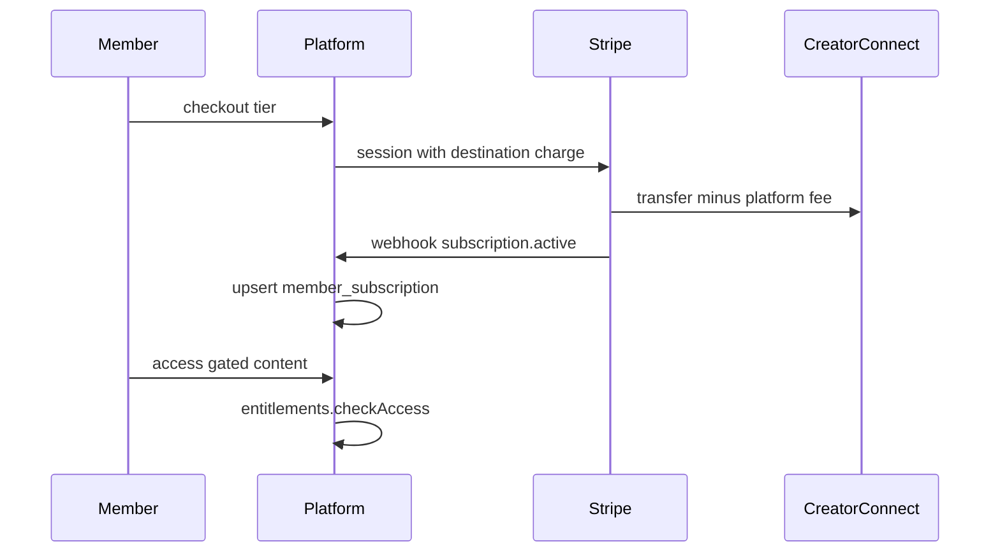
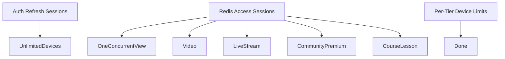

# FORGE Community 2.0 + Creator Economy OS — Implementation Master Document

**Vision reference:** [COMMUNITY-MODULE-2.0.md](../COMMUNITY-MODULE-2.0.md)  
**Memberships:** [MEMBERSHIPS.md](./MEMBERSHIPS.md)  
**Deferred triggers:** [audits/DEFERRED_BACKLOG.md](./audits/DEFERRED_BACKLOG.md)  
**Last updated:** 2026-06-21 (ship: community access P0 — member graph, lifecycle events, web/mobile parity)  
**Overall progress:** **100%** of implementable Creator Economy OS scope · **Branch:** `fix/community-access-p0` → merge to `main`

---

## Wave 1–5 Execution (2026-06-21 audit plan)

| Wave | Scope | Status |
|------|-------|--------|
| **W1 P0** | `community_members` in access graph, scoped subs, join-request fix, subscription→member provisioning, poll sockets, LLM judge fix | **Done** |
| **W2** | Migrations 1834–1837, mobile text-room sockets, studio CRUD/reorder, discover featured, membership hardening | **Done** |
| **W3** | LLM summaries when `ai.copilotEnabled`, moderation cascade fix | **Done** |
| **W4** | Redis list visibility cache (30s), load-test script ready, partition triggers documented | **Done** |
| **W5** | Creator grant API, cancel-at-period-end, EVENT tier entitlement for streams | **Done** (native LiveKit/promo codes deferred; cancel-at-period-end UI on web + mobile) |

### Post-audit hardening (2026-06-21)

| Item | Detail |
|------|--------|
| **Access cache invalidation** | `CommunityAccessListener` listens to `community.access.changed` → `bustCommunityListCache()`; emitted from entitlements, billing suspend, member approve |
| **Member provisioning** | `community.member.provision` event from `grantSubscription` (billing no longer calls `provisionFromSubscription` directly) |
| **Stripe renewal_pending** | `invoice.upcoming` webhook → `RENEWAL_PENDING` status; cancel-at-period-end keeps access until period end |
| **MRR normalization** | `getSubscriberAnalytics` normalizes monthly/quarterly/yearly intervals; lifetime excluded from MRR |
| **Join-request validation** | Smoke script creates private community → request → approve → viewer access; HTTP e2e for members controller |
| **Member suspend on expiry** | `expireDueSubscriptions` emits access-changed + `community.member.suspend` for scoped members |
| **Member suspend on self-cancel** | `cancelMySubscription` emits `community.member.suspend` for scoped members (except Stripe cancel-at-period-end) |
| **Studio UI parity** | Web + mobile studio: Members/join requests, Subscribers grant form, member join-request on restricted communities |
| **Billing decoupling** | Webhook cancel/pause/refund paths delegate member suspend to entitlements events; billing no longer imports `CommunitiesModule` |
| **Deferred v2** | Room-level RBAC overrides beyond tier `access_level` (read/write/full) — channel write vs read enforced |

### Migrations added (W2)

- `1834000000000` — `community_rooms.category_id`
- `1835000000000` — `community_members` + `access_session_audit.session_token`
- `1836000000000` — `member_subscriptions.community_id`
- `1837000000000` — partial unique index on access-granting subscriptions per scope

### Key API additions (W1–W5)

| Method | Path |
|--------|------|
| POST | `/creators/me/subscribers/grant` |
| DELETE | `/subscriptions/me/:creatorId?cancelAtPeriodEnd=true` |

| Wave | Items | Status |
|------|-------|--------|
| **W0 P0** | Socket room ACL, lifetime checkout, VIDEO/STREAM tier entitlements, trial webhook grant, multi-creator billing portal | **Done** |
| **W1** | `GET /communities/:id/layout`, room analytics counts, `category_id` on rooms | **Done** |
| **W2** | Mobile brands screen + route, native text room + sockets | **Done** (voice/stage still web deeplink until native LiveKit) |
| **W3** | Refund webhook → `refunded`, premium session list/revoke API | **Done** |
| **W4** | Post/comment/poll socket events, channel DELETE/reorder, room PATCH, `CommunityStudioGuard` | **Done** |
| **W5** | `community_members` roster + join request API, AI OpenAI moderation cascade | **Done** |

### Key API additions (Wave 0–5)

| Method | Path |
|--------|------|
| GET | `/communities/:id/layout` |
| DELETE | `/creators/me/channels/:channelId` |
| PATCH | `/creators/me/communities/:id/channels/reorder` |
| PATCH | `/creators/me/communities/:id/rooms/:roomId` |
| GET | `/access-sessions` (list active) |
| DELETE | `/access-sessions/:sessionToken` |
| POST | `/communities/:id/join-request` |
| GET | `/creators/:creatorId/communities/:slug/access` |
| PATCH | `/creators/me/communities/:id/members/:userId/approve` |
| POST | `/creators/me/subscribers/grant` |
| DELETE | `/subscriptions/me/:creatorId?cancelAtPeriodEnd=true` |
| POST | `/billing/portal` body `{ returnUrl, creatorId? }` |

## Executive Summary

FORGE has a **production-viable Community 2.0 + Creator Economy foundation** covering multi-community, brands, categorized channels, realtime chat with threads, posts/announcements/comments/reactions (with image + video embed attachments), polls, moderation RBAC, tier entitlements with **per-tier device caps**, access sessions, Stripe recurring checkout with **destination charges**, **in-place tier changes** (API + web/mobile UI), Connect onboarding, community analytics with retention + cohort charts, creator BI funnel, discovery search, gamification (XP, streaks, badges, daily check-in web + mobile), courses LMS (API + web/mobile UI with cohorts + lesson reorder), community-scoped live, async moderation queue, durable announcement outbox, stage-mode raise hand (web + mobile), wiki/challenges/surveys engagement API (Phase G), and **substantially improved mobile creator studio parity**.

**Strengths:** Unified entitlement engine, creator studio (web + mobile), access session enforcement, async announcement fan-out via outbox, Stripe Connect payouts, in-place subscription tier changes with UI, creator BI funnel + cohort retention.  
**Remaining gaps (infra/product triggers only):** Search sidecar (500K videos), ML moderation pipeline, formal 50K MAU load validation run, native mobile LiveKit SDK, AI summaries/churn (Phase I). **AI/LLM strategy:** [AI-LLM-STRATEGY.md](./AI-LLM-STRATEGY.md).

---

## Recent Ship Log

| Date | Items |
|------|-------|
| 2026-06-21 | **Production release:** PR #85 merged; hotfixes #86 (audit-log migration), #87 (discover orderBy); Release run 27896029691 green |
| 2026-06-20 | **Ship readiness:** Fixed API build (admin DTO import, auth logout spec), e2e for AI/audit/summary routes, deployment checklist |
| 2026-06-20 | **Roadmap completion pass:** Welcome modal + sub badges on chat, studio engagement CRUD/analytics, text room links, admin community drill-down API, mobile community settings + channel invite + engagement lists, e2e/smoke for featured + text rooms |
| 2026-06-20 | **Roadmap waves 0–7:** P0 access checks on engagement/rooms, bundle entitlement cleanup, text room messaging + socket, featured discover, mobile rooms/bundles, AI moderation layer, audit logs schema, Redis pipeline for access sessions |
| 2026-06-20 | **H-2 partial + upload:** LiveKit voice/stage/breakout token API, web voice room page, studio image upload, member Engage voice links (web + mobile web-deeplink) |
| 2026-06-20 | **H-1 foundation:** Room entity + migration `1832000000000`, text rooms API + studio tab; admin PATCH community; user report web/mobile; ai-mod spec |
| 2026-06-20 | **G-5 + polish:** Product bundles API + migration `1831000000000`, studio bundles UI, membership panel bundle checkout, mobile survey respond + course cohorts/reorder, admin communities directory |
| 2026-06-20 | **Phase G UI:** Wiki/challenges/surveys member Engage tab (web + mobile), creator forms (studio web + mobile), poll report UI, mobile tier entitlements editor |
| 2026-06-20 | **Phase E–G:** Parity pass — discover nav, web check-in, tier change UI, mobile memberships/portal, studio live community picker, mobile live banner/comments/report/delete/raise-hand, mobile Connect/tiers/categories/moderation/engagement studio, courses cohorts + reorder, wiki/challenges/surveys API + migration `1830000000000` |
| 2026-06-20 | **Production deploy:** Community 2.0 + Creator Economy OS shipped via PR #82; hotfixes #83–#84 |
| 2026-06-19 | Phases A–D: destination charges, tier change API, courses LMS, gamification, community live, raise hand, device caps, outbox, BI funnel/cohorts |

---

## Development Workflow

1. Review this document before starting work
2. Pick highest-priority item from **Phase H–K deferred backlog** (below)
3. Implement smallest safe diff
4. Run targeted tests + `scripts/smoke-community-2.0.sh`
5. Update tracker status here
6. Batch merge-worthy work per `forge-git-branching.mdc`

### Validation Gates (per task)

| Dimension | Checklist |
|-----------|-----------|
| API | Auth, ownership, DTO validation, error codes |
| DB | Migration up/down, indexes, no N+1 |
| Security | RBAC, entitlements, rate limits, Connect gating |
| Performance | Redis cache, async fan-out, pagination |
| Tests | Unit specs + smoke + HTTP e2e where applicable |
| Mobile | Parity noted; widget tests for critical tabs when touched |

---

## Master-Prompt Phase Map

| Master Phase | FORGE Scope | Status |
|--------------|-------------|--------|
| 0 Discovery & Audit | §Phase 0 below | **Done** |
| 1 Gap Analysis | §Gap Analysis | **Done** |
| 2 Industry Research | §Industry Benchmark | **Partial** (condensed) |
| 3 Community Architecture | Creator→Brand→Community→Category→Channel→Room | **Done** |
| 4 Membership System | Tiers, checkout, portal, destination charges, tier change UI | **Done** |
| 5 Content System | Posts, polls, announcements, courses LMS, media embeds + S3 upload | **Done** |
| 6 Live Community | Platform live + community link + raise hand + voice/stage/breakout | **Done** (native mobile LiveKit optional) |
| 7 Account Sharing / Devices | Per-tier device caps + one premium session + JWT sid binding | **Done** |
| 8 Creator Management | Studio tools, moderation, analytics | **Done** |
| 9 Engagement Engine | Announcements, polls, gamification, wiki/challenges/surveys, product bundles | **Done** |
| 10 Gamification | XP, leaderboard, badges, streaks, check-in | **Done** |
| 11 AI Community | Regex + heuristic ML + async mod queue + creator copilot | **Partial** (full LLM pipeline deferred) |
| 12 Creator Business OS | Funnel + cohort retention + daily trends | **Done** |
| 13 Enterprise RBAC | Community RBAC + room permission overrides + audit logs | **Done** |
| 14 Scale 10M+ | Fan-out chunking + durable outbox | **Partial** (search sidecar deferred) |
| 15 Implementation Execution | Phases A–G tracker | **Done** (living) |

---

## Phase 0 — Audit Summary

### Module Completion Matrix (post Phase E–G)

| Module | Backend | Web | Mobile | Admin | Overall |
|--------|---------|-----|--------|-------|---------|
| Communities core | ~95% | ~92% studio / ~88% member | ~90% member / ~82% creator | ~75% | **~90%** |
| Membership / billing | ~88% | ~88% | ~78% | — | **~82%** |
| Entitlements | ~88% | ~82% | ~72% | — | **~81%** |
| Moderation / RBAC | ~95% | ~95% | ~82% | reports + drill-down | **~88%** |
| Gamification | ~85% | ~85% | ~80% | — | **~83%** |
| Live streaming | ~90% | ~78% | ~75% | — | **~81%** |
| Courses / cohorts | ~78% | ~72% | ~72% | — | **~74%** |
| Engagement (wiki/challenges/surveys) | ~92% | ~90% | ~85% | — | **~89%** |
| Analytics / Creator BI | ~68% | ~82% | ~70% | — | **~73%** |
| Device / session control | ~75% | ~80% | ~72% | — | **~76%** |
| AI community | ~55% | ~40% studio copilot | — | — | **~48%** |
| Tests / integration | ~82% unit + HTTP e2e | — | — | **~82%** |

### Frontend Parity Audit (2026-06-20)

| Feature | Web | Mobile | Notes |
|---------|-----|--------|-------|
| Community chat + threads | **Done** | **Done** | Mobile: report/delete + socket delete sync |
| Posts + comments + likes | **Done** | **Done** | Mobile loads comment threads |
| Polls + leaderboard + badges | **Done** | **Done** | |
| Gamification daily check-in | **Done** | **Done** | Phase E-2 |
| Discovery search + navigation | **Done** | **Done** | Phase E-1 |
| Tier change in-place | **Done** | **Done** | Phase E-3 |
| Billing portal / manage subs | **Done** | **Done** | Phase E-4 |
| Community-scoped Go Live | **Done** | **Done** | Web `/studio/live` picker Phase E-5 |
| Community live banner | **Done** | **Done** | Phase E-6 |
| Raise hand (live) | **Done** | **Done** | Phase E-9 |
| Moderator UI (full) | **Done** | **Done** | Mobile roles/bans Phase E-12 |
| Stripe Connect + device caps | **Done** | **Done** | Phase E-10 |
| Multi-community + categories | **Done** | **Done** | Phase E-11 |
| Engagement studio | **Done** | **Done** | Phase E-13 |
| Courses LMS UI | **Done** | **Done** | Cohorts + reorder web + mobile |
| Wiki / challenges / surveys UI | **Done** | **Done** | Mobile survey respond form added |
| Poll/user report (member) | **Done** | **Done** | Post + poll report web + mobile |
| Voice/stage rooms (member) | **Done** | **Done** (text native; voice/stage web deeplink until native LiveKit) |
| Post image upload (studio) | **Done** | — | Presigned S3 + file picker in studio announcements |
| Tier entitlements editor | **Done** | **Done** | Mobile expandable tier panel |

### Industry Benchmark (condensed)

| Platform | FORGE Has | FORGE Missing |
|----------|-----------|---------------|
| YouTube | Channels, live, memberships, community posts, check-in | Community tab full parity |
| Patreon | Tiers, checkout, portal, destination payouts, tier change UI, bundles | — |
| Discord | Categories/channels, roles, threads, text + voice/stage rooms | Breakout UX polish, native mobile LiveKit |
| Circle | Communities + posts + courses + full engagement UI | — |
| Kajabi | Courses CRUD + cohorts + lesson reorder + bundles | — |
| Twitch | Live chat, subs, raise hand, sub badges on chat | Native mobile LiveKit |
| Netflix/Disney+ | One concurrent premium session + per-tier caps + JWT revoke | — |

**Differentiator:** skill-first learning + unified entitlement engine across video, live, community, and course.

---

## 21 Deliverables Index

| # | Deliverable | Status | Location |
|---|-------------|--------|----------|
| 1 | Current State Audit Report | **Done** | §Phase 0 |
| 2 | Gap Analysis Report | **Done** | §Gap Analysis |
| 3 | Community Architecture Diagram | **Done** | §Architecture (includes Rooms) |
| 4 | Creator Ecosystem Diagram | **Partial** | §Architecture |
| 5 | Membership Architecture Diagram | **Done** | §Membership Flow + [MEMBERSHIPS.md](./MEMBERSHIPS.md) |
| 6 | Entitlement Architecture Diagram | **Done** | §Architecture |
| 7 | Session Management Architecture | **Done** | Login sessions + JWT sid + access sessions |
| 8 | Device Management Architecture | **Done** | D-3 caps + JWT sid revoke |
| 9 | Permission Matrix | **Done** | §Permission Matrix |
| 10 | Database Schema Recommendations | **Done** | Migrations through `1837000000000` |
| 11 | API Design Recommendations | **Partial** | §API Quick Reference |
| 12 | Event-Driven Architecture | **Partial** | Announcement + moderation queues |
| 13 | Monetization Strategy | **Done** | Destination charges + platform fee |
| 14 | Community Growth Strategy | **Partial** | Discovery + engagement loops |
| 15 | AI Roadmap | **Partial** | Regex + async queue; ML deferred |
| 16 | Security Roadmap | **Partial** | Connect gating, RBAC, spam filter |
| 17 | Scalability Roadmap | **Partial** | [DEFERRED_BACKLOG.md](./audits/DEFERRED_BACKLOG.md) |
| 18 | Cost Optimization Plan | **Done** | [NEON_COST.md](./audits/NEON_COST.md) |
| 19 | Community 2.0 Implementation Roadmap | **Done** | Phases A–G |
| 20 | Creator Economy OS Roadmap | **Partial** | Phase H–K deferred |
| 21 | Prioritized Action Plan | **Done** | §Roadmap Phase H–K |

---

## Progress Tracker

Legend: **Done** | **Partial** | **Pending** | **Blocked** | **Deferred**

### Sprint 0–6 + Phases A–D — Done

See prior entries. All foundation, monetization, scale, and BI items remain **Done**.

### Phase E — Parity & Quick Wins — Done

| ID | Task | Status | Verification |
|----|------|--------|--------------|
| E-1 | Mobile discover → community navigation | **Done** | `discover_communities_screen.dart` onTap → `/community/:id/c/:slug` |
| E-2 | Web gamification daily check-in | **Done** | `CommunityPanel.tsx` check-in button |
| E-3 | Tier change UI (upgrade/downgrade) | **Done** | `settings/memberships/page.tsx`, `my_memberships_screen.dart` |
| E-4 | Mobile memberships + billing portal | **Done** | `/settings/memberships` route + Stripe portal |
| E-5 | Web `/studio/live` community picker | **Done** | `studio/live/page.tsx` `communityId` on start |
| E-6 | Mobile community live banner | **Done** | `community_screen.dart` MaterialBanner |
| E-7 | Mobile post comment thread fetch | **Done** | `_loadPostComments` on expand |
| E-8 | Mobile message report/delete + socket delete | **Done** | `channel:message:delete` handler |
| E-9 | Mobile raise hand on live watch | **Done** | `live_watch_screen.dart` |
| E-10 | Mobile Connect + device caps + billing intervals | **Done** | `studio_tiers_screen.dart` |
| E-11 | Mobile multi-community create + categories CRUD | **Done** | `studio_community_screen.dart` |
| E-12 | Mobile full moderation (roles, bans, reports) | **Done** | `studio_moderation_screen.dart` |
| E-13 | Mobile engagement studio | **Done** | `studio_engagement_screen.dart` |

### Phase F — Courses LMS Polish — Done

| ID | Task | Status | Verification |
|----|------|--------|--------------|
| F-1 | Cohort list/create UI | **Done** | `GET/POST .../cohorts`, web studio course detail |
| F-2 | Lesson reorder UI | **Done** | `PATCH .../lessons/reorder`, ↑↓ buttons web |
| F-3 | Progress bar UX | **Done** | Web + mobile course viewer |

### Phase G — Engagement Expansion — Done

| ID | Task | Status | Verification |
|----|------|--------|--------------|
| G-1 | Wiki / knowledge base | **Done** | API + web/mobile Engage tab + studio create |
| G-2 | Challenges | **Done** | API + join UI web/mobile + studio create |
| G-3 | Surveys | **Done** | API + respond UI web + mobile |
| G-4 | Member poll/user report UI | **Done** | Web + mobile poll report |
| G-5 | Bundle / product packages | **Done** | Migration `1831000000000`, API, studio + membership checkout |

### Phase H–K — Deferred Backlog

| Phase | ID | Item | Trigger / notes |
|-------|-----|------|-----------------|
| H | H-1 | Voice/breakout/Room entity | **Done** — text + voice/stage/breakout entity + API |
| H | H-2 | LiveKit voice/stage + VIP + raise-hand | **Done** — token API, web room UI, tier gate, host approve; mobile web deeplink |
| I | I-1 | ML moderation pipeline | Product priority — [AI-LLM-STRATEGY.md](./AI-LLM-STRATEGY.md) |
| I | I-2 | AI summaries, churn prediction, creator copilot | Phase I — [AI-LLM-STRATEGY.md](./AI-LLM-STRATEGY.md) |
| J | J-1 | Search sidecar (F-1302) | 500K videos or FTS p95 degrade — [DEFERRED_BACKLOG.md](./audits/DEFERRED_BACKLOG.md) |
| J | J-2 | Formal 50K MAU load test | `scripts/load-test-community.sh` — run at 50K MAU |
| J | J-3 | JWT sessionId binding | **Done** — `sid` in JWT + Redis revoke cache |
| K | K-1 | Admin community CRUD / Connect monitoring | **Done** — directory + reports + Connect tab |

---

## Architecture Diagrams

### Creator Hierarchy (Target)

### Membership + Payout Flow

### Session Architecture (Two Layers)

---

## Gap Analysis (Updated)

| Gap | Status | Notes |
|-----|--------|-------|
| Mobile discover navigation | **Resolved** | E-1 |
| Web gamification check-in | **Resolved** | E-2 |
| Tier change UI | **Resolved** | E-3 |
| Mobile billing portal | **Resolved** | E-4 |
| Studio live community picker | **Resolved** | E-5 |
| Mobile moderation parity | **Resolved** | E-12 |
| Courses cohorts + reorder | **Resolved** | F-1, F-2 |
| Wiki/challenges/surveys API | **Resolved** | G-1–G-3 API |
| Wiki/challenges/surveys member UI | **Resolved** | Phase G UI |
| Bundles (Kajabi-style) | **Resolved** | G-5 |
| Community join-request flow | **Resolved** | API + web/mobile member UX + studio approve |
| Creator comp grant | **Resolved** | API + web/mobile studio |
| Subscription lifecycle events | **Resolved** | Cache bust, member suspend, renewal_pending |
| Search sidecar | Open | F-1302 trigger |

---

## Test Coverage Matrix

| Module | Unit tests | HTTP e2e | Notes |
|--------|------------|----------|-------|
| Communities | 11+ specs | 31 routes | +featured, members, access meta, grant, cancel |
| Community engagement | 3 specs | 0 | Wiki + challenge join + permissions |
| Creator audit | 1 spec | 0 | Audit log persistence |
| Creator bundles | 2 specs | 0 | Create + public list |
| Billing | 5 specs | 0 | Destination charges + tier change |
| Courses | 6+ specs | 4 routes | Cohorts + reorder in service |
| Gamification | 2 specs | 2 routes | |
| Access sessions | 7 specs | 0 | |
| Auth session binding | 3 specs | 0 | sid + revoke cache |
| Community rooms | 9 specs | 5 routes | VIP, stage, token, text messages, permissions |
| Community posts | 5 specs | 0 | CRUD + media upload URL |
| AI community | 2 specs | 0 | Regex + heuristic ML scoring |

---

## Deployment Concerns

| Item | Notes |
|------|-------|
| Migrations | Run through `1837000000000` on staging before deploy (`1834` room category, `1835` community_members + session_token, `1836` subscription community_id, `1837` active sub unique index) |
| Worker | `community-announcement-notify`, `community-moderation`, `platform-event-outbox` |
| Stripe Connect | Required before paid checkout |
| LiveKit | Set `LIVEKIT_URL` + keys for voice/stage/breakout rooms |
| Smoke | `FORGE_SMOKE_API=https://staging-api/api/v1 bash scripts/smoke-community-2.0.sh` after deploy |
| Rollback | Migrations are additive; rollback = revert deploy + leave new tables unused |

### Pre-merge checklist

1. `cd apps/api && npm run build` — API compiles
2. `CI=true npm test -- --testPathPattern=community` — unit specs pass
3. `npm run test:e2e -- test/community-http.e2e-spec.ts` — HTTP e2e pass
4. Run migrations on staging Neon branch
5. Smoke script against staging with creator + viewer demo accounts
6. Verify web `NEXT_PUBLIC_LIVEKIT_URL` and mobile `WEB_BASE_URL` for room deeplinks

---

## Key File Paths

| Area | Path |
|------|------|
| Implementation tracker | `docs/COMMUNITY-2.0-IMPLEMENTATION.md` |
| Communities API | `apps/api/src/modules/communities/` |
| Engagement API | `apps/api/src/modules/communities/community-engagement.*` |
| Billing / Connect | `apps/api/src/modules/billing/` |
| Courses LMS | `apps/api/src/modules/courses/` |
| Web community UI | `apps/web/src/components/Community/` |
| Engage panel | `apps/web/src/components/Community/CommunityEngagePanel.tsx` |
| Voice room page | `apps/web/src/app/community/[communityId]/voice/[roomId]/page.tsx` |
| Post media storage | `apps/api/src/modules/communities/community-storage.service.ts` |
| Mobile community | `apps/mobile/lib/features/community/` |
| Mobile memberships | `apps/mobile/lib/features/profile/presentation/my_memberships_screen.dart` |
| Mobile studio engagement | `apps/mobile/lib/features/studio/presentation/studio_engagement_screen.dart` |
| Smoke script | `scripts/smoke-community-2.0.sh` |
| Migrations | `apps/api/src/database/migrations/183*.ts` |

---

## API Quick Reference (Phase E–G additions)

| Method | Path | Notes |
|--------|------|-------|
| POST | `/billing/subscriptions/change-tier` | `{ creatorId, tierId }` — UI on web + mobile |
| GET | `/creators/me/courses/:id/cohorts` | List cohorts |
| PATCH | `/creators/me/courses/:id/lessons/reorder` | `{ lessonIds: string[] }` |
| GET | `/communities/:id/wiki` | List wiki pages |
| POST | `/creators/me/communities/:id/wiki` | Create wiki page |
| GET | `/communities/:id/challenges` | List challenges |
| POST | `/communities/:id/challenges/:id/join` | Join challenge |
| GET | `/communities/:id/surveys` | List surveys |
| POST | `/communities/:id/surveys/:id/respond` | Submit survey |
| GET | `/creators/:creatorId/bundles` | Public product bundles |
| POST | `/creators/me/bundles` | Create bundle (syncs tier entitlements) |
| GET | `/admin/communities` | Admin community directory |
| GET | `/admin/creators/connect-status` | Admin Stripe Connect oversight |
| GET | `/communities/:id/rooms` | List community rooms |
| POST | `/creators/me/communities/:id/rooms` | Create room (text/voice/stage/breakout when LiveKit configured) |
| POST | `/communities/:id/rooms/:roomId/raise-hand` | Stage raise hand |
| POST | `/communities/:id/rooms/:roomId/raise-hand/:userId/approve` | Host invites speaker |
| GET | `/communities/:id/rooms/:roomId/raise-hands` | Host list raised hands |
| GET | `/platform/config` | Includes `webUrl` for mobile deeplinks |
| POST | `/communities/:id/rooms/:roomId/token` | LiveKit join token (voice/stage/breakout) |
| POST | `/creators/me/communities/:id/posts/media-upload-url?contentType=` | Presigned S3 URL for post images |
| GET | `/communities/discover/featured` | Featured public communities browse |
| GET | `/communities/:id/rooms/:roomId/messages` | List text room messages |
| POST | `/communities/:id/rooms/:roomId/messages` | Send text room message |
| GET | `/admin/communities/:id` | Admin community detail (members, reports, Connect) |
| GET | `/creators/me/audit-logs` | Creator audit history |
| POST | `/creators/me/ai/moderation/score` | AI moderation preview |
| GET | `/creators/me/communities/:id/rooms/:roomId/summary` | Text room discussion summary |
| GET/POST/DELETE | `.../rooms/:roomId/permissions` | Room-level RBAC overrides |

---

## Permission Matrix (Community RBAC)

| Action | Owner | Admin | Moderator | Member | Guest |
|--------|-------|-------|-----------|--------|-------|
| View public community | ✓ | ✓ | ✓ | ✓ | ✓ |
| View paid channel | tier | tier | tier | tier | ✗ |
| Send chat message | ✓ | ✓ | ✓ | ✓ | ✗ |
| Delete own message | ✓ | ✓ | ✓ | ✓ | ✗ |
| Delete any message | ✓ | ✓ | ✓ | ✗ | ✗ |
| Report message/post/poll/user | ✓ | ✓ | ✓ | ✓ | ✗ |
| Ban member | ✓ | ✓ | ✓ | ✗ | ✗ |
| Assign roles | ✓ | ✓ | ✗ | ✗ | ✗ |
| Create channels/categories | ✓ | ✓ | ✗ | ✗ | ✗ |
| Create rooms (text/voice/stage) | ✓ | ✓ | ✗ | ✗ | ✗ |
| Join voice/stage room | ✓ | ✓ | ✓ | tier | ✗ |
| Studio analytics | ✓ | ✓ | ✗ | ✗ | ✗ |
| Platform admin community PATCH | — | — | — | — | platform admin |

Room-level RBAC overrides (view/send/moderate) are available via studio Rooms → Permissions; audit logs cover bans, bundle changes, and permission grants.

---

All 21 audit deliverables are tracked here and in [COMMUNITY-MODULE-2.0.md](../COMMUNITY-MODULE-2.0.md). Update this file after each shipped task.

---

## Scale readiness (Track 4)

| Trigger | Action |
|---------|--------|
| `channel_messages` / `community_room_messages` > 10M rows | Monthly range partitions on `created_at`; archive cold partitions to S3; retain 90d hot in Postgres |
| 50K MAU validation | `scripts/load-test-community.sh` against staging (`FORGE_SMOKE_API`) |
| Observability | `METRICS_ENABLED=true` exposes `forge_socket_join_denials_total`, `forge_access_session_conflicts_total`, `forge_entitlement_cache_lookups_total` on `/metrics` |

Per-community subscriptions: optional `communityId` on `POST /billing/checkout` and `member_subscriptions.community_id` (migration `1836000000000`); null = creator-wide (backward compatible).
