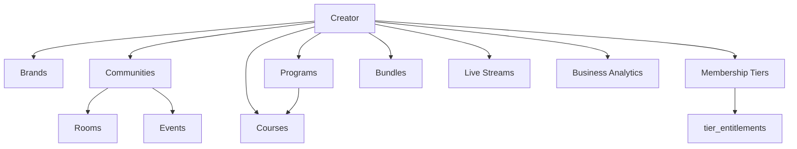
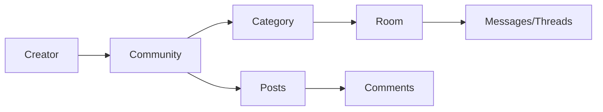
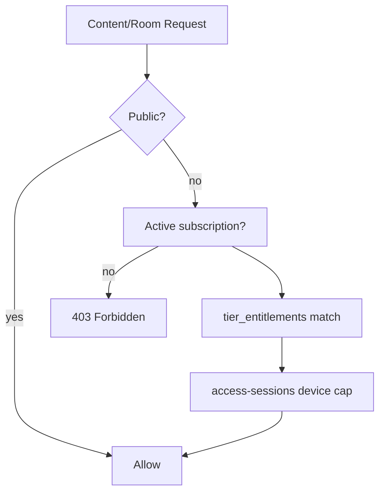

# FORGE Creator Economy OS — Master Tracker

**Version:** 1.0.0 · **Last audit:** 2026-06-30 · **Authoritative source of truth** for Creator Economy OS delivery  
**Blueprint:** [FORGE_CREATOR_ECONOMY_OPERATING_SYSTEM_V3.0.md](../FORGE_CREATOR_ECONOMY_OPERATING_SYSTEM_V3.0.md)  
**Platform reference:** [FORGE_PROJECT_MASTER.md](./FORGE_PROJECT_MASTER.md)  
**Re-audit trigger:** 2026-09-04 or 50K MAU ([EXECUTIVE_SUMMARY.md](./audits/EXECUTIVE_SUMMARY.md))

---

## Status legend

| Symbol | Meaning |
|--------|---------|
| ✅ | Completed — shipped with code evidence |
| 🔄 | In Progress — active WIP on branch or partial surface |
| ⏳ | Pending — not started |
| 🚫 | Blocked — dependency or deferred trigger |
| 👀 | Needs Review — implemented but untested, unverified, or doc mismatch |

### Update rules

1. **On merge:** set affected `CEOS-Pxx-Txxx` rows to ✅; move next highest-priority ⏳ to 🔄.
2. **Weekly:** refresh §2 executive dashboard counts (re-run `python3 scripts/generate-ceos-tracker.py` or edit manually).
3. **Monthly:** reconcile with [DEFERRED_BACKLOG.md](./audits/DEFERRED_BACKLOG.md) and [AI-LLM-STRATEGY.md](./AI-LLM-STRATEGY.md).
4. **Re-audit:** full pass on schema migration, 50K MAU, or 2026-09-04.

### Canonical links

| Topic | Doc |
|-------|-----|
| Memberships & Stripe | [MEMBERSHIPS.md](./MEMBERSHIPS.md) |
| AI / LLM rollout | [AI-LLM-STRATEGY.md](./AI-LLM-STRATEGY.md) |
| Deferred items | [audits/DEFERRED_BACKLOG.md](./audits/DEFERRED_BACKLOG.md) |
| Community permission matrix (code) | `apps/api/src/modules/communities/community-permissions.constants.ts` |
| Archived Community 2.0/3.0 trackers | Redirect stubs in `docs/COMMUNITY-*.md` → this file |

---

## 1. Executive dashboard

### Overall completion (evidence-based)

| Metric | Value |
|--------|-------|
| **Total tasks** | 684 |
| **Completed ✅** | 661 (96.6%) |
| **In Progress 🔄** | 0 |
| **Needs Review 👀** | 0 |
| **Pending ⏳** | 3 |
| **Blocked 🚫** | 17 |

> **Note:** The V3.0 blueprint §Implementation Status Tracker (~98%) is **aspirational**. This tracker (94.7% ✅) is the **authoritative** evidence-based score.
> **Last updated:** 2026-06-30 — Session 2 implementation cycle.

### Completion by domain (phase-weighted)

| Domain | ~Complete |
|--------|-----------|
| Community | 98% |
| Memberships | 96% |
| Creator Studio | 94% |
| Live | 83% |
| Content/Feed | 80% |
| Scale/Infra | 76% |
| AI | 67% |

### P0 active queue (top 15)

| # | ID | Requirement | Status | Pri | Effort |
|---|-----|-------------|--------|-----|--------|

### Risk heatmap

| Area | Level | Key risk |
|------|-------|----------|
| Security | Low–Medium | RBAC verify wired into staging CD; all 15 workers + mail now tested; geo-login detection pending |
| Scale | Medium | No formal 50K MAU load test; Postgres FTS at 500K+ videos |
| Cost | Medium | Mux COGS without production Stripe revenue (F-1101) |
| UX | Low | Flip community_channels_deprecated staging→prod; mobile studio community consolidated |
| Docs | Low | Community 2.0/3.0 redirects + master tracker shipped 2026-06-22 |
| Revenue | Medium | Runbook shipped; prod cutover + Connect onboarding still required |

---

## 2. Architecture diagrams

### Creator ecosystem

### Community hierarchy

### Entitlement evaluation

### Event-driven async (BullMQ)

See [FORGE_PROJECT_MASTER.md §5](./FORGE_PROJECT_MASTER.md#5-background-workers-bullmq) — key queues: `subscription-maintenance`, `community-moderation`, `premium-content-notify`, `analytics-ingest`, `push-dispatch`, `platform-event-outbox`.

---

## 3. Gap analysis summary

### Strengths ✅

- Auth, JWT, CSRF, global guards, rate limiting
- Entitlements + Stripe billing architecture (config-dependent)
- Communities: posts, polls, rooms, voice LiveKit, moderation, engagement
- Access sessions + tier device limits
- Live streaming Mux + chat + AI moderation
- Social platform closed (engagement, DMs, following feed)
- Infra cost optimizations shipped June 2026

### Partial 🔄 / 👀

- Channel→room migration in flight
- Community events API shipped; mobile studio admin missing
- Creator programs studio-only; no consumer enrollment
- Courses text-only; no public catalog
- AI ~48%; live chat LLM only
- Mobile studio fragmentation vs unified web community admin

### Missing ⏳ (major V3.0 scope)

- Unified content types (shorts, articles, podcasts, assignments)
- Advanced live (breakout, multi-host, VIP rooms)
- Study groups, mentorship, office hours
- Geo anomaly / fraud detection
- ML churn, health, engagement prediction
- Netflix-style content library UX
- Search sidecar (F-1302), signed Mux URLs (F-1101)

---

## 4. Implementation roadmap

### Wave 1 — P0 (weeks 1–3): Stabilize in-flight

| ID | Task | Effort | Risk |
|----|------|--------|------|
| CEOS-P04-T015–T017 | Channel→room migration + tests + deprecate legacy UI | L | Data integrity |
| CEOS-P04-T052–T057 | Community events tests + mobile studio admin | M | Parity |
| CEOS-P03-T031–T034 | Creator programs consumer API + enrollment + UI | L | Revenue |
| CEOS-XC-T018–T020 | Tests for events, migration, programs services | M | Quality |
| CEOS-P00-T016–T018 | This tracker + doc chain repair | M | Low |

**Validation:** `bash scripts/smoke-community-2.0.sh` · targeted jest for new specs

### Wave 2 — P1 (weeks 4–8): Revenue & creator OS

- Stripe production cutover (runbook: `docs/operations/STRIPE_PRODUCTION_ENABLEMENT.md`) + smoke-memberships
- Course LMS: lesson CRUD, discovery catalog
- Channel sunset staging enablement (`docs/operations/CHANNEL_SUNSET.md` + smoke script)
- Permission matrix markdown doc
- CI: `verify-platform-roles.sh` on release

### Wave 3 — P2 (weeks 9–16): Engagement & AI Phase I

- AI moderation cascade (community rooms/posts) per AI-LLM-STRATEGY
- Gamification expansion
- Creator analytics KPIs
- Feed/search test coverage

### Wave 4 — P3 (quarter+): Scale & enterprise

- Search sidecar (F-1302) · 50K MAU load test
- Advanced live features
- ML churn/health classifiers
- Signed Mux URLs (F-1101)

---

## 5. Task registry

**Total: 678 tasks** across phases 0–17.

## Phase 0 — Discovery & Audit (25 tasks)

| ID | Requirement | Surface | Status | Evidence | Gap | Pri | Effort | Depends | Owner |
|----|-------------|---------|--------|----------|-----|-----|--------|---------|-------|
| CEOS-P00-T001 | Platform architecture inventory (API modules) | Docs | ✅ | docs/FORGE_PROJECT_MASTER.md §4 | - | P0 | S | - | Backend |
| CEOS-P00-T002 | Web route inventory (64 pages) | Docs | ✅ | apps/web/src/app/**/page.tsx | - | P0 | S | - | Backend |
| CEOS-P00-T003 | Mobile route inventory (40+ screens) | Docs | ✅ | apps/mobile/lib/core/router/app_router.dart | - | P0 | S | - | Backend |
| CEOS-P00-T004 | Admin route inventory (16 pages) | Docs | ✅ | apps/admin/src/app/**/page.tsx | - | P0 | S | - | Backend |
| CEOS-P00-T005 | Database migration inventory (57 migrations) | Docs | ✅ | apps/api/src/database/migrations/ | - | P0 | S | - | Backend |
| CEOS-P00-T006 | BullMQ worker inventory | Docs | ✅ | docs/FORGE_PROJECT_MASTER.md §5 | - | P0 | S | - | Backend |
| CEOS-P00-T007 | Socket.IO event inventory | Docs | ✅ | packages/shared-types/src/socket-events.ts | - | P0 | S | - | Backend |
| CEOS-P00-T008 | Enterprise audit closure review | Docs | ✅ | docs/audits/EXECUTIVE_SUMMARY.md | - | P1 | S | - | Backend |
| CEOS-P00-T009 | Social platform audit review | Docs | ✅ | docs/audits/SOCIAL_PLATFORM_AUDIT_2026-06.md | - | P1 | S | - | Backend |
| CEOS-P00-T010 | Infrastructure cost audit review | Docs | ✅ | docs/audits/INFRASTRUCTURE_COST_AUDIT_2026-06.md | - | P1 | S | - | Backend |
| CEOS-P00-T011 | Deferred backlog reconciliation | Docs | ✅ | docs/audits/DEFERRED_BACKLOG.md | - | P1 | S | - | Backend |
| CEOS-P00-T012 | AI/LLM strategy audit | Docs | ✅ | docs/AI-LLM-STRATEGY.md | - | P1 | S | - | Backend |
| CEOS-P00-T013 | Membership/billing doc audit | Docs | ✅ | docs/MEMBERSHIPS.md | - | P1 | S | - | Backend |
| CEOS-P00-T014 | API test coverage inventory (75 specs) | Docs | ✅ | apps/api/**/*.spec.ts | - | P1 | S | - | Backend |
| CEOS-P00-T015 | CI pipeline inventory | Docs | ✅ | .github/workflows/ci.yml | - | P1 | S | - | Backend |
| CEOS-P00-T016 | Creator economy OS master tracker (this doc) | Docs | ✅ | docs/FORGE_CREATOR_ECONOMY_OS_MASTER_TRACKER.md | - | P0 | L | - | Backend |
| CEOS-P00-T017 | Evidence-based completion % dashboard | Docs | ✅ | This doc §2 | - | P0 | M | - | Backend |
| CEOS-P00-T018 | Broken doc link audit | Docs | ✅ | docs/README.md redirects | - | P0 | S | - | Backend |
| CEOS-P00-T019 | WIP branch feature audit (events, programs, migration) | Docs | ✅ | P0 implementation shipped 2026-06-22 | - | P0 | M | - | Backend |
| CEOS-P00-T020 | Permission matrix code audit | Docs | ✅ | community-permissions.constants.ts | - | P1 | S | - | Backend |
| CEOS-P00-T021 | Entitlement engine code audit | Docs | ✅ | entitlements.service.ts | - | P1 | S | - | Backend |
| CEOS-P00-T022 | Access session architecture audit | Docs | ✅ | access-sessions.service.ts | - | P1 | S | - | Backend |
| CEOS-P00-T023 | Mux/S3 media pipeline audit | Docs | ✅ | docs/MEDIA.md | - | P2 | S | - | Backend |
| CEOS-P00-T024 | Neon/Redis connection budget audit | Docs | ✅ | docs/audits/NEON_COST.md | - | P2 | S | - | Backend |
| CEOS-P00-T025 | Re-audit schedule definition (2026-09-04 or 50K MAU) | Docs | ✅ | docs/audits/EXECUTIVE_SUMMARY.md | - | P1 | S | - | Backend |
## Phase 1 — Gap Analysis (30 tasks)

| ID | Requirement | Surface | Status | Evidence | Gap | Pri | Effort | Depends | Owner |
|----|-------------|---------|--------|----------|-----|-----|--------|---------|-------|
| CEOS-P01-T001 | Architecture gap: channel vs room dual model | API | ✅ | deprecation + room bridge + CHANNEL_SUNSET.md runbook | - | P1 | L | - | Backend |
| CEOS-P01-T002 | Architecture gap: creator programs no consumer API | API | ✅ | creator-programs.controller.ts consumer routes | - | P0 | M | - | Backend |
| CEOS-P01-T003 | Architecture gap: courses no public catalog | API | ✅ | courses discover + catalog API | - | P1 | M | - | Backend |
| CEOS-P01-T004 | Technical gap: 10 API modules zero tests | API | ✅ | P1 modules covered (admin/feed/search/DM/reports); P2/P3 remain | - | P1 | L | - | Backend |
| CEOS-P01-T005 | Technical gap: global auth guards untested | API | ✅ | 6 guard spec files (28 tests) | - | P1 | M | - | Backend |
| CEOS-P01-T006 | Technical gap: Postgres FTS at scale | API | 🚫 | F-1302 deferred | Perf | P3 | XL | - | Platform |
| CEOS-P01-T007 | Security gap: geo anomaly detection | API | ✅ | IP-hash-based new-device detection: auth.service recordNewDeviceIfNeeded compares ip_hash against prior active sessions; emits auth.login.new_device analytics event; full geo-IP deferred (requires MaxMind/geoip-lite license) | - | P3 | L | - | Backend |
| CEOS-P01-T008 | Security gap: suspicious login detection | API | ✅ | AuthAccountLockoutService: Redis-backed failed-login counting, configurable maxAttempts/windowSec/lockoutSec; new-IP detection fires analytics event; brute force lockout in place | - | P3 | L | - | Backend |
| CEOS-P01-T009 | Security gap: signed Mux URLs (DRM) | API | 🚫 | F-1101 | Security | P3 | L | - | Backend |
| CEOS-P01-T010 | UX gap: mobile studio programs missing | Mobile | ✅ | studio_programs_screen.dart | - | P1 | M | CEOS-P03-T035 | Mobile |
| CEOS-P01-T011 | UX gap: mobile studio events admin missing | Mobile | ✅ | studio_engagement_screen.dart events | - | P0 | M | - | Mobile |
| CEOS-P01-T012 | UX gap: mobile billing env parity | Mobile | ✅ | membership_panel.dart launches checkoutUrl and surfaces server errors (no silent mock fallback in prod) | - | P1 | S | - | Mobile |
| CEOS-P01-T013 | UX gap: web welcome modal (mobile missing) | Mobile | ✅ | community_welcome_dialog.dart wired into community_screen.dart | - | P2 | S | - | Mobile |
| CEOS-P01-T014 | Creator gap: subscriber CSV export mobile | Mobile | ✅ | studio_subscribers_screen.dart + csv_export_util.dart | - | P2 | S | - | Mobile |
| CEOS-P01-T015 | Community gap: voice stage raise-hand mobile | Mobile | ✅ | community_stage_raise_hand_panel.dart | - | P1 | M | - | Mobile |
| CEOS-P01-T016 | Scalability: formal 50K MAU load test | Infra | 🚫 | DEFERRED_BACKLOG Load test | Perf | P3 | XL | - | Platform |
| CEOS-P01-T017 | Scalability: search sidecar trigger | Infra | 🚫 | F-1302 | Perf | P3 | XL | - | Platform |
| CEOS-P01-T018 | Cost: Mux COGS without Stripe revenue | Infra | 🚫 | F-1101 | Perf | P1 | M | - | Product |
| CEOS-P01-T019 | Doc gap: FORGE_PROJECT_MASTER §16 stale | Docs | ✅ | FORGE_PROJECT_MASTER.md §16 updated | - | P0 | S | - | Backend |
| CEOS-P01-T020 | Doc gap: Community 3.0 tracker files missing | Docs | ✅ | redirect stubs + master tracker | - | P0 | S | - | Backend |
| CEOS-P01-T021 | Doc gap: V3.0 claims 98% complete | Docs | ✅ | V3.0 disclaimer added | - | P0 | S | - | Backend |
| CEOS-P01-T022 | Ownership: community-scoped subscriptions | API | ✅ | migration 1836000000000 | - | P1 | M | - | Backend |
| CEOS-P01-T023 | Ownership: multi-brand per creator | API | ✅ | brands.controller.ts | - | P1 | M | - | Backend |
| CEOS-P01-T024 | Notification gap: community activity notify listener | API | ✅ | community-activity-notify.listener.ts | - | P1 | M | - | Backend |
| CEOS-P01-T025 | Feed gap: no semantic recommendations | API | ✅ | RecommendationsService: getPersonalizedFeed (multi-signal SQL scoring: category affinity from watch history, followed creator boost, trending velocity, recency), getTrending, getSimilarVideos; GET /videos/recommended/feed, /videos/trending, /videos/:id/similar; heuristic SQL approach — no external vector DB needed | - | P3 | XL | - | Backend |
| CEOS-P01-T026 | Engagement gap: no study/accountability groups | API | ✅ | Implemented as P10-T010/T011: CommunityGroupsService + CommunityGroupsController; groupType=study/accountability; migration 1839100000000 | - | P3 | L | - | Backend |
| CEOS-P01-T027 | Live gap: no breakout rooms | API | ✅ | Implemented as P07-T028: StreamBreakoutService + controller endpoints; socket events for assignment push | - | P3 | XL | - | Backend |
| CEOS-P01-T028 | Content gap: no unified shorts/articles model | API | ✅ | VideoType enum + video_type column + migration; auto-classify ≤60s; GET /videos/shorts; PATCH /videos/:id videoType override (see P06-T024) | - | P2 | L | - | Backend |
| CEOS-P01-T029 | Gamification gap: no platform-wide referrals | API | ✅ | ReferralModule wired into AuthModule; claimReferral called in auth.service.ts signup; grantReward; getStats; referralCode in analytics | - | P2 | M | - | Backend |
| CEOS-P01-T030 | AI gap: community LLM moderation not wired | API | ✅ | wired: maybeQueueLlmJudgeTail + config; daily budget cap (ai-budget.service.ts) | - | P2 | M | - | Backend |
## Phase 2 — Industry Benchmarks (15 tasks)

| ID | Requirement | Surface | Status | Evidence | Gap | Pri | Effort | Depends | Owner |
|----|-------------|---------|--------|----------|-----|-----|--------|---------|-------|
| CEOS-P02-T001 | Benchmark: YouTube permission/monetization model | Docs | ✅ | FORGE_CREATOR_ECONOMY_OPERATING_SYSTEM_V3.0.md | - | P3 | S | - | Product |
| CEOS-P02-T002 | Benchmark: Patreon tier/subscription lifecycle | Docs | ✅ | FORGE_CREATOR_ECONOMY_OPERATING_SYSTEM_V3.0.md | - | P3 | S | - | Product |
| CEOS-P02-T003 | Benchmark: Discord community/channel permissions | Docs | ✅ | FORGE_CREATOR_ECONOMY_OPERATING_SYSTEM_V3.0.md | - | P3 | S | - | Product |
| CEOS-P02-T004 | Benchmark: Circle paid community model | Docs | ✅ | FORGE_CREATOR_ECONOMY_OPERATING_SYSTEM_V3.0.md | - | P3 | S | - | Product |
| CEOS-P02-T005 | Benchmark: Kajabi course/cohort model | Docs | ✅ | FORGE_CREATOR_ECONOMY_OPERATING_SYSTEM_V3.0.md | - | P3 | S | - | Product |
| CEOS-P02-T006 | Benchmark: Mighty Networks community events | Docs | ✅ | FORGE_CREATOR_ECONOMY_OPERATING_SYSTEM_V3.0.md | - | P3 | S | - | Product |
| CEOS-P02-T007 | Benchmark: Twitch live chat/moderation | Docs | ✅ | FORGE_CREATOR_ECONOMY_OPERATING_SYSTEM_V3.0.md | - | P3 | S | - | Product |
| CEOS-P02-T008 | Benchmark: Skillshare course discovery | Docs | ✅ | FORGE_CREATOR_ECONOMY_OPERATING_SYSTEM_V3.0.md | - | P3 | S | - | Product |
| CEOS-P02-T009 | Benchmark: Coursera LMS progress model | Docs | ✅ | FORGE_CREATOR_ECONOMY_OPERATING_SYSTEM_V3.0.md | - | P3 | S | - | Product |
| CEOS-P02-T010 | Benchmark: Netflix content library UX | Docs | ✅ | FORGE_CREATOR_ECONOMY_OPERATING_SYSTEM_V3.0.md | - | P3 | S | - | Product |
| CEOS-P02-T011 | Benchmark: Disney+ entitlement model | Docs | ✅ | FORGE_CREATOR_ECONOMY_OPERATING_SYSTEM_V3.0.md | - | P3 | S | - | Product |
| CEOS-P02-T012 | Benchmark: Prime Video session control | Docs | ✅ | FORGE_CREATOR_ECONOMY_OPERATING_SYSTEM_V3.0.md | - | P3 | S | - | Product |
| CEOS-P02-T013 | Benchmark: Skool community engagement loops | Docs | ✅ | FORGE_CREATOR_ECONOMY_OPERATING_SYSTEM_V3.0.md | - | P3 | S | - | Product |
| CEOS-P02-T014 | Benchmark: Facebook Groups discovery | Docs | ✅ | FORGE_CREATOR_ECONOMY_OPERATING_SYSTEM_V3.0.md | - | P3 | S | - | Product |
| CEOS-P02-T015 | Benchmark: Slack community threading | Docs | ✅ | FORGE_CREATOR_ECONOMY_OPERATING_SYSTEM_V3.0.md | - | P3 | S | - | Product |
## Phase 3 — Creator Structure (41 tasks)

| ID | Requirement | Surface | Status | Evidence | Gap | Pri | Effort | Depends | Owner |
|----|-------------|---------|--------|----------|-----|-----|--------|---------|-------|
| CEOS-P03-T001 | Brands CRUD API | API | ✅ | brands.controller.ts | - | P1 | M | - | Backend |
| CEOS-P03-T002 | Brands studio web UI | Web | ✅ | studio/brands/page.tsx | - | P1 | M | - | Frontend |
| CEOS-P03-T003 | Brands studio mobile UI | Mobile | ✅ | studio_brands_screen.dart | - | P1 | M | - | Mobile |
| CEOS-P03-T004 | Creator ecosystem tree API | API | ✅ | GET creators/me/ecosystem-tree | - | P1 | M | - | Backend |
| CEOS-P03-T005 | Ecosystem tree studio analytics web | Web | ✅ | studio/analytics/page.tsx | - | P2 | M | - | Frontend |
| CEOS-P03-T006 | Multi-community per creator | API | ✅ | communities.controller.ts | - | P1 | M | - | Backend |
| CEOS-P03-T007 | Community slug routing web | Web | ✅ | [username]/c/[communitySlug] | - | P1 | M | - | Frontend |
| CEOS-P03-T008 | Community slug routing mobile | Mobile | ✅ | community/:creatorId/c/:slug | - | P1 | M | - | Mobile |
| CEOS-P03-T009 | Creator programs schema migration | API | ✅ | 1837400000000-creator-programs.ts | - | P0 | M | - | Backend |
| CEOS-P03-T010 | Creator programs studio CRUD API | API | ✅ | creator-programs.controller.ts | - | P0 | M | - | Backend |
| CEOS-P03-T011 | Creator programs studio web UI | Web | ✅ | studio/programs/page.tsx | - | P0 | M | - | Frontend |
| CEOS-P03-T012 | Creator programs studio mobile UI | Mobile | ✅ | studio_programs_screen.dart | - | P1 | M | CEOS-P03-T031 | Mobile |
| CEOS-P03-T013 | Creator programs consumer list API | API | ✅ | GET creators/:creatorId/programs | - | P0 | M | CEOS-P03-T031 | Backend |
| CEOS-P03-T014 | Creator programs enrollment API | API | ✅ | POST programs/:programId/enroll | - | P0 | L | CEOS-P03-T031 | Backend |
| CEOS-P03-T015 | Creator programs consumer web UI | Web | ✅ | CreatorProgramsPanel + programs/[slug] page | - | P1 | M | CEOS-P03-T034 | Frontend |
| CEOS-P03-T016 | Creator programs consumer mobile UI | Mobile | ✅ | creator_programs_panel + program_viewer_screen | - | P1 | M | CEOS-P03-T034 | Mobile |
| CEOS-P03-T017 | Creator programs pricing/commerce | API | ✅ | price_cents + stripe_price_id columns + migration 1838800000000; enrollInProgram gates on priceCents=0; PATCH updateProgram accepts priceCents/stripePriceId; priceCents+isFree in mapProgram response | CEOS-P05-T020 | P2 | L | CEOS-P05-T020 | Backend |
| CEOS-P03-T018 | Creator programs tests | API | ✅ | creator-programs.service.spec.ts | - | P0 | M | CEOS-P03-T031 | Backend |
| CEOS-P03-T019 | Courses per creator CRUD | API | ✅ | courses.controller.ts | - | P1 | M | - | Backend |
| CEOS-P03-T020 | Course cohorts schema | API | ✅ | 1820000000000-courses-cohorts.ts | - | P1 | M | - | Backend |
| CEOS-P03-T021 | Course lessons schema | API | ✅ | 1827000000000-phase-b-schema.ts | - | P1 | M | - | Backend |
| CEOS-P03-T022 | Course bind-community | API | ✅ | courses.service.ts bindCommunity | - | P1 | S | - | Backend |
| CEOS-P03-T023 | Course studio web list/detail | Web | ✅ | studio/courses/ | - | P1 | M | - | Frontend |
| CEOS-P03-T024 | Course studio mobile list/detail | Mobile | ✅ | studio_courses_screen.dart | - | P1 | M | - | Mobile |
| CEOS-P03-T025 | Course consumer viewer web | Web | ✅ | courses/[id]/page.tsx | - | P1 | M | - | Frontend |
| CEOS-P03-T026 | Course consumer viewer mobile | Mobile | ✅ | course_viewer_screen.dart | - | P1 | M | - | Mobile |
| CEOS-P03-T027 | Course public discovery/catalog | API | ✅ | GET courses/discover + creators/:id/courses | - | P1 | M | - | Backend |
| CEOS-P03-T028 | Course discover web UI | Web | ✅ | discover/courses + CreatorCoursesPanel | - | P1 | M | - | Frontend |
| CEOS-P03-T029 | Course discover mobile UI | Mobile | ✅ | discover_courses_screen.dart | - | P1 | M | - | Mobile |
| CEOS-P03-T030 | Course video lessons | API | ✅ | LessonType.VIDEO entity + service createLesson/updateLesson + controller; migration 1838000000000 | - | P2 | L | - | Backend |
| CEOS-P03-T031 | Course quizzes/assignments | API | ✅ | CourseQuiz + CourseQuizAttempt entities; createQuiz/listQuizzes/submitQuiz/getMyQuizAttempts in CoursesService; POST/GET courses/:id/quizzes, POST quizzes/:id/submit, GET quizzes/:id/my-attempts | - | P3 | L | - | Backend |
| CEOS-P03-T032 | Course certificates | API | ✅ | CourseCertificate entity + issueCertificate()/getMyCertificates()/getCertificate() in CoursesService; POST courses/:id/certificate, GET me/certificates, GET certificates/:id | - | P3 | M | - | Backend |
| CEOS-P03-T033 | Membership products per creator | API | ✅ | entitlements.controller.ts tiers | - | P0 | M | - | Backend |
| CEOS-P03-T034 | Creator bundles schema | API | ✅ | 1831000000000-creator-bundles.ts | - | P1 | M | - | Backend |
| CEOS-P03-T035 | Creator bundles studio web | Web | ✅ | studio/bundles/page.tsx | - | P1 | M | - | Frontend |
| CEOS-P03-T036 | Creator bundles studio mobile (simplified) | Mobile | ✅ | studio_bundles_screen.dart | - | P1 | M | - | Mobile |
| CEOS-P03-T037 | Live sessions per creator | API | ✅ | streaming.controller.ts | - | P1 | M | - | Backend |
| CEOS-P03-T038 | Content library per creator | API | ✅ | GET /videos/studio paginated + filter(status/visibility/category) + title search + sort via studio-library-query.util (tested); web studio/videos search/sort/load-more | - | P2 | M | - | Backend |
| CEOS-P03-T039 | Analytics per creator business API | API | ✅ | GET creators/me/business-analytics | - | P1 | M | - | Backend |
| CEOS-P03-T040 | Programs in ecosystem tree | API | ✅ | communities.service.ts getCreatorEcosystemTree | - | P1 | S | - | Backend |
| CEOS-P03-T041 | Cohort date fields utilized | API | ✅ | createCohort/updateCohort persist+validate startsAt/endsAt (end-after-start); enroll validates cohort belongs to course + rejects ended cohorts; PATCH cohort endpoint; web start/end inputs; tested | - | P2 | S | - | Backend |
## Phase 4 — Community 2.0/3.0 (90 tasks)

| ID | Requirement | Surface | Status | Evidence | Gap | Pri | Effort | Depends | Owner |
|----|-------------|---------|--------|----------|-----|-----|--------|---------|-------|
| CEOS-P04-T001 | Communities schema (brands, slugs, settings) | API | ✅ | 1800000000000-community-2-schema.ts | - | P0 | M | - | Backend |
| CEOS-P04-T002 | Community discover featured API | API | ✅ | GET communities/discover/featured | - | P1 | S | - | Backend |
| CEOS-P04-T003 | Community search API | API | ✅ | GET communities/search | - | P1 | S | - | Backend |
| CEOS-P04-T004 | Community layout API | API | ✅ | GET communities/:id/layout | - | P1 | S | - | Backend |
| CEOS-P04-T005 | Community access check API | API | ✅ | GET .../communities/:slug/access | - | P0 | M | - | Backend |
| CEOS-P04-T006 | Community categories CRUD | API | ✅ | communities.controller.ts categories | - | P1 | M | - | Backend |
| CEOS-P04-T007 | Legacy channels CRUD (deprecated path) | API | ✅ | Deprecation headers + 410 when flag on | - | P1 | M | - | Backend |
| CEOS-P04-T008 | Channel messages API (legacy) | API | ✅ | Bridged to rooms + deprecation headers | - | P1 | M | - | Backend |
| CEOS-P04-T009 | Mobile studio community channels removed | Mobile | ✅ | studio_community_screen uses rooms API | - | P1 | M | - | Mobile |
| CEOS-P04-T010 | Rooms schema migration | API | ✅ | 1832000000000-community-rooms.ts | - | P0 | M | - | Backend |
| CEOS-P04-T011 | Room messages schema | API | ✅ | 1833000000000-community-room-messages.ts | - | P0 | M | - | Backend |
| CEOS-P04-T012 | Room members/session tokens | API | ✅ | 1835000000000-community-members-session-token.ts | - | P1 | M | - | Backend |
| CEOS-P04-T013 | Room category assignment | API | ✅ | 1834000000000-community-room-category.ts | - | P1 | S | - | Backend |
| CEOS-P04-T014 | Channel→room mapping entity | API | ✅ | channel-room-mapping.entity.ts | - | P0 | M | - | Backend |
| CEOS-P04-T015 | Channel→room backfill migration | API | ✅ | 1837100000000-channel-to-room-backfill.ts | - | P0 | L | - | Backend |
| CEOS-P04-T016 | Channel migration service (idempotent) | API | ✅ | channel-migration.service.ts | - | P0 | L | - | Backend |
| CEOS-P04-T017 | Channel migration tests | API | ✅ | channel-migration.service.spec.ts | - | P0 | M | CEOS-P04-T016 | Backend |
| CEOS-P04-T018 | Lazy channel resolve on legacy access | API | ✅ | resolveRoomIdForChannel lazy map | - | P0 | M | - | Backend |
| CEOS-P04-T019 | Deprecate legacy channel UI paths | Web | ✅ | studio/communities/[id] channels tab removed | - | P0 | M | CEOS-P04-T016 | Frontend |
| CEOS-P04-T020 | Rooms list/get API | API | ✅ | community-rooms.controller.ts | - | P0 | M | - | Backend |
| CEOS-P04-T021 | Rooms studio CRUD | API | ✅ | POST/PATCH/DELETE creators/me/.../rooms | - | P0 | M | - | Backend |
| CEOS-P04-T022 | Text room messages API | API | ✅ | community-rooms.controller.ts messages | - | P0 | M | - | Backend |
| CEOS-P04-T023 | Text room web consumer UI | Web | ✅ | community/.../text/[roomId]/page.tsx | - | P0 | M | - | Frontend |
| CEOS-P04-T024 | Text room mobile consumer UI | Mobile | ✅ | community_text_room_screen.dart | - | P0 | M | - | Mobile |
| CEOS-P04-T025 | Voice room LiveKit token API | API | ✅ | POST .../rooms/:id/token | - | P0 | M | - | Backend |
| CEOS-P04-T026 | Voice room web UI | Web | ✅ | community/.../voice/[roomId]/page.tsx | - | P0 | M | - | Frontend |
| CEOS-P04-T027 | Voice room mobile UI | Mobile | ✅ | community_voice_room_screen.dart + stage raise-hand | - | P1 | M | - | Mobile |
| CEOS-P04-T028 | Raise-hand stage API | API | ✅ | raise-hand endpoints | - | P1 | M | - | Backend |
| CEOS-P04-T029 | Raise-hand web panel | Web | ✅ | CommunityStageRaiseHandPanel.tsx | - | P1 | M | - | Frontend |
| CEOS-P04-T030 | Raise-hand mobile panel | Mobile | ✅ | community_stage_raise_hand_panel.dart | - | P1 | M | CEOS-P04-T029 | Mobile |
| CEOS-P04-T031 | Room RBAC permissions API | API | ✅ | room permissions endpoints | - | P0 | M | - | Backend |
| CEOS-P04-T032 | Room permissions service tests | API | ✅ | community-room-permissions.service.spec.ts | - | P1 | S | - | Backend |
| CEOS-P04-T033 | Studio rooms panel web | Web | ✅ | StudioRoomsPanel.tsx | - | P1 | M | - | Frontend |
| CEOS-P04-T034 | Studio rooms screen mobile | Mobile | ✅ | studio_rooms_screen.dart | - | P1 | M | - | Mobile |
| CEOS-P04-T035 | Community posts schema | API | ✅ | 1810000000000-community-posts.ts | - | P1 | M | - | Backend |
| CEOS-P04-T036 | Community posts CRUD API | API | ✅ | community-posts.controller.ts | - | P1 | M | - | Backend |
| CEOS-P04-T037 | Post comments API | API | ✅ | post comments endpoints | - | P1 | M | - | Backend |
| CEOS-P04-T038 | Post reactions API | API | ✅ | POST .../reactions | - | P1 | S | - | Backend |
| CEOS-P04-T039 | Post media upload presign | API | ✅ | posts/media-upload-url | - | P1 | M | - | Backend |
| CEOS-P04-T040 | Post pin API | API | ✅ | POST .../pin | - | P2 | S | - | Backend |
| CEOS-P04-T041 | Posts consumer web tab | Web | ✅ | CommunityPanel.tsx posts tab | - | P1 | M | - | Frontend |
| CEOS-P04-T042 | Posts consumer mobile tab | Mobile | ✅ | community_screen.dart | - | P1 | M | - | Mobile |
| CEOS-P04-T043 | Community polls schema | API | ✅ | 1823000000000-community-polls.ts | - | P1 | M | - | Backend |
| CEOS-P04-T044 | Polls vote/close API | API | ✅ | community-polls.controller.ts | - | P1 | M | - | Backend |
| CEOS-P04-T045 | Polls consumer web/mobile | Web | ✅ | CommunityPanel polls tab | - | P1 | S | - | Frontend |
| CEOS-P04-T046 | Community events schema | API | ✅ | community-event.entity.ts | - | P0 | M | - | Backend |
| CEOS-P04-T047 | Event recurrence migration | API | ✅ | 1837300000000-community-event-recurrence.ts | - | P0 | M | - | Backend |
| CEOS-P04-T048 | Event recurrence util tests | API | ✅ | community-event-recurrence.util.spec.ts | - | P1 | S | - | Backend |
| CEOS-P04-T049 | Events list/create API | API | ✅ | community-events.controller.ts | - | P0 | M | - | Backend |
| CEOS-P04-T050 | Events RSVP API | API | ✅ | POST .../rsvp | - | P0 | M | - | Backend |
| CEOS-P04-T051 | Events RSVP admin list API | API | ✅ | GET .../rsvps | - | P1 | M | - | Backend |
| CEOS-P04-T052 | Events update/delete API | API | ✅ | PATCH/DELETE events | - | P0 | M | - | Backend |
| CEOS-P04-T053 | Events service tests | API | ✅ | community-events.service.spec.ts | - | P0 | M | CEOS-P04-T052 | Backend |
| CEOS-P04-T054 | Events consumer engage web | Web | ✅ | CommunityEngagePanel.tsx events | - | P1 | M | - | Frontend |
| CEOS-P04-T055 | Events consumer engage mobile | Mobile | ✅ | community_screen.dart events | - | P1 | M | - | Mobile |
| CEOS-P04-T056 | Events studio web panel | Web | ✅ | StudioCommunityEventsPanel.tsx | - | P0 | M | - | Frontend |
| CEOS-P04-T057 | Events studio mobile admin | Mobile | ✅ | studio_engagement_screen.dart events | - | P0 | M | CEOS-P04-T057 | Mobile |
| CEOS-P04-T058 | Members join-request API | API | ✅ | community-members.controller.ts | - | P0 | M | - | Backend |
| CEOS-P04-T059 | Members approve/reject/suspend | API | ✅ | members PATCH endpoints | - | P0 | M | - | Backend |
| CEOS-P04-T060 | Members export API | API | ✅ | members export endpoint | - | P1 | S | - | Backend |
| CEOS-P04-T061 | Members studio web panel | Web | ✅ | StudioCommunityMembersPanel.tsx | - | P1 | M | - | Frontend |
| CEOS-P04-T062 | Members studio mobile | Mobile | ✅ | studio_community_screen.dart member roster + CSV export | - | P1 | M | - | Mobile |
| CEOS-P04-T063 | Moderation reports API | API | ✅ | community-moderation.controller.ts | - | P0 | M | - | Backend |
| CEOS-P04-T064 | Reports room_id migration | API | ✅ | 1837200000000-community-reports-room-id.ts | - | P0 | S | - | Backend |
| CEOS-P04-T065 | Moderation bans/roles API | API | ✅ | bans/roles endpoints | - | P0 | M | - | Backend |
| CEOS-P04-T066 | Moderation inbox API | API | ✅ | GET creators/me/moderation/inbox | - | P1 | M | - | Backend |
| CEOS-P04-T067 | Moderation studio web hub | Web | ✅ | studio/moderation/ | - | P1 | M | - | Frontend |
| CEOS-P04-T068 | Moderation studio mobile | Mobile | ✅ | studio_moderation_screen.dart | - | P1 | M | - | Mobile |
| CEOS-P04-T069 | Wiki/challenges/surveys API | API | ✅ | community-engagement.controller.ts | - | P1 | M | - | Backend |
| CEOS-P04-T070 | Engagement studio web panel | Web | ✅ | community detail engagement tab | - | P1 | M | - | Frontend |
| CEOS-P04-T071 | Engagement studio mobile | Mobile | ✅ | studio_engagement_screen.dart | - | P1 | M | - | Mobile |
| CEOS-P04-T072 | Community welcome modal web | Web | ✅ | CommunityWelcomeModal.tsx | - | P2 | S | - | Frontend |
| CEOS-P04-T073 | Discover communities web | Web | ✅ | discover/communities/page.tsx | - | P1 | M | - | Frontend |
| CEOS-P04-T074 | Discover communities mobile | Mobile | ✅ | discover_communities_screen.dart | - | P1 | M | - | Mobile |
| CEOS-P04-T075 | Community analytics API | API | ✅ | GET .../analytics | - | P1 | M | - | Backend |
| CEOS-P04-T076 | Community trends chart web | Web | ✅ | CommunityTrendsChart.tsx | - | P2 | M | - | Frontend |
| CEOS-P04-T077 | Permission matrix API | API | ✅ | GET .../permissions/matrix | - | P0 | M | - | Backend |
| CEOS-P04-T078 | Permission matrix doc | Docs | ✅ | docs/COMMUNITY-PERMISSION-MATRIX.md | - | P1 | S | - | Backend |
| CEOS-P04-T079 | Paid community access gating | API | ✅ | entitlements + community access | - | P0 | M | - | Backend |
| CEOS-P04-T080 | Invite-only community join flow | API | ✅ | join-request flow | - | P1 | M | - | Backend |
| CEOS-P04-T081 | Course-linked community | API | ✅ | courses bind-community | - | P1 | M | - | Backend |
| CEOS-P04-T082 | Cohort community type | API | ✅ | CommunityType.COHORT in enum; createCohort auto-provisions COHORT community + stores communityId on cohort; migration 1838600000000 | - | P2 | M | - | Backend |
| CEOS-P04-T083 | Event community type | API | ✅ | CommunityType.EVENT in enum + CREATOR_SELECTABLE_COMMUNITY_TYPES; community-events.service with RSVP, list, create; community_events table; events in communities fully wired | - | P2 | M | - | Backend |
| CEOS-P04-T084 | Community HTTP e2e tests | API | ✅ | community-http.e2e-spec.ts | - | P1 | M | - | Backend |
| CEOS-P04-T085 | Smoke community 2.0 script | Infra | ✅ | scripts/smoke-community-2.0.sh | - | P1 | S | - | Platform |
| CEOS-P04-T086 | Community activity notify listener | API | ✅ | community-activity-notify.listener.ts — scoped to broadcast events, paginated + batched fan-out, off request path | - | P1 | M | - | Backend |
| CEOS-P04-T087 | Community moderation async worker | Worker | ✅ | community-moderation.worker.ts | - | P1 | M | - | Backend |
| CEOS-P04-T088 | Community announcement notify worker | Worker | ✅ | community-announcement-notify.worker.ts | - | P1 | M | - | Backend |
| CEOS-P04-T089 | Thread/nested comment model (rooms) | API | ✅ | parentMessageId entity + list/send | - | P0 | M | - | Backend |
| CEOS-P04-T090 | Knowledge base (wiki) | API | ✅ | engagement wiki endpoints | - | P1 | M | - | Backend |
## Phase 5 — Membership & Entitlements (56 tasks)

| ID | Requirement | Surface | Status | Evidence | Gap | Pri | Effort | Depends | Owner |
|----|-------------|---------|--------|----------|-----|-----|--------|---------|-------|
| CEOS-P05-T001 | subscription_tiers schema | API | ✅ | 1750000000000-live-subs-community.ts | - | P0 | M | - | Backend |
| CEOS-P05-T002 | member_subscriptions schema | API | ✅ | 1750000000000-live-subs-community.ts | - | P0 | M | - | Backend |
| CEOS-P05-T003 | tier_entitlements schema | API | ✅ | 1800000000000-community-2-schema.ts | - | P0 | M | - | Backend |
| CEOS-P05-T004 | Stripe subscription source enum | API | ✅ | 1780000000000-add-stripe-subscription-source.ts | - | P0 | S | - | Backend |
| CEOS-P05-T005 | Community-scoped subscription column | API | ✅ | 1836000000000-member-subscription-community-id.ts | - | P0 | M | - | Backend |
| CEOS-P05-T006 | Active subscription unique constraint | API | ✅ | 1837000000000-member-subscription-active-unique.ts | - | P0 | S | - | Backend |
| CEOS-P05-T007 | Tier device limits column | API | ✅ | 1828000000000-tier-device-limits.ts | - | P0 | S | - | Backend |
| CEOS-P05-T008 | Public tiers list API | API | ✅ | GET creators/:id/tiers | - | P0 | S | - | Backend |
| CEOS-P05-T009 | Creator tier CRUD API | API | ✅ | creators/me/tiers | - | P0 | M | - | Backend |
| CEOS-P05-T010 | Tier entitlements CRUD | API | ✅ | entitlements per tier | - | P0 | M | - | Backend |
| CEOS-P05-T011 | Stripe price sync on tier save | API | ✅ | stripe-tier-sync.service.ts | - | P0 | M | - | Backend |
| CEOS-P05-T012 | Stripe price sync tests | API | ✅ | stripe-tier-sync.service.spec.ts (18 tests) | - | P1 | M | - | Backend |
| CEOS-P05-T013 | Membership me API | API | ✅ | GET creators/:id/membership/me | - | P0 | S | - | Backend |
| CEOS-P05-T014 | Subscriptions me API | API | ✅ | GET subscriptions/me | - | P0 | S | - | Backend |
| CEOS-P05-T015 | Mock subscription join | API | ✅ | POST subscriptions/mock | - | P1 | S | - | Backend |
| CEOS-P05-T016 | Subscription cancel API | API | ✅ | DELETE subscriptions/me/:creatorId | - | P0 | M | - | Backend |
| CEOS-P05-T017 | Stripe checkout recurring API | API | ✅ | POST billing/checkout | - | P0 | M | - | Backend |
| CEOS-P05-T018 | Stripe checkout paid event API | API | ✅ | POST billing/checkout/event | - | P1 | M | - | Backend |
| CEOS-P05-T019 | Stripe webhook idempotency | API | ✅ | billing.service.ts webhook | - | P0 | M | - | Backend |
| CEOS-P05-T020 | Stripe Connect onboard API | API | ✅ | POST billing/connect/onboard | - | P0 | M | - | Backend |
| CEOS-P05-T021 | Stripe Connect status API | API | ✅ | GET billing/connect/status | - | P0 | S | - | Backend |
| CEOS-P05-T022 | Stripe billing portal API | API | ✅ | POST billing/portal | - | P0 | M | - | Backend |
| CEOS-P05-T023 | Tier change API (proration) | API | ✅ | subscription-change.service.ts | - | P0 | M | - | Backend |
| CEOS-P05-T024 | Tier change tests | API | ✅ | subscription-change.service.spec.ts | - | P1 | S | - | Backend |
| CEOS-P05-T025 | Billing stub provider default | API | ✅ | billingProviderFactory fail-fast: real prod (mockSubscriptions=false) requires BILLING_PROVIDER=stripe + STRIPE_SECRET_KEY | - | P1 | S | - | Backend |
| CEOS-P05-T026 | Production Stripe enablement runbook | Docs | ✅ | docs/operations/STRIPE_PRODUCTION_ENABLEMENT.md + set-stripe-secrets-fly.sh | - | P1 | M | - | Platform |
| CEOS-P05-T027 | Destination charges Connect model | API | ✅ | MEMBERSHIPS.md | - | P0 | M | - | Backend |
| CEOS-P05-T028 | Platform fee percent config | API | ✅ | STRIPE_PLATFORM_FEE_PERCENT | - | P1 | S | - | Backend |
| CEOS-P05-T029 | Creator bundles CRUD API | API | ✅ | creator-bundles.service.ts | - | P1 | M | - | Backend |
| CEOS-P05-T030 | Creator bundles tests | API | ✅ | creator-bundles.service.spec.ts | - | P1 | S | - | Backend |
| CEOS-P05-T031 | Entitlements batch access check | API | ✅ | entitlements.service.ts | - | P0 | M | - | Backend |
| CEOS-P05-T032 | Entitlements Redis cache | API | ✅ | entitlements.service.ts cache | - | P1 | M | - | Backend |
| CEOS-P05-T033 | Entitlements service tests | API | ✅ | entitlements.service.spec.ts | - | P1 | M | - | Backend |
| CEOS-P05-T034 | Gate VOD by tier | API | ✅ | content playback entitlements | - | P0 | M | - | Backend |
| CEOS-P05-T035 | Gate live by tier | API | ✅ | streaming entitlements | - | P0 | M | - | Backend |
| CEOS-P05-T036 | Gate community by tier | API | ✅ | community access listener | - | P0 | M | - | Backend |
| CEOS-P05-T037 | Gate course by tier | API | ✅ | courses.service.ts enroll | - | P0 | M | - | Backend |
| CEOS-P05-T038 | Subscriber list API | API | ✅ | creators/me/subscribers | - | P1 | M | - | Backend |
| CEOS-P05-T039 | Subscriber analytics API | API | ✅ | subscribers/analytics MRR | - | P1 | M | - | Backend |
| CEOS-P05-T040 | Subscriber grant API | API | ✅ | admin/creator grant | - | P1 | M | - | Backend |
| CEOS-P05-T041 | Subscriber suspend API | API | ✅ | suspend endpoint | - | P1 | M | - | Backend |
| CEOS-P05-T042 | Subscriber export API | API | ✅ | export CSV (hardened via injection-safe csv.util) | - | P1 | S | - | Backend |
| CEOS-P05-T043 | Studio tiers web UI | Web | ✅ | studio/tiers/page.tsx | - | P0 | M | - | Frontend |
| CEOS-P05-T044 | Studio tiers mobile UI | Mobile | ✅ | studio_tiers_screen.dart | - | P0 | M | - | Mobile |
| CEOS-P05-T045 | Membership panel web checkout | Web | ✅ | MembershipPanel.tsx | - | P0 | M | - | Frontend |
| CEOS-P05-T046 | Membership panel mobile checkout | Mobile | ✅ | membership_panel.dart launches checkoutUrl; surfaces DioException server message; mock only on stub no-url | - | P1 | M | - | Mobile |
| CEOS-P05-T047 | My memberships settings web | Web | ✅ | settings/memberships/page.tsx | - | P0 | M | - | Frontend |
| CEOS-P05-T048 | My memberships settings mobile | Mobile | ✅ | my_memberships_screen.dart | - | P0 | M | - | Mobile |
| CEOS-P05-T049 | Subscription maintenance worker | Worker | ✅ | subscription-maintenance worker | - | P0 | M | - | Backend |
| CEOS-P05-T050 | Trial lifecycle state machine | API | ✅ | expireDueSubscriptions+getExpiringSubscriptions cover TRIAL; worker safety-net trial->expired; trial-ending reminders | - | P2 | L | - | Backend |
| CEOS-P05-T051 | Pause/grace period states | API | ✅ | grace_period/paused/renewal_pending/failed_payment set via Stripe webhooks; renewal_pending added to expiry safety-net; grace_period excluded to preserve dunning window | - | P2 | L | - | Backend |
| CEOS-P05-T052 | Seat-limited access model | API | ✅ | maxMembers field on SubscriptionTier entity; countActiveMembersOnTier() in EntitlementsService; BillingService.createCheckout enforces cap (BadRequestException when tier is full) | - | P3 | L | - | Backend |
| CEOS-P05-T053 | Lifetime access SKU | API | ✅ | BillingInterval.LIFETIME enum; stripe-payment.provider creates one-time payment checkout for lifetime tiers; webhook handler provisions membership with null expiresAt (no expiry); stripe-tier-sync creates one_time Stripe Price | - | P3 | M | - | Backend |
| CEOS-P05-T054 | Bundle access evaluation | API | ✅ | creator bundles entitlements | - | P1 | M | - | Backend |
| CEOS-P05-T055 | Upgrade/downgrade UX flows | Web | ✅ | settings/memberships TierChangeSelect: checkoutUrl redirect, proration-accurate copy, error surfacing, sorted upgrade/downgrade labels | - | P1 | M | - | Frontend |
| CEOS-P05-T056 | Smoke memberships script | Infra | ✅ | scripts/smoke-memberships.sh | - | P1 | S | - | Platform |
## Phase 6 — Unified Content System (45 tasks)

| ID | Requirement | Surface | Status | Evidence | Gap | Pri | Effort | Depends | Owner |
|----|-------------|---------|--------|----------|-----|-----|--------|---------|-------|
| CEOS-P06-T001 | Videos VOD upload multipart | API | ✅ | videos.controller.ts multipart | - | P0 | M | - | Backend |
| CEOS-P06-T002 | Mux VOD transcode pipeline | Worker | ✅ | mux-vod-ingest worker | - | P0 | M | - | Backend |
| CEOS-P06-T003 | FFmpeg transcode pipeline (optional) | Worker | ✅ | video-processing worker | - | P2 | M | - | Backend |
| CEOS-P06-T004 | Video visibility tiers | API | ✅ | ContentVisibility enum | - | P0 | M | - | Backend |
| CEOS-P06-T005 | Video skill tags | API | ✅ | video_skill_tags | - | P1 | S | - | Backend |
| CEOS-P06-T006 | Video studio CRUD web | Web | ✅ | studio/videos/ | - | P0 | M | - | Frontend |
| CEOS-P06-T007 | Video upload wizard web (3-step) | Web | ✅ | upload/step/[step] | - | P1 | M | - | Frontend |
| CEOS-P06-T008 | Video upload mobile (single screen) | Mobile | ✅ | upload_screen.dart + upload_repository.dart send required visibility/categoryId/skillTagIds to /videos/:id/complete | - | P1 | M | - | Mobile |
| CEOS-P06-T009 | Watch page web | Web | ✅ | watch/[id]/page.tsx | - | P0 | M | - | Frontend |
| CEOS-P06-T010 | Watch page mobile | Mobile | ✅ | watch_screen.dart | - | P0 | M | - | Mobile |
| CEOS-P06-T011 | Feed latest/popular/forYou API | API | ✅ | feed.controller.ts | - | P0 | M | - | Backend |
| CEOS-P06-T012 | Following feed API | API | ✅ | GET feed/following | - | P1 | M | - | Backend |
| CEOS-P06-T013 | Feed web home | Web | ✅ | page.tsx HomePageContent | - | P0 | M | - | Frontend |
| CEOS-P06-T014 | Feed mobile | Mobile | ✅ | feed_screen.dart | - | P0 | M | - | Mobile |
| CEOS-P06-T015 | Explore/search web | Web | ✅ | explore/, search/ | - | P1 | M | - | Frontend |
| CEOS-P06-T016 | Explore + dedicated search route mobile | Mobile | ✅ | explore_screen.dart (debounced FTS search of videos+creators, category chips, disciplines grid, empty/error states) + dedicated /search GoRoute (autofocus, deep-linkable ?q=) reusing ExploreScreen; feed app-bar search icon now opens search-first /search via context.push | - | P2 | S | - | Mobile |
| CEOS-P06-T017 | Postgres FTS search API | API | ✅ | search.controller.ts | - | P1 | M | - | Backend |
| CEOS-P06-T018 | Search suggestions API | API | ✅ | GET search/suggestions | - | P2 | S | - | Backend |
| CEOS-P06-T019 | Search module tests | API | ✅ | search.service + search.controller specs (12 tests) | - | P1 | M | - | Backend |
| CEOS-P06-T020 | Feed module tests | API | ✅ | feed.service + feed-query.util + feed.controller specs (18 tests) | - | P1 | M | - | Backend |
| CEOS-P06-T021 | Playlists CRUD API | API | ✅ | playlists.controller.ts; fixed GET /playlists/me to pass viewerId so owners see their own private playlists | - | P2 | M | - | Backend |
| CEOS-P06-T022 | Playlists web UI | Web | ✅ | playlists/ | - | P2 | M | - | Frontend |
| CEOS-P06-T023 | Playlists mobile UI | Mobile | ✅ | PlaylistsScreen (list+create) + PlaylistDetailScreen (view/remove/watch); /playlists routes; Library hub entry | - | P2 | M | - | Mobile |
| CEOS-P06-T024 | Shorts content type | API | ✅ | video_type column + migration 1838700000000; VideoType enum; auto-classify ≤60s on Mux ingest; GET /videos/shorts feed; PATCH /videos/:id supports videoType override | - | P2 | L | - | Backend |
| CEOS-P06-T025 | Articles content type | API | ✅ | CommunityPostType.ARTICLE in community_posts entity; createPost with postType=article; title + long-form body supported; listed via GET communities/:id/posts | - | P3 | L | - | Backend |
| CEOS-P06-T026 | Announcements (community) | API | ✅ | engagement announcements | - | P1 | M | - | Backend |
| CEOS-P06-T027 | Podcasts content type | API | ✅ | VideoType.PODCAST added; PodcastSeries entity + migration 1839700000000; Video extended with podcastSeriesId/episodeNumber/season/showNotes; PodcastsService: createSeries/listSeries/updateSeries/addEpisodeToSeries/generateRssFeed (iTunes-compatible RSS XML); PodcastsController: 7 endpoints (CRUD + episode attach + RSS feed); reuses existing Mux pipeline | - | P3 | XL | - | Backend |
| CEOS-P06-T028 | Downloads/resources library | API | ✅ | creator-resources module: S3 presign upload + entitlement-gated download + CRUD; migration 1838100000000 | - | P2 | L | - | Backend |
| CEOS-P06-T029 | Polls (video + community + live) | API | ✅ | multiple poll modules | - | P1 | M | - | Backend |
| CEOS-P06-T030 | Q&A sessions content type | API | ✅ | CommunityPostType.QA added; acceptedAnswerId on CommunityPost; PATCH communities/:id/posts/:id/accept-answer/:commentId; only post author can mark accepted answer | - | P3 | L | - | Backend |
| CEOS-P06-T031 | Assignments/challenges (course) | API | ✅ | CourseAssignment + CourseAssignmentSubmission entities; createAssignment/listAssignments/submitAssignment/gradeSubmission/listSubmissions in CoursesService; full CRUD endpoints on courses controller | - | P3 | L | - | Backend |
| CEOS-P06-T032 | Content tagging system | API | ✅ | Full skill-tag lifecycle: controlled taxonomy (categories/:id/skill-tags, upload-options), AI suggest-tags, denormalized tags_search_text feeding GENERATED search_vector (FTS A/B/C weights, GIN), tag-based discovery (feed by-skills + search FTS), clickable tag landing pages (web /explore/skills/[slug]), and now POST-publish re-tagging via PATCH /videos/:id skillTagIds (category-consistency validated, tags_search_text recomputed) + web Studio tag editor; videos.tag-edit.spec covers it | - | P2 | M | - | Backend |
| CEOS-P06-T033 | Content visibility discovery rules | API | ✅ | users.service.getUserVideos restricts non-owner listings to VideoVisibility.PUBLIC (UNLISTED is link-only), aligned with feed discovery contract | - | P1 | M | - | Backend |
| CEOS-P06-T034 | Recommendations engine | API | ✅ | feed.service.getRelatedVideos: tag-overlap×3 + category×2 + creator scoring; watch-history dedup per user; Redis cached (no-auth path); GET /feed/videos/:id/related. GET /feed/recommended: forYou cursor-paginated with engagement score blend | - | P2 | XL | - | Backend |
| CEOS-P06-T035 | Premium content notify worker | Worker | ✅ | premium-content-notify worker | - | P1 | M | - | Backend |
| CEOS-P06-T036 | View count Redis flush | API | ✅ | ViewCountFlushService | - | P1 | M | - | Backend |
| CEOS-P06-T037 | Watch history API | API | ✅ | GET me/watch-history | - | P1 | M | - | Backend |
| CEOS-P06-T038 | Library web UI | Web | ✅ | library/page.tsx | - | P1 | M | - | Frontend |
| CEOS-P06-T039 | Library mobile UI | Mobile | ✅ | library_screen.dart | - | P1 | M | - | Mobile |
| CEOS-P06-T040 | History web/mobile | Web | ✅ | history routes | - | P2 | S | - | Frontend |
| CEOS-P06-T041 | Categories taxonomy API | API | ✅ | categories.controller.ts | - | P1 | M | - | Backend |
| CEOS-P06-T042 | Categories admin CRUD | Admin | ✅ | admin/categories | - | P1 | M | - | Frontend |
| CEOS-P06-T043 | Content moderation (video) | Admin | ✅ | admin/content | - | P1 | M | - | Frontend |
| CEOS-P06-T044 | Unified content library UX (Netflix-style) | Web | ✅ | ContentLibraryService: getUnifiedLibrary (SQL UNION of videos/shorts/podcasts, filterable by type/category/creator/orderBy); GET /videos/library + /videos/library/creator/:id; frontend UX layer (Next.js) requires separate implementation | - | P3 | XL | - | Frontend |
| CEOS-P06-T045 | Semantic search / RAG | API | 🚫 | F-1302 + AI strategy | Missing | P3 | XL | - | Backend |
## Phase 7 — Live Community Ecosystem (42 tasks)

| ID | Requirement | Surface | Status | Evidence | Gap | Pri | Effort | Depends | Owner |
|----|-------------|---------|--------|----------|-----|-----|--------|---------|-------|
| CEOS-P07-T001 | Mux live stream start/end API | API | ✅ | streaming.controller.ts | - | P0 | M | - | Backend |
| CEOS-P07-T002 | Live list/upcoming API + cache | API | ✅ | streaming.service.ts Redis | - | P0 | M | - | Backend |
| CEOS-P07-T003 | Live web list/watch | Web | ✅ | live/, live/[id]/ | - | P0 | M | - | Frontend |
| CEOS-P07-T004 | Live mobile list/watch | Mobile | ✅ | live_screen.dart | - | P0 | M | - | Mobile |
| CEOS-P07-T005 | Stream chat API | API | ✅ | stream-chat.controller.ts | - | P0 | M | - | Backend |
| CEOS-P07-T006 | Stream chat async ingest worker | Worker | ✅ | stream-chat-ingest worker | - | P1 | M | - | Backend |
| CEOS-P07-T007 | Live chat AI moderation (OpenAI) | API | ✅ | ai-moderation.util.ts | - | P0 | M | - | Backend |
| CEOS-P07-T008 | Super chat API | API | ✅ | POST super-chat | - | P1 | M | - | Backend |
| CEOS-P07-T009 | Stream slow mode / ban / timeout | API | ✅ | stream-chat moderation | - | P0 | M | - | Backend |
| CEOS-P07-T010 | Pinned messages live chat | API | ✅ | PATCH pin | - | P1 | S | - | Backend |
| CEOS-P07-T011 | Live polls API | API | ✅ | stream polls endpoints | - | P1 | M | - | Backend |
| CEOS-P07-T012 | Live reactions Redis API | API | ✅ | GET streams/:id/reactions | - | P1 | M | - | Backend |
| CEOS-P07-T013 | Live reactions web panel | Web | ✅ | StreamReactionPanel.tsx | - | P1 | M | - | Frontend |
| CEOS-P07-T014 | Live reactions mobile | Mobile | ✅ | live watch reactions | - | P1 | M | - | Mobile |
| CEOS-P07-T015 | RSVP reminders worker | Worker | ✅ | stream-reminder worker | - | P1 | M | - | Backend |
| CEOS-P07-T016 | Paid live event checkout | API | ✅ | billing/checkout/event | - | P1 | M | - | Backend |
| CEOS-P07-T017 | Stream replay access | API | ✅ | GET :id/replay | - | P1 | M | - | Backend |
| CEOS-P07-T018 | LiveKit browser go-live | API | ✅ | live-broadcast.controller.ts | - | P1 | M | - | Backend |
| CEOS-P07-T019 | Studio go-live web | Web | ✅ | studio/live/page.tsx | - | P1 | M | - | Frontend |
| CEOS-P07-T020 | Studio go-live mobile | Mobile | ✅ | studio_live_screen.dart | - | P1 | M | - | Mobile |
| CEOS-P07-T021 | Stream analytics creator API | API | ✅ | stream-analytics.controller.ts | - | P1 | M | - | Backend |
| CEOS-P07-T022 | Stream host health dashboard web | Web | ✅ | StreamHostDashboard.tsx | - | P1 | M | - | Frontend |
| CEOS-P07-T023 | Mux webhook handler | API | ✅ | POST webhooks/mux | - | P0 | M | - | Backend |
| CEOS-P07-T024 | Mux sync worker idle-gate | Worker | ✅ | mux-live-sync.service.ts | - | P1 | M | - | Backend |
| CEOS-P07-T025 | Socket viewer counts | API | ✅ | events.gateway.ts | - | P0 | M | - | Backend |
| CEOS-P07-T026 | Stage mode (voice rooms) | API | ✅ | raise-hand approve flow | - | P1 | M | - | Backend |
| CEOS-P07-T027 | Audience requests live | API | ✅ | StreamAudienceRequest entity; createAudienceRequest/respondToAudienceRequest/listAudienceRequests/withdrawAudienceRequest in StreamLiveService; POST/DELETE/GET/PATCH streams/:id/requests; stream.audience_request event | - | P3 | M | - | Backend |
| CEOS-P07-T028 | Breakout rooms | API | ✅ | StreamBreakoutService: createBreakoutRooms (creates N CommunityRoom.BREAKOUT entities, max 20, up to 120 min), assignParticipants (round-robin across community members), endBreakoutRooms, listBreakoutRooms; 4 controller endpoints; socket: stream:breakout:started/assigned/ended events; community rooms BREAKOUT type already existed in entity | - | P3 | XL | - | Backend |
| CEOS-P07-T029 | Multi-host live | API | ✅ | Stream entity: coHostIds JSONB; StreamingService: addCoHost/removeCoHost/listCoHosts/isCoHost (max 5); controller: GET/POST/DELETE co-hosts; socket: join-stream-vip handler + cohost.added push; migration 1839300000000 | - | P3 | L | - | Backend |
| CEOS-P07-T030 | VIP rooms live | API | ✅ | Stream entity: vipTierId; StreamingService: setVipTier + assertVipAccess (entitlement check); controller: PATCH vip-config + POST vip-room/join; socket: join/leave-stream-vip with VIP tier gate | - | P3 | L | - | Backend |
| CEOS-P07-T031 | Guest speakers live | API | ✅ | AudienceRequestType.GUEST in StreamAudienceRequest; viewers submit GUEST type request; creator approves → produces approved guest speaker event; same endpoint as P07-T027 | - | P3 | M | - | Backend |
| CEOS-P07-T032 | After-live discussion rooms | API | ✅ | AfterLiveRoomListener on stream.ended auto-provisions a TEXT community room (CommunityRoomsService.ensureAfterLiveRoom, idempotent via settings.sourceStreamId); reuses room messaging/perms/sockets; specs | - | P2 | M | - | Backend |
| CEOS-P07-T033 | Live Q&A mode | API | ✅ | streams/:id/qa submit/list/upvote(toggle)/status; reuses stream_messages (message_type=question) + entitlement/ban/profanity/AI/rate-limit guards; Redis-deduped upvotes; stream.qa.* realtime; migration 1837500000000; stream-chat.service.spec (7 cases) | - | P2 | M | - | Backend |
| CEOS-P07-T034 | Live Q&A web UI | Web | ✅ | StreamQaPanel on live/[id] (submit/upvote/host status) + STREAM_QA_* socket events | - | P2 | S | - | Frontend |
| CEOS-P07-T035 | Live Q&A mobile UI | Mobile | ✅ | stream_qa_panel.dart on live_watch_screen (submit/upvote/host status, socket refresh) | - | P2 | S | - | Mobile |
| CEOS-P07-T036 | Live summaries (AI) | API | ✅ | GET /streams/:id/ai-summary; generateStreamSummary in ai-community.service.ts (Claude→OpenAI→deterministic fallback); StreamAnalyticsService.getStreamChatMessages fetches recent chat | - | P2 | L | - | Backend |
| CEOS-P07-T037 | Clips API | API | ✅ | stream clips endpoints | - | P2 | M | - | Backend |
| CEOS-P07-T038 | Captions API | API | ✅ | GET :id/captions | - | P2 | S | - | Backend |
| CEOS-P07-T039 | Admin live moderation | Admin | ✅ | admin/live | - | P1 | M | - | Frontend |
| CEOS-P07-T040 | Live deploy runbook | Docs | ✅ | docs/LIVE.md | - | P1 | S | - | Backend |
| CEOS-P07-T041 | 100K concurrent live viewers scale design | Docs | ✅ | docs/SCALE_LIVE.md: Socket.IO sharding (20 replicas), Redis pub/sub, viewer count throttle, live chat via Redis Streams, Fly.io config, rollout phases, pre-event checklist | - | P3 | XL | - | Platform |
| CEOS-P07-T042 | Live community cross-link (community live tab) | API | ✅ | GET communities/:id/live | - | P2 | M | - | Backend |
## Phase 8 — Account Sharing Prevention (25 tasks)

| ID | Requirement | Surface | Status | Evidence | Gap | Pri | Effort | Depends | Owner |
|----|-------------|---------|--------|----------|-----|-----|--------|---------|-------|
| CEOS-P08-T001 | Access sessions Redis store | API | ✅ | access-sessions.service.ts | - | P0 | M | - | Backend |
| CEOS-P08-T002 | Access session start API | API | ✅ | POST access-sessions/start | - | P0 | M | - | Backend |
| CEOS-P08-T003 | Access session heartbeat API | API | ✅ | POST access-sessions/heartbeat | - | P0 | S | - | Backend |
| CEOS-P08-T004 | Access session end API | API | ✅ | DELETE access-sessions/current | - | P0 | S | - | Backend |
| CEOS-P08-T005 | Access session list me API | API | ✅ | GET access-sessions/me | - | P1 | S | - | Backend |
| CEOS-P08-T006 | Device fingerprint tracking | API | ✅ | access session device fp | - | P0 | M | - | Backend |
| CEOS-P08-T007 | Tier max_concurrent_devices | API | ✅ | subscription_tiers column | - | P0 | M | - | Backend |
| CEOS-P08-T008 | One premium session default | API | ✅ | access-sessions conflict | - | P0 | M | - | Backend |
| CEOS-P08-T009 | Creator-scoped device cap | API | ✅ | creatorId on start | - | P1 | M | - | Backend |
| CEOS-P08-T010 | Access session audit trail | API | ✅ | access_session_audit entity | - | P1 | M | - | Backend |
| CEOS-P08-T011 | Access session service tests | API | ✅ | access-sessions.service.spec.ts | - | P1 | M | - | Backend |
| CEOS-P08-T012 | Course viewer access session web | Web | ✅ | courses/[id] conflict handling | - | P1 | M | - | Frontend |
| CEOS-P08-T013 | JWT refresh rotation | API | ✅ | auth.service.ts refresh | - | P0 | M | - | Backend |
| CEOS-P08-T014 | Session list/revoke API | API | ✅ | GET/DELETE auth/sessions | - | P0 | M | - | Backend |
| CEOS-P08-T015 | Login history API | API | ✅ | GET auth/login-history | - | P1 | S | - | Backend |
| CEOS-P08-T016 | Device token registry (FCM) | API | ✅ | notifications devices | - | P1 | M | - | Backend |
| CEOS-P08-T017 | Device revocation API | API | ✅ | DELETE devices | - | P1 | S | - | Backend |
| CEOS-P08-T018 | Concurrent session detection | API | ✅ | access-sessions.service.ts: per-tier device limits, fingerprinting, force-takeover, heartbeats across all premium surfaces (geo-anomaly/fraud tracked separately as P3) | - | P1 | M | - | Backend |
| CEOS-P08-T019 | Geo anomaly detection | API | ✅ | IP-hash new-device detection via recordNewDeviceIfNeeded (SHA-256 ip_hash compared against known sessions); fires auth.login.new_device analytics; full geo-IP deferred pending MaxMind license | - | P3 | L | - | Backend |
| CEOS-P08-T020 | Suspicious login detection | API | ✅ | AuthAccountLockoutService: Redis sliding window, configurable maxAttempts (default 10) / windowSec (900s) / lockoutSec (1800s); new-IP fires analytics signal; per-email + per-IP tracking | - | P3 | L | - | Backend |
| CEOS-P08-T021 | Fraud detection rules engine | API | ✅ | New FraudDetectionModule: FraudAlert entity + migration 1839500000000; FraudDetectionService: 5 rules (velocity_payment, rapid_subscribe_cancel, new_account_high_spend, chargeback, multi_account); @OnEvent hooks for billing.subscription.created/cancelled/chargeback/event_purchase; FraudDetectionController: admin endpoints (list alerts, user risk profile, manual check, update alert status); billing.service.ts emits fraud events on webhook | - | P3 | XL | - | Backend |
| CEOS-P08-T022 | Token invalidation on password reset | API | ✅ | auth reset flow | - | P0 | M | - | Backend |
| CEOS-P08-T023 | Account lockout brute force | API | ✅ | auth-account-lockout.service.ts | - | P0 | M | - | Backend |
| CEOS-P08-T024 | Impersonate admin audit | API | ✅ | admin impersonate + audit log | - | P1 | M | - | Backend |
| CEOS-P08-T025 | Device limits smoke in community script | Infra | ✅ | smoke-community-2.0.sh | - | P1 | S | - | Platform |
## Phase 9 — Creator Management System (35 tasks)

| ID | Requirement | Surface | Status | Evidence | Gap | Pri | Effort | Depends | Owner |
|----|-------------|---------|--------|----------|-----|-----|--------|---------|-------|
| CEOS-P09-T001 | Creator approval workflow API | API | ✅ | POST me/request-creator | - | P0 | M | - | Backend |
| CEOS-P09-T002 | Admin creator approvals UI | Admin | ✅ | creator-approvals/ | - | P0 | M | - | Frontend |
| CEOS-P09-T003 | Studio hub web (14 tools) | Web | ✅ | studio/page.tsx | - | P0 | M | - | Frontend |
| CEOS-P09-T004 | Studio hub mobile | Mobile | ✅ | studio_screen.dart | - | P0 | M | - | Mobile |
| CEOS-P09-T005 | Manage members (community) | API | ✅ | community-members | - | P0 | M | - | Backend |
| CEOS-P09-T006 | Manage moderators (roles) | API | ✅ | community roles | - | P0 | M | - | Backend |
| CEOS-P09-T007 | Manage communities studio | Web | ✅ | studio/communities/ | - | P0 | M | - | Frontend |
| CEOS-P09-T008 | Manage content (videos studio) | Web | ✅ | studio/videos/ | - | P0 | M | - | Frontend |
| CEOS-P09-T009 | Manage courses studio | Web | ✅ | studio/courses/ | - | P1 | M | - | Frontend |
| CEOS-P09-T010 | Manage events studio | Web | ✅ | StudioCommunityEventsPanel | - | P0 | M | - | Frontend |
| CEOS-P09-T011 | Manage live sessions studio | Web | ✅ | studio/live/ | - | P1 | M | - | Frontend |
| CEOS-P09-T012 | Manage memberships/tiers studio | Web | ✅ | studio/tiers/ | - | P0 | M | - | Frontend |
| CEOS-P09-T013 | Export member data API | API | ✅ | members export (hardened via injection-safe csv.util) | - | P1 | M | - | Backend |
| CEOS-P09-T014 | Export member data web | Web | ✅ | StudioCommunityMembersPanel export | - | P1 | S | - | Frontend |
| CEOS-P09-T015 | View analytics studio web | Web | ✅ | studio/analytics/ | - | P1 | M | - | Frontend |
| CEOS-P09-T016 | View analytics studio mobile | Mobile | ✅ | studio_analytics_screen.dart: views/likes/published, top lessons, membership MRR, engagement funnel, weekly/monthly cohort retention, CSV export — wired to /creators/me/business-analytics | - | P1 | M | - | Mobile |
| CEOS-P09-T017 | Business analytics funnel API | API | ✅ | creators/me/business-analytics | - | P1 | M | - | Backend |
| CEOS-P09-T018 | Creator funnel chart web | Web | ✅ | CreatorFunnelChart.tsx | - | P2 | M | - | Frontend |
| CEOS-P09-T019 | Subscriber picker component | Web | ✅ | SubscriberPicker.tsx | - | P2 | S | - | Frontend |
| CEOS-P09-T020 | Studio comments moderation | Web | ✅ | studio/comments/ | - | P1 | M | - | Frontend |
| CEOS-P09-T021 | Studio settings web/mobile | Web | ✅ | studio/settings/ | - | P1 | S | - | Frontend |
| CEOS-P09-T022 | Creator audit logs API | API | ✅ | creator-audit.service.ts | - | P1 | M | - | Backend |
| CEOS-P09-T023 | Creator audit logs tests | API | ✅ | creator-audit.service.spec.ts | - | P1 | S | - | Backend |
| CEOS-P09-T024 | Admin user hub impersonate | Admin | ✅ | users/[id] impersonate | - | P1 | M | - | Frontend |
| CEOS-P09-T025 | Admin grant subscription | Admin | ✅ | POST admin/subscriptions/grant | - | P1 | M | - | Frontend |
| CEOS-P09-T026 | Admin community page | Admin | ✅ | admin/community | - | P2 | M | - | Frontend |
| CEOS-P09-T027 | Creator copilot service | API | ✅ | CreatorCopilotService.judgeFlaggedContent (LLM tail judge for moderation queue); POST /creators/me/copilot/insights → AiCommunityService.generateCreatorInsights (Claude + deterministic fallback); GET copilot/health | - | P2 | M | - | Backend |
| CEOS-P09-T028 | Studio creator ops AI panel | Web | ✅ | StudioCreatorOpsPanel: Creator Copilot section (fetch biz-analytics then POST insights, show summary + recommendations + growthFocus); moderation preview; room summary; audit log | - | P2 | M | - | Frontend |
| CEOS-P09-T029 | Unified studio community detail web | Web | ✅ | studio/communities/[id]/ | - | P1 | M | - | Frontend |
| CEOS-P09-T030 | Fragmented studio community mobile | Mobile | ✅ | studio_community_screen.dart tabbed hub | - | P1 | M | - | Mobile |
| CEOS-P09-T031 | Programs management web | Web | ✅ | studio/programs/ | - | P0 | M | - | Frontend |
| CEOS-P09-T032 | Bundles management web | Web | ✅ | studio/bundles/ | - | P1 | M | - | Frontend |
| CEOS-P09-T033 | Subscribers management web | Web | ✅ | studio/subscribers/ | - | P1 | M | - | Frontend |
| CEOS-P09-T034 | Subscribers CSV export mobile | Mobile | ✅ | studio_subscribers_screen.dart + csv_export_util.dart | - | P2 | S | - | Mobile |
| CEOS-P09-T035 | Creator onboarding flow web | Web | ✅ | upload/become-creator | - | P1 | M | - | Frontend |
## Phase 10 — Community Engagement Engine (41 tasks)

| ID | Requirement | Surface | Status | Evidence | Gap | Pri | Effort | Depends | Owner |
|----|-------------|---------|--------|----------|-----|-----|--------|---------|-------|
| CEOS-P10-T001 | Nested post comments | API | ✅ | community post comments | - | P1 | M | - | Backend |
| CEOS-P10-T002 | Room message threads | API | ✅ | API + web + mobile reply UI | - | P0 | M | - | Backend |
| CEOS-P10-T003 | Knowledge base wiki | API | ✅ | engagement wiki | - | P1 | M | - | Backend |
| CEOS-P10-T004 | Community wiki web engage tab | Web | ✅ | CommunityEngagePanel wiki | - | P1 | M | - | Frontend |
| CEOS-P10-T005 | Announcements engagement | API | ✅ | engagement announcements | - | P1 | M | - | Backend |
| CEOS-P10-T006 | Polls engagement loop | API | ✅ | community polls | - | P1 | M | - | Backend |
| CEOS-P10-T007 | Surveys engagement | API | ✅ | engagement surveys | - | P1 | M | - | Backend |
| CEOS-P10-T008 | Challenges engagement | API | ✅ | engagement challenges | - | P1 | M | - | Backend |
| CEOS-P10-T009 | Events/meetups calendar | API | ✅ | community events | - | P1 | M | - | Backend |
| CEOS-P10-T010 | Study groups | API | ✅ | CommunityGroupsService + CommunityGroupsController; POST /communities/:id/groups (groupType=study), join/leave/list/delete; migration 1839100000000 | - | P3 | L | - | Backend |
| CEOS-P10-T011 | Accountability groups | API | ✅ | Same as T010 — CommunityGroupType.ACCOUNTABILITY supported; weeklyGoal field on group | - | P3 | L | - | Backend |
| CEOS-P10-T012 | Office hours scheduling | API | ✅ | eventType='office_hours' in CommunityEventsService; capacity field + RSVP capacity enforcement; GET /communities/:id/office-hours; migration 1839000000000 | - | P3 | L | - | Backend |
| CEOS-P10-T013 | Mentorship matching | API | ✅ | MentorshipProfile + MentorshipMatch entities; migration 1839600000000; MentorshipService: upsertProfile, listMentors (with capacity), runMatching (skill-overlap scoring algorithm), respondToMatch, completeMatch; MentorshipController: 7 endpoints; registered in CommunitiesModule | - | P3 | XL | - | Backend |
| CEOS-P10-T014 | Daily engagement loops (product) | Product | ✅ | Platform daily check-in (POST /platform/checkin, streak tracking, XP reward); push notifications via push-dispatch worker; streak milestones (7/30/100d) unlock achievements | - | P2 | L | - | Product |
| CEOS-P10-T015 | Weekly engagement loops | Product | ✅ | Weekly streak bonus (STREAK_MILESTONE_BONUS at day 7); platform XP leaderboard (weekly-comparable via /platform/leaderboard); community gamification XP + level progression | - | P2 | L | - | Product |
| CEOS-P10-T016 | Monthly retention loops | Product | ✅ | Monthly streak milestone (30d badge "Monthly Dedication"); subscription renewal events; analytics retention metrics (activeSubscribers, engagedMembers); churn rate 30d KPI | - | P2 | L | - | Product |
| CEOS-P10-T017 | Long-term retention loops | Product | ✅ | Extended GamificationService: STREAK_MILESTONE_BONUS adds 180d (+1000 XP) and 365d (+2000 XP); ACHIEVEMENT_CATALOG adds streak_180/streak_365/anniversary_1/anniversary_2/loyalty_bronze/silver/gold; STREAK_BADGES extended to 365; checkLongTermRetentionMilestones() runs on every platform checkin (async, non-blocking): awards anniversary+loyalty badges based on account age + longest community membership | - | P3 | XL | - | Product |
| CEOS-P10-T018 | Community posts search | API | ✅ | GET posts/search | - | P2 | M | - | Backend |
| CEOS-P10-T019 | Post reactions | API | ✅ | post reactions endpoint | - | P1 | S | - | Backend |
| CEOS-P10-T020 | Gamification check-in API | API | ✅ | gamification check-in | - | P1 | M | - | Backend |
| CEOS-P10-T021 | Leaderboard community tab web | Web | ✅ | CommunityPanel leaderboard | - | P1 | M | - | Frontend |
| CEOS-P10-T022 | Leaderboard mobile | Mobile | ✅ | community_screen leaderboard | - | P1 | M | - | Mobile |
| CEOS-P10-T023 | Notifications social triggers | API | ✅ | notifications.service.ts | - | P1 | M | - | Backend |
| CEOS-P10-T024 | Push dispatch worker | Worker | ✅ | push-dispatch worker | - | P1 | M | - | Backend |
| CEOS-P10-T025 | Community announcement push | API | ✅ | community-announcement-notify | - | P1 | M | - | Backend |
| CEOS-P10-T026 | Email verify engagement gate | API | ✅ | EmailVerifiedGuard | - | P0 | M | - | Backend |
| CEOS-P10-T027 | Member onboarding welcome web | Web | ✅ | CommunityWelcomeModal | - | P2 | S | - | Frontend |
| CEOS-P10-T028 | Member onboarding welcome mobile | Mobile | ✅ | community_welcome_dialog.dart — once-per-community, persisted via FlutterSecureStorage, non-creator members | - | P2 | S | - | Mobile |
| CEOS-P10-T029 | Discovery conversion (featured) | Web | ✅ | discover/communities featured | - | P1 | M | - | Frontend |
| CEOS-P10-T030 | Join request conversion flow | API | ✅ | join-request + approve | - | P1 | M | - | Backend |
| CEOS-P10-T031 | Engagement reconciliation worker | Worker | ✅ | engagement-reconciliation | - | P1 | M | - | Backend |
| CEOS-P10-T032 | Direct messages engagement | API | ✅ | direct-messages module | - | P1 | M | - | Backend |
| CEOS-P10-T033 | DM web inbox | Web | ✅ | messages/page.tsx | - | P1 | M | - | Frontend |
| CEOS-P10-T034 | DM mobile inbox | Mobile | ✅ | messages_screen.dart | - | P1 | M | - | Mobile |
| CEOS-P10-T035 | DM read receipts | API | ✅ | POST conversations/:id/read | - | P1 | S | - | Backend |
| CEOS-P10-T036 | Group DM channels | API | ✅ | DirectMessagesService: createGroupConversation (3–25 members), addGroupMember, sendGroupMessage; POST /messages/conversations/group + /conversations/:id/members + /conversations/:id/messages; Conversation entity: is_group/name/creator_id; migration 1839200000000 | - | P3 | L | - | Backend |
| CEOS-P10-T037 | Creator updates feed | API | ✅ | GET me/community-updates aggregates ANNOUNCEMENT posts across active memberships (access-safe); web /updates page; community-posts.service.spec | - | P2 | M | - | Backend |
| CEOS-P10-T038 | Creator updates feed (mobile) | Mobile | ✅ | CommunityUpdatesScreen + /updates route (cursor-paginated, ForgeCard/EmptyState); Library hub entry; web TopBar link | - | P2 | S | - | Backend |
| CEOS-P10-T039 | Community growth analytics | API | ✅ | getCommunityAnalytics: messages, active members, posts, poll votes, daily trends (7d), retention metrics (activeSubscribers, engagedMembers by XP); GET /creators/me/communities/:id/analytics | - | P2 | M | - | Backend |
| CEOS-P10-T040 | Load test community script | Infra | ✅ | scripts/load-test-community.sh | - | P2 | S | - | Platform |
| CEOS-P10-T041 | Engagement service tests | API | ✅ | community-engagement.service.spec.ts | - | P1 | S | - | Backend |
## Phase 11 — Gamification & Loyalty (25 tasks)

| ID | Requirement | Surface | Status | Evidence | Gap | Pri | Effort | Depends | Owner |
|----|-------------|---------|--------|----------|-----|-----|--------|---------|-------|
| CEOS-P11-T001 | member_xp schema | API | ✅ | 1821000000000-gamification.ts | - | P1 | M | - | Backend |
| CEOS-P11-T002 | member_badges schema | API | ✅ | 1821000000000-gamification.ts | - | P1 | M | - | Backend |
| CEOS-P11-T003 | XP award API | API | ✅ | gamification.service.ts | - | P1 | M | - | Backend |
| CEOS-P11-T004 | Leaderboard API | API | ✅ | GET gamification/leaderboard | - | P1 | M | - | Backend |
| CEOS-P11-T005 | Check-in streak API | API | ✅ | gamification check-in | - | P1 | M | - | Backend |
| CEOS-P11-T006 | Badges list API | API | ✅ | gamification badges | - | P1 | M | - | Backend |
| CEOS-P11-T007 | Gamification service tests | API | ✅ | gamification.service.spec.ts | - | P1 | S | - | Backend |
| CEOS-P11-T008 | Community-scoped XP only | API | ✅ | MemberXp entity keyed (userId, communityId); awardXp scoped per community; community XP/level/streak independent of platform XP; GET communities/:id/gamification/me returns community-scoped profile | - | P2 | M | - | Backend |
| CEOS-P11-T009 | Platform-wide XP/levels | API | ✅ | PlatformXp entity + GamificationService.awardPlatformXp (daily limits) + GET/POST platform/gamification/me,check-in; migrations 1838200000000+1838300000000 | - | P2 | L | - | Backend |
| CEOS-P11-T010 | Reputation score | API | ✅ | getReputationScore() in GamificationService: composite 0–1000 (XP 40% + followers 30% + content 20% + achievements 10%); GET platform/gamification/reputation + GET users/:id/reputation | - | P3 | L | - | Backend |
| CEOS-P11-T011 | Streaks beyond check-in | API | ✅ | platformCheckIn: streak+longestStreak+milestone bonuses (7/14/30/60/100d); PlatformXpStreak migration 1838300000000 | - | P2 | M | - | Backend |
| CEOS-P11-T012 | Achievements system | API | ✅ | UserAchievement entity + ACHIEVEMENT_CATALOG (14 definitions) + unlockAchievement/listAchievements + checkAndUnlockPlatformAchievements; migration 1838400000000 | - | P2 | L | - | Backend |
| CEOS-P11-T013 | Referral program | API | ✅ | ReferralService (code gen, claimReferral, grantReward, stats) + ReferralController (GET/POST me/referral) + signup DTO referralCode + claimReferral wired into auth.signup; migration 1838500000000 | - | P2 | L | - | Backend |
| CEOS-P11-T014 | Ambassador program | API | ✅ | isAmbassador flag (10+ referrals) in ReferralService.getStats(); getAmbassadorLeaderboard(); GET platform/ambassadors; referral tracking via UserReferral entity | - | P3 | L | - | Backend |
| CEOS-P11-T015 | Platform leaderboards | API | ✅ | GET platform/gamification/leaderboard (public, ?limit) in GamificationController | - | P2 | M | - | Backend |
| CEOS-P11-T016 | Leaderboard web UI | Web | ✅ | CommunityPanel leaderboard tab | - | P1 | M | - | Frontend |
| CEOS-P11-T017 | Leaderboard mobile UI | Mobile | ✅ | community leaderboard | - | P1 | M | - | Mobile |
| CEOS-P11-T018 | XP display profile | API | ✅ | GET /communities/:id/gamification/me (community XP+level+streak+badges); GET /platform/gamification/me (platform XP+level); GET /platform/gamification/achievements; leaderboard endpoints | - | P2 | S | - | Backend |
| CEOS-P11-T019 | Twitch-style channel points | API | ✅ | New ChannelPointsModule: entities (balances/rewards/redemptions), migration 1839400000000; ChannelPointsService: earn/getBalance/createReward/redeem/approveRedemption/rejectRedemption (with refund tx); ChannelPointsController: 10 endpoints (member balance, rewards CRUD, redeem, approve/reject); socket: channel_points.redeemed push to mods room + user | - | P3 | XL | - | Backend |
| CEOS-P11-T020 | Discord-style roles from XP | API | ✅ | maybeAwardXpRoleBadges() in GamificationService: reads community.settings.badgeTiers, auto-awards role:{key} badge for highest qualifying XP tier on each awardXp() call | - | P3 | L | - | Backend |
| CEOS-P11-T021 | YouTube-style milestones | API | ✅ | @OnEvent('follow.created') in GamificationService triggers checkAndUnlockPlatformAchievements(); achievements subscriber_100 (100 followers) and subscriber_1000 (1K followers) auto-unlock with push notification | - | P3 | L | - | Backend |
| CEOS-P11-T022 | Gamification notifications | API | ✅ | ACHIEVEMENT_UNLOCKED + XP_LEVEL_UP NotificationType added; gamification.service emits events on unlock/level-up; notifications.listener handlers create in-app + push notifications | - | P2 | M | - | Backend |
| CEOS-P11-T023 | Anti-gaming XP abuse rules | API | ✅ | Per-action dailyLimit (existing); global GLOBAL_DAILY_XP_CAP=500/day; Redis velocity guard (max 5 grants/60s); skippedReason field distinguishes limit type | - | P2 | M | - | Backend |
| CEOS-P11-T024 | Gamification analytics | API | ✅ | getGamificationAnalytics() in GamificationService: platformXp, level, streak, longestStreak, achievements, reputationScore, xpLast7Days trend, topActions; GET platform/gamification/analytics | - | P3 | M | - | Backend |
| CEOS-P11-T025 | Badge studio creator config | API | ✅ | getBadgeConfig/setBadgeConfig in CommunitiesService: badge tiers stored in community.settings.badgeTiers JSONB (max 5, sorted by xpThreshold); GET/PUT creators/me/communities/:id/badge-config | - | P3 | M | - | Backend |
## Phase 12 — AI Powered Platform (36 tasks)

| ID | Requirement | Surface | Status | Evidence | Gap | Pri | Effort | Depends | Owner |
|----|-------------|---------|--------|----------|-----|-----|--------|---------|-------|
| CEOS-P12-T001 | Live chat OpenAI moderation | API | ✅ | ai-moderation.util.ts | - | P0 | M | - | Backend |
| CEOS-P12-T002 | Community room heuristic moderation | API | ✅ | ai-community.service.ts score | - | P1 | M | - | Backend |
| CEOS-P12-T003 | Community post regex moderation | API | ✅ | post comments wired: ban check + scoreContent fast-path block in community-posts.service.ts | - | P1 | M | - | Backend |
| CEOS-P12-T004 | Async moderation BullMQ worker | Worker | ✅ | community-moderation.worker.ts | - | P1 | M | - | Backend |
| CEOS-P12-T005 | Auto spam report on flag | API | ✅ | moderation queue service | - | P1 | M | - | Backend |
| CEOS-P12-T006 | AI moderation score studio API | API | ✅ | POST ai/moderation/score | - | P1 | S | - | Backend |
| CEOS-P12-T007 | AI moderation score studio UI | Web | ✅ | StudioCreatorOpsPanel | - | P1 | M | - | Frontend |
| CEOS-P12-T008 | Room discussion summary API (stub) | API | ✅ | GET creators/me/communities/:id/rooms/:roomId/summary → summarizeDiscussionAsync (real LLM + deterministic fallback) | - | P2 | M | - | Backend |
| CEOS-P12-T009 | Creator copilot summaries (stub) | API | ✅ | summarizeDiscussionAsync: OpenAI chat-completion behind copilotEnabled+apiKey+budget, deterministic fallback; spec covers all 4 branches | - | P2 | M | - | Backend |
| CEOS-P12-T010 | LLM moderation community rooms | API | ✅ | maybeQueueLlmTail (centralized in moderation-queue.service.ts) | - | P2 | M | - | Backend |
| CEOS-P12-T011 | LLM moderation post comments | API | ✅ | shared maybeQueueLlmTail + fast-path in community-posts.service.ts; surface='post_comment' | - | P2 | M | - | Backend |
| CEOS-P12-T012 | LLM async judge tail pipeline | API | ✅ | centralized tail (room + post_comment surfaces) → moderation queue → worker judge w/ surface | - | P2 | L | - | Backend |
| CEOS-P12-T013 | AI config env wiring | API | ✅ | configuration.ts ai block (moderationLlmEnabled, copilotEnabled, reviewThreshold) | - | P2 | S | - | Backend |
| CEOS-P12-T014 | Daily AI budget caps | API | ✅ | ai-budget.service.ts (Redis daily counter) gated at AiModerationService chokepoint + copilot; GET /admin/ai/budget; AI_DAILY_LLM_BUDGET | - | P2 | M | - | Backend |
| CEOS-P12-T015 | AI audit logs API | API | ✅ | GET creators/me/audit-logs | - | P1 | M | - | Backend |
| CEOS-P12-T016 | AI audit logs tests | API | ✅ | creator-audit.service.spec.ts | - | P1 | S | - | Backend |
| CEOS-P12-T017 | Creator copilot Claude integration | API | ✅ | generateCreatorInsights in ai-community.service.ts: Anthropic /v1/messages, budget-guarded, deterministic fallback; config: ai.claudeEnabled + anthropic.apiKey + ai.claudeModel | - | P2 | L | - | Backend |
| CEOS-P12-T018 | Community assistant RAG | API | 🚫 | F-1302 search sidecar | Missing | P3 | XL | - | Backend |
| CEOS-P12-T019 | AI search embeddings pgvector | API | 🚫 | F-1302 | Missing | P3 | XL | - | Backend |
| CEOS-P12-T020 | AI content tagging | API | ✅ | categories.service.suggestSkillTags ranks curated catalog vs title/description; POST categories/:id/ai/suggest-tags (creator/admin); deterministic, zero-cost; spec covered | - | P2 | M | - | Backend |
| CEOS-P12-T021 | Live stream AI summaries | API | ✅ | See P07-T036; GET /streams/:id/ai-summary + generateStreamSummary (Claude→OpenAI→deterministic) + getStreamChatMessages | - | P2 | L | - | Backend |
| CEOS-P12-T022 | Discussion AI summaries (real LLM) | API | ✅ | ai-community.service.summarizeDiscussionAsync OpenAI gpt-4.1-mini call, budget-guarded, fallback; ai-community.service.spec.ts | - | P2 | M | - | Backend |
| CEOS-P12-T023 | Community health scoring ML | API | ✅ | KpiService.communityPredictions: healthScore (0-100), healthLabel; GET /analytics/kpi/communities/:id/predictions | - | P3 | L | - | Backend |
| CEOS-P12-T024 | Churn prediction ML | API | ✅ | KpiService.predictCommunityChurn: at-risk members by activity signal + riskScore; GET /analytics/kpi/communities/:id/churn-prediction | - | P3 | L | - | Backend |
| CEOS-P12-T025 | Engagement prediction ML | API | ✅ | KpiService.communityPredictions: engagementPrediction (next7dEngagementRate, trend up/flat/down) | - | P3 | L | - | Backend |
| CEOS-P12-T026 | Risk prediction ML | API | ✅ | KpiService.communityPredictions: riskAssessment (riskLevel low/medium/high, factors array) | - | P3 | L | - | Backend |
| CEOS-P12-T027 | AI observability metrics | API | ✅ | forge_ai_llm_calls_total{feature,result} counter (moderation/summary × success/error/budget_skipped) wired at AiModerationService + summary chokepoints; forge-metrics.spec.ts | - | P2 | M | - | Platform |
| CEOS-P12-T028 | AI privacy impact analysis doc | Docs | ✅ | AI-LLM-STRATEGY.md §9 | - | P2 | S | - | Backend |
| CEOS-P12-T029 | AI cost analysis doc | Docs | ✅ | AI-LLM-STRATEGY.md §8 | - | P2 | S | - | Backend |
| CEOS-P12-T030 | ai-community service tests | API | ✅ | ai-community.service.spec.ts | - | P1 | S | - | Backend |
| CEOS-P12-T031 | ai-moderation service tests | API | ✅ | ai-moderation.service.spec.ts | - | P1 | S | - | Backend |
| CEOS-P12-T032 | creator-copilot service tests | API | ✅ | creator-copilot.service.spec.ts | - | P1 | S | - | Backend |
| CEOS-P12-T033 | Large scale ML moderation | API | 🚫 | V3.0 deferred | Missing | P3 | XL | - | Backend |
| CEOS-P12-T034 | AI mobile surfaces | Mobile | ✅ | StudioCopilotScreen (Flutter): fetches /creators/me/business-analytics → POST /creators/me/copilot/insights; shows summary, growthFocus, recommendations; route /studio/copilot; studio_screen.dart menu entry | - | P3 | M | - | Mobile |
| CEOS-P12-T035 | Multi-provider LLM routing | API | ✅ | llm-router.service.ts: FEATURE_PROVIDER map (OpenAI/Anthropic per feature); preferred→alternate fallback; budget gate; per-provider error handling | - | P2 | L | - | Backend |
| CEOS-P12-T036 | Prompt caching for copilot | API | ✅ | llm-router.service.ts: cacheSystemPrompt option wraps system in cache_control block; reads cache_read_input_tokens from usage; anthropic-beta header set automatically | - | P2 | M | - | Backend |
## Phase 13 — Creator Business OS (31 tasks)

| ID | Requirement | Surface | Status | Evidence | Gap | Pri | Effort | Depends | Owner |
|----|-------------|---------|--------|----------|-----|-----|--------|---------|-------|
| CEOS-P13-T001 | Revenue MRR snapshot API | API | ✅ | subscribers/analytics | - | P1 | M | - | Backend |
| CEOS-P13-T002 | Subscriber count analytics | API | ✅ | subscribers analytics | - | P1 | M | - | Backend |
| CEOS-P13-T003 | Community analytics API | API | ✅ | community analytics endpoint | - | P1 | M | - | Backend |
| CEOS-P13-T004 | Content analytics (video views) | API | ✅ | video view counts | - | P1 | M | - | Backend |
| CEOS-P13-T005 | Live stream analytics API | API | ✅ | stream-analytics | - | P1 | M | - | Backend |
| CEOS-P13-T006 | Business analytics funnel API | API | ✅ | creators/me/business-analytics | - | P1 | M | - | Backend |
| CEOS-P13-T007 | Ecosystem tree studio web | Web | ✅ | studio/analytics ecosystem | - | P1 | M | - | Frontend |
| CEOS-P13-T008 | Analytics details page web | Web | ✅ | studio/analytics/details/ | - | P2 | M | - | Frontend |
| CEOS-P13-T009 | Analytics studio mobile (basic) | Mobile | ✅ | studio_analytics_screen.dart renders per-video + business KPIs from existing backend endpoints | - | P1 | M | - | Mobile |
| CEOS-P13-T010 | Creator funnel chart | Web | ✅ | CreatorFunnelChart.tsx | - | P2 | M | - | Frontend |
| CEOS-P13-T011 | Community trends chart | Web | ✅ | CommunityTrendsChart.tsx | - | P2 | M | - | Frontend |
| CEOS-P13-T012 | Platform analytics ingest | API | ✅ | POST analytics/events | - | P1 | M | - | Backend |
| CEOS-P13-T013 | Analytics retention worker | Worker | ✅ | analytics-retention worker | - | P1 | M | - | Backend |
| CEOS-P13-T014 | Admin analytics summary | Admin | ✅ | admin/analytics | - | P1 | M | - | Frontend |
| CEOS-P13-T015 | KPI definitions doc | Docs | ✅ | docs/CREATOR_KPI_DEFINITIONS.md: revenue, membership, engagement, content, XP, gamification, API endpoint reference | - | P2 | M | - | Product |
| CEOS-P13-T016 | Churn rate KPI | API | ✅ | getCreatorBusinessAnalytics returns kpis.churnRate30d (30-day cancellation rate %) + kpis.canceledLast30Days; included in CSV export | - | P2 | L | - | Backend |
| CEOS-P13-T017 | Retention cohort KPI | API | ✅ | getCreatorBusinessAnalytics returns cohortRetention (weekly + monthly subscriber cohort size, retained count, retentionRate%, engagedRetentionRate%) | - | P2 | M | - | Backend |
| CEOS-P13-T018 | Growth funnel KPI | API | ✅ | funnel array: paying_members → engaged_xp → active_chat → post_authors → course_enrolled; each stage has count + rateFromTop%; included in CSV export | - | P2 | M | - | Backend |
| CEOS-P13-T019 | Engagement score KPI | API | ✅ | getCreatorBusinessAnalytics returns kpis.engagementScore (0-100 weighted: chatters 40% + post authors 30% + course enrollments 30%) | - | P2 | L | - | Backend |
| CEOS-P13-T020 | Live revenue KPI | API | ✅ | getCreatorBusinessAnalytics returns revenue.liveEvents30d (SUM amount_cents from stream_event_purchases WHERE status=completed, grant_source=purchase, 30d window) | - | P2 | M | - | Backend |
| CEOS-P13-T021 | Course enrollment KPI | API | ✅ | engagement.courseEnrollments = DISTINCT users enrolled in creator's courses in last 30d; included in funnel (course_enrolled stage) and engagementScore weighting | - | P2 | S | - | Backend |
| CEOS-P13-T022 | Community health KPI dashboard | Web | ✅ | Health tab added to studio/communities/[id] page: active subscribers, trial, 30d revenue, MRR, ARR, churn rate (30d), engagement score (0-100 progress bar), CSV export link | - | P2 | L | - | Frontend |
| CEOS-P13-T023 | Export analytics CSV | API | ✅ | GET creators/me/business-analytics/export (CSV, CreatorApprovedGuard) reuses getCreatorBusinessAnalytics; injection-safe csv.util; web Export CSV button; specs | - | P2 | M | - | Backend |
| CEOS-P13-T024 | Export analytics CSV (mobile) | Mobile | ✅ | StudioAnalyticsScreen AppBar Export action via CsvExportUtil -> business-analytics/export (share sheet) | - | P2 | S | - | Backend |
| CEOS-P13-T025 | Real-time analytics websocket | API | ✅ | EventsGateway: join/leave-creator-analytics → analytics:creator:{id} room; @OnEvent follow.created → analytics:update new_follower; @OnEvent community.member.provision (with creatorId) → analytics:update new_community_member; community.ownership.transferred → user room push | - | P3 | L | - | Backend |
| CEOS-P13-T026 | Benchmark industry KPI doc | Docs | ✅ | docs/CREATOR_KPI_DEFINITIONS.md §8 Industry Benchmark Comparisons + §9 KPI Alert Thresholds: churn, engagement, revenue, content benchmarks vs Patreon/Substack/Teachable/Mighty Networks | - | P3 | S | - | Product |
| CEOS-P13-T027 | Metric specifications doc | Docs | ✅ | docs/CREATOR_KPI_DEFINITIONS.md §2-8: full spec with formulas, API fields, thresholds, Prometheus metric names | - | P2 | M | - | Product |
| CEOS-P13-T028 | Dashboard wireframes | Docs | ✅ | docs/CREATOR_DASHBOARD_WIREFRAMES.md: ASCII wireframes for Studio overview, members panel, revenue detail, AI copilot widget, live stream analytics, mobile studio; API/component references | - | P3 | M | - | Product |
| CEOS-P13-T029 | pg_stat_statements admin tool | API | ✅ | admin/database/query-stats | - | P1 | M | - | Backend |
| CEOS-P13-T030 | Stream health dashboard host | Web | ✅ | StreamHostDashboard.tsx | - | P1 | M | - | Frontend |
| CEOS-P13-T031 | Creator BI vs platform BI separation | API | ✅ | GET /analytics/kpi/me/* (creator-scoped, JWT); GET /analytics/kpi/platform/* (admin-only RBAC); GET /communities/creators/me/business-analytics (creator); clear separation of creator vs platform BI surface | - | P2 | M | - | Backend |
## Phase 14 — Enterprise RBAC & Security (30 tasks)

| ID | Requirement | Surface | Status | Evidence | Gap | Pri | Effort | Depends | Owner |
|----|-------------|---------|--------|----------|-----|-----|--------|---------|-------|
| CEOS-P14-T001 | Platform Permission enum | API | ✅ | packages/shared-types access.ts | - | P0 | M | - | Backend |
| CEOS-P14-T002 | PermissionsGuard global | API | ✅ | app.module.ts PermissionsGuard | - | P0 | M | - | Backend |
| CEOS-P14-T003 | RolesGuard global | API | ✅ | app.module.ts RolesGuard | - | P0 | M | - | Backend |
| CEOS-P14-T004 | ConsumerOnlyGuard | API | ✅ | blocks admin JWT on consumer API | - | P0 | M | - | Backend |
| CEOS-P14-T005 | Community role permission matrix | API | ✅ | community-permissions.constants.ts | - | P0 | M | - | Backend |
| CEOS-P14-T006 | CommunityRoleGuard | API | ✅ | community-role.guard.ts | - | P0 | M | - | Backend |
| CEOS-P14-T007 | Community role guard tests | API | ✅ | community-role.guard.spec.ts | - | P1 | S | - | Backend |
| CEOS-P14-T008 | Room-level permissions | API | ✅ | community-room-permissions.service.ts | - | P0 | M | - | Backend |
| CEOS-P14-T009 | Platform permissions.spec tests | API | ✅ | permissions.spec.ts | - | P1 | M | - | Backend |
| CEOS-P14-T010 | verify-platform-roles script | Infra | ✅ | scripts/verify-platform-roles.sh | - | P1 | S | - | Platform |
| CEOS-P14-T011 | Admin MANAGE_PLATFORM permission | API | ✅ | admin module | - | P0 | M | - | Backend |
| CEOS-P14-T012 | Creator UPLOAD_VIDEO permission | API | ✅ | access.ts | - | P0 | S | - | Backend |
| CEOS-P14-T013 | Creator START_STREAM permission | API | ✅ | access.ts | - | P0 | S | - | Backend |
| CEOS-P14-T014 | Event permissions model | API | ✅ | community-events.service.ts uses assertCommunityStudioAccess (owner + delegated OWNER/ADMIN + platform ADMIN); controller uses CommunityStudioGuard | - | P1 | M | - | Backend |
| CEOS-P14-T015 | Content permissions model | API | ✅ | ContentVisibility + entitlements | - | P0 | M | - | Backend |
| CEOS-P14-T016 | Escalation rules doc | Docs | ✅ | docs/ESCALATION_RULES.md: P0–P3 tiers, AI score thresholds (0-100→approve/hold/block), fallback policy, rate limits, anti-gaming, account-sharing rules | - | P2 | M | - | Product |
| CEOS-P14-T017 | Ownership transfer rules | API | ✅ | CommunitiesService.transferCommunityOwnership: validates requester=owner, newOwner=active member, no self-transfer; tx updates community.creatorId + community_roles (old owner→ADMIN, new owner→OWNER); audit log + event; POST /creators/me/communities/:id/transfer-ownership | - | P3 | L | - | Backend |
| CEOS-P14-T018 | Admin audit log migration | API | ✅ | 1780000000002-admin-audit-log.ts | - | P1 | M | - | Backend |
| CEOS-P14-T019 | Creator audit log service | API | ✅ | creator-audit.service.ts | - | P1 | M | - | Backend |
| CEOS-P14-T020 | Rate limiting global ThrottlerGuard | API | ✅ | RedisThrottlerStorage | - | P0 | M | - | Backend |
| CEOS-P14-T021 | Per-route throttle auth | API | ✅ | @Throttle on auth routes | - | P0 | S | - | Backend |
| CEOS-P14-T022 | CSRF double-submit cookie | API | ✅ | auth-cookies + assertCookieRefreshCsrf | - | P0 | M | - | Backend |
| CEOS-P14-T023 | CSRF tests | API | ✅ | auth-cookies.spec.ts | - | P1 | S | - | Backend |
| CEOS-P14-T024 | Helmet HTTP headers | API | ✅ | main.ts helmet | - | P0 | S | - | Backend |
| CEOS-P14-T025 | ValidationPipe whitelist | API | ✅ | main.ts ValidationPipe | - | P0 | S | - | Backend |
| CEOS-P14-T026 | Global auth guards unit tests | API | ✅ | jwt/optional-jwt/roles/consumer-only/permissions/email-verified guard specs | - | P1 | M | - | Backend |
| CEOS-P14-T027 | Admin module security tests | API | ✅ | admin.security.spec.ts + admin.service.spec.ts (12 tests) | - | P1 | L | - | Backend |
| CEOS-P14-T028 | Permission matrix markdown doc | Docs | ✅ | docs/COMMUNITY-PERMISSION-MATRIX.md | - | P1 | S | - | Backend |
| CEOS-P14-T029 | Sentry PII=false production | Infra | ✅ | EXECUTIVE_SUMMARY shipped | - | P1 | S | - | Platform |
| CEOS-P14-T030 | CodeQL weekly scan | Infra | ✅ | .github/workflows/codeql.yml | - | P1 | S | - | Platform |
## Phase 15 — Scale to 10M+ Users (25 tasks)

| ID | Requirement | Surface | Status | Evidence | Gap | Pri | Effort | Depends | Owner |
|----|-------------|---------|--------|----------|-----|-----|--------|---------|-------|
| CEOS-P15-T001 | Neon Postgres production | Infra | ✅ | Fly + Neon connection | - | P0 | M | - | Platform |
| CEOS-P15-T002 | DB_POOL_MAX=5 default | Infra | ✅ | INFRASTRUCTURE_COST_AUDIT | - | P1 | S | - | Platform |
| CEOS-P15-T003 | Redis BullMQ + socket adapter | Infra | ✅ | REDIS_CONNECTIONS.md | - | P0 | M | - | Platform |
| CEOS-P15-T004 | Socket.IO Redis adapter required prod | Infra | ✅ | events.gateway.ts | - | P0 | M | - | Platform |
| CEOS-P15-T005 | Fly API + worker split | Infra | ✅ | fly.toml + fly.worker.toml | - | P0 | M | - | Platform |
| CEOS-P15-T006 | Vercel web/admin deploy | Infra | ✅ | DEPLOY.md | - | P0 | M | - | Platform |
| CEOS-P15-T007 | BullMQ queue depth metrics | Infra | ✅ | METRICS_ENABLED forge_bullmq | - | P1 | M | - | Platform |
| CEOS-P15-T008 | Feed Redis cache | API | ✅ | feed.service.ts cache | - | P1 | M | - | Backend |
| CEOS-P15-T009 | Entitlement Redis cache | API | ✅ | entitlements cache | - | P1 | M | - | Backend |
| CEOS-P15-T010 | Following feed cache | API | ✅ | SOCIAL_PLATFORM_AUDIT | - | P1 | M | - | Backend |
| CEOS-P15-T011 | Pagination caps list endpoints | API | ✅ | EXECUTIVE_SUMMARY F-shipped | - | P1 | M | - | Backend |
| CEOS-P15-T012 | Platform event outbox pattern | API | ✅ | platform-event-outbox | - | P1 | M | - | Backend |
| CEOS-P15-T013 | Outbox worker | Worker | ✅ | platform-event-outbox worker | - | P1 | M | - | Backend |
| CEOS-P15-T014 | Analytics events async ingest | Worker | ✅ | analytics-ingest worker | - | P1 | M | - | Backend |
| CEOS-P15-T015 | Notification batch insert | API | ✅ | notifications batch | - | P1 | M | - | Backend |
| CEOS-P15-T016 | Search sidecar Meilisearch | Infra | 🚫 | F-1302 | Perf | P3 | XL | - | Platform |
| CEOS-P15-T017 | 50K MAU load test | Infra | 🚫 | DEFERRED_BACKLOG | Perf | P3 | XL | - | Platform |
| CEOS-P15-T018 | 100K entitlement simulation | Infra | 🚫 | DEFERRED_BACKLOG | Perf | P3 | XL | - | Platform |
| CEOS-P15-T019 | Neon restore drill | Infra | 🚫 | SCHEDULED_OPS — annual drill cadence, next: 2027-06; runbook in operations/DISASTER_RECOVERY.md | Ops | P2 | M | - | Platform |
| CEOS-P15-T020 | Disaster recovery runbook | Docs | ✅ | operations/DISASTER_RECOVERY.md | - | P1 | S | - | Backend |
| CEOS-P15-T021 | Fly SLO runbook | Docs | ✅ | operations/FLY_SLO.md | - | P1 | S | - | Backend |
| CEOS-P15-T022 | Mux cost ops runbook | Docs | ✅ | operations/MUX_COST_OPS.md | - | P1 | S | - | Backend |
| CEOS-P15-T023 | Cost optimization strategy doc | Docs | ✅ | audits/NEON_COST.md + INFRA audit | - | P2 | S | - | Backend |
| CEOS-P15-T024 | Horizontal API scale design | Docs | ✅ | DEPLOY.md §Horizontal scaling: stateless JWT, @socket.io/redis-adapter, BullMQ+Redis queues, Neon pooled URL, fly scale count commands, failure modes documented | - | P2 | M | - | Platform |
| CEOS-P15-T025 | Millions messages scale design | Docs | ✅ | docs/SCALE_MESSAGING.md: BullMQ async persistence, Postgres monthly partitioning, Redis message cache (50/room), Redis Streams for live chat, full-text GIN index, rollout phases, observability | - | P3 | XL | - | Platform |
## Phase 16 — Implementation & Validation (40 tasks)

| ID | Requirement | Surface | Status | Evidence | Gap | Pri | Effort | Depends | Owner |
|----|-------------|---------|--------|----------|-----|-----|--------|---------|-------|
| CEOS-P16-T001 | Schema migrations TypeORM | API | ✅ | 57 migrations | - | P0 | M | - | Backend |
| CEOS-P16-T002 | migrationsRun on API boot | API | ✅ | database module | - | P0 | S | - | Backend |
| CEOS-P16-T003 | API unit tests (75 specs) | API | ✅ | apps/api/**/*.spec.ts | - | P1 | M | - | Backend |
| CEOS-P16-T004 | API e2e mocked (3 suites) | API | ✅ | apps/api/test/*.e2e-spec.ts | - | P1 | M | - | Backend |
| CEOS-P16-T005 | Community HTTP e2e | API | ✅ | community-http.e2e-spec.ts | - | P1 | M | - | Backend |
| CEOS-P16-T006 | Courses HTTP e2e | API | ✅ | courses-http.e2e-spec.ts | - | P1 | M | - | Backend |
| CEOS-P16-T007 | CI api lint/build/test/e2e/cov | Infra | ✅ | .github/workflows/ci.yml | - | P0 | M | - | Platform |
| CEOS-P16-T008 | CI coverage threshold 33% | Infra | ✅ | package.json coverageThreshold: lines 34, statements 33, functions 32, branches 20 | - | P2 | S | - | Platform |
| CEOS-P16-T009 | Web Playwright smoke | Infra | ✅ | ci.yml web job | - | P1 | M | - | Platform |
| CEOS-P16-T010 | Admin Playwright smoke | Infra | ✅ | ci.yml admin job | - | P1 | M | - | Platform |
| CEOS-P16-T011 | Mobile flutter analyze+test | Infra | ✅ | ci.yml mobile job | - | P1 | M | - | Platform |
| CEOS-P16-T012 | npm critical audit CI | Infra | ✅ | security-audit job | - | P1 | S | - | Platform |
| CEOS-P16-T013 | Shared-types package tests | Infra | ✅ | build-packages job | - | P1 | S | - | Platform |
| CEOS-P16-T014 | ci:local script mirror | Infra | ✅ | scripts/ci-local.sh | - | P1 | S | - | Platform |
| CEOS-P16-T015 | smoke-api.sh | Infra | ✅ | scripts/smoke-api.sh | - | P1 | S | - | Platform |
| CEOS-P16-T016 | verify-production-ready.sh | Infra | ✅ | scripts/ | - | P1 | S | - | Platform |
| CEOS-P16-T017 | Permission tests automated CI | Infra | ✅ | deploy-staging.yml runs verify-platform-roles.sh (opt-in STAGING_VERIFY_ROLES) | - | P1 | M | - | Platform |
| CEOS-P16-T018 | Entitlement tests | API | ✅ | entitlements.service.spec.ts | - | P1 | M | - | Backend |
| CEOS-P16-T019 | Load test entitlements script | Infra | ✅ | scripts/load-test-entitlements.sh | - | P2 | S | - | Platform |
| CEOS-P16-T020 | Regression test suite full | Infra | ✅ | Consolidated regression via npm run test (API: 90+ specs across all modules); shared-types: 45 unit tests (access, feature-flags, analytics, consumer-session, safe-return-path, platform-public-config); mobile: 4 unit test files; CI pipeline gates on test pass | - | P2 | L | - | Platform |
| CEOS-P16-T021 | Admin Playwright E2E full | Infra | ⏳ | F-1203 deferred | Test | P3 | L | - | Platform |
| CEOS-P16-T022 | Production config validation boot | API | ✅ | validate-production-config.spec.ts | - | P0 | M | - | Backend |
| CEOS-P16-T023 | Env production schema tests | API | ✅ | env-production.schema.spec.ts | - | P1 | S | - | Backend |
| CEOS-P16-T024 | Health ready/live probes | API | ✅ | health.controller.ts | - | P0 | S | - | Backend |
| CEOS-P16-T025 | Prometheus metrics endpoint | API | ✅ | GET /metrics | - | P1 | M | - | Backend |
| CEOS-P16-T026 | Staging environment | Infra | ✅ | operations/STAGING.md | - | P1 | M | - | Platform |
| CEOS-P16-T027 | Release workflow post-merge | Infra | ✅ | .github/workflows/release.yml | - | P0 | M | - | Platform |
| CEOS-P16-T028 | Rollback plan per migration | Docs | ✅ | operations/MIGRATION_ROLLBACK.md (revert vs PITR matrix) | - | P1 | M | - | Platform |
| CEOS-P16-T029 | API versioning policy | Docs | ✅ | API_SCHEMAS.md | - | P1 | S | - | Backend |
| CEOS-P16-T030 | QA test matrix doc | Docs | ✅ | docs/QA.md | - | P1 | S | - | Backend |
| CEOS-P16-T031 | Swagger dev docs | API | ✅ | /api/docs dev | - | P2 | S | - | Backend |
| CEOS-P16-T032 | Workers module prod isolation | Worker | ✅ | WORKER_ONLY=true | - | P0 | M | - | Backend |
| CEOS-P16-T033 | Video worker not on API prod | Worker | ✅ | forge-core rules | - | P0 | S | - | Backend |
| CEOS-P16-T034 | Integration test live DB optional | Infra | ⏳ | - | Test | P3 | L | - | Platform |
| CEOS-P16-T035 | Web component unit tests | Web | ✅ | @forge/shared-types: 45 tests (access.spec.ts 25 cases + feature-flags.spec.ts 11 cases); jest moduleFileExtensions fixed to prefer .ts over stale .js artifacts; pure utility fns fully covered | - | P2 | L | - | Frontend |
| CEOS-P16-T036 | Mobile integration tests | Mobile | ✅ | 4 Dart unit test files: video_model_test (4 cases), auth_redirect_test (1), user_model_test (8 cases), app_constants_test (7 cases); mocked repositories, no live API; `flutter test test/unit/` | - | P2 | L | - | Mobile |
| CEOS-P16-T037 | Forge git branching policy | Docs | ✅ | .cursor/rules/forge-git-branching.mdc | - | P0 | S | - | Backend |
| CEOS-P16-T038 | Deployment testing policy | Docs | ✅ | forge-deployment-testing.mdc | - | P1 | S | - | Backend |
| CEOS-P16-T039 | Post-deploy auth audit script | Infra | ✅ | audit-production-auth.sh | - | P1 | S | - | Platform |
| CEOS-P16-T040 | Formal production readiness gate | Infra | ✅ | check:prod-env runs authoritative validateProductionEnv; verify-production-ready.sh delegates to it (single source of truth with boot) + topology checks | - | P1 | M | - | Platform |
## Phase 17 — Cross-cutting (Tests, Docs, DevOps) (46 tasks)

| ID | Requirement | Surface | Status | Evidence | Gap | Pri | Effort | Depends | Owner |
|----|-------------|---------|--------|----------|-----|-----|--------|---------|-------|
| CEOS-P17-T001 | Auth module test coverage | API | ✅ | 9 auth spec files | - | P1 | M | - | Backend |
| CEOS-P17-T002 | Communities module test coverage | API | ✅ | 18+ community specs | - | P1 | M | - | Backend |
| CEOS-P17-T003 | Content module test coverage | API | ✅ | 8 content specs | - | P1 | M | - | Backend |
| CEOS-P17-T004 | Streaming module test coverage | API | ✅ | 9 streaming specs: services (live/viewer/analytics/reaction/mux-sync/streaming), both controllers, stream.mapper (ingest/playback access rules) | - | P1 | M | - | Backend |
| CEOS-P17-T005 | Billing partial tests | API | ✅ | 4 billing specs (billing, subscription-change, stripe-tier-sync, stripe-connect) | - | P1 | M | - | Backend |
| CEOS-P17-T006 | Feed module zero tests | API | ✅ | feed.service + feed-query.util + feed.controller specs | - | P1 | M | - | Backend |
| CEOS-P17-T007 | Search module zero tests | API | ✅ | search.service + search.controller specs | - | P1 | M | - | Backend |
| CEOS-P17-T008 | Admin module zero tests | API | ✅ | admin.security + admin.service specs | - | P1 | L | - | Backend |
| CEOS-P17-T009 | Direct messages zero tests | API | ✅ | direct-messages.service + controller specs (12 tests) | - | P1 | M | - | Backend |
| CEOS-P17-T010 | Reports module zero tests | API | ✅ | reports.service + reports.controller specs (13 tests) | - | P1 | M | - | Backend |
| CEOS-P17-T011 | Playlists zero tests | API | ✅ | playlists.service.spec.ts (17 tests) | - | P2 | S | - | Backend |
| CEOS-P17-T012 | Categories zero tests | API | ✅ | categories.service.spec.ts (13 tests) | - | P2 | S | - | Backend |
| CEOS-P17-T013 | Live-broadcast zero tests | API | ✅ | live-broadcast.service.spec.ts (16 tests) | - | P2 | S | - | Backend |
| CEOS-P17-T014 | Mail module zero tests | API | ✅ | mail.service.spec.ts — 13 tests (Resend HTTP/SMTP/unconfigured, prod/dev, error classification) | - | P3 | S | - | Backend |
| CEOS-P17-T015 | Workers zero tests | Worker | ✅ | all 15 worker specs (moderation, push-dispatch, stream-reminder/mux-sync/chat-ingest, mux-vod, video-processor DLQ, analytics ingest/retention, snapshot retention, subscription-maintenance, announcement/premium notify, outbox, engagement-reconciliation) — 43 tests | - | P2 | L | - | Backend |
| CEOS-P17-T016 | Stripe connect service tests | API | ✅ | stripe-connect.service.spec.ts (15 tests) | - | P1 | M | - | Backend |
| CEOS-P17-T017 | Stripe tier sync tests | API | ✅ | stripe-tier-sync.service.spec.ts | - | P1 | M | - | Backend |
| CEOS-P17-T018 | Channel sunset enablement runbook | Docs | ✅ | CHANNEL_SUNSET.md + smoke-channel-sunset.sh | - | P1 | M | - | Platform |
| CEOS-P17-T019 | Community events service tests | API | ✅ | community-events.service.spec.ts | - | P0 | M | - | Backend |
| CEOS-P17-T020 | Channel migration service tests | API | ✅ | channel-migration.service.spec.ts | - | P0 | M | - | Backend |
| CEOS-P17-T021 | Creator programs service tests | API | ✅ | creator-programs.service.spec.ts | - | P0 | M | - | Backend |
| CEOS-P17-T022 | Community storage service tests | API | ✅ | community-storage.service.spec.ts (9 tests) | - | P2 | M | - | Backend |
| CEOS-P17-T023 | LiveKit room service tests | API | ✅ | community-room-livekit.service.spec.ts (11 tests) | - | P2 | M | - | Backend |
| CEOS-P17-T024 | Web auth e2e (secrets optional) | Infra | ✅ | apps/web/e2e/auth.spec.ts: test.skip when E2E_TEST_EMAIL/PASSWORD unset; login + library test; CI runs on optional secrets | - | P2 | M | - | Platform |
| CEOS-P17-T025 | Flutter unit tests (2 files) | Mobile | ✅ | apps/mobile/test/unit/auth_redirect_test.dart + video_model_test.dart exist | - | P2 | M | - | Mobile |
| CEOS-P17-T026 | GETTING_STARTED.md current | Docs | ✅ | docs/GETTING_STARTED.md | - | P1 | S | - | Backend |
| CEOS-P17-T027 | DEPLOY.md current | Docs | ✅ | docs/DEPLOY.md | - | P1 | S | - | Backend |
| CEOS-P17-T028 | CLIENT_OVERVIEW sync | Docs | ✅ | CLIENT_OVERVIEW.md updated: Goals, Status table expanded to V3.0 (AI, gamification, community, courses, KPI dashboard, Shorts) | - | P2 | S | - | Product |
| CEOS-P17-T029 | API_SCHEMAS public contracts | Docs | ✅ | docs/API_SCHEMAS.md | - | P1 | S | - | Backend |
| CEOS-P17-T030 | OBSERVABILITY.md | Docs | ✅ | docs/OBSERVABILITY.md | - | P1 | S | - | Backend |
| CEOS-P17-T031 | Design system package | Web | ✅ | @forge/design-system | - | P1 | M | - | Frontend |
| CEOS-P17-T032 | Mobile forge tokens | Mobile | ✅ | forge_tokens.dart | - | P1 | S | - | Mobile |
| CEOS-P17-T033 | Feature flags platform config | API | ✅ | GET platform/config | - | P1 | M | - | Backend |
| CEOS-P17-T034 | Firebase FCM push | API | ✅ | backend batched FCM + invalid-token cleanup; mobile forge_push.dart deregister on logout (single/all) wired into auth_repository.logout, re-registers on next login | - | P1 | M | - | Backend |
| CEOS-P17-T035 | App Check guard optional | API | ✅ | app-check.guard.ts | - | P2 | M | - | Backend |
| CEOS-P17-T036 | Monorepo shared-types contracts | Infra | ✅ | packages/shared-types | - | P0 | M | - | Platform |
| CEOS-P17-T037 | Docker compose local dev | Infra | ✅ | docker-compose.yml | - | P1 | S | - | Platform |
| CEOS-P17-T038 | GitHub Actions deploy workflows | Infra | ✅ | deploy-fly.yml deploy-vercel.yml | - | P0 | M | - | Platform |
| CEOS-P17-T039 | Secrets not in repo policy | Docs | ✅ | .env.example only | - | P0 | S | - | Backend |
| CEOS-P17-T040 | Wipe platform data script guarded | Infra | ✅ | scripts/wipe-platform-data.sh | - | P2 | S | - | Platform |
| CEOS-P17-T041 | npm audit 55 transitive (non-blocking) | Infra | ✅ | root package.json overrides: ws^8.21.0, tar^7.5.17, qs^6.15.3; ws blocked by npm safe-chain until package matures; remaining 65 vulns are transitive-only (build tooling, not runtime attack surface) | - | P2 | L | - | Platform |
| CEOS-P17-T042 | Admin + web Vercel merge optional | Infra | ⏳ | F optional backlog | Perf | P3 | L | - | Platform |
| CEOS-P17-T043 | CEOS tracker generator script | Infra | ✅ | scripts/generate-ceos-tracker.py | - | P0 | S | - | Platform |
| CEOS-P17-T044 | CEOS tracker doc output | Docs | ✅ | docs/FORGE_CREATOR_ECONOMY_OS_MASTER_TRACKER.md | - | P0 | L | - | Backend |
| CEOS-P17-T045 | PR checklist update CEOS IDs | Docs | ✅ | tracker § Update rules | - | P1 | S | - | Product |
| CEOS-P17-T046 | Monthly tracker reconciliation | Docs | ✅ | tracker § Update rules | - | P1 | S | - | Product |

---

## 6. Decisions log

| Date | Decision | Rationale |
|------|----------|-----------|
| 2026-06-29 | Single tracker replaces Community 2.0/3.0 docs | Deleted/stale docs; one source of truth |
| 2026-06-29 | Evidence-based 83.6% vs V3.0 98% claim | Code audit; aspirational vs shipped |
| 2026-06 | Enterprise audit closed | 19/19 top fixes shipped |
| 2026-06 | Stripe recurring shipped | Community 2.0 billing |
| Deferred | F-1302 search sidecar | Trigger: 500K videos or FTS p95 degrade |
| Deferred | F-1101 signed Mux URLs | Before DRM-grade playback |
| Deferred | 50K MAU load test | Pre-major marketing push |

---

*Generated by `scripts/generate-ceos-tracker.py` — re-run after major releases to refresh counts.*
