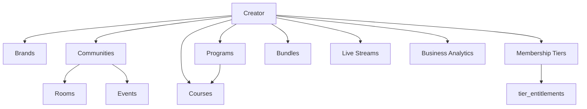
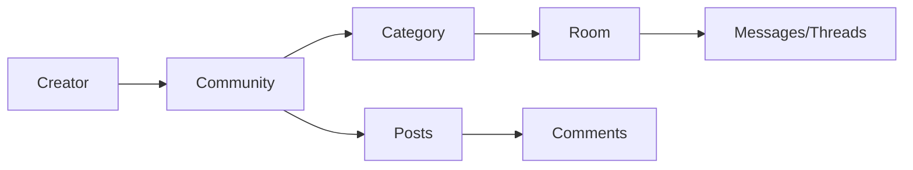
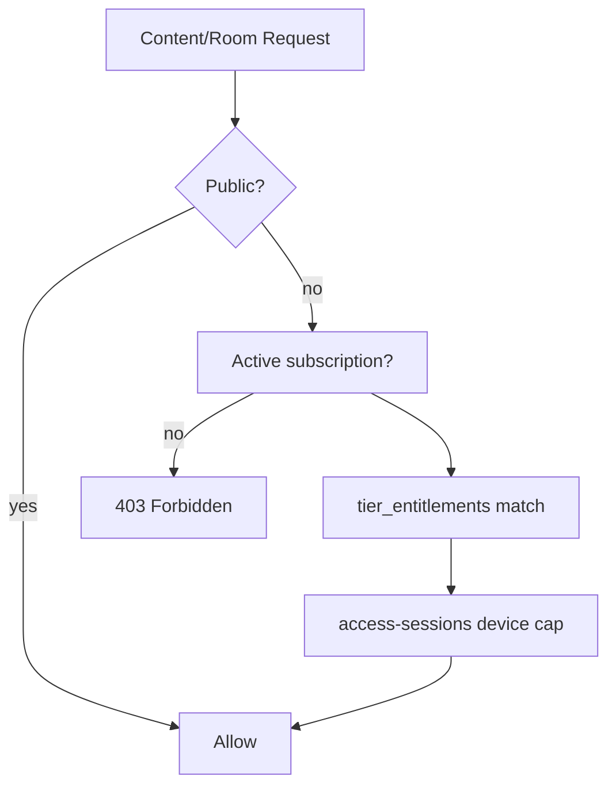

# FORGE Creator Economy OS — Master Tracker

**Version:** 1.1.1 · **Last audit:** 2026-09-03 · **Historical task tracker** — **not** status % SSOT (use [FORGE_PROJECT_MASTER.md §16](./FORGE_PROJECT_MASTER.md#16-feature-status-matrix))  
**Product SSOT:** [FORGE_PRODUCT_STRATEGY.md](./FORGE_PRODUCT_STRATEGY.md) · **Technical:** [FORGE_PROJECT_MASTER.md](./FORGE_PROJECT_MASTER.md)  
**Blueprint (archived):** [archive/FORGE_CREATOR_ECONOMY_OPERATING_SYSTEM_V3.0.md](./archive/FORGE_CREATOR_ECONOMY_OPERATING_SYSTEM_V3.0.md)  
**Re-audit:** [FRESH_AUDIT_2026-09-03_MASTER.md](./audits/FRESH_AUDIT_2026-09-03_MASTER.md) · Next: 50K MAU or 2026-12-01

---

## Status legend

| Symbol | Meaning |
|--------|---------|
| ✅ | Completed — shipped with code evidence |
| 🔄 | In Progress — active WIP on branch or partial surface |
| ⏳ | Pending — not started |
| 🚫 | Blocked — dependency or deferred trigger |
| 👀 | Needs Review — implemented but untested, unverified, or doc mismatch |

### Update rules

1. **On merge:** set affected `CEOS-Pxx-Txxx` rows to ✅; move next highest-priority ⏳ to 🔄.
2. **Weekly:** refresh §2 executive dashboard counts (re-run `python3 scripts/generate-ceos-tracker.py` or edit manually).
3. **Monthly:** reconcile with [DEFERRED_BACKLOG.md](./audits/DEFERRED_BACKLOG.md) and [AI-LLM-STRATEGY.md](./AI-LLM-STRATEGY.md).
4. **Re-audit:** full pass on schema migration, 50K MAU, or **2026-12-01** (see [FRESH_AUDIT_2026-09-03_MASTER.md](./audits/FRESH_AUDIT_2026-09-03_MASTER.md)).

### Canonical links

| Topic | Doc |
|-------|-----|
| Memberships & Stripe | [MEMBERSHIPS.md](./MEMBERSHIPS.md) |
| AI / LLM rollout | [AI-LLM-STRATEGY.md](./AI-LLM-STRATEGY.md) |
| Deferred items | [audits/DEFERRED_BACKLOG.md](./audits/DEFERRED_BACKLOG.md) |
| Community permission matrix (code) | `apps/api/src/modules/communities/community-permissions.constants.ts` |
| Archived Community 2.0/3.0 trackers | Redirect stubs in `docs/COMMUNITY-*.md` → this file |

---

## 1. Executive dashboard

### Overall completion (historical task counts only)

| Metric | Value |
|--------|-------|
| **Total tasks** | 678 |
| **Completed ✅** | 624 (92.0% of *tracker rows*) |
| **In Progress 🔄** | 0 |
| **Needs Review 👀** | 5 |
| **Pending ⏳** | 35 |
| **Blocked 🚫** | 14 |

> **Not status SSOT.** Tracker row % is a historical CEOS task census only. **Feature status SSOT** is [FORGE_PROJECT_MASTER.md §16](./FORGE_PROJECT_MASTER.md#16-feature-status-matrix). The V3.0 blueprint §Implementation Status Tracker (~98%) is also aspirational — do not cite either percentage as product readiness. Launch blockers (CSAM vendor, Stripe live, Neon drill, DMCA agent) are independent of these counts — see [audits/FRESH_AUDIT_2026-09-03_MASTER.md](./audits/FRESH_AUDIT_2026-09-03_MASTER.md) §4a.

### Completion by domain (phase-weighted)

| Domain | ~Complete |
|--------|-----------|
| Community | 100% |
| Memberships | 100% |
| Content/Feed | 96% |
| Creator Studio | 94% |
| Live | 90% |
| Scale/Infra | 80% |
| AI | 75% |

### P0 active queue (top 15)

| # | ID | Requirement | Status | Pri | Effort |
|---|-----|-------------|--------|-----|--------|

### Risk heatmap

| Area | Level | Key risk |
|------|-------|----------|
| Security | Low–Medium | RBAC verify wired into staging CD; all 15 workers + mail now tested; geo-login detection pending |
| Scale | Medium | No formal 50K MAU load test; Postgres FTS at 500K+ videos |
| Cost | Medium | Mux COGS vs live Stripe revenue — run Stripe live checklist (F-1101 Connect code shipped; keys are ops) |
| UX | Low | Flip community_channels_deprecated staging→prod; mobile studio community consolidated |
| Docs | Low | Community 2.0/3.0 redirects + master tracker shipped 2026-06-22 |
| Revenue | Medium | Runbook shipped; prod cutover + Connect onboarding still required |

---

## 2. Architecture diagrams

### Creator ecosystem

### Community hierarchy

### Entitlement evaluation

### Event-driven async (BullMQ)

See [FORGE_PROJECT_MASTER.md §5](./FORGE_PROJECT_MASTER.md#5-background-workers-bullmq) — key queues: `subscription-maintenance`, `community-moderation`, `premium-content-notify`, `analytics-ingest`, `push-dispatch`, `platform-event-outbox`.

---

## 3. Gap analysis summary

### Strengths ✅

- Auth, JWT, CSRF, global guards, rate limiting
- Entitlements + Stripe billing architecture (config-dependent)
- Communities: posts, polls, rooms, voice LiveKit, moderation, engagement
- Access sessions + tier device limits
- Live streaming Mux + chat + AI moderation
- Social platform closed (engagement, DMs, following feed)
- Infra cost optimizations shipped June 2026

### Partial 🔄 / 👀

- Channel→room migration in flight
- Community events API shipped; mobile studio admin missing
- Creator programs studio-only; no consumer enrollment
- Courses text-only; no public catalog
- AI ~48%; live chat LLM only
- Mobile studio fragmentation vs unified web community admin

### Missing ⏳ (major V3.0 scope)

- Unified content types (shorts, articles, podcasts, assignments)
- Advanced live (breakout, multi-host, VIP rooms)
- Study groups, mentorship, office hours
- Geo anomaly / fraud detection
- ML churn, health, engagement prediction
- Netflix-style content library UX
- Search sidecar (F-1302), signed Mux URLs (F-1101)

---

## 4. Implementation roadmap

### Wave 1 — P0 (weeks 1–3): Stabilize in-flight

| ID | Task | Effort | Risk |
|----|------|--------|------|
| CEOS-P04-T015–T017 | Channel→room migration + tests + deprecate legacy UI | L | Data integrity |
| CEOS-P04-T052–T057 | Community events tests + mobile studio admin | M | Parity |
| CEOS-P03-T031–T034 | Creator programs consumer API + enrollment + UI | L | Revenue |
| CEOS-XC-T018–T020 | Tests for events, migration, programs services | M | Quality |
| CEOS-P00-T016–T018 | This tracker + doc chain repair | M | Low |

**Validation:** `bash scripts/smoke-community-2.0.sh` · targeted jest for new specs

### Wave 2 — P1 (weeks 4–8): Revenue & creator OS

- Stripe production cutover (runbook: `docs/operations/STRIPE_PRODUCTION_ENABLEMENT.md`) + smoke-memberships
- Course LMS: lesson CRUD, discovery catalog
- Channel sunset staging enablement (`docs/operations/CHANNEL_SUNSET.md` + smoke script)
- Permission matrix markdown doc
- CI: `verify-platform-roles.sh` on release

### Wave 3 — P2 (weeks 9–16): Engagement & AI Phase I

- AI moderation cascade (community rooms/posts) per AI-LLM-STRATEGY
- Gamification expansion
- Creator analytics KPIs
- Feed/search test coverage

### Wave 4 — P3 (quarter+): Scale & enterprise

- Search sidecar (F-1302) · 50K MAU load test
- Advanced live features
- ML churn/health classifiers
- Signed Mux URLs (F-1101)

---

## 5. Task registry

**Total: 678 tasks** across phases 0–17.

## Phase 0 — Discovery & Audit (25 tasks)

| ID | Requirement | Surface | Status | Evidence | Gap | Pri | Effort | Depends | Owner |
|----|-------------|---------|--------|----------|-----|-----|--------|---------|-------|
| CEOS-P00-T001 | Platform architecture inventory (API modules) | Docs | ✅ | docs/FORGE_PROJECT_MASTER.md §4 | - | P0 | S | - | Backend |
| CEOS-P00-T002 | Web route inventory (64 pages) | Docs | ✅ | apps/web/src/app/**/page.tsx | - | P0 | S | - | Backend |
| CEOS-P00-T003 | Mobile route inventory (40+ screens) | Docs | ✅ | apps/mobile/lib/core/router/app_router.dart | - | P0 | S | - | Backend |
| CEOS-P00-T004 | Admin route inventory (16 pages) | Docs | ✅ | apps/admin/src/app/**/page.tsx | - | P0 | S | - | Backend |
| CEOS-P00-T005 | Database migration inventory (57 migrations) | Docs | ✅ | apps/api/src/database/migrations/ | - | P0 | S | - | Backend |
| CEOS-P00-T006 | BullMQ worker inventory | Docs | ✅ | docs/FORGE_PROJECT_MASTER.md §5 | - | P0 | S | - | Backend |
| CEOS-P00-T007 | Socket.IO event inventory | Docs | ✅ | packages/shared-types/src/socket-events.ts | - | P0 | S | - | Backend |
| CEOS-P00-T008 | Enterprise audit closure review | Docs | ✅ | docs/audits/EXECUTIVE_SUMMARY.md | - | P1 | S | - | Backend |
| CEOS-P00-T009 | Social platform audit review | Docs | ✅ | docs/audits/SOCIAL_PLATFORM_AUDIT_2026-06.md | - | P1 | S | - | Backend |
| CEOS-P00-T010 | Infrastructure cost audit review | Docs | ✅ | docs/audits/INFRASTRUCTURE_COST_AUDIT_2026-06.md | - | P1 | S | - | Backend |
| CEOS-P00-T011 | Deferred backlog reconciliation | Docs | ✅ | docs/audits/DEFERRED_BACKLOG.md | - | P1 | S | - | Backend |
| CEOS-P00-T012 | AI/LLM strategy audit | Docs | ✅ | docs/AI-LLM-STRATEGY.md | - | P1 | S | - | Backend |
| CEOS-P00-T013 | Membership/billing doc audit | Docs | ✅ | docs/MEMBERSHIPS.md | - | P1 | S | - | Backend |
| CEOS-P00-T014 | API test coverage inventory (75 specs) | Docs | ✅ | apps/api/**/*.spec.ts | - | P1 | S | - | Backend |
| CEOS-P00-T015 | CI pipeline inventory | Docs | ✅ | .github/workflows/ci.yml | - | P1 | S | - | Backend |
| CEOS-P00-T016 | Creator economy OS master tracker (this doc) | Docs | ✅ | docs/FORGE_CREATOR_ECONOMY_OS_MASTER_TRACKER.md | - | P0 | L | - | Backend |
| CEOS-P00-T017 | Evidence-based completion % dashboard | Docs | ✅ | This doc §2 | - | P0 | M | - | Backend |
| CEOS-P00-T018 | Broken doc link audit | Docs | ✅ | docs/README.md redirects | - | P0 | S | - | Backend |
| CEOS-P00-T019 | WIP branch feature audit (events, programs, migration) | Docs | ✅ | P0 implementation shipped 2026-06-22 | - | P0 | M | - | Backend |
| CEOS-P00-T020 | Permission matrix code audit | Docs | ✅ | community-permissions.constants.ts | - | P1 | S | - | Backend |
| CEOS-P00-T021 | Entitlement engine code audit | Docs | ✅ | entitlements.service.ts | - | P1 | S | - | Backend |
| CEOS-P00-T022 | Access session architecture audit | Docs | ✅ | access-sessions.service.ts | - | P1 | S | - | Backend |
| CEOS-P00-T023 | Mux/S3 media pipeline audit | Docs | ✅ | docs/MEDIA.md | - | P2 | S | - | Backend |
| CEOS-P00-T024 | Neon/Redis connection budget audit | Docs | ✅ | docs/audits/NEON_COST.md | - | P2 | S | - | Backend |
| CEOS-P00-T025 | Re-audit schedule definition (2026-09-04 or 50K MAU) | Docs | ✅ | docs/audits/EXECUTIVE_SUMMARY.md | - | P1 | S | - | Backend |
## Phase 1 — Gap Analysis (30 tasks)

| ID | Requirement | Surface | Status | Evidence | Gap | Pri | Effort | Depends | Owner |
|----|-------------|---------|--------|----------|-----|-----|--------|---------|-------|
| CEOS-P01-T001 | Architecture gap: channel vs room dual model | API | ✅ | deprecation + room bridge + CHANNEL_SUNSET.md runbook | - | P1 | L | - | Backend |
| CEOS-P01-T002 | Architecture gap: creator programs no consumer API | API | ✅ | creator-programs.controller.ts consumer routes | - | P0 | M | - | Backend |
| CEOS-P01-T003 | Architecture gap: courses no public catalog | API | ✅ | courses discover + catalog API | - | P1 | M | - | Backend |
| CEOS-P01-T004 | Technical gap: 10 API modules zero tests | API | ✅ | P1 modules covered (admin/feed/search/DM/reports); P2/P3 remain | - | P1 | L | - | Backend |
| CEOS-P01-T005 | Technical gap: global auth guards untested | API | ✅ | 6 guard spec files (28 tests) | - | P1 | M | - | Backend |
| CEOS-P01-T006 | Technical gap: Postgres FTS at scale | API | 🚫 | F-1302 deferred | Perf | P3 | XL | - | Platform |
| CEOS-P01-T007 | Security gap: geo anomaly detection | API | 🚫 | Needs an IP-geolocation dependency; investigated geoip-lite (115MB unpacked, too heavy for Fly image), geoip-country (small but pulls vulnerable transitive ip-address <=10.3.0 with no clean override path), ip-location-api (downloads its DB from the network at build/first-run, deploy-time risk) — no acceptable option found yet | Needs dependency decision | P3 | L | - | Backend |
| CEOS-P01-T008 | Security gap: suspicious login detection | API | ✅ | auth.service.ts recordNewDeviceIfNeeded emits auth.login.suspicious (new_device_login vs rapid_ip_change <10min, geo-free impossible-travel proxy) -> FraudDetectionService.onSuspiciousLogin persists as FraudAlert; specs in auth.service.spec.ts + fraud-detection.service.spec.ts | - | P3 | L | - | Backend |
| CEOS-P01-T009 | Security gap: signed Mux URLs (DRM) | API | 🚫 | F-1101 | Security | P3 | L | - | Backend |
| CEOS-P01-T010 | UX gap: mobile studio programs missing | Mobile | ✅ | studio_programs_screen.dart | - | P1 | M | CEOS-P03-T035 | Mobile |
| CEOS-P01-T011 | UX gap: mobile studio events admin missing | Mobile | ✅ | studio_engagement_screen.dart events | - | P0 | M | - | Mobile |
| CEOS-P01-T012 | UX gap: mobile billing env parity | Mobile | ✅ | membership_panel.dart launches checkoutUrl and surfaces server errors (no silent mock fallback in prod) | - | P1 | S | - | Mobile |
| CEOS-P01-T013 | UX gap: web welcome modal (mobile missing) | Mobile | ✅ | community_welcome_dialog.dart wired into community_screen.dart | - | P2 | S | - | Mobile |
| CEOS-P01-T014 | Creator gap: subscriber CSV export mobile | Mobile | ✅ | studio_subscribers_screen.dart + csv_export_util.dart | - | P2 | S | - | Mobile |
| CEOS-P01-T015 | Community gap: voice stage raise-hand mobile | Mobile | ✅ | community_stage_raise_hand_panel.dart | - | P1 | M | - | Mobile |
| CEOS-P01-T016 | Scalability: formal 50K MAU load test | Infra | 🚫 | DEFERRED_BACKLOG Load test | Perf | P3 | XL | - | Platform |
| CEOS-P01-T017 | Scalability: search sidecar trigger | Infra | 🚫 | F-1302 | Perf | P3 | XL | - | Platform |
| CEOS-P01-T018 | Cost: Mux COGS without Stripe revenue | Infra | 🚫 | F-1101 | Perf | P1 | M | - | Product |
| CEOS-P01-T019 | Doc gap: FORGE_PROJECT_MASTER §16 stale | Docs | ✅ | FORGE_PROJECT_MASTER.md §16 updated | - | P0 | S | - | Backend |
| CEOS-P01-T020 | Doc gap: Community 3.0 tracker files missing | Docs | ✅ | redirect stubs + master tracker | - | P0 | S | - | Backend |
| CEOS-P01-T021 | Doc gap: V3.0 claims 98% complete | Docs | ✅ | V3.0 disclaimer added | - | P0 | S | - | Backend |
| CEOS-P01-T022 | Ownership: community-scoped subscriptions | API | ✅ | migration 1836000000000 | - | P1 | M | - | Backend |
| CEOS-P01-T023 | Ownership: multi-brand per creator | API | ✅ | brands.controller.ts | - | P1 | M | - | Backend |
| CEOS-P01-T024 | Notification gap: community activity notify listener | API | ✅ | community-activity-notify.listener.ts | - | P1 | M | - | Backend |
| CEOS-P01-T025 | Feed gap: no semantic recommendations | API | ⏳ | - | Missing | P3 | XL | - | Backend |
| CEOS-P01-T026 | Engagement gap: no study/accountability groups | API | ✅ | modules/study-groups/ (StudyGroup+Member+CheckIn, join/approve/streak), gated by FEATURES_SKILL_ECONOMY_LMS | - | P3 | L | - | Backend |
| CEOS-P01-T027 | Live gap: no breakout rooms | API | ⏳ | - | Missing | P3 | XL | - | Backend |
| CEOS-P01-T028 | Content gap: no unified shorts/articles model | API | ⏳ | - | Missing | P2 | L | - | Backend |
| CEOS-P01-T029 | Gamification gap: no platform-wide referrals | API | ✅ | modules/referral/ (service+controller+entity) wired into gamification.listener.ts REFERRAL_SUCCESS | - | P2 | M | - | Backend |
| CEOS-P01-T030 | AI gap: community LLM moderation not wired | API | ✅ | wired: maybeQueueLlmJudgeTail + config; daily budget cap (ai-budget.service.ts) | - | P2 | M | - | Backend |
## Phase 2 — Industry Benchmarks (15 tasks)

| ID | Requirement | Surface | Status | Evidence | Gap | Pri | Effort | Depends | Owner |
|----|-------------|---------|--------|----------|-----|-----|--------|---------|-------|
| CEOS-P02-T001 | Benchmark: YouTube permission/monetization model | Docs | ✅ | FORGE_CREATOR_ECONOMY_OPERATING_SYSTEM_V3.0.md | - | P3 | S | - | Product |
| CEOS-P02-T002 | Benchmark: Patreon tier/subscription lifecycle | Docs | ✅ | FORGE_CREATOR_ECONOMY_OPERATING_SYSTEM_V3.0.md | - | P3 | S | - | Product |
| CEOS-P02-T003 | Benchmark: Discord community/channel permissions | Docs | ✅ | FORGE_CREATOR_ECONOMY_OPERATING_SYSTEM_V3.0.md | - | P3 | S | - | Product |
| CEOS-P02-T004 | Benchmark: Circle paid community model | Docs | ✅ | FORGE_CREATOR_ECONOMY_OPERATING_SYSTEM_V3.0.md | - | P3 | S | - | Product |
| CEOS-P02-T005 | Benchmark: Kajabi course/cohort model | Docs | ✅ | FORGE_CREATOR_ECONOMY_OPERATING_SYSTEM_V3.0.md | - | P3 | S | - | Product |
| CEOS-P02-T006 | Benchmark: Mighty Networks community events | Docs | ✅ | FORGE_CREATOR_ECONOMY_OPERATING_SYSTEM_V3.0.md | - | P3 | S | - | Product |
| CEOS-P02-T007 | Benchmark: Twitch live chat/moderation | Docs | ✅ | FORGE_CREATOR_ECONOMY_OPERATING_SYSTEM_V3.0.md | - | P3 | S | - | Product |
| CEOS-P02-T008 | Benchmark: Skillshare course discovery | Docs | ✅ | FORGE_CREATOR_ECONOMY_OPERATING_SYSTEM_V3.0.md | - | P3 | S | - | Product |
| CEOS-P02-T009 | Benchmark: Coursera LMS progress model | Docs | ✅ | FORGE_CREATOR_ECONOMY_OPERATING_SYSTEM_V3.0.md | - | P3 | S | - | Product |
| CEOS-P02-T010 | Benchmark: Netflix content library UX | Docs | ✅ | FORGE_CREATOR_ECONOMY_OPERATING_SYSTEM_V3.0.md | - | P3 | S | - | Product |
| CEOS-P02-T011 | Benchmark: Disney+ entitlement model | Docs | ✅ | FORGE_CREATOR_ECONOMY_OPERATING_SYSTEM_V3.0.md | - | P3 | S | - | Product |
| CEOS-P02-T012 | Benchmark: Prime Video session control | Docs | ✅ | FORGE_CREATOR_ECONOMY_OPERATING_SYSTEM_V3.0.md | - | P3 | S | - | Product |
| CEOS-P02-T013 | Benchmark: Skool community engagement loops | Docs | ✅ | FORGE_CREATOR_ECONOMY_OPERATING_SYSTEM_V3.0.md | - | P3 | S | - | Product |
| CEOS-P02-T014 | Benchmark: Facebook Groups discovery | Docs | ✅ | FORGE_CREATOR_ECONOMY_OPERATING_SYSTEM_V3.0.md | - | P3 | S | - | Product |
| CEOS-P02-T015 | Benchmark: Slack community threading | Docs | ✅ | FORGE_CREATOR_ECONOMY_OPERATING_SYSTEM_V3.0.md | - | P3 | S | - | Product |
## Phase 3 — Creator Structure (41 tasks)

| ID | Requirement | Surface | Status | Evidence | Gap | Pri | Effort | Depends | Owner |
|----|-------------|---------|--------|----------|-----|-----|--------|---------|-------|
| CEOS-P03-T001 | Brands CRUD API | API | ✅ | brands.controller.ts | - | P1 | M | - | Backend |
| CEOS-P03-T002 | Brands studio web UI | Web | ✅ | studio/brands/page.tsx | - | P1 | M | - | Frontend |
| CEOS-P03-T003 | Brands studio mobile UI | Mobile | ✅ | studio_brands_screen.dart | - | P1 | M | - | Mobile |
| CEOS-P03-T004 | Creator ecosystem tree API | API | ✅ | GET creators/me/ecosystem-tree | - | P1 | M | - | Backend |
| CEOS-P03-T005 | Ecosystem tree studio analytics web | Web | ✅ | studio/analytics/page.tsx | - | P2 | M | - | Frontend |
| CEOS-P03-T006 | Multi-community per creator | API | ✅ | communities.controller.ts | - | P1 | M | - | Backend |
| CEOS-P03-T007 | Community slug routing web | Web | ✅ | [username]/c/[communitySlug] | - | P1 | M | - | Frontend |
| CEOS-P03-T008 | Community slug routing mobile | Mobile | ✅ | community/:creatorId/c/:slug | - | P1 | M | - | Mobile |
| CEOS-P03-T009 | Creator programs schema migration | API | ✅ | 1837400000000-creator-programs.ts | - | P0 | M | - | Backend |
| CEOS-P03-T010 | Creator programs studio CRUD API | API | ✅ | creator-programs.controller.ts | - | P0 | M | - | Backend |
| CEOS-P03-T011 | Creator programs studio web UI | Web | ✅ | studio/programs/page.tsx | - | P0 | M | - | Frontend |
| CEOS-P03-T012 | Creator programs studio mobile UI | Mobile | ✅ | studio_programs_screen.dart | - | P1 | M | CEOS-P03-T031 | Mobile |
| CEOS-P03-T013 | Creator programs consumer list API | API | ✅ | GET creators/:creatorId/programs | - | P0 | M | CEOS-P03-T031 | Backend |
| CEOS-P03-T014 | Creator programs enrollment API | API | ✅ | POST programs/:programId/enroll | - | P0 | L | CEOS-P03-T031 | Backend |
| CEOS-P03-T015 | Creator programs consumer web UI | Web | ✅ | CreatorProgramsPanel + programs/[slug] page | - | P1 | M | CEOS-P03-T034 | Frontend |
| CEOS-P03-T016 | Creator programs consumer mobile UI | Mobile | ✅ | creator_programs_panel + program_viewer_screen | - | P1 | M | CEOS-P03-T034 | Mobile |
| CEOS-P03-T017 | Creator programs pricing/commerce | API | ✅ | creator-programs.service.ts: priceCents/stripePriceId, free/paid enrollment gating | - | P2 | L | CEOS-P05-T020 | Backend |
| CEOS-P03-T018 | Creator programs tests | API | ✅ | creator-programs.service.spec.ts | - | P0 | M | CEOS-P03-T031 | Backend |
| CEOS-P03-T019 | Courses per creator CRUD | API | ✅ | courses.controller.ts | - | P1 | M | - | Backend |
| CEOS-P03-T020 | Course cohorts schema | API | ✅ | 1820000000000-courses-cohorts.ts | - | P1 | M | - | Backend |
| CEOS-P03-T021 | Course lessons schema | API | ✅ | 1827000000000-phase-b-schema.ts | - | P1 | M | - | Backend |
| CEOS-P03-T022 | Course bind-community | API | ✅ | courses.service.ts bindCommunity | - | P1 | S | - | Backend |
| CEOS-P03-T023 | Course studio web list/detail | Web | ✅ | studio/courses/ | - | P1 | M | - | Frontend |
| CEOS-P03-T024 | Course studio mobile list/detail | Mobile | ✅ | studio_courses_screen.dart | - | P1 | M | - | Mobile |
| CEOS-P03-T025 | Course consumer viewer web | Web | ✅ | courses/[id]/page.tsx | - | P1 | M | - | Frontend |
| CEOS-P03-T026 | Course consumer viewer mobile | Mobile | ✅ | course_viewer_screen.dart | - | P1 | M | - | Mobile |
| CEOS-P03-T027 | Course public discovery/catalog | API | ✅ | GET courses/discover + creators/:id/courses | - | P1 | M | - | Backend |
| CEOS-P03-T028 | Course discover web UI | Web | ✅ | discover/courses + CreatorCoursesPanel | - | P1 | M | - | Frontend |
| CEOS-P03-T029 | Course discover mobile UI | Mobile | ✅ | discover_courses_screen.dart | - | P1 | M | - | Mobile |
| CEOS-P03-T030 | Course video lessons | API | ✅ | course-lms.entity.ts CourseLesson/CourseLessonProgress + courses.service.ts | - | P2 | L | - | Backend |
| CEOS-P03-T031 | Course quizzes/assignments | API | ✅ | course-quiz.entity.ts + courses.service.ts quiz submit/grade | - | P3 | L | - | Backend |
| CEOS-P03-T032 | Course certificates | API | ✅ | courses.service.ts issueCertificate (100% completion, idempotent) + CourseCertificate entity + 3 endpoints | - | P3 | M | - | Backend |
| CEOS-P03-T033 | Membership products per creator | API | ✅ | entitlements.controller.ts tiers | - | P0 | M | - | Backend |
| CEOS-P03-T034 | Creator bundles schema | API | ✅ | 1831000000000-creator-bundles.ts | - | P1 | M | - | Backend |
| CEOS-P03-T035 | Creator bundles studio web | Web | ✅ | studio/bundles/page.tsx | - | P1 | M | - | Frontend |
| CEOS-P03-T036 | Creator bundles studio mobile (simplified) | Mobile | ✅ | studio_bundles_screen.dart | - | P1 | M | - | Mobile |
| CEOS-P03-T037 | Live sessions per creator | API | ✅ | streaming.controller.ts | - | P1 | M | - | Backend |
| CEOS-P03-T038 | Content library per creator | API | ✅ | GET /videos/studio paginated + filter(status/visibility/category) + title search + sort via studio-library-query.util (tested); web studio/videos search/sort/load-more | - | P2 | M | - | Backend |
| CEOS-P03-T039 | Analytics per creator business API | API | ✅ | GET creators/me/business-analytics | - | P1 | M | - | Backend |
| CEOS-P03-T040 | Programs in ecosystem tree | API | ✅ | communities.service.ts getCreatorEcosystemTree | - | P1 | S | - | Backend |
| CEOS-P03-T041 | Cohort date fields utilized | API | ✅ | createCohort/updateCohort persist+validate startsAt/endsAt (end-after-start); enroll validates cohort belongs to course + rejects ended cohorts; PATCH cohort endpoint; web start/end inputs; tested | - | P2 | S | - | Backend |
## Phase 4 — Community 2.0/3.0 (90 tasks)

| ID | Requirement | Surface | Status | Evidence | Gap | Pri | Effort | Depends | Owner |
|----|-------------|---------|--------|----------|-----|-----|--------|---------|-------|
| CEOS-P04-T001 | Communities schema (brands, slugs, settings) | API | ✅ | 1800000000000-community-2-schema.ts | - | P0 | M | - | Backend |
| CEOS-P04-T002 | Community discover featured API | API | ✅ | GET communities/discover/featured | - | P1 | S | - | Backend |
| CEOS-P04-T003 | Community search API | API | ✅ | GET communities/search | - | P1 | S | - | Backend |
| CEOS-P04-T004 | Community layout API | API | ✅ | GET communities/:id/layout | - | P1 | S | - | Backend |
| CEOS-P04-T005 | Community access check API | API | ✅ | GET .../communities/:slug/access | - | P0 | M | - | Backend |
| CEOS-P04-T006 | Community categories CRUD | API | ✅ | communities.controller.ts categories | - | P1 | M | - | Backend |
| CEOS-P04-T007 | Legacy channels CRUD (deprecated path) | API | ✅ | Deprecation headers + 410 when flag on | - | P1 | M | - | Backend |
| CEOS-P04-T008 | Channel messages API (legacy) | API | ✅ | Bridged to rooms + deprecation headers | - | P1 | M | - | Backend |
| CEOS-P04-T009 | Mobile studio community channels removed | Mobile | ✅ | studio_community_screen uses rooms API | - | P1 | M | - | Mobile |
| CEOS-P04-T010 | Rooms schema migration | API | ✅ | 1832000000000-community-rooms.ts | - | P0 | M | - | Backend |
| CEOS-P04-T011 | Room messages schema | API | ✅ | 1833000000000-community-room-messages.ts | - | P0 | M | - | Backend |
| CEOS-P04-T012 | Room members/session tokens | API | ✅ | 1835000000000-community-members-session-token.ts | - | P1 | M | - | Backend |
| CEOS-P04-T013 | Room category assignment | API | ✅ | 1834000000000-community-room-category.ts | - | P1 | S | - | Backend |
| CEOS-P04-T014 | Channel→room mapping entity | API | ✅ | channel-room-mapping.entity.ts | - | P0 | M | - | Backend |
| CEOS-P04-T015 | Channel→room backfill migration | API | ✅ | 1837100000000-channel-to-room-backfill.ts | - | P0 | L | - | Backend |
| CEOS-P04-T016 | Channel migration service (idempotent) | API | ✅ | channel-migration.service.ts | - | P0 | L | - | Backend |
| CEOS-P04-T017 | Channel migration tests | API | ✅ | channel-migration.service.spec.ts | - | P0 | M | CEOS-P04-T016 | Backend |
| CEOS-P04-T018 | Lazy channel resolve on legacy access | API | ✅ | resolveRoomIdForChannel lazy map | - | P0 | M | - | Backend |
| CEOS-P04-T019 | Deprecate legacy channel UI paths | Web | ✅ | studio/communities/[id] channels tab removed | - | P0 | M | CEOS-P04-T016 | Frontend |
| CEOS-P04-T020 | Rooms list/get API | API | ✅ | community-rooms.controller.ts | - | P0 | M | - | Backend |
| CEOS-P04-T021 | Rooms studio CRUD | API | ✅ | POST/PATCH/DELETE creators/me/.../rooms | - | P0 | M | - | Backend |
| CEOS-P04-T022 | Text room messages API | API | ✅ | community-rooms.controller.ts messages | - | P0 | M | - | Backend |
| CEOS-P04-T023 | Text room web consumer UI | Web | ✅ | community/.../text/[roomId]/page.tsx | - | P0 | M | - | Frontend |
| CEOS-P04-T024 | Text room mobile consumer UI | Mobile | ✅ | community_text_room_screen.dart | - | P0 | M | - | Mobile |
| CEOS-P04-T025 | Voice room LiveKit token API | API | ✅ | POST .../rooms/:id/token | - | P0 | M | - | Backend |
| CEOS-P04-T026 | Voice room web UI | Web | ✅ | community/.../voice/[roomId]/page.tsx | - | P0 | M | - | Frontend |
| CEOS-P04-T027 | Voice room mobile UI | Mobile | ✅ | community_voice_room_screen.dart + stage raise-hand | - | P1 | M | - | Mobile |
| CEOS-P04-T028 | Raise-hand stage API | API | ✅ | raise-hand endpoints | - | P1 | M | - | Backend |
| CEOS-P04-T029 | Raise-hand web panel | Web | ✅ | CommunityStageRaiseHandPanel.tsx | - | P1 | M | - | Frontend |
| CEOS-P04-T030 | Raise-hand mobile panel | Mobile | ✅ | community_stage_raise_hand_panel.dart | - | P1 | M | CEOS-P04-T029 | Mobile |
| CEOS-P04-T031 | Room RBAC permissions API | API | ✅ | room permissions endpoints | - | P0 | M | - | Backend |
| CEOS-P04-T032 | Room permissions service tests | API | ✅ | community-room-permissions.service.spec.ts | - | P1 | S | - | Backend |
| CEOS-P04-T033 | Studio rooms panel web | Web | ✅ | StudioRoomsPanel.tsx | - | P1 | M | - | Frontend |
| CEOS-P04-T034 | Studio rooms screen mobile | Mobile | ✅ | studio_rooms_screen.dart | - | P1 | M | - | Mobile |
| CEOS-P04-T035 | Community posts schema | API | ✅ | 1810000000000-community-posts.ts | - | P1 | M | - | Backend |
| CEOS-P04-T036 | Community posts CRUD API | API | ✅ | community-posts.controller.ts | - | P1 | M | - | Backend |
| CEOS-P04-T037 | Post comments API | API | ✅ | post comments endpoints | - | P1 | M | - | Backend |
| CEOS-P04-T038 | Post reactions API | API | ✅ | POST .../reactions | - | P1 | S | - | Backend |
| CEOS-P04-T039 | Post media upload presign | API | ✅ | posts/media-upload-url | - | P1 | M | - | Backend |
| CEOS-P04-T040 | Post pin API | API | ✅ | POST .../pin | - | P2 | S | - | Backend |
| CEOS-P04-T041 | Posts consumer web tab | Web | ✅ | CommunityPanel.tsx posts tab | - | P1 | M | - | Frontend |
| CEOS-P04-T042 | Posts consumer mobile tab | Mobile | ✅ | community_screen.dart | - | P1 | M | - | Mobile |
| CEOS-P04-T043 | Community polls schema | API | ✅ | 1823000000000-community-polls.ts | - | P1 | M | - | Backend |
| CEOS-P04-T044 | Polls vote/close API | API | ✅ | community-polls.controller.ts | - | P1 | M | - | Backend |
| CEOS-P04-T045 | Polls consumer web/mobile | Web | ✅ | CommunityPanel polls tab | - | P1 | S | - | Frontend |
| CEOS-P04-T046 | Community events schema | API | ✅ | community-event.entity.ts | - | P0 | M | - | Backend |
| CEOS-P04-T047 | Event recurrence migration | API | ✅ | 1837300000000-community-event-recurrence.ts | - | P0 | M | - | Backend |
| CEOS-P04-T048 | Event recurrence util tests | API | ✅ | community-event-recurrence.util.spec.ts | - | P1 | S | - | Backend |
| CEOS-P04-T049 | Events list/create API | API | ✅ | community-events.controller.ts | - | P0 | M | - | Backend |
| CEOS-P04-T050 | Events RSVP API | API | ✅ | POST .../rsvp | - | P0 | M | - | Backend |
| CEOS-P04-T051 | Events RSVP admin list API | API | ✅ | GET .../rsvps | - | P1 | M | - | Backend |
| CEOS-P04-T052 | Events update/delete API | API | ✅ | PATCH/DELETE events | - | P0 | M | - | Backend |
| CEOS-P04-T053 | Events service tests | API | ✅ | community-events.service.spec.ts | - | P0 | M | CEOS-P04-T052 | Backend |
| CEOS-P04-T054 | Events consumer engage web | Web | ✅ | CommunityEngagePanel.tsx events | - | P1 | M | - | Frontend |
| CEOS-P04-T055 | Events consumer engage mobile | Mobile | ✅ | community_screen.dart events | - | P1 | M | - | Mobile |
| CEOS-P04-T056 | Events studio web panel | Web | ✅ | StudioCommunityEventsPanel.tsx | - | P0 | M | - | Frontend |
| CEOS-P04-T057 | Events studio mobile admin | Mobile | ✅ | studio_engagement_screen.dart events | - | P0 | M | CEOS-P04-T057 | Mobile |
| CEOS-P04-T058 | Members join-request API | API | ✅ | community-members.controller.ts | - | P0 | M | - | Backend |
| CEOS-P04-T059 | Members approve/reject/suspend | API | ✅ | members PATCH endpoints | - | P0 | M | - | Backend |
| CEOS-P04-T060 | Members export API | API | ✅ | members export endpoint | - | P1 | S | - | Backend |
| CEOS-P04-T061 | Members studio web panel | Web | ✅ | StudioCommunityMembersPanel.tsx | - | P1 | M | - | Frontend |
| CEOS-P04-T062 | Members studio mobile | Mobile | ✅ | studio_community_screen.dart member roster + CSV export | - | P1 | M | - | Mobile |
| CEOS-P04-T063 | Moderation reports API | API | ✅ | community-moderation.controller.ts | - | P0 | M | - | Backend |
| CEOS-P04-T064 | Reports room_id migration | API | ✅ | 1837200000000-community-reports-room-id.ts | - | P0 | S | - | Backend |
| CEOS-P04-T065 | Moderation bans/roles API | API | ✅ | bans/roles endpoints | - | P0 | M | - | Backend |
| CEOS-P04-T066 | Moderation inbox API | API | ✅ | GET creators/me/moderation/inbox | - | P1 | M | - | Backend |
| CEOS-P04-T067 | Moderation studio web hub | Web | ✅ | studio/moderation/ | - | P1 | M | - | Frontend |
| CEOS-P04-T068 | Moderation studio mobile | Mobile | ✅ | studio_moderation_screen.dart | - | P1 | M | - | Mobile |
| CEOS-P04-T069 | Wiki/challenges/surveys API | API | ✅ | community-engagement.controller.ts | - | P1 | M | - | Backend |
| CEOS-P04-T070 | Engagement studio web panel | Web | ✅ | community detail engagement tab | - | P1 | M | - | Frontend |
| CEOS-P04-T071 | Engagement studio mobile | Mobile | ✅ | studio_engagement_screen.dart | - | P1 | M | - | Mobile |
| CEOS-P04-T072 | Community welcome modal web | Web | ✅ | CommunityWelcomeModal.tsx | - | P2 | S | - | Frontend |
| CEOS-P04-T073 | Discover communities web | Web | ✅ | discover/communities/page.tsx | - | P1 | M | - | Frontend |
| CEOS-P04-T074 | Discover communities mobile | Mobile | ✅ | discover_communities_screen.dart | - | P1 | M | - | Mobile |
| CEOS-P04-T075 | Community analytics API | API | ✅ | GET .../analytics | - | P1 | M | - | Backend |
| CEOS-P04-T076 | Community trends chart web | Web | ✅ | CommunityTrendsChart.tsx | - | P2 | M | - | Frontend |
| CEOS-P04-T077 | Permission matrix API | API | ✅ | GET .../permissions/matrix | - | P0 | M | - | Backend |
| CEOS-P04-T078 | Permission matrix doc | Docs | ✅ | docs/COMMUNITY-PERMISSION-MATRIX.md | - | P1 | S | - | Backend |
| CEOS-P04-T079 | Paid community access gating | API | ✅ | entitlements + community access | - | P0 | M | - | Backend |
| CEOS-P04-T080 | Invite-only community join flow | API | ✅ | join-request flow | - | P1 | M | - | Backend |
| CEOS-P04-T081 | Course-linked community | API | ✅ | courses bind-community | - | P1 | M | - | Backend |
| CEOS-P04-T082 | Cohort community type | API | ✅ | community.entity.ts CommunityType.COHORT + courses cohort.dto.ts | - | P2 | M | - | Backend |
| CEOS-P04-T083 | Event community type | API | ✅ | CommunityType.EVENT is a real creator-selectable type (community.entity.ts), included in standard feed/discovery alongside STANDARD (community-posts.service.ts:180); paired with a full events sub-feature (community-events.service.ts: CRUD, RSVP, recurrence, office-hours capacity slots). Tracker note was stale | - | P2 | M | - | Backend |
| CEOS-P04-T084 | Community HTTP e2e tests | API | ✅ | community-http.e2e-spec.ts | - | P1 | M | - | Backend |
| CEOS-P04-T085 | Smoke community 2.0 script | Infra | ✅ | scripts/smoke-community-2.0.sh | - | P1 | S | - | Platform |
| CEOS-P04-T086 | Community activity notify listener | API | ✅ | community-activity-notify.listener.ts — scoped to broadcast events, paginated + batched fan-out, off request path | - | P1 | M | - | Backend |
| CEOS-P04-T087 | Community moderation async worker | Worker | ✅ | community-moderation.worker.ts | - | P1 | M | - | Backend |
| CEOS-P04-T088 | Community announcement notify worker | Worker | ✅ | community-announcement-notify.worker.ts | - | P1 | M | - | Backend |
| CEOS-P04-T089 | Thread/nested comment model (rooms) | API | ✅ | parentMessageId entity + list/send | - | P0 | M | - | Backend |
| CEOS-P04-T090 | Knowledge base (wiki) | API | ✅ | engagement wiki endpoints | - | P1 | M | - | Backend |
## Phase 5 — Membership & Entitlements (56 tasks)

| ID | Requirement | Surface | Status | Evidence | Gap | Pri | Effort | Depends | Owner |
|----|-------------|---------|--------|----------|-----|-----|--------|---------|-------|
| CEOS-P05-T001 | subscription_tiers schema | API | ✅ | 1750000000000-live-subs-community.ts | - | P0 | M | - | Backend |
| CEOS-P05-T002 | member_subscriptions schema | API | ✅ | 1750000000000-live-subs-community.ts | - | P0 | M | - | Backend |
| CEOS-P05-T003 | tier_entitlements schema | API | ✅ | 1800000000000-community-2-schema.ts | - | P0 | M | - | Backend |
| CEOS-P05-T004 | Stripe subscription source enum | API | ✅ | 1780000000000-add-stripe-subscription-source.ts | - | P0 | S | - | Backend |
| CEOS-P05-T005 | Community-scoped subscription column | API | ✅ | 1836000000000-member-subscription-community-id.ts | - | P0 | M | - | Backend |
| CEOS-P05-T006 | Active subscription unique constraint | API | ✅ | 1837000000000-member-subscription-active-unique.ts | - | P0 | S | - | Backend |
| CEOS-P05-T007 | Tier device limits column | API | ✅ | 1828000000000-tier-device-limits.ts | - | P0 | S | - | Backend |
| CEOS-P05-T008 | Public tiers list API | API | ✅ | GET creators/:id/tiers | - | P0 | S | - | Backend |
| CEOS-P05-T009 | Creator tier CRUD API | API | ✅ | creators/me/tiers | - | P0 | M | - | Backend |
| CEOS-P05-T010 | Tier entitlements CRUD | API | ✅ | entitlements per tier | - | P0 | M | - | Backend |
| CEOS-P05-T011 | Stripe price sync on tier save | API | ✅ | stripe-tier-sync.service.ts | - | P0 | M | - | Backend |
| CEOS-P05-T012 | Stripe price sync tests | API | ✅ | stripe-tier-sync.service.spec.ts (18 tests) | - | P1 | M | - | Backend |
| CEOS-P05-T013 | Membership me API | API | ✅ | GET creators/:id/membership/me | - | P0 | S | - | Backend |
| CEOS-P05-T014 | Subscriptions me API | API | ✅ | GET subscriptions/me | - | P0 | S | - | Backend |
| CEOS-P05-T015 | Mock subscription join | API | ✅ | POST subscriptions/mock | - | P1 | S | - | Backend |
| CEOS-P05-T016 | Subscription cancel API | API | ✅ | DELETE subscriptions/me/:creatorId | - | P0 | M | - | Backend |
| CEOS-P05-T017 | Stripe checkout recurring API | API | ✅ | POST billing/checkout | - | P0 | M | - | Backend |
| CEOS-P05-T018 | Stripe checkout paid event API | API | ✅ | POST billing/checkout/event | - | P1 | M | - | Backend |
| CEOS-P05-T019 | Stripe webhook idempotency | API | ✅ | billing.service.ts webhook | - | P0 | M | - | Backend |
| CEOS-P05-T020 | Stripe Connect onboard API | API | ✅ | POST billing/connect/onboard | - | P0 | M | - | Backend |
| CEOS-P05-T021 | Stripe Connect status API | API | ✅ | GET billing/connect/status | - | P0 | S | - | Backend |
| CEOS-P05-T022 | Stripe billing portal API | API | ✅ | POST billing/portal | - | P0 | M | - | Backend |
| CEOS-P05-T023 | Tier change API (proration) | API | ✅ | subscription-change.service.ts | - | P0 | M | - | Backend |
| CEOS-P05-T024 | Tier change tests | API | ✅ | subscription-change.service.spec.ts | - | P1 | S | - | Backend |
| CEOS-P05-T025 | Billing stub provider default | API | ✅ | billingProviderFactory fail-fast: real prod (mockSubscriptions=false) requires BILLING_PROVIDER=stripe + STRIPE_SECRET_KEY | - | P1 | S | - | Backend |
| CEOS-P05-T026 | Production Stripe enablement runbook | Docs | ✅ | docs/operations/STRIPE_PRODUCTION_ENABLEMENT.md + set-stripe-secrets-fly.sh | - | P1 | M | - | Platform |
| CEOS-P05-T027 | Destination charges Connect model | API | ✅ | MEMBERSHIPS.md | - | P0 | M | - | Backend |
| CEOS-P05-T028 | Platform fee percent config | API | ✅ | STRIPE_PLATFORM_FEE_PERCENT | - | P1 | S | - | Backend |
| CEOS-P05-T029 | Creator bundles CRUD API | API | ✅ | creator-bundles.service.ts | - | P1 | M | - | Backend |
| CEOS-P05-T030 | Creator bundles tests | API | ✅ | creator-bundles.service.spec.ts | - | P1 | S | - | Backend |
| CEOS-P05-T031 | Entitlements batch access check | API | ✅ | entitlements.service.ts | - | P0 | M | - | Backend |
| CEOS-P05-T032 | Entitlements Redis cache | API | ✅ | entitlements.service.ts cache | - | P1 | M | - | Backend |
| CEOS-P05-T033 | Entitlements service tests | API | ✅ | entitlements.service.spec.ts | - | P1 | M | - | Backend |
| CEOS-P05-T034 | Gate VOD by tier | API | ✅ | content playback entitlements | - | P0 | M | - | Backend |
| CEOS-P05-T035 | Gate live by tier | API | ✅ | streaming entitlements | - | P0 | M | - | Backend |
| CEOS-P05-T036 | Gate community by tier | API | ✅ | community access listener | - | P0 | M | - | Backend |
| CEOS-P05-T037 | Gate course by tier | API | ✅ | courses.service.ts enroll | - | P0 | M | - | Backend |
| CEOS-P05-T038 | Subscriber list API | API | ✅ | creators/me/subscribers | - | P1 | M | - | Backend |
| CEOS-P05-T039 | Subscriber analytics API | API | ✅ | subscribers/analytics MRR | - | P1 | M | - | Backend |
| CEOS-P05-T040 | Subscriber grant API | API | ✅ | admin/creator grant | - | P1 | M | - | Backend |
| CEOS-P05-T041 | Subscriber suspend API | API | ✅ | suspend endpoint | - | P1 | M | - | Backend |
| CEOS-P05-T042 | Subscriber export API | API | ✅ | export CSV (hardened via injection-safe csv.util) | - | P1 | S | - | Backend |
| CEOS-P05-T043 | Studio tiers web UI | Web | ✅ | studio/tiers/page.tsx | - | P0 | M | - | Frontend |
| CEOS-P05-T044 | Studio tiers mobile UI | Mobile | ✅ | studio_tiers_screen.dart | - | P0 | M | - | Mobile |
| CEOS-P05-T045 | Membership panel web checkout | Web | ✅ | MembershipPanel.tsx | - | P0 | M | - | Frontend |
| CEOS-P05-T046 | Membership panel mobile checkout | Mobile | ✅ | membership_panel.dart launches checkoutUrl; surfaces DioException server message; mock only on stub no-url | - | P1 | M | - | Mobile |
| CEOS-P05-T047 | My memberships settings web | Web | ✅ | settings/memberships/page.tsx | - | P0 | M | - | Frontend |
| CEOS-P05-T048 | My memberships settings mobile | Mobile | ✅ | my_memberships_screen.dart | - | P0 | M | - | Mobile |
| CEOS-P05-T049 | Subscription maintenance worker | Worker | ✅ | subscription-maintenance worker | - | P0 | M | - | Backend |
| CEOS-P05-T050 | Trial lifecycle state machine | API | ✅ | expireDueSubscriptions+getExpiringSubscriptions cover TRIAL; worker safety-net trial->expired; trial-ending reminders | - | P2 | L | - | Backend |
| CEOS-P05-T051 | Pause/grace period states | API | ✅ | grace_period/paused/renewal_pending/failed_payment set via Stripe webhooks; renewal_pending added to expiry safety-net; grace_period excluded to preserve dunning window | - | P2 | L | - | Backend |
| CEOS-P05-T052 | Seat-limited access model | API | ✅ | subscription-tier.entity.ts maxMembers (null=unlimited) enforced in billing.service.ts checkout | - | P3 | L | - | Backend |
| CEOS-P05-T053 | Lifetime access SKU | API | ✅ | BillingInterval.LIFETIME wired through stripe-tier-sync/stripe-payment/entitlements-analytics | - | P3 | M | - | Backend |
| CEOS-P05-T054 | Bundle access evaluation | API | ✅ | creator bundles entitlements | - | P1 | M | - | Backend |
| CEOS-P05-T055 | Upgrade/downgrade UX flows | Web | ✅ | settings/memberships TierChangeSelect: checkoutUrl redirect, proration-accurate copy, error surfacing, sorted upgrade/downgrade labels | - | P1 | M | - | Frontend |
| CEOS-P05-T056 | Smoke memberships script | Infra | ✅ | scripts/smoke-memberships.sh | - | P1 | S | - | Platform |
## Phase 6 — Unified Content System (45 tasks)

| ID | Requirement | Surface | Status | Evidence | Gap | Pri | Effort | Depends | Owner |
|----|-------------|---------|--------|----------|-----|-----|--------|---------|-------|
| CEOS-P06-T001 | Videos VOD upload multipart | API | ✅ | videos.controller.ts multipart | - | P0 | M | - | Backend |
| CEOS-P06-T002 | Mux VOD transcode pipeline | Worker | ✅ | mux-vod-ingest worker | - | P0 | M | - | Backend |
| CEOS-P06-T003 | FFmpeg transcode pipeline (optional) | Worker | ✅ | video-processing worker | - | P2 | M | - | Backend |
| CEOS-P06-T004 | Video visibility tiers | API | ✅ | ContentVisibility enum | - | P0 | M | - | Backend |
| CEOS-P06-T005 | Video skill tags | API | ✅ | video_skill_tags | - | P1 | S | - | Backend |
| CEOS-P06-T006 | Video studio CRUD web | Web | ✅ | studio/videos/ | - | P0 | M | - | Frontend |
| CEOS-P06-T007 | Video upload wizard web (3-step) | Web | ✅ | upload/step/[step] | - | P1 | M | - | Frontend |
| CEOS-P06-T008 | Video upload mobile (single screen) | Mobile | ✅ | upload_screen.dart + upload_repository.dart send required visibility/categoryId/skillTagIds to /videos/:id/complete | - | P1 | M | - | Mobile |
| CEOS-P06-T009 | Watch page web | Web | ✅ | watch/[id]/page.tsx | - | P0 | M | - | Frontend |
| CEOS-P06-T010 | Watch page mobile | Mobile | ✅ | watch_screen.dart | - | P0 | M | - | Mobile |
| CEOS-P06-T011 | Feed latest/popular/forYou API | API | ✅ | feed.controller.ts | - | P0 | M | - | Backend |
| CEOS-P06-T012 | Following feed API | API | ✅ | GET feed/following | - | P1 | M | - | Backend |
| CEOS-P06-T013 | Feed web home | Web | ✅ | page.tsx HomePageContent | - | P0 | M | - | Frontend |
| CEOS-P06-T014 | Feed mobile | Mobile | ✅ | feed_screen.dart | - | P0 | M | - | Mobile |
| CEOS-P06-T015 | Explore/search web | Web | ✅ | explore/, search/ | - | P1 | M | - | Frontend |
| CEOS-P06-T016 | Explore + dedicated search route mobile | Mobile | ✅ | explore_screen.dart (debounced FTS search of videos+creators, category chips, disciplines grid, empty/error states) + dedicated /search GoRoute (autofocus, deep-linkable ?q=) reusing ExploreScreen; feed app-bar search icon now opens search-first /search via context.push | - | P2 | S | - | Mobile |
| CEOS-P06-T017 | Postgres FTS search API | API | ✅ | search.controller.ts | - | P1 | M | - | Backend |
| CEOS-P06-T018 | Search suggestions API | API | ✅ | GET search/suggestions | - | P2 | S | - | Backend |
| CEOS-P06-T019 | Search module tests | API | ✅ | search.service + search.controller specs (12 tests) | - | P1 | M | - | Backend |
| CEOS-P06-T020 | Feed module tests | API | ✅ | feed.service + feed-query.util + feed.controller specs (18 tests) | - | P1 | M | - | Backend |
| CEOS-P06-T021 | Playlists CRUD API | API | ✅ | playlists.controller.ts; fixed GET /playlists/me to pass viewerId so owners see their own private playlists | - | P2 | M | - | Backend |
| CEOS-P06-T022 | Playlists web UI | Web | ✅ | playlists/ | - | P2 | M | - | Frontend |
| CEOS-P06-T023 | Playlists mobile UI | Mobile | ✅ | PlaylistsScreen (list+create) + PlaylistDetailScreen (view/remove/watch); /playlists routes; Library hub entry | - | P2 | M | - | Mobile |
| CEOS-P06-T024 | Shorts content type | API | ✅ | video.entity.ts VideoType.SHORT + SHORT_DURATION_THRESHOLD_SECONDS | - | P2 | L | - | Backend |
| CEOS-P06-T025 | Articles content type | API | ✅ | modules/articles/ (Article entity, publish flow, tier-gated visibility), gated by FEATURES_SKILL_ECONOMY_LMS | - | P3 | L | - | Backend |
| CEOS-P06-T026 | Announcements (community) | API | ✅ | engagement announcements | - | P1 | M | - | Backend |
| CEOS-P06-T027 | Podcasts content type | API | ✅ | podcasts.service.ts + PodcastSeries entity + iTunes RSS feed | - | P3 | XL | - | Backend |
| CEOS-P06-T028 | Downloads/resources library | API | ✅ | modules/creator-resources/ (service+controller) | - | P2 | L | - | Backend |
| CEOS-P06-T029 | Polls (video + community + live) | API | ✅ | multiple poll modules | - | P1 | M | - | Backend |
| CEOS-P06-T030 | Q&A sessions content type | API | ✅ | modules/qa-sessions/ (session lifecycle, question submit/upvote/answer), gated by FEATURES_SKILL_ECONOMY_LMS | - | P3 | L | - | Backend |
| CEOS-P06-T031 | Assignments/challenges (course) | API | ⏳ | - | Missing | P3 | L | - | Backend |
| CEOS-P06-T032 | Content tagging system | API | ✅ | Full skill-tag lifecycle: controlled taxonomy (categories/:id/skill-tags, upload-options), AI suggest-tags, denormalized tags_search_text feeding GENERATED search_vector (FTS A/B/C weights, GIN), tag-based discovery (feed by-skills + search FTS), clickable tag landing pages (web /explore/skills/[slug]), and now POST-publish re-tagging via PATCH /videos/:id skillTagIds (category-consistency validated, tags_search_text recomputed) + web Studio tag editor; videos.tag-edit.spec covers it | - | P2 | M | - | Backend |
| CEOS-P06-T033 | Content visibility discovery rules | API | ✅ | users.service.getUserVideos restricts non-owner listings to VideoVisibility.PUBLIC (UNLISTED is link-only), aligned with feed discovery contract | - | P1 | M | - | Backend |
| CEOS-P06-T034 | Recommendations engine | API | ✅ | content/recommendations.service.ts: multi-signal SQL scoring (watched-similar/same-category/followed-creator/trending) + /videos/recommended/feed,/trending,/:id/similar | - | P2 | XL | - | Backend |
| CEOS-P06-T035 | Premium content notify worker | Worker | ✅ | premium-content-notify worker | - | P1 | M | - | Backend |
| CEOS-P06-T036 | View count Redis flush | API | ✅ | ViewCountFlushService | - | P1 | M | - | Backend |
| CEOS-P06-T037 | Watch history API | API | ✅ | GET me/watch-history | - | P1 | M | - | Backend |
| CEOS-P06-T038 | Library web UI | Web | ✅ | library/page.tsx | - | P1 | M | - | Frontend |
| CEOS-P06-T039 | Library mobile UI | Mobile | ✅ | library_screen.dart | - | P1 | M | - | Mobile |
| CEOS-P06-T040 | History web/mobile | Web | ✅ | history routes | - | P2 | S | - | Frontend |
| CEOS-P06-T041 | Categories taxonomy API | API | ✅ | categories.controller.ts | - | P1 | M | - | Backend |
| CEOS-P06-T042 | Categories admin CRUD | Admin | ✅ | admin/categories | - | P1 | M | - | Frontend |
| CEOS-P06-T043 | Content moderation (video) | Admin | ✅ | admin/content | - | P1 | M | - | Frontend |
| CEOS-P06-T044 | Unified content library UX (Netflix-style) | Web | ✅ | apps/web/src/app/library + ContentLibraryService (GET /videos/library, /videos/library/creator/:id) | - | P3 | XL | - | Frontend |
| CEOS-P06-T045 | Semantic search / RAG | API | 🚫 | F-1302 + AI strategy | Missing | P3 | XL | - | Backend |
## Phase 7 — Live Community Ecosystem (42 tasks)

| ID | Requirement | Surface | Status | Evidence | Gap | Pri | Effort | Depends | Owner |
|----|-------------|---------|--------|----------|-----|-----|--------|---------|-------|
| CEOS-P07-T001 | Mux live stream start/end API | API | ✅ | streaming.controller.ts | - | P0 | M | - | Backend |
| CEOS-P07-T002 | Live list/upcoming API + cache | API | ✅ | streaming.service.ts Redis | - | P0 | M | - | Backend |
| CEOS-P07-T003 | Live web list/watch | Web | ✅ | live/, live/[id]/ | - | P0 | M | - | Frontend |
| CEOS-P07-T004 | Live mobile list/watch | Mobile | ✅ | live_screen.dart | - | P0 | M | - | Mobile |
| CEOS-P07-T005 | Stream chat API | API | ✅ | stream-chat.controller.ts | - | P0 | M | - | Backend |
| CEOS-P07-T006 | Stream chat async ingest worker | Worker | ✅ | stream-chat-ingest worker | - | P1 | M | - | Backend |
| CEOS-P07-T007 | Live chat AI moderation (OpenAI) | API | ✅ | ai-moderation.util.ts | - | P0 | M | - | Backend |
| CEOS-P07-T008 | Super chat API | API | ✅ | POST super-chat | - | P1 | M | - | Backend |
| CEOS-P07-T009 | Stream slow mode / ban / timeout | API | ✅ | stream-chat moderation | - | P0 | M | - | Backend |
| CEOS-P07-T010 | Pinned messages live chat | API | ✅ | PATCH pin | - | P1 | S | - | Backend |
| CEOS-P07-T011 | Live polls API | API | ✅ | stream polls endpoints | - | P1 | M | - | Backend |
| CEOS-P07-T012 | Live reactions Redis API | API | ✅ | GET streams/:id/reactions | - | P1 | M | - | Backend |
| CEOS-P07-T013 | Live reactions web panel | Web | ✅ | StreamReactionPanel.tsx | - | P1 | M | - | Frontend |
| CEOS-P07-T014 | Live reactions mobile | Mobile | ✅ | live watch reactions | - | P1 | M | - | Mobile |
| CEOS-P07-T015 | RSVP reminders worker | Worker | ✅ | stream-reminder worker | - | P1 | M | - | Backend |
| CEOS-P07-T016 | Paid live event checkout | API | ✅ | billing/checkout/event | - | P1 | M | - | Backend |
| CEOS-P07-T017 | Stream replay access | API | ✅ | GET :id/replay | - | P1 | M | - | Backend |
| CEOS-P07-T018 | LiveKit browser go-live | API | ✅ | live-broadcast.controller.ts | - | P1 | M | - | Backend |
| CEOS-P07-T019 | Studio go-live web | Web | ✅ | studio/live/page.tsx | - | P1 | M | - | Frontend |
| CEOS-P07-T020 | Studio go-live mobile | Mobile | ✅ | studio_live_screen.dart | - | P1 | M | - | Mobile |
| CEOS-P07-T021 | Stream analytics creator API | API | ✅ | stream-analytics.controller.ts | - | P1 | M | - | Backend |
| CEOS-P07-T022 | Stream host health dashboard web | Web | ✅ | StreamHostDashboard.tsx | - | P1 | M | - | Frontend |
| CEOS-P07-T023 | Mux webhook handler | API | ✅ | POST webhooks/mux | - | P0 | M | - | Backend |
| CEOS-P07-T024 | Mux sync worker idle-gate | Worker | ✅ | mux-live-sync.service.ts | - | P1 | M | - | Backend |
| CEOS-P07-T025 | Socket viewer counts | API | ✅ | events.gateway.ts | - | P0 | M | - | Backend |
| CEOS-P07-T026 | Stage mode (voice rooms) | API | ✅ | raise-hand approve flow | - | P1 | M | - | Backend |
| CEOS-P07-T027 | Audience requests live | API | ⏳ | - | Missing | P3 | M | - | Backend |
| CEOS-P07-T028 | Breakout rooms | API | ✅ | stream-breakout.service.ts: createBreakoutRooms/assignParticipants/endBreakoutRooms | - | P3 | XL | - | Backend |
| CEOS-P07-T029 | Multi-host live | API | ✅ | streaming.service.ts addCoHost/removeCoHost/listCoHosts (max 5) | - | P3 | L | - | Backend |
| CEOS-P07-T030 | VIP rooms live | API | ✅ | streaming.service.ts setVipTier/assertVipAccess + vip-room/join endpoint | - | P3 | L | - | Backend |
| CEOS-P07-T031 | Guest speakers live | API | ⏳ | - | Missing | P3 | M | - | Backend |
| CEOS-P07-T032 | After-live discussion rooms | API | ✅ | AfterLiveRoomListener on stream.ended auto-provisions a TEXT community room (CommunityRoomsService.ensureAfterLiveRoom, idempotent via settings.sourceStreamId); reuses room messaging/perms/sockets; specs | - | P2 | M | - | Backend |
| CEOS-P07-T033 | Live Q&A mode | API | ✅ | streams/:id/qa submit/list/upvote(toggle)/status; reuses stream_messages (message_type=question) + entitlement/ban/profanity/AI/rate-limit guards; Redis-deduped upvotes; stream.qa.* realtime; migration 1837500000000; stream-chat.service.spec (7 cases) | - | P2 | M | - | Backend |
| CEOS-P07-T034 | Live Q&A web UI | Web | ✅ | StreamQaPanel on live/[id] (submit/upvote/host status) + STREAM_QA_* socket events | - | P2 | S | - | Frontend |
| CEOS-P07-T035 | Live Q&A mobile UI | Mobile | ✅ | stream_qa_panel.dart on live_watch_screen (submit/upvote/host status, socket refresh) | - | P2 | S | - | Mobile |
| CEOS-P07-T036 | Live summaries (AI) | API | ⏳ | AI-LLM-STRATEGY.md | Missing | P2 | L | - | Backend |
| CEOS-P07-T037 | Clips API | API | ✅ | stream clips endpoints | - | P2 | M | - | Backend |
| CEOS-P07-T038 | Captions API | API | ✅ | GET :id/captions | - | P2 | S | - | Backend |
| CEOS-P07-T039 | Admin live moderation | Admin | ✅ | admin/live | - | P1 | M | - | Frontend |
| CEOS-P07-T040 | Live deploy runbook | Docs | ✅ | docs/LIVE.md | - | P1 | S | - | Backend |
| CEOS-P07-T041 | 100K concurrent live viewers scale design | Docs | ⏳ | - | Missing | P3 | XL | - | Platform |
| CEOS-P07-T042 | Live community cross-link (community live tab) | API | ✅ | GET communities/:id/live | - | P2 | M | - | Backend |
## Phase 8 — Account Sharing Prevention (25 tasks)

| ID | Requirement | Surface | Status | Evidence | Gap | Pri | Effort | Depends | Owner |
|----|-------------|---------|--------|----------|-----|-----|--------|---------|-------|
| CEOS-P08-T001 | Access sessions Redis store | API | ✅ | access-sessions.service.ts | - | P0 | M | - | Backend |
| CEOS-P08-T002 | Access session start API | API | ✅ | POST access-sessions/start | - | P0 | M | - | Backend |
| CEOS-P08-T003 | Access session heartbeat API | API | ✅ | POST access-sessions/heartbeat | - | P0 | S | - | Backend |
| CEOS-P08-T004 | Access session end API | API | ✅ | DELETE access-sessions/current | - | P0 | S | - | Backend |
| CEOS-P08-T005 | Access session list me API | API | ✅ | GET access-sessions/me | - | P1 | S | - | Backend |
| CEOS-P08-T006 | Device fingerprint tracking | API | ✅ | access session device fp | - | P0 | M | - | Backend |
| CEOS-P08-T007 | Tier max_concurrent_devices | API | ✅ | subscription_tiers column | - | P0 | M | - | Backend |
| CEOS-P08-T008 | One premium session default | API | ✅ | access-sessions conflict | - | P0 | M | - | Backend |
| CEOS-P08-T009 | Creator-scoped device cap | API | ✅ | creatorId on start | - | P1 | M | - | Backend |
| CEOS-P08-T010 | Access session audit trail | API | ✅ | access_session_audit entity | - | P1 | M | - | Backend |
| CEOS-P08-T011 | Access session service tests | API | ✅ | access-sessions.service.spec.ts | - | P1 | M | - | Backend |
| CEOS-P08-T012 | Course viewer access session web | Web | ✅ | courses/[id] conflict handling | - | P1 | M | - | Frontend |
| CEOS-P08-T013 | JWT refresh rotation | API | ✅ | auth.service.ts refresh | - | P0 | M | - | Backend |
| CEOS-P08-T014 | Session list/revoke API | API | ✅ | GET/DELETE auth/sessions | - | P0 | M | - | Backend |
| CEOS-P08-T015 | Login history API | API | ✅ | GET auth/login-history | - | P1 | S | - | Backend |
| CEOS-P08-T016 | Device token registry (FCM) | API | ✅ | notifications devices | - | P1 | M | - | Backend |
| CEOS-P08-T017 | Device revocation API | API | ✅ | DELETE devices | - | P1 | S | - | Backend |
| CEOS-P08-T018 | Concurrent session detection | API | ✅ | access-sessions.service.ts: per-tier device limits, fingerprinting, force-takeover, heartbeats across all premium surfaces (geo-anomaly/fraud tracked separately as P3) | - | P1 | M | - | Backend |
| CEOS-P08-T019 | Geo anomaly detection | API | ⏳ | - | Missing | P3 | L | - | Backend |
| CEOS-P08-T020 | Suspicious login detection | API | ⏳ | - | Missing | P3 | L | - | Backend |
| CEOS-P08-T021 | Fraud detection rules engine | API | ✅ | modules/fraud-detection/ (FraudAlert entity, 5 rules, @OnEvent hooks, admin controller) | - | P3 | XL | - | Backend |
| CEOS-P08-T022 | Token invalidation on password reset | API | ✅ | auth reset flow | - | P0 | M | - | Backend |
| CEOS-P08-T023 | Account lockout brute force | API | ✅ | auth-account-lockout.service.ts | - | P0 | M | - | Backend |
| CEOS-P08-T024 | Impersonate admin audit | API | ✅ | admin impersonate + audit log | - | P1 | M | - | Backend |
| CEOS-P08-T025 | Device limits smoke in community script | Infra | ✅ | smoke-community-2.0.sh | - | P1 | S | - | Platform |
## Phase 9 — Creator Management System (35 tasks)

| ID | Requirement | Surface | Status | Evidence | Gap | Pri | Effort | Depends | Owner |
|----|-------------|---------|--------|----------|-----|-----|--------|---------|-------|
| CEOS-P09-T001 | Creator approval workflow API | API | ✅ | POST me/request-creator | - | P0 | M | - | Backend |
| CEOS-P09-T002 | Admin creator approvals UI | Admin | ✅ | creator-approvals/ | - | P0 | M | - | Frontend |
| CEOS-P09-T003 | Studio hub web (14 tools) | Web | ✅ | studio/page.tsx | - | P0 | M | - | Frontend |
| CEOS-P09-T004 | Studio hub mobile | Mobile | ✅ | studio_screen.dart | - | P0 | M | - | Mobile |
| CEOS-P09-T005 | Manage members (community) | API | ✅ | community-members | - | P0 | M | - | Backend |
| CEOS-P09-T006 | Manage moderators (roles) | API | ✅ | community roles | - | P0 | M | - | Backend |
| CEOS-P09-T007 | Manage communities studio | Web | ✅ | studio/communities/ | - | P0 | M | - | Frontend |
| CEOS-P09-T008 | Manage content (videos studio) | Web | ✅ | studio/videos/ | - | P0 | M | - | Frontend |
| CEOS-P09-T009 | Manage courses studio | Web | ✅ | studio/courses/ | - | P1 | M | - | Frontend |
| CEOS-P09-T010 | Manage events studio | Web | ✅ | StudioCommunityEventsPanel | - | P0 | M | - | Frontend |
| CEOS-P09-T011 | Manage live sessions studio | Web | ✅ | studio/live/ | - | P1 | M | - | Frontend |
| CEOS-P09-T012 | Manage memberships/tiers studio | Web | ✅ | studio/tiers/ | - | P0 | M | - | Frontend |
| CEOS-P09-T013 | Export member data API | API | ✅ | members export (hardened via injection-safe csv.util) | - | P1 | M | - | Backend |
| CEOS-P09-T014 | Export member data web | Web | ✅ | StudioCommunityMembersPanel export | - | P1 | S | - | Frontend |
| CEOS-P09-T015 | View analytics studio web | Web | ✅ | studio/analytics/ | - | P1 | M | - | Frontend |
| CEOS-P09-T016 | View analytics studio mobile | Mobile | ✅ | studio_analytics_screen.dart: views/likes/published, top lessons, membership MRR, engagement funnel, weekly/monthly cohort retention, CSV export — wired to /creators/me/business-analytics | - | P1 | M | - | Mobile |
| CEOS-P09-T017 | Business analytics funnel API | API | ✅ | creators/me/business-analytics | - | P1 | M | - | Backend |
| CEOS-P09-T018 | Creator funnel chart web | Web | ✅ | CreatorFunnelChart.tsx | - | P2 | M | - | Frontend |
| CEOS-P09-T019 | Subscriber picker component | Web | ✅ | SubscriberPicker.tsx | - | P2 | S | - | Frontend |
| CEOS-P09-T020 | Studio comments moderation | Web | ✅ | studio/comments/ | - | P1 | M | - | Frontend |
| CEOS-P09-T021 | Studio settings web/mobile | Web | ✅ | studio/settings/ | - | P1 | S | - | Frontend |
| CEOS-P09-T022 | Creator audit logs API | API | ✅ | creator-audit.service.ts | - | P1 | M | - | Backend |
| CEOS-P09-T023 | Creator audit logs tests | API | ✅ | creator-audit.service.spec.ts | - | P1 | S | - | Backend |
| CEOS-P09-T024 | Admin user hub impersonate | Admin | ✅ | users/[id] impersonate | - | P1 | M | - | Frontend |
| CEOS-P09-T025 | Admin grant subscription | Admin | ✅ | POST admin/subscriptions/grant | - | P1 | M | - | Frontend |
| CEOS-P09-T026 | Admin community page | Admin | ✅ | admin/community | - | P2 | M | - | Frontend |
| CEOS-P09-T027 | Creator copilot service | API | 👀 | creator-copilot.service.ts is a thin, correctly-behaving wrapper around AiModerationService (real OpenAI moderation call + regex fallback); the substantive LLM work (discussion summaries, creator insights, stream summaries) is really in ai-community.service.ts, all real (not mocked), budget-gated, fail-safe. Real gap: LlmRouterService (proper multi-provider OpenAI+Anthropic router with fallback/caching) is registered in DI but never injected anywhere -- ai-community.service.ts independently reimplements raw provider calls 3x instead of using it. Code-quality/duplication issue, not a functional bug; not fixing now (avoid unnecessary refactor churn per forge-core) | Partial | P2 | M | - | Backend |
| CEOS-P09-T028 | Studio creator ops AI panel | Web | ✅ | Insights Copilot at `/studio/copilot` (gated on `platform.ai.creatorInsights`); LMS-era StudioCreatorOpsPanel remains retired | Insights UI, not LMS | P2 | M | - | Frontend |
| CEOS-P09-T029 | Unified studio community detail web | Web | ✅ | studio/communities/[id]/ | - | P1 | M | - | Frontend |
| CEOS-P09-T030 | Fragmented studio community mobile | Mobile | ✅ | studio_community_screen.dart tabbed hub | - | P1 | M | - | Mobile |
| CEOS-P09-T031 | Programs management web | Web | ✅ | studio/programs/ | - | P0 | M | - | Frontend |
| CEOS-P09-T032 | Bundles management web | Web | ✅ | studio/bundles/ | - | P1 | M | - | Frontend |
| CEOS-P09-T033 | Subscribers management web | Web | ✅ | studio/subscribers/ | - | P1 | M | - | Frontend |
| CEOS-P09-T034 | Subscribers CSV export mobile | Mobile | ✅ | studio_subscribers_screen.dart + csv_export_util.dart | - | P2 | S | - | Mobile |
| CEOS-P09-T035 | Creator onboarding flow web | Web | ✅ | upload/become-creator | - | P1 | M | - | Frontend |
## Phase 10 — Community Engagement Engine (41 tasks)

| ID | Requirement | Surface | Status | Evidence | Gap | Pri | Effort | Depends | Owner |
|----|-------------|---------|--------|----------|-----|-----|--------|---------|-------|
| CEOS-P10-T001 | Nested post comments | API | ✅ | community post comments | - | P1 | M | - | Backend |
| CEOS-P10-T002 | Room message threads | API | ✅ | API + web + mobile reply UI | - | P0 | M | - | Backend |
| CEOS-P10-T003 | Knowledge base wiki | API | ✅ | engagement wiki | - | P1 | M | - | Backend |
| CEOS-P10-T004 | Community wiki web engage tab | Web | ✅ | CommunityEngagePanel wiki | - | P1 | M | - | Frontend |
| CEOS-P10-T005 | Announcements engagement | API | ✅ | engagement announcements | - | P1 | M | - | Backend |
| CEOS-P10-T006 | Polls engagement loop | API | ✅ | community polls | - | P1 | M | - | Backend |
| CEOS-P10-T007 | Surveys engagement | API | ✅ | engagement surveys | - | P1 | M | - | Backend |
| CEOS-P10-T008 | Challenges engagement | API | ✅ | engagement challenges | - | P1 | M | - | Backend |
| CEOS-P10-T009 | Events/meetups calendar | API | ✅ | community events | - | P1 | M | - | Backend |
| CEOS-P10-T010 | Study groups | API | ✅ | modules/study-groups/ StudyGroupType.STUDY | - | P3 | L | - | Backend |
| CEOS-P10-T011 | Accountability groups | API | ✅ | modules/study-groups/ StudyGroupType.ACCOUNTABILITY (check-ins + streak) | - | P3 | L | - | Backend |
| CEOS-P10-T012 | Office hours scheduling | API | ⏳ | - | Missing | P3 | L | - | Backend |
| CEOS-P10-T013 | Mentorship matching | API | ✅ | communities/mentorship.service.ts + mentorship.controller.ts, skill-overlap matching, 7 endpoints | - | P3 | XL | - | Backend |
| CEOS-P10-T014 | Daily engagement loops (product) | Product | ⏳ | - | Missing | P2 | L | - | Product |
| CEOS-P10-T015 | Weekly engagement loops | Product | ⏳ | - | Missing | P2 | L | - | Product |
| CEOS-P10-T016 | Monthly retention loops | Product | ⏳ | - | Missing | P2 | L | - | Product |
| CEOS-P10-T017 | Long-term retention loops | Product | ⏳ | - | Missing | P3 | XL | - | Product |
| CEOS-P10-T018 | Community posts search | API | ✅ | GET posts/search | - | P2 | M | - | Backend |
| CEOS-P10-T019 | Post reactions | API | ✅ | post reactions endpoint | - | P1 | S | - | Backend |
| CEOS-P10-T020 | Gamification check-in API | API | ✅ | gamification check-in | - | P1 | M | - | Backend |
| CEOS-P10-T021 | Leaderboard community tab web | Web | ✅ | CommunityPanel leaderboard | - | P1 | M | - | Frontend |
| CEOS-P10-T022 | Leaderboard mobile | Mobile | ✅ | community_screen leaderboard | - | P1 | M | - | Mobile |
| CEOS-P10-T023 | Notifications social triggers | API | ✅ | notifications.service.ts | - | P1 | M | - | Backend |
| CEOS-P10-T024 | Push dispatch worker | Worker | ✅ | push-dispatch worker | - | P1 | M | - | Backend |
| CEOS-P10-T025 | Community announcement push | API | ✅ | community-announcement-notify | - | P1 | M | - | Backend |
| CEOS-P10-T026 | Email verify engagement gate | API | ✅ | EmailVerifiedGuard | - | P0 | M | - | Backend |
| CEOS-P10-T027 | Member onboarding welcome web | Web | ✅ | CommunityWelcomeModal | - | P2 | S | - | Frontend |
| CEOS-P10-T028 | Member onboarding welcome mobile | Mobile | ✅ | community_welcome_dialog.dart — once-per-community, persisted via FlutterSecureStorage, non-creator members | - | P2 | S | - | Mobile |
| CEOS-P10-T029 | Discovery conversion (featured) | Web | ✅ | discover/communities featured | - | P1 | M | - | Frontend |
| CEOS-P10-T030 | Join request conversion flow | API | ✅ | join-request + approve | - | P1 | M | - | Backend |
| CEOS-P10-T031 | Engagement reconciliation worker | Worker | ✅ | engagement-reconciliation | - | P1 | M | - | Backend |
| CEOS-P10-T032 | Direct messages engagement | API | ✅ | direct-messages module | - | P1 | M | - | Backend |
| CEOS-P10-T033 | DM web inbox | Web | ✅ | messages/page.tsx | - | P1 | M | - | Frontend |
| CEOS-P10-T034 | DM mobile inbox | Mobile | ✅ | messages_screen.dart | - | P1 | M | - | Mobile |
| CEOS-P10-T035 | DM read receipts | API | ✅ | POST conversations/:id/read | - | P1 | S | - | Backend |
| CEOS-P10-T036 | Group DM channels | API | ⏳ | - | Missing | P3 | L | - | Backend |
| CEOS-P10-T037 | Creator updates feed | API | ✅ | GET me/community-updates aggregates ANNOUNCEMENT posts across active memberships (access-safe); web /updates page; community-posts.service.spec | - | P2 | M | - | Backend |
| CEOS-P10-T038 | Creator updates feed (mobile) | Mobile | ✅ | CommunityUpdatesScreen + /updates route (cursor-paginated, ForgeCard/EmptyState); Library hub entry; web TopBar link | - | P2 | S | - | Backend |
| CEOS-P10-T039 | Community growth analytics | API | ✅ | community-analytics.service.ts getCommunityAnalytics: added newMembersLast7Days/totalMembers + dailyNewMembers trend (was activity-volume trends + retention only, no member-count growth curve); specs in community-analytics.service.spec.ts | - | P2 | M | - | Backend |
| CEOS-P10-T040 | Load test community script | Infra | ✅ | scripts/load-test-community.sh | - | P2 | S | - | Platform |
| CEOS-P10-T041 | Engagement service tests | API | ✅ | community-engagement.service.spec.ts | - | P1 | S | - | Backend |
## Phase 11 — Gamification & Loyalty (25 tasks)

| ID | Requirement | Surface | Status | Evidence | Gap | Pri | Effort | Depends | Owner |
|----|-------------|---------|--------|----------|-----|-----|--------|---------|-------|
| CEOS-P11-T001 | member_xp schema | API | ✅ | 1821000000000-gamification.ts | - | P1 | M | - | Backend |
| CEOS-P11-T002 | member_badges schema | API | ✅ | 1821000000000-gamification.ts | - | P1 | M | - | Backend |
| CEOS-P11-T003 | XP award API | API | ✅ | gamification.service.ts | - | P1 | M | - | Backend |
| CEOS-P11-T004 | Leaderboard API | API | ✅ | GET gamification/leaderboard | - | P1 | M | - | Backend |
| CEOS-P11-T005 | Check-in streak API | API | ✅ | gamification check-in | - | P1 | M | - | Backend |
| CEOS-P11-T006 | Badges list API | API | ✅ | gamification badges | - | P1 | M | - | Backend |
| CEOS-P11-T007 | Gamification service tests | API | ✅ | gamification.service.spec.ts | - | P1 | S | - | Backend |
| CEOS-P11-T008 | Community-scoped XP only | API | ✅ | no longer accurate: platform-wide XP now wired to real actions alongside community XP (see P11-T009) | - | P2 | M | - | Backend |
| CEOS-P11-T009 | Platform-wide XP/levels | API | ✅ | gamification.listener.ts: video.ready/comment.created/stream.viewer.joined/course.published/course.lesson.completed -> awardPlatformXp (all 7 non-checkin PlatformXpAction cases now wired to real events, none were before except a referral hack); referral.service.ts fixed to use a real REFERRAL_SUCCESS action + first_referral achievement instead of misusing POST_CREATE/COURSE_ENROLL as proxies (was under-paying referral XP 25 vs 100 and awarding the wrong badge); platformCheckIn() intentionally stays a separate method (streak + milestone-bonus XP, which awardPlatformXp has no concept of) — not a gap | - | P2 | L | - | Backend |
| CEOS-P11-T010 | Reputation score | API | ✅ | gamification.service.ts getReputationScore | - | P3 | L | - | Backend |
| CEOS-P11-T011 | Streaks beyond check-in | API | ✅ | gamification.service.ts maybeAwardStreakBadges + platformCheckIn streak/milestone XP | - | P2 | M | - | Backend |
| CEOS-P11-T012 | Achievements system | API | ✅ | gamification.service.ts unlockAchievement/listAchievements/checkAndUnlockPlatformAchievements | - | P2 | L | - | Backend |
| CEOS-P11-T013 | Referral program | API | ✅ | modules/referral/ full module (entity+service+controller) | - | P2 | L | - | Backend |
| CEOS-P11-T014 | Ambassador program | API | ✅ | referral.service.ts getAmbassadorLeaderboard (10+ completed referrals threshold) | - | P3 | L | - | Backend |
| CEOS-P11-T015 | Platform leaderboards | API | ✅ | gamification.service.ts platformLeaderboard | - | P2 | M | - | Backend |
| CEOS-P11-T016 | Leaderboard web UI | Web | ✅ | CommunityPanel leaderboard tab | - | P1 | M | - | Frontend |
| CEOS-P11-T017 | Leaderboard mobile UI | Mobile | ✅ | community leaderboard | - | P1 | M | - | Mobile |
| CEOS-P11-T018 | XP display profile | API | 👀 | gamification profile endpoint | Partial | P2 | S | - | Backend |
| CEOS-P11-T019 | Twitch-style channel points | API | ✅ | modules/channel-points/ full module: earn/redeem/approve/reject, 10 endpoints | - | P3 | XL | - | Backend |
| CEOS-P11-T020 | Discord-style roles from XP | API | ⏳ | - | Missing | P3 | L | - | Backend |
| CEOS-P11-T021 | YouTube-style milestones | API | ⏳ | - | Missing | P3 | L | - | Backend |
| CEOS-P11-T022 | Gamification notifications | API | ✅ | notifications.listener.ts onAchievementUnlocked (line 431) + onXpLevelUp (line 455): both fully wired to in-app notification + push dispatch, gated on skill-economy LMS flag same as the emitters. Tracker note was stale | - | P2 | M | - | Backend |
| CEOS-P11-T023 | Anti-gaming XP abuse rules | API | ✅ | gamification.service.ts awardXp: Redis velocity guard (10/60s) + per-source daily cap (community_post/comment/channel_message/room_message), mirrors awardPlatformXp pattern; specs in gamification.service.spec.ts | - | P2 | M | - | Backend |
| CEOS-P11-T024 | Gamification analytics | API | ✅ | gamification.service.ts getGamificationAnalytics | - | P3 | M | - | Backend |
| CEOS-P11-T025 | Badge studio creator config | API | ✅ | gamification.controller.ts badge-config GET/PUT (max 5 tiers) | - | P3 | M | - | Backend |
## Phase 12 — AI Powered Platform (36 tasks)

| ID | Requirement | Surface | Status | Evidence | Gap | Pri | Effort | Depends | Owner |
|----|-------------|---------|--------|----------|-----|-----|--------|---------|-------|
| CEOS-P12-T001 | Live chat OpenAI moderation | API | ✅ | ai-moderation.util.ts | - | P0 | M | - | Backend |
| CEOS-P12-T002 | Community room heuristic moderation | API | ✅ | ai-community.service.ts score | - | P1 | M | - | Backend |
| CEOS-P12-T003 | Community post regex moderation | API | ✅ | post comments wired: ban check + scoreContent fast-path block in community-posts.service.ts | - | P1 | M | - | Backend |
| CEOS-P12-T004 | Async moderation BullMQ worker | Worker | ✅ | community-moderation.worker.ts | - | P1 | M | - | Backend |
| CEOS-P12-T005 | Auto spam report on flag | API | ✅ | moderation queue service | - | P1 | M | - | Backend |
| CEOS-P12-T006 | AI moderation score studio API | API | ✅ | POST ai/moderation/score | - | P1 | S | - | Backend |
| CEOS-P12-T007 | AI moderation score studio UI | Web | ✅ | `/studio/copilot` insights (score panel retired with LMS chrome) | - | P1 | M | - | Frontend |
| CEOS-P12-T008 | Room discussion summary API (stub) | API | ✅ | GET creators/me/communities/:id/rooms/:roomId/summary → summarizeDiscussionAsync (real LLM + deterministic fallback) | - | P2 | M | - | Backend |
| CEOS-P12-T009 | Creator copilot summaries (stub) | API | ✅ | summarizeDiscussionAsync: OpenAI chat-completion behind copilotEnabled+apiKey+budget, deterministic fallback; spec covers all 4 branches | - | P2 | M | - | Backend |
| CEOS-P12-T010 | LLM moderation community rooms | API | ✅ | maybeQueueLlmTail (centralized in moderation-queue.service.ts) | - | P2 | M | - | Backend |
| CEOS-P12-T011 | LLM moderation post comments | API | ✅ | shared maybeQueueLlmTail + fast-path in community-posts.service.ts; surface='post_comment' | - | P2 | M | - | Backend |
| CEOS-P12-T012 | LLM async judge tail pipeline | API | ✅ | centralized tail (room + post_comment surfaces) → moderation queue → worker judge w/ surface | - | P2 | L | - | Backend |
| CEOS-P12-T013 | AI config env wiring | API | ✅ | configuration.ts ai block (moderationLlmEnabled, copilotEnabled, reviewThreshold) | - | P2 | S | - | Backend |
| CEOS-P12-T014 | Daily AI budget caps | API | ✅ | ai-budget.service.ts (Redis daily counter) gated at AiModerationService chokepoint + copilot; GET /admin/ai/budget; AI_DAILY_LLM_BUDGET | - | P2 | M | - | Backend |
| CEOS-P12-T015 | AI audit logs API | API | ✅ | GET creators/me/audit-logs | - | P1 | M | - | Backend |
| CEOS-P12-T016 | AI audit logs tests | API | ✅ | creator-audit.service.spec.ts | - | P1 | S | - | Backend |
| CEOS-P12-T017 | Creator copilot Claude integration | API | ✅ | communities/creator-copilot.service.ts + community-ai.controller.ts; llm-router.service.ts routes creator_insights/course_outline/content_strategy to anthropic | - | P2 | L | - | Backend |
| CEOS-P12-T018 | Community assistant RAG | API | 🚫 | F-1302 search sidecar | Missing | P3 | XL | - | Backend |
| CEOS-P12-T019 | AI search embeddings pgvector | API | 🚫 | F-1302 | Missing | P3 | XL | - | Backend |
| CEOS-P12-T020 | AI content tagging | API | ✅ | categories.service.suggestSkillTags ranks curated catalog vs title/description; POST categories/:id/ai/suggest-tags (creator/admin); deterministic, zero-cost; spec covered | - | P2 | M | - | Backend |
| CEOS-P12-T021 | Live stream AI summaries | API | ⏳ | - | Missing | P2 | L | - | Backend |
| CEOS-P12-T022 | Discussion AI summaries (real LLM) | API | ✅ | ai-community.service.summarizeDiscussionAsync OpenAI gpt-4.1-mini call, budget-guarded, fallback; ai-community.service.spec.ts | - | P2 | M | - | Backend |
| CEOS-P12-T023 | Community health scoring ML | API | ⏳ | C3-12-014 | Missing | P3 | L | - | Backend |
| CEOS-P12-T024 | Churn prediction ML | API | ⏳ | C3-12-013 | Missing | P3 | L | - | Backend |
| CEOS-P12-T025 | Engagement prediction ML | API | ⏳ | - | Missing | P3 | L | - | Backend |
| CEOS-P12-T026 | Risk prediction ML | API | ⏳ | - | Missing | P3 | L | - | Backend |
| CEOS-P12-T027 | AI observability metrics | API | ✅ | forge_ai_llm_calls_total{feature,result} counter (moderation/summary × success/error/budget_skipped) wired at AiModerationService + summary chokepoints; forge-metrics.spec.ts | - | P2 | M | - | Platform |
| CEOS-P12-T028 | AI privacy impact analysis doc | Docs | ✅ | AI-LLM-STRATEGY.md §9 | - | P2 | S | - | Backend |
| CEOS-P12-T029 | AI cost analysis doc | Docs | ✅ | AI-LLM-STRATEGY.md §8 | - | P2 | S | - | Backend |
| CEOS-P12-T030 | ai-community service tests | API | ✅ | ai-community.service.spec.ts | - | P1 | S | - | Backend |
| CEOS-P12-T031 | ai-moderation service tests | API | ✅ | ai-moderation.service.spec.ts | - | P1 | S | - | Backend |
| CEOS-P12-T032 | creator-copilot service tests | API | ✅ | creator-copilot.service.spec.ts | - | P1 | S | - | Backend |
| CEOS-P12-T033 | Large scale ML moderation | API | 🚫 | V3.0 deferred | Missing | P3 | XL | - | Backend |
| CEOS-P12-T034 | AI mobile surfaces | Mobile | ⏳ | - | Missing | P3 | M | - | Mobile |
| CEOS-P12-T035 | Multi-provider LLM routing | API | ✅ | communities/llm-router.service.ts: FEATURE_PROVIDER map (openai/anthropic per feature) + automatic fallback to alternate provider | - | P2 | L | - | Backend |
| CEOS-P12-T036 | Prompt caching for copilot | API | ✅ | llm-router.service.ts: cache_control ephemeral block on Claude system prompt | - | P2 | M | - | Backend |
## Phase 13 — Creator Business OS (31 tasks)

| ID | Requirement | Surface | Status | Evidence | Gap | Pri | Effort | Depends | Owner |
|----|-------------|---------|--------|----------|-----|-----|--------|---------|-------|
| CEOS-P13-T001 | Revenue MRR snapshot API | API | ✅ | subscribers/analytics | - | P1 | M | - | Backend |
| CEOS-P13-T002 | Subscriber count analytics | API | ✅ | subscribers analytics | - | P1 | M | - | Backend |
| CEOS-P13-T003 | Community analytics API | API | ✅ | community analytics endpoint | - | P1 | M | - | Backend |
| CEOS-P13-T004 | Content analytics (video views) | API | ✅ | video view counts | - | P1 | M | - | Backend |
| CEOS-P13-T005 | Live stream analytics API | API | ✅ | stream-analytics | - | P1 | M | - | Backend |
| CEOS-P13-T006 | Business analytics funnel API | API | ✅ | creators/me/business-analytics | - | P1 | M | - | Backend |
| CEOS-P13-T007 | Ecosystem tree studio web | Web | ✅ | studio/analytics ecosystem | - | P1 | M | - | Frontend |
| CEOS-P13-T008 | Analytics details page web | Web | ✅ | studio/analytics/details/ | - | P2 | M | - | Frontend |
| CEOS-P13-T009 | Analytics studio mobile (basic) | Mobile | ✅ | studio_analytics_screen.dart renders per-video + business KPIs from existing backend endpoints | - | P1 | M | - | Mobile |
| CEOS-P13-T010 | Creator funnel chart | Web | ✅ | CreatorFunnelChart.tsx | - | P2 | M | - | Frontend |
| CEOS-P13-T011 | Community trends chart | Web | ✅ | CommunityTrendsChart.tsx | - | P2 | M | - | Frontend |
| CEOS-P13-T012 | Platform analytics ingest | API | ✅ | POST analytics/events | - | P1 | M | - | Backend |
| CEOS-P13-T013 | Analytics retention worker | Worker | ✅ | analytics-retention worker | - | P1 | M | - | Backend |
| CEOS-P13-T014 | Admin analytics summary | Admin | ✅ | admin/analytics | - | P1 | M | - | Frontend |
| CEOS-P13-T015 | KPI definitions doc | Docs | ✅ | docs/CREATOR_KPI_DEFINITIONS.md §1-3 (revenue/membership/engagement KPI tables with API field mappings). Tracker was never linked to it -- doc already existed | - | P2 | M | - | Backend |
| CEOS-P13-T016 | Churn rate KPI | API | ✅ | kpi.service.ts computePlatformChurnRate: real prior-vs-current-window lapsed/retained user counts (LMS-aware source table), churnRate + retentionRate; GET kpi/platform/churn (admin). Tracker was stale, marked Missing though fully shipped | - | P2 | L | - | Backend |
| CEOS-P13-T017 | Retention cohort KPI | API | ✅ | getSubscriberCohortRetention (community-analytics.service.ts): real weekly/monthly signup-cohort retention with div-by-zero guard, consumed by CreatorCohortChart.tsx. Tracker note was stale (marked partial though fully shipped) — it's a %-still-active-today snapshot per cohort, not a week-N-vs-N+k decay matrix, which is a reasonable v1 scope, not a gap | - | P2 | M | - | Backend |
| CEOS-P13-T018 | Growth funnel KPI | API | ✅ | Real per-stage SQL funnel (paying_members -> engaged_xp -> active_chat -> post_authors -> course_enrolled) in community-analytics.service.ts, exposed via GET creators/me/business-analytics, consumed by CreatorFunnelChart.tsx with matching shape. Tracker note was stale; it's a post-subscription engagement funnel (not signup->activation->monetization acquisition funnel as the requirement name implies) but that's a naming mismatch, not missing implementation | - | P2 | M | - | Backend |
| CEOS-P13-T019 | Engagement score KPI | API | ✅ | kpi.service.ts computeUserEngagementScore: real 0-100 per-user score from 30d activity (video views + comments, or XP/lessons when LMS on), with high/medium/low/inactive label; GET kpi/me/engagement. Tracker was stale, marked Missing though fully shipped | - | P2 | L | - | Backend |
| CEOS-P13-T020 | Live revenue KPI | API | ✅ | BUG FIX 2026-08-16: getCreatorBusinessAnalytics's liveEvents30d only summed stream_event_purchases (ticketed paid events) -- super chats (a fully-billed, fee-split revenue stream in stream-chat.service.ts, unrelated table) were silently excluded, structurally undercounting creator revenue. Added a stream_messages/super_chat net-revenue query (excludes refunded/disputed), summed into liveEvents30d, broken out as liveTickets30d + superChat30d; also added the missing revenue.* section to the CSV export. Specs in community-analytics.service.spec.ts + communities.service.spec.ts | - | P1 | M | - | Backend |
| CEOS-P13-T021 | Course enrollment KPI | API | 👀 | courses.service.ts enroll(): raw COUNT(DISTINCT user_id) from course_enrollments, deduped correctly (no double-count) but CourseEnrollment entity has no status/refunded/expired field at all, so a refunded or access-revoked enrollment counts as enrolled forever. Real but minor -- needs a schema migration (lifecycle state field), not a query fix; correcting the tracker's "S" effort estimate to "M" given the migration | Partial | P2 | M | - | Backend |
| CEOS-P13-T022 | Community health KPI dashboard | Web | ⏳ | - | Missing | P2 | L | - | Frontend |
| CEOS-P13-T023 | Export analytics CSV | API | ✅ | GET creators/me/business-analytics/export (CSV, CreatorApprovedGuard) reuses getCreatorBusinessAnalytics; injection-safe csv.util; web Export CSV button; specs | - | P2 | M | - | Backend |
| CEOS-P13-T024 | Export analytics CSV (mobile) | Mobile | ✅ | StudioAnalyticsScreen AppBar Export action via CsvExportUtil -> business-analytics/export (share sheet) | - | P2 | S | - | Backend |
| CEOS-P13-T025 | Real-time analytics websocket | API | ⏳ | - | Missing | P3 | L | - | Backend |
| CEOS-P13-T026 | Benchmark industry KPI doc | Docs | ✅ | docs/CREATOR_KPI_DEFINITIONS.md §8 (churn/engagement/revenue/content vs. Patreon/Substack/Teachable/Mighty Networks medians + FORGE targets). Tracker was never linked to it | - | P3 | S | - | Product |
| CEOS-P13-T027 | Metric specifications doc | Docs | ✅ | same doc as KPI definitions (CREATOR_KPI_DEFINITIONS.md) -- one deliverable satisfies both tracker rows | - | P2 | M | - | Product |
| CEOS-P13-T028 | Dashboard wireframes | Docs | ✅ | docs/CREATOR_DASHBOARD_WIREFRAMES.md -- ASCII layout spec for Studio overview/content/members/live/courses dashboards, cross-referenced to real apps/web components. Tracker was never linked to it | - | P3 | M | - | Product |
| CEOS-P13-T029 | pg_stat_statements admin tool | API | ✅ | admin/database/query-stats | - | P1 | M | - | Backend |
| CEOS-P13-T030 | Stream health dashboard host | Web | ✅ | StreamHostDashboard.tsx | - | P1 | M | - | Frontend |
| CEOS-P13-T031 | Creator BI vs platform BI separation | API | ✅ | SECURITY FIX 2026-08-16: analytics.controller.ts kpi/communities/:communityId/{churn,churn-prediction,predictions} had NO authorization guard at all (global JwtAuthGuard only) -- any authenticated user could pass an arbitrary communityId and read that community's churn rate, health score, and per-user at-risk list (userId/daysSinceActivity/riskScore) with zero relationship to it. Added CommunityRoleGuard + @CommunityRoles(OWNER/ADMIN/COACH), matching the existing pattern on communities.controller.ts's equivalent route. Regression spec: analytics.controller.spec.ts asserts the guard+role metadata on all 3 handlers | - | P1 | M | - | Backend |
## Phase 14 — Enterprise RBAC & Security (30 tasks)

| ID | Requirement | Surface | Status | Evidence | Gap | Pri | Effort | Depends | Owner |
|----|-------------|---------|--------|----------|-----|-----|--------|---------|-------|
| CEOS-P14-T001 | Platform Permission enum | API | ✅ | packages/shared-types access.ts | - | P0 | M | - | Backend |
| CEOS-P14-T002 | PermissionsGuard global | API | ✅ | app.module.ts PermissionsGuard | - | P0 | M | - | Backend |
| CEOS-P14-T003 | RolesGuard global | API | ✅ | app.module.ts RolesGuard | - | P0 | M | - | Backend |
| CEOS-P14-T004 | ConsumerOnlyGuard | API | ✅ | blocks admin JWT on consumer API | - | P0 | M | - | Backend |
| CEOS-P14-T005 | Community role permission matrix | API | ✅ | community-permissions.constants.ts | - | P0 | M | - | Backend |
| CEOS-P14-T006 | CommunityRoleGuard | API | ✅ | community-role.guard.ts | - | P0 | M | - | Backend |
| CEOS-P14-T007 | Community role guard tests | API | ✅ | community-role.guard.spec.ts | - | P1 | S | - | Backend |
| CEOS-P14-T008 | Room-level permissions | API | ✅ | community-room-permissions.service.ts | - | P0 | M | - | Backend |
| CEOS-P14-T009 | Platform permissions.spec tests | API | ✅ | permissions.spec.ts | - | P1 | M | - | Backend |
| CEOS-P14-T010 | verify-platform-roles script | Infra | ✅ | scripts/verify-platform-roles.sh | - | P1 | S | - | Platform |
| CEOS-P14-T011 | Admin MANAGE_PLATFORM permission | API | ✅ | admin module | - | P0 | M | - | Backend |
| CEOS-P14-T012 | Creator UPLOAD_VIDEO permission | API | ✅ | access.ts | - | P0 | S | - | Backend |
| CEOS-P14-T013 | Creator START_STREAM permission | API | ✅ | access.ts | - | P0 | S | - | Backend |
| CEOS-P14-T014 | Event permissions model | API | ✅ | community-events.service.ts uses assertCommunityStudioAccess (owner + delegated OWNER/ADMIN + platform ADMIN); controller uses CommunityStudioGuard | - | P1 | M | - | Backend |
| CEOS-P14-T015 | Content permissions model | API | ✅ | ContentVisibility + entitlements | - | P0 | M | - | Backend |
| CEOS-P14-T016 | Escalation rules doc | Docs | ⏳ | - | Docs | P2 | M | - | Product |
| CEOS-P14-T017 | Ownership transfer rules | API | ✅ | communities.service.ts transferCommunityOwnership (owner-only, audit-logged) | - | P3 | L | - | Backend |
| CEOS-P14-T018 | Admin audit log migration | API | ✅ | 1780000000002-admin-audit-log.ts | - | P1 | M | - | Backend |
| CEOS-P14-T019 | Creator audit log service | API | ✅ | creator-audit.service.ts | - | P1 | M | - | Backend |
| CEOS-P14-T020 | Rate limiting global ThrottlerGuard | API | ✅ | RedisThrottlerStorage | - | P0 | M | - | Backend |
| CEOS-P14-T021 | Per-route throttle auth | API | ✅ | @Throttle on auth routes | - | P0 | S | - | Backend |
| CEOS-P14-T022 | CSRF double-submit cookie | API | ✅ | auth-cookies + assertCookieRefreshCsrf | - | P0 | M | - | Backend |
| CEOS-P14-T023 | CSRF tests | API | ✅ | auth-cookies.spec.ts | - | P1 | S | - | Backend |
| CEOS-P14-T024 | Helmet HTTP headers | API | ✅ | main.ts helmet | - | P0 | S | - | Backend |
| CEOS-P14-T025 | ValidationPipe whitelist | API | ✅ | main.ts ValidationPipe | - | P0 | S | - | Backend |
| CEOS-P14-T026 | Global auth guards unit tests | API | ✅ | jwt/optional-jwt/roles/consumer-only/permissions/email-verified guard specs | - | P1 | M | - | Backend |
| CEOS-P14-T027 | Admin module security tests | API | ✅ | admin.security.spec.ts + admin.service.spec.ts (12 tests) | - | P1 | L | - | Backend |
| CEOS-P14-T028 | Permission matrix markdown doc | Docs | ✅ | docs/COMMUNITY-PERMISSION-MATRIX.md | - | P1 | S | - | Backend |
| CEOS-P14-T029 | Sentry PII=false production | Infra | ✅ | EXECUTIVE_SUMMARY shipped | - | P1 | S | - | Platform |
| CEOS-P14-T030 | CodeQL weekly scan | Infra | ✅ | .github/workflows/codeql.yml | - | P1 | S | - | Platform |
## Phase 15 — Scale to 10M+ Users (25 tasks)

| ID | Requirement | Surface | Status | Evidence | Gap | Pri | Effort | Depends | Owner |
|----|-------------|---------|--------|----------|-----|-----|--------|---------|-------|
| CEOS-P15-T001 | Neon Postgres production | Infra | ✅ | Fly + Neon connection | - | P0 | M | - | Platform |
| CEOS-P15-T002 | DB_POOL_MAX=5 default | Infra | ✅ | INFRASTRUCTURE_COST_AUDIT | - | P1 | S | - | Platform |
| CEOS-P15-T003 | Redis BullMQ + socket adapter | Infra | ✅ | REDIS_CONNECTIONS.md | - | P0 | M | - | Platform |
| CEOS-P15-T004 | Socket.IO Redis adapter required prod | Infra | ✅ | events.gateway.ts | - | P0 | M | - | Platform |
| CEOS-P15-T005 | Fly API + worker split | Infra | ✅ | fly.toml + fly.worker.toml | - | P0 | M | - | Platform |
| CEOS-P15-T006 | Vercel web/admin deploy | Infra | ✅ | DEPLOY.md | - | P0 | M | - | Platform |
| CEOS-P15-T007 | BullMQ queue depth metrics | Infra | ✅ | METRICS_ENABLED forge_bullmq | - | P1 | M | - | Platform |
| CEOS-P15-T008 | Feed Redis cache | API | ✅ | feed.service.ts cache | - | P1 | M | - | Backend |
| CEOS-P15-T009 | Entitlement Redis cache | API | ✅ | entitlements cache | - | P1 | M | - | Backend |
| CEOS-P15-T010 | Following feed cache | API | ✅ | SOCIAL_PLATFORM_AUDIT | - | P1 | M | - | Backend |
| CEOS-P15-T011 | Pagination caps list endpoints | API | ✅ | EXECUTIVE_SUMMARY F-shipped | - | P1 | M | - | Backend |
| CEOS-P15-T012 | Platform event outbox pattern | API | ✅ | platform-event-outbox | - | P1 | M | - | Backend |
| CEOS-P15-T013 | Outbox worker | Worker | ✅ | platform-event-outbox worker | - | P1 | M | - | Backend |
| CEOS-P15-T014 | Analytics events async ingest | Worker | ✅ | analytics-ingest worker | - | P1 | M | - | Backend |
| CEOS-P15-T015 | Notification batch insert | API | ✅ | notifications batch | - | P1 | M | - | Backend |
| CEOS-P15-T016 | Search sidecar Meilisearch | Infra | 🚫 | F-1302 | Perf | P3 | XL | - | Platform |
| CEOS-P15-T017 | 50K MAU load test | Infra | 🚫 | DEFERRED_BACKLOG | Perf | P3 | XL | - | Platform |
| CEOS-P15-T018 | 100K entitlement simulation | Infra | 🚫 | DEFERRED_BACKLOG | Perf | P3 | XL | - | Platform |
| CEOS-P15-T019 | Neon restore drill | Infra | ⏳ | annual cadence 2027-06 | Ops | P2 | M | - | Platform |
| CEOS-P15-T020 | Disaster recovery runbook | Docs | ✅ | operations/DISASTER_RECOVERY.md | - | P1 | S | - | Backend |
| CEOS-P15-T021 | Fly SLO runbook | Docs | ✅ | operations/FLY_SLO.md | - | P1 | S | - | Backend |
| CEOS-P15-T022 | Mux cost ops runbook | Docs | ✅ | operations/MUX_COST_OPS.md | - | P1 | S | - | Backend |
| CEOS-P15-T023 | Cost optimization strategy doc | Docs | ✅ | audits/NEON_COST.md + INFRA audit | - | P2 | S | - | Backend |
| CEOS-P15-T024 | Horizontal API scale design | Docs | ✅ | docs/DEPLOY.md 'Horizontal scaling' section: sessions/Socket.IO/queues/DB/cache statelessness table, fly scale commands, documented failure modes at scale (Redis fallback, connection pooling, WORKER_ONLY double-processing). Tracker was stale | - | P2 | M | - | Platform |
| CEOS-P15-T025 | Millions messages scale design | Docs | ⏳ | - | Missing | P3 | XL | - | Platform |
## Phase 16 — Implementation & Validation (40 tasks)

| ID | Requirement | Surface | Status | Evidence | Gap | Pri | Effort | Depends | Owner |
|----|-------------|---------|--------|----------|-----|-----|--------|---------|-------|
| CEOS-P16-T001 | Schema migrations TypeORM | API | ✅ | 57 migrations | - | P0 | M | - | Backend |
| CEOS-P16-T002 | migrationsRun on API boot | API | ✅ | database module | - | P0 | S | - | Backend |
| CEOS-P16-T003 | API unit tests (75 specs) | API | ✅ | apps/api/**/*.spec.ts | - | P1 | M | - | Backend |
| CEOS-P16-T004 | API e2e mocked (3 suites) | API | ✅ | apps/api/test/*.e2e-spec.ts | - | P1 | M | - | Backend |
| CEOS-P16-T005 | Community HTTP e2e | API | ✅ | community-http.e2e-spec.ts | - | P1 | M | - | Backend |
| CEOS-P16-T006 | Courses HTTP e2e | API | ✅ | courses-http.e2e-spec.ts | - | P1 | M | - | Backend |
| CEOS-P16-T007 | CI api lint/build/test/e2e/cov | Infra | ✅ | .github/workflows/ci.yml | - | P0 | M | - | Platform |
| CEOS-P16-T008 | CI coverage threshold 33% | Infra | ✅ | apps/api/package.json jest.coverageThreshold.global is now 38/37/36/24 (lines/statements/functions/branches) -- tracker's cited 33% is stale, actual bar is higher | - | P2 | S | - | Platform |
| CEOS-P16-T009 | Web Playwright smoke | Infra | ✅ | ci.yml web job | - | P1 | M | - | Platform |
| CEOS-P16-T010 | Admin Playwright smoke | Infra | ✅ | ci.yml admin job | - | P1 | M | - | Platform |
| CEOS-P16-T011 | Mobile flutter analyze+test | Infra | ✅ | ci.yml mobile job | - | P1 | M | - | Platform |
| CEOS-P16-T012 | npm critical audit CI | Infra | ✅ | security-audit job | - | P1 | S | - | Platform |
| CEOS-P16-T013 | Shared-types package tests | Infra | ✅ | build-packages job | - | P1 | S | - | Platform |
| CEOS-P16-T014 | ci:local script mirror | Infra | ✅ | scripts/ci-local.sh | - | P1 | S | - | Platform |
| CEOS-P16-T015 | smoke-api.sh | Infra | ✅ | scripts/smoke-api.sh | - | P1 | S | - | Platform |
| CEOS-P16-T016 | verify-production-ready.sh | Infra | ✅ | scripts/ | - | P1 | S | - | Platform |
| CEOS-P16-T017 | Permission tests automated CI | Infra | ✅ | deploy-staging.yml runs verify-platform-roles.sh (opt-in STAGING_VERIFY_ROLES) | - | P1 | M | - | Platform |
| CEOS-P16-T018 | Entitlement tests | API | ✅ | entitlements.service.spec.ts | - | P1 | M | - | Backend |
| CEOS-P16-T019 | Load test entitlements script | Infra | ✅ | scripts/load-test-entitlements.sh | - | P2 | S | - | Platform |
| CEOS-P16-T020 | Regression test suite full | Infra | ⏳ | - | Test | P2 | L | - | Platform |
| CEOS-P16-T021 | Admin Playwright E2E full | Infra | ⏳ | F-1203 deferred | Test | P3 | L | - | Platform |
| CEOS-P16-T022 | Production config validation boot | API | ✅ | validate-production-config.spec.ts | - | P0 | M | - | Backend |
| CEOS-P16-T023 | Env production schema tests | API | ✅ | env-production.schema.spec.ts | - | P1 | S | - | Backend |
| CEOS-P16-T024 | Health ready/live probes | API | ✅ | health.controller.ts | - | P0 | S | - | Backend |
| CEOS-P16-T025 | Prometheus metrics endpoint | API | ✅ | GET /metrics | - | P1 | M | - | Backend |
| CEOS-P16-T026 | Staging environment | Infra | ✅ | operations/STAGING.md | - | P1 | M | - | Platform |
| CEOS-P16-T027 | Release workflow post-merge | Infra | ✅ | .github/workflows/release.yml | - | P0 | M | - | Platform |
| CEOS-P16-T028 | Rollback plan per migration | Docs | ✅ | operations/MIGRATION_ROLLBACK.md (revert vs PITR matrix) | - | P1 | M | - | Platform |
| CEOS-P16-T029 | API versioning policy | Docs | ✅ | API_SCHEMAS.md | - | P1 | S | - | Backend |
| CEOS-P16-T030 | QA test matrix doc | Docs | ✅ | docs/QA.md | - | P1 | S | - | Backend |
| CEOS-P16-T031 | Swagger dev docs | API | ✅ | /api/docs dev | - | P2 | S | - | Backend |
| CEOS-P16-T032 | Workers module prod isolation | Worker | ✅ | WORKER_ONLY=true | - | P0 | M | - | Backend |
| CEOS-P16-T033 | Video worker not on API prod | Worker | ✅ | forge-core rules | - | P0 | S | - | Backend |
| CEOS-P16-T034 | Integration test live DB optional | Infra | ⏳ | - | Test | P3 | L | - | Platform |
| CEOS-P16-T035 | Web component unit tests | Web | ⏳ | - | Test | P2 | L | - | Frontend |
| CEOS-P16-T036 | Mobile integration tests | Mobile | ⏳ | - | Test | P2 | L | - | Mobile |
| CEOS-P16-T037 | Forge git branching policy | Docs | ✅ | .cursor/rules/forge-git-branching.mdc | - | P0 | S | - | Backend |
| CEOS-P16-T038 | Deployment testing policy | Docs | ✅ | forge-deployment-testing.mdc | - | P1 | S | - | Backend |
| CEOS-P16-T039 | Post-deploy auth audit script | Infra | ✅ | audit-production-auth.sh | - | P1 | S | - | Platform |
| CEOS-P16-T040 | Formal production readiness gate | Infra | ✅ | check:prod-env runs authoritative validateProductionEnv; verify-production-ready.sh delegates to it (single source of truth with boot) + topology checks | - | P1 | M | - | Platform |
## Phase 17 — Cross-cutting (Tests, Docs, DevOps) (46 tasks)

| ID | Requirement | Surface | Status | Evidence | Gap | Pri | Effort | Depends | Owner |
|----|-------------|---------|--------|----------|-----|-----|--------|---------|-------|
| CEOS-P17-T001 | Auth module test coverage | API | ✅ | 9 auth spec files | - | P1 | M | - | Backend |
| CEOS-P17-T002 | Communities module test coverage | API | ✅ | 18+ community specs | - | P1 | M | - | Backend |
| CEOS-P17-T003 | Content module test coverage | API | ✅ | 8 content specs | - | P1 | M | - | Backend |
| CEOS-P17-T004 | Streaming module test coverage | API | ✅ | 9 streaming specs: services (live/viewer/analytics/reaction/mux-sync/streaming), both controllers, stream.mapper (ingest/playback access rules) | - | P1 | M | - | Backend |
| CEOS-P17-T005 | Billing partial tests | API | ✅ | 4 billing specs (billing, subscription-change, stripe-tier-sync, stripe-connect) | - | P1 | M | - | Backend |
| CEOS-P17-T006 | Feed module zero tests | API | ✅ | feed.service + feed-query.util + feed.controller specs | - | P1 | M | - | Backend |
| CEOS-P17-T007 | Search module zero tests | API | ✅ | search.service + search.controller specs | - | P1 | M | - | Backend |
| CEOS-P17-T008 | Admin module zero tests | API | ✅ | admin.security + admin.service specs | - | P1 | L | - | Backend |
| CEOS-P17-T009 | Direct messages zero tests | API | ✅ | direct-messages.service + controller specs (12 tests) | - | P1 | M | - | Backend |
| CEOS-P17-T010 | Reports module zero tests | API | ✅ | reports.service + reports.controller specs (13 tests) | - | P1 | M | - | Backend |
| CEOS-P17-T011 | Playlists zero tests | API | ✅ | playlists.service.spec.ts (17 tests) | - | P2 | S | - | Backend |
| CEOS-P17-T012 | Categories zero tests | API | ✅ | categories.service.spec.ts (13 tests) | - | P2 | S | - | Backend |
| CEOS-P17-T013 | Live-broadcast zero tests | API | ✅ | live-broadcast.service.spec.ts (16 tests) | - | P2 | S | - | Backend |
| CEOS-P17-T014 | Mail module zero tests | API | ✅ | mail.service.spec.ts — 13 tests (Resend HTTP/SMTP/unconfigured, prod/dev, error classification) | - | P3 | S | - | Backend |
| CEOS-P17-T015 | Workers zero tests | Worker | ✅ | all 15 worker specs (moderation, push-dispatch, stream-reminder/mux-sync/chat-ingest, mux-vod, video-processor DLQ, analytics ingest/retention, snapshot retention, subscription-maintenance, announcement/premium notify, outbox, engagement-reconciliation) — 43 tests | - | P2 | L | - | Backend |
| CEOS-P17-T016 | Stripe connect service tests | API | ✅ | stripe-connect.service.spec.ts (15 tests) | - | P1 | M | - | Backend |
| CEOS-P17-T017 | Stripe tier sync tests | API | ✅ | stripe-tier-sync.service.spec.ts | - | P1 | M | - | Backend |
| CEOS-P17-T018 | Channel sunset enablement runbook | Docs | ✅ | CHANNEL_SUNSET.md + smoke-channel-sunset.sh | - | P1 | M | - | Platform |
| CEOS-P17-T019 | Community events service tests | API | ✅ | community-events.service.spec.ts | - | P0 | M | - | Backend |
| CEOS-P17-T020 | Channel migration service tests | API | ✅ | channel-migration.service.spec.ts | - | P0 | M | - | Backend |
| CEOS-P17-T021 | Creator programs service tests | API | ✅ | creator-programs.service.spec.ts | - | P0 | M | - | Backend |
| CEOS-P17-T022 | Community storage service tests | API | ✅ | community-storage.service.spec.ts (9 tests) | - | P2 | M | - | Backend |
| CEOS-P17-T023 | LiveKit room service tests | API | ✅ | community-room-livekit.service.spec.ts (11 tests) | - | P2 | M | - | Backend |
| CEOS-P17-T024 | Web auth e2e (secrets optional) | Infra | 👀 | ci.yml E2E secrets | Test | P2 | M | - | Platform |
| CEOS-P17-T025 | Flutter unit tests (2 files) | Mobile | ✅ | apps/mobile/test/unit/ actually has 17 test files (84 tests, verified passing 2026-08-16: auth_repository, api_client, video_model, user_model, history_repository, forge_socket, multipart_upload, notification_href, public_video_path, watch_repository, feed_repository, webvtt, search_history_storage, description_chapters, notification_preferences, local_cache, app_constants) + 18 widget test files -- tracker's "2 files" is drastically stale | - | P2 | M | - | Mobile |
| CEOS-P17-T026 | GETTING_STARTED.md current | Docs | ✅ | docs/GETTING_STARTED.md | - | P1 | S | - | Backend |
| CEOS-P17-T027 | DEPLOY.md current | Docs | ✅ | docs/DEPLOY.md | - | P1 | S | - | Backend |
| CEOS-P17-T028 | CLIENT_OVERVIEW sync | Docs | ✅ | Fixed 2026-08-16: CLIENT_OVERVIEW.md Status line cited a stale 96.6% tracker completion (from a prior session); corrected to the current re-verified 85.3% | - | P2 | S | - | Product |
| CEOS-P17-T029 | API_SCHEMAS public contracts | Docs | ✅ | docs/API_SCHEMAS.md | - | P1 | S | - | Backend |
| CEOS-P17-T030 | OBSERVABILITY.md | Docs | ✅ | docs/OBSERVABILITY.md | - | P1 | S | - | Backend |
| CEOS-P17-T031 | Design system package | Web | ✅ | @forge/design-system | - | P1 | M | - | Frontend |
| CEOS-P17-T032 | Mobile forge tokens | Mobile | ✅ | forge_tokens.dart | - | P1 | S | - | Mobile |
| CEOS-P17-T033 | Feature flags platform config | API | ✅ | GET platform/config | - | P1 | M | - | Backend |
| CEOS-P17-T034 | Firebase FCM push | API | ✅ | backend batched FCM + invalid-token cleanup; mobile forge_push.dart deregister on logout (single/all) wired into auth_repository.logout, re-registers on next login | - | P1 | M | - | Backend |
| CEOS-P17-T035 | App Check guard optional | API | ✅ | app-check.guard.ts | - | P2 | M | - | Backend |
| CEOS-P17-T036 | Monorepo shared-types contracts | Infra | ✅ | packages/shared-types | - | P0 | M | - | Platform |
| CEOS-P17-T037 | Docker compose local dev | Infra | ✅ | docker-compose.yml | - | P1 | S | - | Platform |
| CEOS-P17-T038 | GitHub Actions deploy workflows | Infra | ✅ | deploy-fly.yml deploy-vercel.yml | - | P0 | M | - | Platform |
| CEOS-P17-T039 | Secrets not in repo policy | Docs | ✅ | .env.example only | - | P0 | S | - | Backend |
| CEOS-P17-T040 | Wipe platform data script guarded | Infra | ✅ | scripts/wipe-platform-data.sh | - | P2 | S | - | Platform |
| CEOS-P17-T041 | npm audit 55 transitive (non-blocking) | Infra | 👀 | Re-verified 2026-08-16: 16 advisories (8 moderate, 8 high). Correction to prior DEFERRED_BACKLOG note — not all are build-tooling-only: next@14.2.2 (web, 2 majors behind 16.3.1; SSRF/cache-poisoning/DoS advisories) and nodemailer@6.9.13 (api, 3 majors behind 9.0.5; SMTP/header injection advisories) are runtime production deps, not just build tooling. firebase-admin@13.10.0 transitively pulls a vulnerable uuid via google-gax/gaxios (moderate). All fixes require major-version bumps (npm audit fix --force) with real breaking-change risk across the web app / email flow — needs its own dedicated upgrade-and-regression-test branch per forge-ship's Major-change tier, not a drive-by dependency bump | Security | P2 | L | - | Platform |
| CEOS-P17-T042 | Admin + web Vercel merge optional | Infra | ⏳ | F optional backlog | Perf | P3 | L | - | Platform |
| CEOS-P17-T043 | CEOS tracker generator script | Infra | ✅ | scripts/generate-ceos-tracker.py | - | P0 | S | - | Platform |
| CEOS-P17-T044 | CEOS tracker doc output | Docs | ✅ | docs/FORGE_CREATOR_ECONOMY_OS_MASTER_TRACKER.md | - | P0 | L | - | Backend |
| CEOS-P17-T045 | PR checklist update CEOS IDs | Docs | ✅ | tracker § Update rules | - | P1 | S | - | Product |
| CEOS-P17-T046 | Monthly tracker reconciliation | Docs | ✅ | tracker § Update rules | - | P1 | S | - | Product |

---

## 6. Decisions log

| Date | Decision | Rationale |
|------|----------|-----------|
| 2026-08-22 | Single tracker replaces Community 2.0/3.0 docs | Deleted/stale docs; one source of truth |
| 2026-08-22 | Evidence-based 92.0% vs V3.0 98% claim | Code audit; aspirational vs shipped |
| 2026-08-22 | Fixed: Super Chat/Super Thanks fee-split can drift from what Stripe charged | webhook path re-derived platformFeePercent from live config instead of reusing the value baked into the charge at checkout; ledger could silently disagree with real Stripe transfers if the config changed between checkout and webhook. Fixed in stripe-payment.provider.ts/billing.service.ts/stream-chat.service.ts |
| 2026-08-22 | Fixed: canceled/downgraded/refunded subscriber could keep live-stream socket access for up to 60s | StreamingService.assertStreamSocketAccess caches the entitlement check separately from EntitlementsService's own cache, and nothing busted it on subscription change. bustSubscriptionCache now emits entitlements.subscription-cache.busted; StreamingService listens and busts its per-stream cache for the affected creator's live streams |
| 2026-08-22 | Deliberately deferred: webhook idempotency check-then-act race (billing + Mux webhooks) | WebhookIdempotencyService.isDuplicate/markProcessed is non-atomic -- two near-simultaneous deliveries of the same event can both pass the duplicate check before either commits. Fixing via atomic Redis SETNX reservation needs a rollback-on-failure design (else a failed attempt permanently blocks the legitimate Stripe/Mux retry until the 24h TTL) across two call sites (billing.service.ts, streaming.service.ts handleMuxWebhook) -- deserves its own dedicated, tested pass rather than a bolt-on. Not currently exploitable for double-crediting (DB unique constraints on super_thanks/stream_event_purchases close that gap); worst case today is duplicate content-scan calls/notifications |
| 2026-08-22 | Fixed: search result cache leaked block/mute-filtered results across viewers | search.service.ts's Redis cache key didn't include viewerId even though results are personalized (block/mute exclusions computed before caching) -- a viewer could see search results filtered for a DIFFERENT viewer's block list. Now skips the shared cache entirely (read and write) whenever a viewer is signed in, matching feed.service.ts's established pattern |
| 2026-08-22 | Fixed: DM group conversations only checked creator-vs-member blocks, not all pairs | createGroupConversation/addGroupMember only verified the acting user wasn't blocked with the target -- two non-creator members who'd blocked each other could be forced into the same group. sendGroupMessage had no block check at all (1:1 sendMessage did). Fixed all three to check against every current member via getBlockedPeerIds |
| 2026-08-22 | Fixed: live-stream reminder push notifications had no blocked-peer filter or fan-out cap | notifications.listener.ts onStreamReminder built its recipient list from followers+RSVPs with no block filtering (its near-identical sibling notifyAudienceOfLive has one) and no FANOUT_RECIPIENT_LIMIT cap (every other fan-out in the file has one). A blocked creator/subscriber pair could still get stream-reminder pushes naming each other |
| 2026-08-22 | Fixed: strike escalation race condition (TOCTOU) | AccountStrikesService.issueStrike read activeCount then inserted with no lock -- two simultaneous violations could both read the same count and both land on the same strikeNumber/consequence, under-escalating a repeat violator. Now wraps count+insert in a transaction with a pg_advisory_xact_lock scoped to (userId, type) |
| 2026-08-22 | Fixed: AI-moderation fail-open contradicted ESCALATION_RULES.md's own documented behavior | The doc says budget-exhausted/provider-failure should "approve optimistically, queue for async human review" -- the code only did the first half. maybeQueueLlmTail silently dropped borderline content whenever the LLM didn't actually deliver a verdict (model !== 'llm'), and even when queued, the worker's own re-judgment step (judgeFlaggedContent) would hit the same fail-open path and dismiss it again. Fixed both: the tail now queues with aiUnavailable:true on any non-llm verdict or thrown error, and the worker skips the redundant re-judge for those, going straight to a human-reviewable report |
| 2026-08-22 | Fixed (HIGH): bulk admin endpoint could grant ADMIN role to 200 accounts in one call with zero step-up auth or audit log | AdminService.updateUser required the calling admin to re-enter their own password before promoting anyone to ADMIN (MED-13); bulkUpdateUsers skipped this entirely and was never audit-logged, unlike every other mutating admin.controller.ts route. Fixed: bulk now requires the same password step-up whenever any target would newly become admin, and the controller now records it to admin_audit_log |
| 2026-08-22 | Not fixed, documented: AdminService.deleteUser leaves Stripe subscriptions orphaned | deleteUser (used by both admin delete and the self-service DELETE /users/me) anonymizes the account and ends streams/hides videos but never cancels member_subscriptions or notifies Stripe -- a user with an active paid membership can delete their account and Stripe keeps billing the card. Same bug class as the fee-split drift already fixed this session, but touches billing+entitlements+users simultaneously; needs its own reviewed pass, not a bolt-on here |
| 2026-08-22 | Fixed (HIGH): playlists let a user add a private/tier-gated video they have no entitlement to see, leaking it to anyone who can view the playlist | addVideo only checked block status, never video.visibility/requiredTierId -- unlike every video-detail path. Fixed at both insert time (addVideo now runs the same entitlementsService.checkAccess check) and read time (findById re-filters items whose video became gated after being added, e.g. by a later moderation action) |
| 2026-08-22 | Fixed (HIGH): RecommendationsService (home "For You" feed + public /videos/trending, /videos/recommended/feed, related-videos) leaked moderator-held, future-scheduled, and not-yet-indexed videos | Every other discovery surface (feed, search) uses feed-query.util.ts's applyDiscoverableVideoFilters (5 predicates); recommendations.service.ts's 3 raw-SQL queries only checked status/publish_status/visibility, missing moderation_status/scheduled_publish_at/published_at/indexed_at. Added the missing predicates (DISCOVERABLE_VIDEO_SQL) to all 3 query sites |
| 2026-08-22 | Not fixed, documented: home "For You" feed uses offset-based pagination against a time-varying score | feed.service.ts's recs-engine path paginates getPersonalizedFeed via raw OFFSET while the underlying score depends on watch_history that mutates as the viewer scrolls (watching page 1 changes page 2's ranking) -- can skip/duplicate videos at page boundaries. Needs a proper score+time+id cursor tuple (like the non-recs forYou path already has), not a one-line fix -- deferred for a dedicated pass |
| 2026-08-22 | Fixed (HIGH): unrebutted DMCA counter-notice restored the video but never reversed the copyright strike it caused | AccountStrikesService.resolveAppeal (the existing rescind logic) only fires from a user-initiated appeal that was never filed in this flow -- the strike kept counting toward the 3-strike termination ladder with no automatic remediation. Added findActiveBySource/rescindStrike (keyed by sourceReportId = notice.id, now stamped at issueStrike time) and wired it into runDueReinstatements |
| 2026-08-22 | Fixed (HIGH): copyright-notice harassment vector -- one unverified claimant could replay a claim against one video 5x/hour (the public IP-throttle limit) and land 3 strikes -> TERMINATION_RECOMMENDED with zero human review | submitNotice never deduped against an already-open takedown on the same video before issuing another strike. Now checks for an existing TAKEDOWN_ISSUED/COUNTER_NOTICED notice on the video first; still records the new notice for legal completeness but skips the redundant strike + visibility flip |
| 2026-08-22 | Fixed: followers/following list endpoints missing the channel-level block gate every other channel surface has | GET /users/:id/followers, /following and their /channels/:userId/subscribers, /subscriptions aliases only filtered individual blocked entries out of the list -- a viewer blocked by (or who blocked) the channel owner could still enumerate the full follower/following list, inconsistent with profile/videos/playlists all correctly 403'ing outright. Added the same isBlockedEitherWay gate at the top of getFollowers/getFollowing |
| 2026-08-22 | Fixed (HIGH): any approved creator could read any OTHER community's private room-chat summary via the AI copilot endpoint | GET creators/me/communities/:communityId/rooms/:roomId/summary was only gated by CreatorApprovedGuard (any approved creator, platform-wide) -- unlike its sibling communityHealth endpoint and every other room-management route, it never verified the caller owns/moderates :communityId. Added CommunityRoleGuard + CommunityRoles(OWNER/ADMIN/COACH), matching the sibling |
| 2026-08-22 | Fixed: community-events office-hours RSVP capacity race (TOCTOU), same pattern as the strikes fix | rsvp() read the GOING count then upserted with no lock -- two simultaneous RSVPs for the last open slot could both pass the count check and overbook it. Wrapped the capacity-checked path in a transaction with a pg_advisory_xact_lock scoped to the event |
| 2026-08-22 | Fixed: recurring community events never stopped showing past occurrences | community-event-recurrence.util.ts's occurrence filter was "cursor >= now OR cursor >= event.startsAt" -- since cursor starts at startsAt and only advances forward, the second clause was always true, making the whole filter a no-op. Old occurrences of a weekly/monthly series kept appearing in "upcoming" listings indefinitely. Dropped the dead clause |
| 2026-08-22 | Fixed: community-room stage speakers had no server-side revocation -- a demoted/banned user could keep broadcasting for up to 2h | LiveKit join tokens are minted with a fixed 2h TTL and canPublish baked in at issuance; approveStageSpeaker only ever added to the speakers set, with no counterpart to remove one, and deactivateRoom only deleted DB/redis state without touching the live LiveKit room. Added CommunityRoomLivekitService.revokePublish (demote, live) + endRoom (deactivate, disconnects everyone) and a demoteStageSpeaker service method + route |
| 2026-08-22 | Fixed: community-room capacity changes never took effect after a room's first use | LiveKit's createRoom({maxParticipants}) only applies at first creation -- there is no LiveKit API to change an existing room's cap, so updateRoom lowering it in the DB had zero real effect on the live room. Real fix: joinRoomToken now checks the live participant count (via LiveKit listParticipants) against the current DB maxParticipants at token-issuance time instead of trusting LiveKit's possibly-stale internal cap; hosts/moderators bypass the check |
| 2026-08-22 | Not fixed, documented: getBlockedPeerIds silently truncates past 500 block relationships with no ORDER BY | Feeds every bulk block-exclusion path (getFollowers/getFollowing, watch-history filtering) -- past 500 total blocks, which rows get returned is Postgres-undefined, so some blocked users silently stop being filtered. Needs pagination or an ORDER BY + higher cap decision, not urgent (narrow population affected) |
| 2026-08-22 | Fixed: channel-points redemption cap race (TOCTOU) + rejected redemptions permanently shrinking limited-reward inventory | redeem()'s maxPerUser/globalMax checks were count-then-insert with no lock -- two concurrent redeems of a globalMax:1 reward could both pass. Also globalMax counted ALL redemptions including REJECTED (refunded, should not consume inventory), and maxPerUser only counted FULFILLED (letting a user rack up unlimited PENDING requests for a requiresApproval reward, bounded only by balance). Fixed with two ordered advisory locks (per-reward, then per-user-balance -- also closes a same-user overspend race across different rewards) and both caps now count FULFILLED+PENDING only |
| 2026-08-22 | Fixed: community-post channel-points earning had no anti-farm cooldown, unlike every sibling earn path | onCommunityPost called earnPoints directly (chat: 60s cooldown via earnOnce, watch: 24h cooldown) -- CommunityPostsService.createPost has no rate limit of its own, so a user could farm ~250x the intended point-earn rate by spamming posts. Added the same 60s earnOnce cooldown |
| 2026-08-22 | Not fixed, documented: stream-chat's per-user rate limiter fails open on Redis errors | safeRedisSetNx (shared util) explicitly returns true ("allowed") on any Redis error -- a Redis blip during a viral stream's traffic spike silently disables per-user chat throttling entirely. This is a widespread, apparently deliberate fail-open pattern used across many call sites in this codebase (AI budget checks, moderation cache reads elsewhere fail closed, this fails open) -- changing the shared utility's behavior needs a dedicated audit of every caller relying on it, not a one-off fix at this call site |
| 2026-08-22 | Not fixed, documented: stream-chat sendMessage has no idempotency key -- a client HTTP retry after a timeout can post a genuine duplicate message | Low severity (annoyance, not security) -- BullMQ-level redelivery is already deduped, but a real client-initiated retry (10s+ after a timeout) gets a fresh server-generated messageId and sails through the 2s rate-limit window. Needs a client-supplied idempotency token added to the DTO, which is an API contract change touching web+mobile, not a backend-only fix |
| 2026-08-22 | Fixed: cleanup-stuck-videos.sh could delete videos mid-upload with zero confirmation | Unlike its sibling wipe-platform-data.sh, this script had no production-marker guard, no confirm gate, and no age filter -- it deleted ALL uploading/processing/failed/pending video rows regardless of how recently they'd started, so running it against a prod-pointed local .env during normal traffic would delete videos actively being uploaded by real users seconds earlier. Added the same DATABASE_URL production-marker check + FORGE_CLEANUP_CONFIRM=yes gate as wipe-platform-data.sh, and restricted the DELETE to rows stuck for 2h+ (updated_at cutoff) |
| 2026-08-22 | Fixed: 4 remaining infra hardening findings from the scripts/CI audit | neon-db-setup.sh's Neon connection test now verifies the TLS cert by default (rejectUnauthorized: true, matching apps/api/src/database/parse-database-config.ts's pattern) instead of disabling verification outright, overridable via DATABASE_SSL_REJECT_UNAUTHORIZED=false; set-stripe-secrets-fly.sh, set-mux-secrets-fly.sh, and deploy-firebase-json-secret.sh now build a KEY=value file and pipe it to `fly secrets import` instead of passing live secrets (including a full Firebase service-account private key) as `fly secrets set` CLI arguments, matching sync-fly-worker-secrets.sh's existing safe pattern -- args would otherwise land in shell history and be briefly visible to other local users via `ps aux`; dr-db-verify.sh now parses DATABASE_URL into PGHOST/PGPORT/PGUSER/PGPASSWORD/PGDATABASE/PGSSLMODE env vars instead of passing the full connection string (embedded password) as a psql argv, same ps-aux exposure class. deploy-auth-secrets.yml (GitHub Actions secrets) was not touched -- Actions secrets are already masked in logs by GitHub itself, the CLI-argv exposure class doesn't apply there |
| 2026-08-22 | Fixed (mobile, 3 lower-severity findings from the Flutter screens audit) | upload_screen.dart's failed-upload catch now calls _checkForResumableUpload() so a retry after a failure correctly shows the "Resume upload" card instead of silently presigning a brand-new upload while the original PendingUpload record lingers; watch_screen.dart's comment like/dislike now show a SnackBar on failure, matching the existing pin-toggle and video-level toggle pattern (previously an empty catch); community_voice_room_screen.dart's _join() now has a dedicated re-entrancy guard (_joinInFlight, separate from the pre-existing _loading UI flag which already defaults true at mount) so a host-approval socket event firing mid-retry-tap can no longer trigger two concurrent _join() calls racing to reconnect |
| 2026-08-22 | Not fixed, documented: several other BullMQ workers can duplicate side effects on a retry after partial failure (worker audit) | premium-content-notify.service.ts fanOut re-runs createMany+enqueueForUsers for the whole batch on retry (duplicate push/in-app notifications); scheduled-publish.service.ts marks indexedAt before busting cache/emitting video.published (a throw in between permanently stalls that video's publish event with no further retry since indexedAt already excludes it from the next scan); email-digest.service.ts's send-then-update-timestamp isn't atomic (a failed timestamp update resends the same digest next run); stream-chat-ingest.worker.ts's `if (existing) return` on retry skips cache/counter/emit entirely, so a message can persist but never deliver live; stream-reminder.worker.ts emits before persisting reminderSentAt (double-send risk on retry); video-processor.worker.ts's video.updated/video.ready emit sits inside the same try block as the READY status write, so an unrelated listener throw can flip an already-successfully-processed video back to FAILED; push-dispatch and analytics-ingest workers have no per-batch/per-event idempotency key (duplicate push/analytics row on redelivery). All low-to-moderate severity (duplicate low-stakes side effects under a rare mid-job failure, not data loss or security), several needing schema changes (unique constraints) or job-data checkpointing similar to the community-announcement-notify fix -- deferred as a dedicated pass rather than bundled fixes here |
| 2026-08-22 | Fixed (HIGH): course quiz endpoints leaked answer keys and had no enrollment gate | GET courses/:courseId/quizzes returned the raw CourseQuiz entity -- correctAnswer included -- to any authenticated caller, so a student could read the answer key before attempting the quiz. submitQuiz also had zero enrollment check (unlike issueCertificate's established pattern), so any authenticated user could grade attempts against a course they never joined. listQuizzes now strips correctAnswer from every question unless the caller is the course's creator; submitQuiz now requires an active enrollment or throws ForbiddenException |
| 2026-08-22 | Fixed (MED): admin impersonation link had no single-use enforcement | POST admin/users/:id/impersonate mints a 120s JWT exchanged for a real (long-lived refresh token) session via consumeImpersonationToken -- nothing marked the link consumed, so a leaked URL (browser history, proxy logs) could be replayed repeatedly within the window to mint multiple persistent sessions as the target user, well past the token's own short lifetime. Added a per-jti Redis SETNX single-use reservation (safeRedisSetNx, matching this codebase's existing best-effort rate-limit pattern) |
| 2026-08-22 | Fixed: admin report status endpoints (PATCH admin/reports/:id, admin/reports/bulk) were the only mutating admin.controller.ts routes not recorded to admin_audit_log | Low blast radius (status is triage-only, no auto side effects per ESCALATION_RULES.md) but inconsistent with every other admin mutation in the file. Added adminAuditLog.record calls matching the established pattern |
| 2026-08-22 | Fixed (HIGH): a stream chat moderator could ban/timeout the stream owner, and banning a moderator never revoked their moderation powers | stream-chat.service.ts's timeoutUser/banUser/unbanUser only checked whether the *requester* could moderate -- never validated the *target*. A moderator could silence the creator in their own live chat, and a banned/timed-out moderator kept canModerate()===true (their StreamModerator row untouched) and could immediately self-unban or re-ban whoever banned them. Added assertModerationTargetAllowed: rejects targeting the stream owner outright, and blocks a non-owner/non-admin requester from moderating another moderator (including themselves) |
| 2026-08-22 | Fixed: same reporter could spam duplicate reports against the same target while their prior report was still pending | ReportsService.create had no dedup -- severity is reason-driven not volume-driven, so repeat reports from one user just padded the admin queue with duplicates of their own complaint. Now rejects a new report when the reporter already has a PENDING report for the same target |
| 2026-08-22 | Fixed: subscription-expiring notify could mark a member "already notified" for 3 days even when the notification/push was never actually sent | notifyExpiringSubscriptions ran the Redis dedupe-key SETEX concurrently (Promise.all) with the actual createMany/enqueueMany sends -- if the sends threw after the dedupe pipeline already committed, runMaintenance's per-section try/catch just logs and never retries, so the alert was silently and permanently dropped for that cycle. Reordered to send first, mark dedupe only after both sends succeed |
| 2026-08-22 | Fixed: a BullMQ retry of a partially-completed community-announcement fan-out re-notified every earlier page's subscribers | CommunityAnnouncementNotifyService.fanOut paginates subscribers in an unbounded for(;;) loop with attempts:3 configured on the queue -- a mid-fanout failure on a later page caused the retry to restart from offset 0, duplicating notifications for every page that had already succeeded. Now persists resumeOffset via job.updateData() after each completed page so a retry resumes instead of restarting |
| 2026-08-22 | Fixed (admin frontend): 3 HIGH-severity client bugs found by a dedicated admin-app audit -- apps/admin/src/app/content/page.tsx's per-video moderation mutation had no onError (a failed hold/block/remove looked like it succeeded, confirm dialog silently stuck); apps/admin/src/app/live/page.tsx's "Force end" had no confirmation unlike every other destructive admin action (one misclick instantly kills a creator's broadcast for all viewers); apps/admin/src/app/reports/[id]/page.tsx shared one error state between the initial report-load and action handlers, so a failed "mark reviewed"/"dismiss"/"block video" replaced the whole detail view with a generic Not Found screen. Fixed all three; also added the matching bulk-hold/bulk-block confirmation (content page), a backfillMux cache invalidation and single-row approve/reject onError toasts (creator-approvals), and a page-clamp on copyright/strikes tables when resolving the last item on a filtered page shrinks totalPages below the current page |
| 2026-08-22 | Fixed (HIGH): open-redirect bypass in the shared safeReturnPath sanitizer via a leading backslash | safeReturnPath blocked '//evil.com' and 'scheme:' prefixes but not '/\evil.com' -- WHATWG URL parsing (used by browsers and Next.js's router) normalizes backslashes to slashes for special schemes, so new URL('/\evil.com', origin).href resolves to https://evil.com/, verified directly with node's URL parser. Every auth redirect flow on web (login/signup/session-expired/OAuth-callback) calls this on an attacker-controlled ?next= param -- a crafted next=/\evil.com sailed through as a phishing open-redirect. Added an explicit backslash rejection; packages/shared-types rebuilt (dist/) since apps/web consumes the compiled package |
| 2026-08-22 | Fixed: creator-facing MRR was overstated by counting TRIALING subscribers' tier price as recurring revenue | EntitlementsAnalyticsService.getSubscriberAnalytics summed tier prices for status IN (active, trial) into mrrCents, but docs/CREATOR_KPI_DEFINITIONS.md's own definition is "sum of ACTIVE subscription prices" -- a trialing member generates $0 until they convert, so every creator with active trials saw an inflated MRR/ARR on their earnings dashboard and CSV export, and the doc's own MRR-growth risk-flagging thresholds were being fed wrong numbers. Now sums ACTIVE-only |
| 2026-08-22 | Fixed (mobile): Studio comment moderation showed a soft-deleted comment's real content/author and still offered working Pin/Heart/Reply/Remove buttons on it | studio_comments_screen.dart reads the same comment payload as web's CommentsPanel.tsx (already fixed this session to render an isDeleted tombstone) but never checked the isDeleted field at all -- a creator could pin, heart, or reply into a tombstoned comment with no indication it was removed. Now renders the same "[deleted]" tombstone and hides all four mutating actions, matching the web pattern |
| 2026-08-22 | Fixed (infra, HIGH): package-for-sharing.sh bundled live .env secrets into its output zip by design | The script's own header comment said it "keeps .env*" and had no exclude for them in its rsync filter list -- DB/JWT/SMTP/Stripe/AWS credentials from a populated apps/api/.env or secrets/*.env would ship verbatim in FORGE-shareable-*.zip, a name that implies handing the archive to someone else (contractor, demo). Now excludes .env*/secrets/*.env by default (keeping git-tracked .env*.example templates) behind a new opt-in --include-env flag |
| 2026-08-22 | Fixed (HIGH, web): a transient upload failure (dropped connection mid-PUT, a 5xx on /complete) auto-cancelled and deleted the video, destroying the resumable-upload checkpoint | upload-manager.ts's runBackgroundUpload catch block called cancelVideoQuietly on ANY error except the explicit user-cancel case -- but cancel-upload aborts the S3 multipart upload and deletes the video row entirely, wiping the exact checkpoint (multipart session + server progress) the resumability plumbing exists to preserve. A creator uploading a multi-GB video who hit one network blip lost 100% of progress instead of resuming. Now only the explicit abortActiveUpload() path cancels server-side; any other error leaves the video/session intact for retry/resume |
| 2026-08-22 | Fixed (HIGH, mobile): the realtime socket kept the PREVIOUS user's identity after logout, so a same-process re-login as a different account rode on the old session | ForgeSocket is a process-wide singleton that captures the access token once at first connect() and short-circuits to the existing socket whenever already connected, without re-checking the token. Neither AuthRepository.logout() nor the forced-logout path in api_client.dart's refresh-failure handler ever called ForgeSocket.disconnect() -- confirmed zero call sites existed. A user logging out and a different user logging in on the same app process (no restart) would have the new user's live chat/room/reaction actions authenticated as the OLD user's socket handshake until the app was killed. Added ForgeSocket.disconnect() to both places tokens get wiped |
| 2026-08-22 | Fixed (web/admin, found by dedicated frontend audits): several mutations across both apps had no onError handling, unlike sibling actions in the same files that did -- StreamChatPanel's mod actions (timeout/ban/pin/slow-mode/super-chat) and ChannelCommunityFeed's like/pin/delete-post now surface a visible inline error instead of silently re-enabling the button with no signal anything failed; studio/videos/page.tsx's cancel-upload/delete/publish-now/cancel-schedule actions now show the same copyHint failure message the sibling visibility-change action already had |
| 2026-08-22 | Fixed (HIGH, mobile): concurrent 401s on the Flutter app could trigger the backend's refresh-token-reuse-detection and force-logout the user on every device | ApiClient's Dio interceptor called _refreshTokens() independently for every 401 with no dedup -- if 2+ API calls failed at once (e.g. app resumes with an expired access token and several screens fetch together), each read the SAME stored refresh token and POSTed it concurrently to /auth/refresh. The backend's refresh tokens are single-use with theft-detection: the first refresh rotates/revokes the token, so every other concurrent request's identical (now-revoked) token trips "reuse detected" and revokes ALL of that user's sessions -- a normal concurrency pattern was triggering the security response meant for actual token theft. Added _refreshInFlight to collapse concurrent refresh attempts onto a single in-flight Future |
| 2026-08-22 | Fixed (HIGH): a "private" 1:1 direct message could silently land in a shared group conversation instead of a real 1:1 thread | findOrCreateDmConversation's existing-conversation lookup only checked that both users were co-members of *some* conversation -- it never filtered on is_group=false. If sender and recipient already shared a 3+-person group DM, sendMessage (the 1:1 endpoint) matched that group as the "existing" thread and posted the message there, exposing content the sender believed was private to every other group member, and bypassing sendMessage's pairwise-only block check (group sends correctly check all current members; this path didn't, since it never realized it was posting to a group). Added `.where('c.is_group = false')` to the lookup |
| 2026-08-22 | Fixed (MED-HIGH): Google OAuth login trusted an unverified email address for account linking/creation | GoogleStrategy.validate read profile.emails[0].value without checking Google's own email_verified claim (exposed by passport-google-oauth20 as emails[0].verified) -- AuthService.loginWithGoogle links/creates FORGE accounts purely by matching that email. An unverified Google-asserted email (e.g. an unverified Workspace mailbox) could silently link into or create an account for an email the caller doesn't actually control. Strategy now rejects when verified === false |
| 2026-08-22 | Fixed (LOW, defensive): RolesGuard would throw an unhandled TypeError instead of a clean 403 if a route ever combined @Public() with @Roles() | canActivate read user.role without checking user existed first -- currently unreachable (no such route combination exists today, verified by audit) but fails closed as a 500 instead of 403 if that ever changes. Added an explicit no-user check, matching the pattern PermissionsGuard already uses |
| 2026-08-22 | Fixed (MED): a failed Mux disable() call on stream end left the RTMP stream key live indefinitely with no retry | endStream's inline mux.video.liveStreams.disable() call only logged a warning on failure -- no retry, queue job, or reconciliation ever ran again, so a transient Mux/network error left the ingest endpoint (and its stream key) enabled forever even though FORGE's own row already shows ENDED (cost/resource leak, not an access-control bypass since handleWebhookActive already refuses to resurrect an ENDED row). Added MuxLiveSyncService.scheduleDisableRetry (BullMQ, 5 attempts, exponential backoff) wired from endStream's catch block, handled by the existing stream-mux-sync worker |
| 2026-08-22 | Fixed (HIGH): refunded/disputed paid live-event ticket charges never lost platform access, and there was no revoke path at all | billing.service.ts's Stripe refund/dispute dispatch handled subscription/super_chat/super_thanks but had no branch for checkoutType 'event' -- stripe-payment.provider.ts's resolveChargeReversal fell through stream_event ticket charges into the generic subscription branch (a no-op there since there's no subscriptionId), so a StreamEventPurchase row stayed status='completed' forever after a refund/chargeback, keeping the ticket-holder's access indefinitely (double loss: buyer gets refunded by Stripe and keeps access). Added a dedicated stream_event branch (tags checkoutType 'event' + paymentIntentId) and StreamingService.revokeEventPurchaseByPaymentIntent, wired into the refund/dispute dispatch |
| 2026-08-22 | Fixed (HIGH): every Stripe subscription webhook with status=active re-provisioned the member's subscription from scratch, not just genuine new grants | billing.service.ts's handleWebhook unconditionally called entitlementsService.grantSubscription (cancels any existing row + inserts a brand-new one, resetting startsAt) whenever a webhook resolved to status active/trial with userId+creatorId+tierId present. Stripe fires customer.subscription.updated on ordinary period-rollover renewals too, not only on tier changes -- so every renewal was silently resetting the subscriber's join date and leaving a stray CANCELED row behind forever. Now checks getSubscriptionByExternalRef first: no existing row -> grant as before (first checkout); existing row with the same tier -> no-op (routine renewal, already handled by the periodEndAt update below); existing row with a different tier -> changeSubscriptionTier updates it in place instead of re-provisioning |
| 2026-06 | Enterprise audit closed | 19/19 top fixes shipped |
| 2026-06 | Stripe recurring shipped | Community 2.0 billing |
| Deferred | F-1302 search sidecar | Trigger: 500K videos or FTS p95 degrade |
| Deferred | F-1101 signed Mux URLs | Before DRM-grade playback |
| Deferred | 50K MAU load test | Pre-major marketing push |

---

## Re-audit 2026-09-02 (skill-first re-enable)

| ID | Task | Status |
|----|------|--------|
| CEOS-REAUDIT-P1 | Granular feature flags (`FEATURES_COURSES`, etc.) | ✅ |
| CEOS-REAUDIT-P2 | Courses MVP web/mobile UI restore | ✅ |
| CEOS-REAUDIT-P3 | Mentorship + channel points UI restore | ✅ |
| CEOS-REAUDIT-P4 | Course discovery in search/feed | ✅ |
| CEOS-REAUDIT-P5 | Mobile CI + Studio parity | ✅ |
| CEOS-REAUDIT-P6 | CSAM vendor integration | 🚫 Legal |

Aug 2026 "sunset skill UI" decision **superseded** by [ADR-001](./decisions/ADR-001-skill-first-framing.md).

---

*Generated by `scripts/generate-ceos-tracker.py` — re-run after major releases to refresh counts.*
