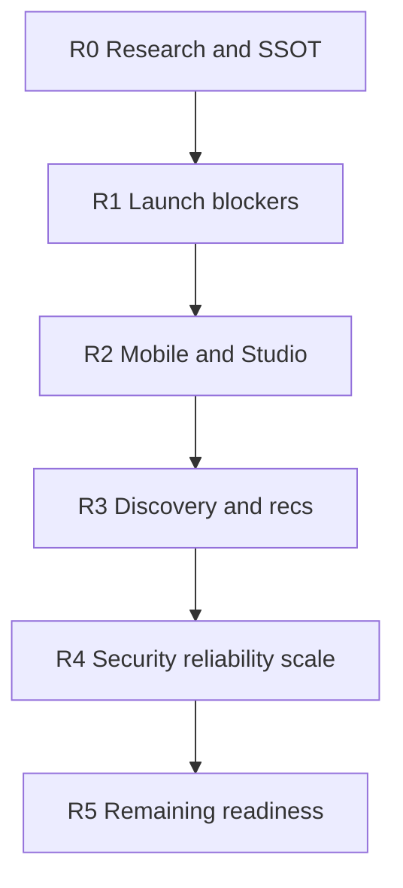

# FORGE Implementation Roadmap

**Audience:** Engineering, product, DevOps.  
**Status:** Active sequencing plan (zero-trust rewrite 2026-09-03).  
**Supersedes:** 2026-09-02 P0–P6 narrative and [YOUTUBE_PARITY_ROADMAP.md](./YOUTUBE_PARITY_ROADMAP.md) for product direction.  
**Product SSOT:** [FORGE_PRODUCT_STRATEGY.md](./FORGE_PRODUCT_STRATEGY.md)  
**Audit SSOT:** [audits/FRESH_AUDIT_2026-09-03_MASTER.md](./audits/FRESH_AUDIT_2026-09-03_MASTER.md)

---

## How to read this

Phases are dependency-ordered by **launch risk**, then depth. Feature-status SSOT is [FORGE_PROJECT_MASTER.md §16](./FORGE_PROJECT_MASTER.md#16-feature-status-matrix) — not tracker percentages.

| Phase | Focus | Status |
|-------|--------|--------|
| **R0** | Docs, ADRs, master audit, agent rules | Complete (2026-09-03) |
| **R1** | CSAM gate, Stripe ops, load test, Neon DR | In-repo engineering shipped; **ops/legal still open** |
| **R2** | Mobile/Studio parity + SEO metadata | **In-repo complete** (Copilot gated; VoiceOver/a11y smoke shipped) |
| **R3** | FTS/recs hardening | In-repo (watch_history index, course-aware recs) |
| **R4** | Security/reliability docs + health | Dual RBAC kept; topology documented; health `contentScan`/`billing` honesty (`noop_ack`, `stripe`) |
| **R5** | Sitemap, status matrix, deferred items | Docs + SEO sitemap + discover a11y; ML/DRM stay trigger-gated |

---

## R0 — Research and SSOT (complete)

- [FORGE_PRODUCT_STRATEGY.md](./FORGE_PRODUCT_STRATEGY.md)
- [decisions/](./decisions/) ADR-001–014
- [audits/FRESH_AUDIT_2026-09-03_MASTER.md](./audits/FRESH_AUDIT_2026-09-03_MASTER.md)
- Agent rules: `forge-product` frames; `forge-youtube-replica` = mechanics only

---

## R1 — Launch blockers

| Item | In-repo | Ops / legal | Domain |
|------|---------|-------------|--------|
| CSAM / vendor scan | Webhook + fail-closed hold + `CONTENT_SCAN_ALLOW_NOOP` prod gate (ADR-012) + admin notify on hold + `npm run set:fly:content-scan-secrets` / worker sync | **Vendor contract** (CSAI Match / Thorn / equivalent); NCMEC process | 16, 7 |
| Stripe live cutover | Connect/Checkout/webhooks shipped; health `billing` | Live keys, Connect branding, Vercel `NEXT_PUBLIC_BILLING_ENABLED`, one `chargesEnabled` creator — [STRIPE_PRODUCTION_ENABLEMENT.md](./operations/STRIPE_PRODUCTION_ENABLEMENT.md) | 14 |
| Load test | `npm run load-test:feed` / `:community` / `:entitlements` | Run on **staging**, attach evidence | 18, 22 |
| Neon DR | Runbook + `scripts/verify-neon-dr-checklist.sh` | Quarterly PITR drill — next **2026-10-22** | 21 |
| DMCA agent | Pipeline shipped | USPTO designated agent filing | 15 |

**R1 is not “green” until legal picks a scanner and Stripe live checklist is executed.** Engineering cannot close those boxes from git.

---

## R2 — Mobile and Studio depth

Shipped this pass:

- `/studio/playlists` mobile route (was consumer `/playlists` only)
- Mobile Studio `/studio/upload-reliability` + `/studio/analytics/details` (+ stuck-upload clear on videos)
- Mobile Studio go-live parity: schedule, DVR, tier/paid, category, live/upcoming lists, `canGoLive` gate
- Public SEO metadata: Shorts, live directory, search; dynamic `/live/[id]` metadata
- Discover courses/communities a11y smoke; explore SEO descriptions; discover/communities sitemap
- `content_scan_held` deep links → admin held queue; Admin nav “Held videos”
- Skill Studio VoiceOver labels (courses, mentorship, channel points)
- FCM: mobile push opens external admin URLs; web SW `notificationclick` routing
- Admin notifications bell for held-scan alerts; web Studio Uploads nav + clear-stuck CTA
- Master §16 corrected (playlists/reports/FCM were stale)
- Mobile Copilot ungated via `platform.ai.creatorInsights`; uploader notify on scan hold; Studio held badges
- Web Studio `/studio/copilot` + FCM SW uploader routing for held scans

Still open (priority order):

| Item | Notes |
|------|-------|
| Admin billing actions | Ledger is read-only by design until Stripe disputes process is staffed |

Podcasts / wiki / gamification **UI** are out of R2 (ADR-007).

---

## R3 — Discovery and recommendations

Shipped this pass:

- `watch_history(watched_at DESC)` index for trending CTEs
- Course-enrollment lesson boost in SQL recs

Triggers (do **not** build early):

| Trigger | Work | ADR |
|---------|------|-----|
| 100K+ MAU or forYou quality stall | pgvector slice | ADR-008 |
| 500K videos or search p95 regress | Meilisearch F-1302 | ADR-010 |

---

## R4 — Security, reliability, scale

| Item | Decision |
|------|----------|
| Dual RBAC | **Keep** two planes (ADR-014) — document, don’t merge |
| Worker SPOF | **Accepted** until idempotency review + cost (ADR-013) |
| API 1 machine + auto-stop | **Accepted** MVP; rollback path in `FLY_SLO.md` |
| App Check | Code present; ops flip `APP_CHECK_ENABLED` + Firebase |
| Cookie consent | Banner shipped; full EEA CMP is legal-scoped |
| SCALE_LIVE / MESSAGING / MULTI_REGION | Remain **proposed** until a scale trigger |

---

## R5 — Remaining production readiness

| Item | Status |
|------|--------|
| Sitemap: live directory + playlists bound | Shipped this pass |
| Cost follow-up | [COST_AUDIT_2026-09-01.md](./audits/COST_AUDIT_2026-09-01.md) — still valid if DEPLOY matches fly.toml |
| Mux DRM F-1101 | Premium-scale trigger |
| Admin Playwright deep moderation | Staging credentials; skipped in CI by design |
| Next full re-audit | **50K MAU** or **2026-12-01** |

---

## Domain coverage (25 areas → phase)

| # | Domain | Phase |
|---|--------|-------|
| 1 | Product vision | R0 |
| 2 | User/creator/admin flows | R0, R2 |
| 3 | Architecture | R0, R4 |
| 4 | Data models | R0, R3 |
| 5 | APIs | R0 |
| 6 | Web/mobile architecture | R2 |
| 7 | Video/media pipeline | R1 (scan), else shipped Mux |
| 8 | Search | R3 |
| 9 | Recs/feeds | R3 |
| 10 | Creator tools/analytics | R2 |
| 11 | Engagement | Shipped |
| 12 | AuthN/Z | R4 / ADR-014 |
| 13 | Notifications | R1 (scan hold) |
| 14 | Monetization | R1 Stripe ops |
| 15 | Moderation | R1 CSAM |
| 16 | Security/privacy | R1, R4 |
| 17 | Cloud/DevOps | R4 / ADR-013 |
| 18 | Scalability | R3–R4 triggers |
| 19 | Cache/queues | R4 worker SPOF |
| 20 | Observability | Shipped + health honesty |
| 21 | Backup/DR | R1 |
| 22 | Testing/QA | R1 load test; R5 admin E2E |
| 23 | SEO/a11y | R2, R5 |
| 24 | Cost | ADR-013 |
| 25 | Extensibility | Flags + ADRs |

---

## Carried YouTube-parity (still done)

Community permission enforcement, strikes/DMCA, MFA, DSAR export, monetization eligibility UI, caption search, scheduled publish, share tracking, comment moderation gate.

---

*Update phase status on merge. Feature status SSOT: `FORGE_PROJECT_MASTER.md` §16.*
