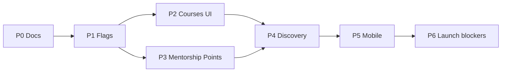

# FORGE Implementation Roadmap

**Audience:** Engineering, product, DevOps.  
**Status:** Active sequencing plan (re-audit 2026-09-02).  
**Supersedes:** [YOUTUBE_PARITY_ROADMAP.md](./YOUTUBE_PARITY_ROADMAP.md) for product direction (file retained for historical MVP closure notes).  
**Product SSOT:** [FORGE_PRODUCT_STRATEGY.md](./FORGE_PRODUCT_STRATEGY.md)

---

## How to read this

Phases are dependency-ordered. **P0** (documentation) is complete with this re-audit. Implementation begins at **P1**.

| Phase | Focus | Status |
|-------|-------|--------|
| P0 | Documentation + strategy lock | ✅ Complete (2026-09-02) |
| P1 | Feature flags + API contracts | ✅ Shipped (granular flags) |
| P2 | Courses MVP UI | ✅ Shipped (web + mobile) |
| P3 | Mentorship + channel points UI | ✅ Shipped (flag-gated) |
| P4 | Unified skill discovery | ✅ Shipped (search, explore, home rail) |
| P5 | Mobile parity + CI | ✅ CI in `.github/workflows/ci.yml` |
| P6 | Pre-launch blockers | ⏳ Ops/legal (CSAM vendor, load test) |

---

## P0 — Documentation (complete)

- [FORGE_PRODUCT_STRATEGY.md](./FORGE_PRODUCT_STRATEGY.md)
- [FRESH_AUDIT_2026-09_MASTER.md](./audits/FRESH_AUDIT_2026-09_MASTER.md)
- [docs/decisions/](./decisions/) ADR-001–010
- [platform-research/skill-first-positioning.md](./platform-research/skill-first-positioning.md)
- Doc archive + README hierarchy

---

## P1 — Platform foundations (shipped)

| Item | Deliverable |
|------|-------------|
| Granular flags | `FEATURES_COURSES`, `FEATURES_MENTORSHIP`, `FEATURES_CHANNEL_POINTS` |
| Legacy compat | `FEATURES_SKILL_ECONOMY_LMS=true` enables all + full LMS |
| Guards | `SkillFeatureGuard` + `@RequireSkillFeature()` |
| Config | `apps/api/.env.example`, `configuration.ts` |

**Courses MVP API** (when `FEATURES_COURSES=true`):

- `GET /courses/discover`, `GET /courses/discover/featured`
- `GET /courses/:id/catalog`, `GET /creators/:id/courses`
- `POST/PATCH /creators/me/courses`, lesson CRUD, enroll, progress

Full LMS (quizzes, cohorts, programs) requires `FEATURES_SKILL_ECONOMY_LMS=true`.

---

## P2 — Courses MVP UI

**Goal:** Skillshare-style video-lesson collections (not full LMS).

| Surface | Work |
|---------|------|
| Web Studio | `/studio/courses` — create course, add video lessons, publish |
| Web consumer | `/courses`, `/courses/:id` — catalog + watch flow |
| Mobile | Restore routes (remove redirects in `app_router.dart`) |
| Admin | ✅ Courses oversight (`/courses`, `GET /admin/courses/overview`) |

**Out of scope:** Quizzes, assignments, certificates, cohorts (full LMS flag).

**Depends on:** `FEATURES_COURSES=true` in target environment.

---

## P3 — Mentorship + channel points UI

| Module | Web | Mobile |
|--------|-----|--------|
| Mentorship | Community mentorship tab + Studio | Restore `/studio/mentorship` |
| Channel points | Studio rewards config + live earn UI | Restore `/studio/channel-points` |

**Depends on:** `FEATURES_MENTORSHIP`, `FEATURES_CHANNEL_POINTS`.

---

## P4 — Unified skill discovery

| Item | Notes |
|------|-------|
| Skill taxonomy UX | ✅ Popular skills chips on Explore (→ search) |
| Course cards in feed | ✅ “Courses for you” home rail |
| Search | ✅ `type=course` in unified search (web + mobile) |
| Recommendations | Course-aware signals when catalog has volume |

**Trigger for ML:** 100K+ MAU → pgvector slice per ADR-008.

---

## P5 — Mobile + quality

| Item | Notes |
|------|-------|
| Flutter CI | Add to `.github/workflows` or document separate gate |
| Studio parity | Close gaps in `DEPTH_BACKLOG.md` |
| a11y | VoiceOver pass on skill module screens |

---

## P6 — Production readiness

**Engineering (in-repo):** complete — skill UI, paid program checkout + refund reversal, admin oversight, `npm run smoke:skill-features`. Ship checklist: [SKILL_PLATFORM_SHIP_READINESS.md](./operations/SKILL_PLATFORM_SHIP_READINESS.md).

| Item | Blocker? | Reference |
|------|----------|-----------|
| CSAM/vendor content scan | **Yes** | ADR-009, `CONTENT_SCANNING.md` |
| Load test 100K entitlements | Before major marketing | `LOAD_TEST_RUNBOOK.md` |
| Stripe production | Go-live | `STRIPE_PRODUCTION_ENABLEMENT.md` |
| Neon DR drill | Quarterly | Next: 2026-10-22 |
| Final re-audit | 50K MAU | `DEFERRED_BACKLOG.md` |

---

## Carried forward from YouTube parity (still valid)

These shipped items remain done — see [YOUTUBE_PARITY_ROADMAP.md](./YOUTUBE_PARITY_ROADMAP.md) MVP-1–3:

- Community permission enforcement, strikes/DMCA, MFA, DSAR export, monetization eligibility UI, caption search, scheduled publish, share tracking, comment moderation gate.

**Open from prior roadmap (still applies):**

- F-1302 Meilisearch at 500K videos
- F-1101b Mux DRM at premium scale
- Designated DMCA agent USPTO filing (ops/legal)

---

## Dependency graph

---

*Update phase status on merge. Feature status SSOT: `FORGE_PROJECT_MASTER.md` §16.*
