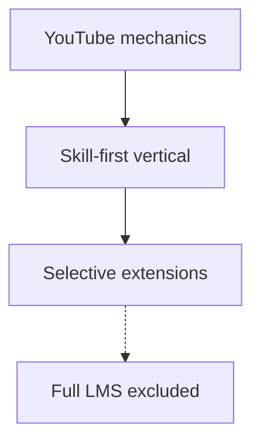

# FORGE Product Strategy

**Audience:** Product, engineering, stakeholders, agents.  
**Status:** Authoritative product SSOT (re-audit 2026-09-02).  
**Technical reference:** [FORGE_PROJECT_MASTER.md](./FORGE_PROJECT_MASTER.md)  
**Implementation sequencing:** [FORGE_IMPLEMENTATION_ROADMAP.md](./FORGE_IMPLEMENTATION_ROADMAP.md)

---

## 1. Product statement

**FORGE is a skill-first creator platform powered by YouTube-style mechanics.**

We combine the discovery, engagement, and video infrastructure patterns of YouTube with a vertical focus on skills/crafts creators and learners. Creators teach through video, Shorts, live sessions, and structured courses; learners discover by skill taxonomy, follow trusted creators, and participate in communities.

This supersedes the Aug 2026 decision to retire the skill-economy layer in favor of a pure YouTube replica.

---

## 2. Product layers

### Layer 1 — YouTube mechanics (core, always on)

Channels (`User` identity), VOD upload/watch, Shorts, live streaming, subscriptions, playlists, comments, likes, search, algorithmic feeds, Studio, notifications, admin moderation, strikes/DMCA, Stripe Connect monetization (memberships, Super Thanks, Super Chat).

### Layer 2 — Skill-first vertical (core positioning)

- **Taxonomy:** `Category` / `Subcategory` / `SkillTag` seeded for skills/crafts (e.g. Woodworking → Carving). Not YouTube genre taxonomy.
- **Trusted creators:** Admin approval before upload/live (intentional trust gate — see [ADR-002](./decisions/ADR-002-creator-approval-gate.md)).
- **Creator KPIs:** Engagement weighted for skill communities (see [CREATOR_KPI_DEFINITIONS.md](./CREATOR_KPI_DEFINITIONS.md)).
- **Communities:** Posts + polls + tiers = YouTube Community tab equivalent (core). Rooms + events = skill-community extension (core for FORGE).

### Layer 3 — Selective extensions (re-enable)

| Module | Flag | MVP scope |
|--------|------|-----------|
| Courses | `FEATURES_COURSES` | Video-linked lessons, catalog, enroll, progress |
| Mentorship | `FEATURES_MENTORSHIP` | Community mentor profiles, matching |
| Channel points | `FEATURES_CHANNEL_POINTS` | Live/chat engagement rewards |

Legacy `FEATURES_SKILL_ECONOMY_LMS=true` enables all three **plus** full LMS backend (quizzes, cohorts, programs, articles, podcasts, study groups).

### Layer 4 — Explicit non-goals

SCORM, formal accreditation, assignment grading pipelines, Netflix-style library UX, platform-wide subscription royalty pool (Skillshare model), ad network / RPM monetization.

---

## 3. Personas

| Persona | Description |
|---------|-------------|
| **Learner** | Discovers skills, watches video/Shorts, enrolls in courses, joins communities |
| **Creator** | Approved skill expert; publishes video, courses, live; earns via Stripe |
| **Community member** | Participates in posts, rooms, events; may access tier-gated content |
| **Mentor / mentee** | Optional extension via mentorship module |
| **Admin** | Moderation, creator approval, trust & safety, audit |

---

## 4. Key decisions (re-validated 2026-09)

| # | Decision | Outcome | ADR |
|---|----------|---------|-----|
| 1 | Product framing | Skill-first + YouTube mechanics | [ADR-001](./decisions/ADR-001-skill-first-framing.md) |
| 2 | Creator approval gate | **Keep** — trust gate for skill vertical | [ADR-002](./decisions/ADR-002-creator-approval-gate.md) |
| 3 | Category taxonomy | **Keep** skills/crafts taxonomy | [ADR-003](./decisions/ADR-003-skill-taxonomy.md) |
| 4 | Communities rooms/events | **Keep** as skill-community extension | [ADR-004](./decisions/ADR-004-communities-extension.md) |
| 5 | Ad revenue | **Permanently N/A** — creator-owned monetization only | [ADR-005](./decisions/ADR-005-no-ads.md) |
| 6 | Feature flags | Granular: `FEATURES_COURSES`, `_MENTORSHIP`, `_CHANNEL_POINTS` | [ADR-006](./decisions/ADR-006-granular-feature-flags.md) |
| 7 | Courses scope | Video-lesson MVP; quizzes/certs behind full LMS flag | [ADR-007](./decisions/ADR-007-courses-mvp-scope.md) |
| 8 | ML recommendations | SQL heuristics until 100K+ MAU; then pgvector slice | [ADR-008](./decisions/ADR-008-recommendations-approach.md) |
| 9 | CSAM scanning | Pre-launch blocker; vendor TBD (legal) | [ADR-009](./decisions/ADR-009-content-scanning.md) |
| 10 | Search sidecar | Postgres FTS until 500K videos (F-1302) | [ADR-010](./decisions/ADR-010-search-fts.md) |

---

## 5. Monetization model

| Stream | Status |
|--------|--------|
| Channel memberships (Stripe Connect) | Shipped |
| Super Thanks (VOD tips) | Shipped |
| Super Chat (live tips) | Shipped |
| Paid events / tickets | Shipped |
| Course sales (future) | Backend ready; UI P2 |
| Ad revenue | Not planned |

Eligibility gate mirrors YouTube Partner Program thresholds (read-only; no ads to gate).

---

## 6. Documentation hierarchy

| Doc | Role |
|-----|------|
| **FORGE_PRODUCT_STRATEGY.md** (this file) | Product SSOT |
| **FORGE_PROJECT_MASTER.md** | Technical SSOT (modules, routes, workers) |
| **FORGE_IMPLEMENTATION_ROADMAP.md** | Sequenced delivery plan |
| **docs/decisions/** | Architecture decision records |
| **FORGE_CREATOR_ECONOMY_OS_MASTER_TRACKER.md** | Historical task tracker — reconcile, not primary SSOT |
| **docs/platform-research/** | Research + benchmarks |

---

## 7. Maintenance

When product direction changes: update this file first, then `CLIENT_OVERVIEW.md`, `FORGE_PROJECT_MASTER.md` §1, and `.cursor/rules/forge-product.mdc`.

*Re-audit 2026-09-02.*
