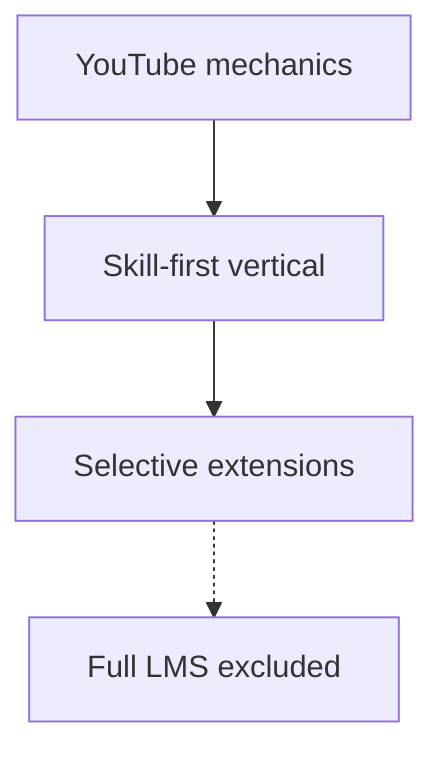

# FORGE Product Strategy

**Audience:** Product, engineering, stakeholders, agents.  
**Status:** Authoritative product SSOT (zero-trust rewrite 2026-09-03).  
**Supersedes:** 2026-09-02 strategy text where they differ; Aug 2026 YouTube-replica-only framing.  
**Technical reference:** [FORGE_PROJECT_MASTER.md](./FORGE_PROJECT_MASTER.md)  
**Implementation sequencing:** [FORGE_IMPLEMENTATION_ROADMAP.md](./FORGE_IMPLEMENTATION_ROADMAP.md)  
**Latest audit:** [audits/FRESH_AUDIT_2026-09-03_MASTER.md](./audits/FRESH_AUDIT_2026-09-03_MASTER.md)

---

## 1. Product statement

**FORGE is a skill-first creator platform powered by YouTube-style mechanics.**

Creators teach skills and crafts through VOD, Shorts, live, and structured courses. Learners discover by skill taxonomy, follow trusted (admin-approved) creators, and participate in communities. Monetization is creator-owned Stripe Connect — not an ad network.

This is **not** a YouTube trademark clone, a Netflix library, or a Coursera LMS.

---

## 2. Product layers

### Layer 1 — YouTube mechanics (core, always on)

Channels (`User` identity), VOD upload/watch, Shorts, live streaming, subscriptions, playlists, comments, likes, search, algorithmic feeds, Studio, notifications, admin moderation, strikes/DMCA, Stripe Connect (memberships, Super Thanks, Super Chat, paid events).

### Layer 2 — Skill-first vertical (core positioning)

- **Taxonomy:** `Category` / `Subcategory` / `SkillTag` for skills/crafts — [ADR-003](./decisions/ADR-003-skill-taxonomy.md).
- **Trusted creators:** Admin approval before upload/live — [ADR-002](./decisions/ADR-002-creator-approval-gate.md).
- **Creator KPIs:** Teaching-weighted — [CREATOR_KPI_DEFINITIONS.md](./CREATOR_KPI_DEFINITIONS.md).
- **Communities:** Posts + polls + tiers = YouTube Community tab + memberships (core). Rooms + events = skill-community extension (always on) — [ADR-004](./decisions/ADR-004-communities-extension.md).

### Layer 3 — Selective extensions (flag-gated)

| Module | Flag | MVP scope |
|--------|------|-----------|
| Courses | `FEATURES_COURSES` | Video-linked lessons, catalog, enroll, progress |
| Mentorship | `FEATURES_MENTORSHIP` | Community mentor profiles, matching |
| Channel points | `FEATURES_CHANNEL_POINTS` | Live/chat engagement rewards |

`FEATURES_SKILL_ECONOMY_LMS=true` enables all three **plus** full LMS *backend* (quizzes, cohorts, programs, articles, podcasts, study groups). Consumer UI for podcasts/wiki/gamification is **not** in default scope — [ADR-007](./decisions/ADR-007-courses-mvp-scope.md).

### Layer 4 — Explicit non-goals

SCORM, formal accreditation, assignment grading pipelines, Netflix-style library UX, platform-wide subscription royalty pool (Skillshare model), ad network / RPM — [ADR-005](./decisions/ADR-005-no-ads.md).

---

## 3. Personas

| Persona | Description |
|---------|-------------|
| **Learner** | Discovers skills, watches video/Shorts, enrolls in courses, joins communities |
| **Creator** | Approved skill expert; publishes video, courses, live; earns via Stripe |
| **Community member** | Posts, rooms, events; may access tier-gated content |
| **Mentor / mentee** | Optional via mentorship flag |
| **Admin** | Creator approval, moderation, trust & safety, audit |

---

## 4. Key decisions (revalidated 2026-09-03)

| # | Decision | Outcome | ADR |
|---|----------|---------|-----|
| 1 | Product framing | Skill-first + YouTube mechanics | [ADR-001](./decisions/ADR-001-skill-first-framing.md) |
| 2 | Creator approval | **Keep** trust gate | [ADR-002](./decisions/ADR-002-creator-approval-gate.md) |
| 3 | Taxonomy | **Keep** skills/crafts | [ADR-003](./decisions/ADR-003-skill-taxonomy.md) |
| 4 | Rooms/events | **Keep** as extension | [ADR-004](./decisions/ADR-004-communities-extension.md) |
| 5 | Ads | **Permanently N/A** | [ADR-005](./decisions/ADR-005-no-ads.md) |
| 6 | Flags | Granular `FEATURES_*` | [ADR-006](./decisions/ADR-006-granular-feature-flags.md) |
| 7 | Courses | Video-lesson MVP | [ADR-007](./decisions/ADR-007-courses-mvp-scope.md) |
| 8 | Recs | SQL until 100K MAU | [ADR-008](./decisions/ADR-008-recommendations-approach.md) |
| 9 | CSAM scan | Pre-launch vendor gate | [ADR-009](./decisions/ADR-009-content-scanning.md) |
| 10 | Search | Postgres FTS first | [ADR-010](./decisions/ADR-010-search-fts.md) |
| 11 | Creator routes | `me` before `:id` | [ADR-011](./decisions/ADR-011-creator-route-ordering.md) |
| 12 | Scan prod gate | Explicit noop ack | [ADR-012](./decisions/ADR-012-content-scan-prod-gate.md) |
| 13 | Fly topology | Cost-first 1 machine | [ADR-013](./decisions/ADR-013-cost-first-fly-topology.md) |
| 14 | Authz | Dual RBAC kept | [ADR-014](./decisions/ADR-014-dual-rbac.md) |

---

## 5. Monetization model

| Stream | Status |
|--------|--------|
| Channel memberships (Stripe Connect) | Shipped (live keys = ops) |
| Super Thanks / Super Chat / paid events | Shipped |
| Course / program sales | Backend + flag-gated UI |
| Ad revenue | Not planned |

---

## 6. Documentation hierarchy

| Doc | Role |
|-----|------|
| **This file** | Product SSOT |
| **FORGE_PROJECT_MASTER.md** | Technical SSOT (modules, routes, **§16 status matrix**) |
| **FORGE_IMPLEMENTATION_ROADMAP.md** | R0–R5 delivery plan |
| **docs/decisions/** | ADRs |
| **audits/FRESH_AUDIT_2026-09-03_MASTER.md** | Current audit SSOT |
| **FORGE_CREATOR_ECONOMY_OS_MASTER_TRACKER.md** | Historical task list — **not** status % SSOT |

---

## 7. Maintenance

When product direction changes: update this file first, then `CLIENT_OVERVIEW.md`, `FORGE_PROJECT_MASTER.md` §1, and `.cursor/rules/forge-product.mdc` / `.claude/rules/forge-product.md`.
