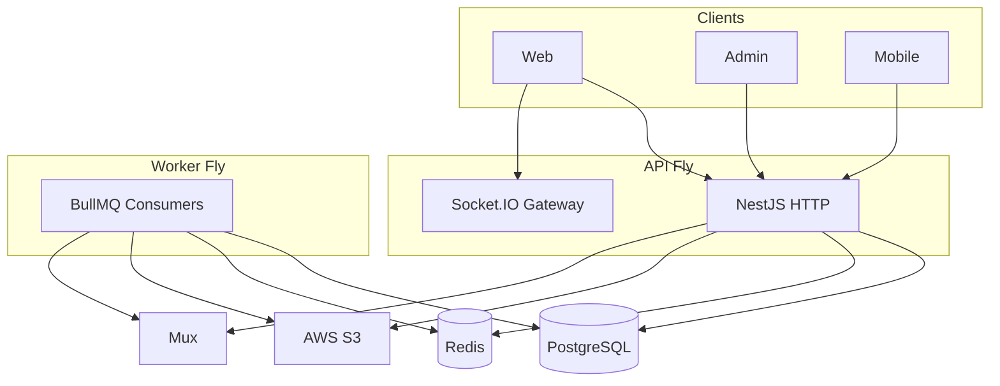

# FORGE — Project Master

**Audience:** Engineering, product, DevOps.  
**Client summary:** [CLIENT_OVERVIEW.md](./CLIENT_OVERVIEW.md)  
**Doc index:** [README.md](./README.md) (13 files in `docs/`).

**Maintenance:** Update this file when architecture or feature status changes; sync [CLIENT_OVERVIEW.md](./CLIENT_OVERVIEW.md) §4.

---

## 1. Executive summary

**FORGE** is a skill-first creator platform: on-demand lessons, live teaching, categories/skill tags, and creator audiences.

| Surface | Stack | Port / host |
|---------|--------|-------------|
| API | NestJS modular monolith, TypeORM, BullMQ, Socket.IO | `:3001` / Fly.io |
| Web | Next.js 14 App Router | `:3000` / Vercel |
| Admin | Next.js 14 | `:3002` / Vercel |
| Mobile | Flutter + Riverpod + go_router | iOS / Android |

**Infrastructure:** PostgreSQL 16 · Redis 7 · AWS S3 · **Mux** (live + default VOD) · **FFmpeg** (optional VOD) · GitHub Actions CI/CD.

**Monorepo:** npm workspaces. Shared: `@forge/shared-types`, `@forge/design-system`.

---

## 2. Vision and positioning

- **Focus:** Tutorials, crafts, live teaching — not generic viral entertainment.
- **Creator gate:** Request → admin approve + verified email before upload/live.
- **Brand:** Familiar video IA; distinct visual identity (`packages/design-system`).
- **Phase 1 monetization:** Mock membership tiers — no Stripe yet.
- **Deferred:** ML recommendations, dedicated search cluster, real payments.

---

## 3. System architecture

- **API:** HTTP + Socket.IO; no video workers in production.
- **Worker:** `WORKER_ONLY=true` — transcode, Mux ingest, analytics, push, subscription jobs.
- **Redis:** BullMQ, cache, Socket.IO adapter (required multi-instance).

---

## 4. API modules

From `apps/api/src/app.module.ts`:

`Auth`, `Users`, `Categories`, `Content`, `Feed`, `Engagement`, `Streaming`, `Entitlements`, `Billing` (scaffold), `Communities`, `StreamChat`, `Playlists`, `Notifications`, `Search`, `Reports`, `Analytics`, `Admin`, `Platform`, `Firebase`, `Workers`, `Gateway`.

**Guards:** JWT, roles, permissions, consumer-only, email-verified, throttler.

---

## 5. Auth & permissions

[AUTH.md](./AUTH.md) · [API_SCHEMAS.md](./API_SCHEMAS.md)

| Permission | Holder |
|------------|--------|
| `ENGAGE`, `USE_LIBRARY` | Verified user |
| `VIEW_DASHBOARD` | Creator pending/approved |
| `UPLOAD_VIDEO`, `START_STREAM` | Approved verified creator |
| `MANAGE_PLATFORM` | Admin |

---

## 6. Media

[MEDIA.md](./MEDIA.md)

- Upload: presigned S3 → complete → worker
- VOD default: Mux (`VIDEO_TRANSCODE_PROVIDER=mux`)
- Live: Mux RTMP + webhooks

---

## 7. Feature status

| Domain | Status |
|--------|--------|
| Auth, sessions, Google OAuth | Done |
| VOD + live (Mux) | Done API; UX polish ongoing |
| Feed, search, engagement | Done |
| Memberships (mock) | Done |
| Communities, stream chat | Done |
| Playlists | Web only |
| FCM push | Partial (needs FlutterFire) |
| Stripe billing | Scaffold |

---

## 8. Clients

**Web:** `/`, `/watch/[id]`, `/explore`, `/studio/*`, `/upload/*`, `/live`, `/[username]/community`  
**Admin:** dashboard, users, creators, content, reports  
**Mobile:** feed, explore, live, studio — see `apps/mobile` router

---

## 9. Data & schemas

Entities: users, videos, streams, engagement, tiers, subscriptions, communities.  
**Public contracts:** [API_SCHEMAS.md](./API_SCHEMAS.md)  
**Env:** `apps/api/.env.example`

---

## 10. Realtime & queues

**Socket** `/events`: `join-video`, `join-stream`, `join-live-feed` → `comment:new`, `stream:*`, `video:ready`  
**Queues:** `video-processing`, `mux-vod-ingest`, `analytics-ingest`, `push-dispatch`, `subscription-maintenance`

---

## 11. Security & observability

Production boot checks JWT + Mux webhook secrets. [OBSERVABILITY.md](./OBSERVABILITY.md) — health, metrics, Sentry.

---

## 12. Deploy

[DEPLOY.md](./DEPLOY.md) · [CI_CD.md](./CI_CD.md) · Branch → PR → single merge `main`.

---

## 13. Status matrix

| Area | API | Web | Admin | Mobile | Worker |
|------|:---:|:---:|:-----:|:------:|:------:|
| Auth | ✅ | ✅ | ✅ | ✅ | — |
| VOD | ✅ | ✅ | — | ⚠️ | ✅ |
| Live | ✅ | ⚠️ | — | ⚠️ | — |
| Memberships | ✅ | ✅ | — | — | ✅ |

---

## 14. Docs map

| Topic | File |
|-------|------|
| Local dev | [GETTING_STARTED.md](./GETTING_STARTED.md) |
| Schemas | [API_SCHEMAS.md](./API_SCHEMAS.md) |
| Deploy | [DEPLOY.md](./DEPLOY.md) |
| Media | [MEDIA.md](./MEDIA.md) |
| Auth | [AUTH.md](./AUTH.md) |
| Firebase | [FIREBASE.md](./FIREBASE.md) |
| QA | [QA.md](./QA.md) |

---

*Last updated: 2026-06-04*
