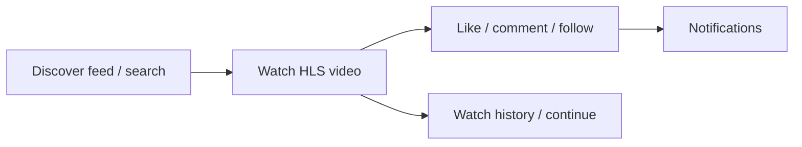
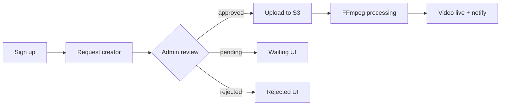

# FORGE — Project Master Document

**This is the only project goals document.** Vision, product scope, tech stack, architecture, MVP status, production checklist, roadmap, and enhancement direction all live here.

**Audience:** Founders, product, engineering, design, DevOps, and partners.

**Client handoff:** Share [CLIENT_OVERVIEW.md](./CLIENT_OVERVIEW.md) first (~10 min read), then this document for full depth. Index: [docs/README.md](./README.md).

**Maintenance:** Update **this file** when vision, scope, feature status, or go-live requirements change; sync the status table in `CLIENT_OVERVIEW.md` §4. Setup commands remain in [README.md](../README.md). UI screen specs remain in [ui-ux-ai-design-prompt.md](./ui-ux-ai-design-prompt.md).

---

## Table of contents

1. [Executive summary](#1-executive-summary)
1A. [Problem, opportunity, and product idea](#1a-problem-opportunity-and-product-idea)
1B. [Core user journeys](#1b-core-user-journeys)
1C. [Success metrics (product KPIs)](#1c-success-metrics-product-kpis)
2. [Vision, mission, and positioning](#2-vision-mission-and-positioning)
3. [Product principles](#3-product-principles)
4. [Target users and personas](#4-target-users-and-personas)
5. [Platform surfaces](#5-platform-surfaces)
6. [Technology stack](#6-technology-stack)
7. [Repository and monorepo structure](#7-repository-and-monorepo-structure)
8. [System architecture](#8-system-architecture)
9. [Roles, permissions, and creator lifecycle](#9-roles-permissions-and-creator-lifecycle)
10. [Feature domains (product specification)](#10-feature-domains-product-specification)
11. [Backend modules and API surface](#11-backend-modules-and-api-surface)
12. [Client applications (routes and parity)](#12-client-applications-routes-and-parity)
13. [Data model overview](#13-data-model-overview)
14. [Video on demand pipeline](#14-video-on-demand-pipeline)
15. [Live streaming pipeline](#15-live-streaming-pipeline)
16. [Discovery, feed, and recommendations](#16-discovery-feed-and-recommendations)
17. [Search](#17-search)
18. [Realtime (Socket.IO)](#18-realtime-socketio)
19. [Notifications and email](#19-notifications-and-email)
20. [Analytics and observability](#20-analytics-and-observability)
21. [Security and trust & safety](#21-security-and-trust--safety)
22. [UI/UX identity and design direction](#22-uiux-identity-and-design-direction)
23. [MVP scope definition](#23-mvp-scope-definition)
24. [Implementation status snapshot](#24-implementation-status-snapshot)
25. [Production readiness](#25-production-readiness)
26. [Growth and scale roadmap](#26-growth-and-scale-roadmap)
27. [Execution priorities (engineering)](#27-execution-priorities-engineering)
28. [External tools and deferred integrations](#28-external-tools-and-deferred-integrations)
29. [Deployment and environments](#29-deployment-and-environments)
30. [Appendix A — MVP feature backlog](#30-appendix-a--mvp-feature-backlog)
31. [Appendix B — Scale & architecture north star](#31-appendix-b--scale--architecture-north-star)
32. [Document maintenance](#32-document-maintenance)

---

## 1. Executive summary

**FORGE** is a **skill-first live creator platform**. Creators share learning journeys, upload tutorial-style videos, go live to teach skills, and build an audience around **expertise**—not only entertainment or viral clips.

The product is delivered as a **monorepo** with four main codebases:

| Surface | Technology | Default port |
|---------|------------|--------------|
| API | NestJS (modular monolith) | 3001 |
| Web | Next.js 14 (App Router) | 3000 |
| Admin | Next.js 14 | 3002 |
| Mobile | Flutter + Riverpod | device/emulator |

Shared infrastructure: **PostgreSQL 16**, **Redis 7**, **BullMQ**, **AWS S3 + CloudFront**, **Mux** (live), **FFmpeg → HLS** (on-demand), **Socket.IO** (realtime).

**Strategic intent:** Ship a credible MVP loop (sign up → discover → watch → engage → creator approval → upload → process → playback → admin moderation), then incrementally scale architecture toward millions of users without a ground-up rewrite.

**Repository name:** `forge-platform` (npm workspaces root). **Mobile package:** `forge_mobile`.

---

## 1A. Problem, opportunity, and project goals

### The problem

- General video platforms optimize for **entertainment and watch time**, not structured **skill acquisition**.
- Learners struggle to find **credible teachers** and coherent learning paths for crafts, trades, and tutorials.
- Skilled creators lack a platform where **expertise and teaching quality** are first-class—not buried under viral noise.
- Live teaching tools are often fragmented (separate video host, separate stream tool, separate community).

### The opportunity

Build a **unified creator platform** where the same account can publish on-demand lessons, go live to teach, grow a following, and (later) monetize—while operators retain **quality control** via creator approval and moderation.

### Primary project goals

| # | Goal | How FORGE addresses it |
|---|------|------------------------|
| G1 | **Skill-first discovery** | Categories, skill tags on videos, search (FTS), feeds sorted by recency and engagement |
| G2 | **Trusted creator supply** | Request → admin approve/reject; verified email; gated upload/live |
| G3 | **End-to-end VOD** | Presigned S3 upload → BullMQ → FFmpeg multi-bitrate HLS → CDN playback |
| G4 | **Live teaching** | Mux-backed streams, webhooks, realtime `stream:started` events |
| G5 | **Engagement loop** | Likes, comments, follows, playlists, notifications, watch history / continue watching |
| G6 | **Operator control** | Admin app: users, content, reports, creator queue, analytics summary |
| G7 | **Multi-surface reach** | Web + mobile + admin on one API and shared types |
| G8 | **Production path** | Migrations, health checks, correlation IDs, optional metrics/Sentry, Redis socket adapter |

### Secondary goals (engineering)

- Modular monolith with clear NestJS module boundaries.
- Incremental scale (Redis cache, indexes, FTS, DLQ)—no premature microservices.
- Observable, rate-limited, JWT-secured API.

### Non-goals (current phase)

- Open upload without creator approval.
- Full ML recommendation engine or vector search.
- Monetization (ads, subscriptions, payouts) as production systems.
- YouTube/Twitch visual clone (IA may be familiar; brand must be distinct).

---

## 1B. Core user journeys

### Learner journey (approved MVP path)



1. Land on home feed (`/` or mobile `/feed`) — sort `latest`, `popular`, or `forYou` if signed in.
2. Open watch page — HLS player, comments, realtime `comment:new` in `video:{id}` room.
3. Engage — like, comment, follow creator; optional playlist add.
4. Return — continue watching from history; search via `/search` or mobile `/explore`.

### Creator journey



1. Register → verify email (when enforced) → request creator (`POST /users/me/request-creator`).
2. Wait for admin approval (web/mobile waiting screens).
3. Once **approved + verified**: get presigned URL → upload raw file → register video → worker transcodes.
4. Receive `video:ready` via Socket.IO and in-app notification.
5. Optional: start live stream via Mux (`POST /streams/start`).

### Admin / operator journey

1. Sign into admin panel (token in `localStorage` as `forge_admin_token`).
2. Review dashboard stats → pending creators → approve/reject.
3. Moderate videos and reports queue.
4. Manage categories taxonomy; check API health in settings.

### Guest journey

- Browse public feed and search; watch where visibility is `public`.
- Auth gate on follow, like, comment, upload (modal or redirect to login).

---

## 1C. Success metrics (product & platform)

| Category | Examples to track (via `analytics_events` + DB) |
|----------|--------------------------------------------------|
| **Acquisition** | Signups, creator requests, approval rate |
| **Activation** | First watch, first follow, first upload (approved creators) |
| **Engagement** | DAU/WAU, watch time, completion rate, likes/comments per video |
| **Retention** | D1/D7 return, continue-watching usage |
| **Creator** | Upload success rate, processing time, live streams started |
| **Quality** | Report volume, moderation resolution time |
| **Platform** | API p95 latency, queue depth, worker failure rate, health `degraded` rate |

---

## 2. Vision, mission, and positioning

### 2.1 Vision

A world where **learning skills** is as discoverable and engaging as consuming entertainment video—but with quality, structure, and live teaching at the center.

### 2.2 Mission

| Stakeholder | Mission |
|-------------|---------|
| **Learners** | Discover quality, skill-oriented video and live teaching; follow creators; track progress (watch history, continue watching). |
| **Creators** | Publish video and go live with manageable operational complexity; grow an audience tied to expertise. |
| **Operators (admins)** | Onboard creators safely, moderate content and reports, and monitor platform health. |

### 2.3 Positioning

| Dimension | FORGE | Typical alternatives |
|-----------|-------|-------------------|
| Content focus | Tutorials, crafts, teaching, expertise tags | General entertainment (YouTube), short viral (TikTok), gaming live (Twitch) |
| Discovery | Skill categories, search, feed (latest / popular / personalized) | Algorithm-only viral feeds |
| Creator gate | Request → admin approve before full creator privileges | Open upload or separate partner programs |
| Brand | Modern, skill-native learning product (not a YouTube visual clone) | Generic video portal aesthetics |

**Mental model for users:** Familiar video-app patterns (home, watch, channel, search, upload) so onboarding is fast. **Visual design** must remain distinctly FORGE—refined, skill-forward, optionally subtle futuristic accents—not a near-copy of YouTube UI.

### 2.4 Long-term north star (product)

Comparable capability surface to creator economy platforms (YouTube, Twitch, TikTok) but optimized for **education and craft**, with eventual support for:

- Advanced personalized feeds and semantic search
- Rich creator analytics and growth tools
- Monetization (subscriptions, tips, ads)—**after** core metrics and compliance
- Trust & safety automation and platform scale (multi-region, dedicated search/analytics stacks)

---

## 3. Product principles

| Principle | Meaning |
|-----------|---------|
| **Skill-first** | Categories, profiles, and discovery emphasize teaching and craft. |
| **Creator path** | Users request creator status; admins approve or reject before upload/live privileges. |
| **Honest MVP** | Ship a complete core loop before peripheral features (OAuth, full ML recommendations, monetization). |
| **Production realism** | Security, migrations, multi-instance sockets, observability, and queue monitoring are explicit targets. |
| **Modular monolith first** | One NestJS codebase with clear module boundaries; extract services only when metrics justify it. |
| **Boring, proven infra** | PostgreSQL, Redis, BullMQ, S3, CDN, HLS—defer Kafka, K8s, vector DBs until SLOs require them. |
| **Multi-client alignment** | One API + `packages/shared-types` for contracts; ship API → web → admin → mobile when possible. |
| **Gate, don’t hide** | Show Upload/Follow/Comment affordances; redirect or modal when user lacks permission. |

---

## 4. Target users and personas

### 4.1 Guest (unauthenticated)

- Browse public feed and watch pages where visibility allows
- Search videos and creators
- Prompted to sign in for follow, like, comment, upload

### 4.2 User (Viewer)

- Full consumption: feed, watch, like, comment, follow, playlists, notifications
- Profile management, watch history, continue watching
- **Become a creator** request (enters pending state)

### 4.3 Creator (approved)

- All viewer capabilities
- Upload pipeline (presigned S3 → register → worker → HLS)
- Live streaming via Mux (where product enables)
- Own-channel management, studio/dashboard (product/UI incremental)
- Requires: `creatorStatus === approved` and verification rules per API

### 4.4 Admin (operator)

- Separate **admin app** (`apps/admin`)—dense operational UI
- User management, creator approvals, content moderation, reports, categories, platform stats/analytics
- Does not use consumer chrome

### 4.5 Creator lifecycle states

| Status | UX/API behavior |
|--------|-----------------|
| `pending` | Upload/live routes redirect to waiting-approval screens |
| `approved` | Full creator capabilities |
| `rejected` | Upload blocked; rejection note may be shown |

---

## 5. Platform surfaces

```
┌─────────────────────────────────────────────────────────────────┐
│                         FORGE Platform                          │
├──────────────┬──────────────┬──────────────┬─────────────────────┤
│  apps/web    │ apps/mobile  │ apps/admin   │     apps/api        │
│  Learners &  │  Learners &  │  Operators   │  REST + Swagger     │
│  Creators    │  Creators    │              │  BullMQ workers     │
│  Next.js 14  │  Flutter     │  Next.js 14  │  Socket.IO gateway  │
└──────┬───────┴──────┬───────┴──────┬───────┴──────────┬──────────┘
       │              │              │                  │
       └──────────────┴──────────────┴──────────────────┘
                              │
              ┌───────────────┼───────────────┐
              ▼               ▼               ▼
         PostgreSQL        Redis          AWS S3
                              │          CloudFront
                              ▼
                         BullMQ workers
                         (FFmpeg, etc.)
                              │
                              ▼
                            Mux (live)
```

| Surface | Path | Purpose |
|---------|------|---------|
| **API** | `apps/api` | Auth, content, feed, engagement, streaming, admin APIs, workers, webhooks |
| **Web** | `apps/web` | Public product: auth, home feed, watch, upload, search, live, history, playlists |
| **Admin** | `apps/admin` | Dashboard, users, creator approvals, content, categories, reports, settings |
| **Mobile** | `apps/mobile` | Parity with web: auth, feed, explore/search, watch, profile, history, live tab |
| **Shared types** | `packages/shared-types` | Health, API envelope, feed meta, Socket event names |
| **Infra** | `infra/nginx`, Docker Compose, GitHub Actions | Local/prod deploy, CI/CD |

---

## 6. Technology stack

### 6.1 Core stack

| Layer | Technology | Version / constraint | Notes |
|-------|------------|----------------------|-------|
| **Monorepo** | npm workspaces | Node ≥20, npm ≥10 | Root `forge-platform@1.0.0` |
| **Backend** | NestJS | ^10.3 | Modular monolith; **TypeORM** (not Prisma) |
| **Language** | TypeScript | ^5.4 | API, web, admin |
| **Database** | PostgreSQL | 16 (Alpine in Docker) | Migrations auto-run on API boot |
| **Cache / queue** | Redis | 7 | ioredis + `@nestjs-modules/ioredis` |
| **Jobs** | BullMQ | ^5.4 | `video-processing` + `video-processing-dlq` |
| **Web / Admin** | Next.js | ^14.2 (App Router) | React ^18.2 |
| **Mobile** | Flutter | ≥3.19 | Dart SDK ≥3.3; package `forge_mobile` |
| **Storage** | AWS S3 + CloudFront | SDK ^3.54 | Presigned PUT; default region `ap-south-1` in config |
| **VOD** | fluent-ffmpeg | ^2.1 | HLS renditions 240p–1080p |
| **Live** | Mux Node SDK | ^8.3 | Webhooks with signing secret |
| **Realtime** | Socket.IO | ^4.7 | `@socket.io/redis-adapter` for scale-out |
| **Auth** | JWT + Passport | access 15m default, refresh 7d | bcrypt password hashing |
| **Containers** | Docker Compose | dev + prod files | Optional PgBouncer on host port 6432 |
| **CI/CD** | GitHub Actions | `api.yml`, `web.yml` | GHCR images; SSH deploy EC2 on `main` |

### 6.2 API dependencies (`@forge/api`)

| Package | Purpose |
|---------|---------|
| `@nestjs/bullmq`, `bullmq` | Video processing queue |
| `@nestjs/throttler` | Global + per-route rate limits |
| `@nestjs/swagger` | OpenAPI at `/api/docs` (non-production) |
| `nestjs-pino`, `pino-pretty` | Structured HTTP logs |
| `nestjs-cls` | Request context (`correlationId`, `userId`) |
| `helmet` | Security headers |
| `@sentry/nestjs` | Optional error tracking (`instrument.ts`) |
| `prom-client` | Optional Prometheus metrics |
| `nodemailer` | SMTP / console mail |
| `class-validator`, `class-transformer` | DTO validation |
| `uuid` | IDs for jobs and tokens |

### 6.3 Web dependencies (`@forge/web`)

| Package | Purpose |
|---------|---------|
| `@tanstack/react-query` | Server state / caching |
| `axios` | HTTP client (`lib/api.ts`) |
| `zustand` | Client auth/UI state |
| `hls.js` | Adaptive HLS playback |
| `socket.io-client` | Realtime (`lib/socket.ts`) |
| `lucide-react`, `tailwindcss` | UI icons and styling |
| `next-auth` | Present in deps; **not wired** in app code yet |

### 6.4 Admin dependencies (`@forge/admin`)

| Package | Purpose |
|---------|---------|
| `@tanstack/react-table` | Data tables |
| `recharts` | Dashboard charts |
| `axios`, `@tanstack/react-query` | API calls |

### 6.5 Mobile dependencies (`forge_mobile`)

| Package | Purpose |
|---------|---------|
| `flutter_riverpod`, `riverpod_annotation` | State management |
| `go_router` | Navigation / deep links |
| `dio` | HTTP |
| `flutter_secure_storage` | Token storage |
| `video_player`, `chewie` | Playback |
| `cached_network_image` | Thumbnails |
| `freezed`, `json_serializable` | Codegen models |

---

## 7. Repository and monorepo structure

```
FORGE/
├── apps/
│   ├── api/                 # NestJS backend (port 3001)
│   ├── web/                 # Next.js user app (port 3000)
│   ├── admin/               # Next.js admin (port 3002)
│   └── mobile/              # Flutter (separate from npm workspaces)
├── packages/
│   └── shared-types/        # @forge/shared-types
├── infra/
│   └── nginx/               # Production reverse proxy
├── docs/
│   ├── FORGE_PROJECT_MASTER.md   # ← This file (single project doc)
│   └── ui-ux-ai-design-prompt.md # Screen-level UI spec
├── .github/workflows/              # CI/CD (api.yml, web.yml)
├── docker-compose.yml
├── docker-compose.prod.yml
├── FORGE_ENHANCEMENT.MD            # Redirect → docs/FORGE_PROJECT_MASTER.md
├── FORGE_MVP_Enhancement_Prompt.md   # Redirect → docs/FORGE_PROJECT_MASTER.md
└── README.md                       # Setup and API cheat sheet
```

**Workspaces:** Root `package.json` manages `apps/api`, `apps/web`, `apps/admin`, `packages/shared-types`. Mobile uses `flutter pub get` independently.

**Root scripts:** `dev:api`, `dev:web`, `dev:admin`, `lint`, `test`.

### 7.1 Local development URLs

| Surface | Default URL |
|---------|-------------|
| Web | http://localhost:3000 |
| API | http://localhost:3001/api/v1 |
| API docs (dev) | http://localhost:3001/api/docs |
| Admin | http://localhost:3002 |
| Mobile | `flutter run` from `apps/mobile` |

### 7.2 Configuration (summary)

| App | Env files |
|-----|-----------|
| API | `apps/api/.env.example` → `.env` / `.env.local` |
| Web | `apps/web/.env.example` → `.env.local` (`NEXT_PUBLIC_API_URL`, optional `API_INTERNAL_URL` in Docker) |
| Admin | `apps/admin/.env.example` → `.env.local` |
| Prod compose | `compose.prod.env.example` → root `.env` |

Without AWS/Mux credentials, the stack still runs; upload and streaming fail predictably until configured.

### 7.3 Key implementation paths

| Area | Path |
|------|------|
| User / creator entity | `apps/api/src/modules/users/entities/user.entity.ts` |
| Permissions model | `apps/api/src/common/auth/permissions.ts` |
| Socket gateway | `apps/api/src/gateway/events.gateway.ts` |
| Web socket client | `apps/web/src/lib/socket.ts` |
| Realtime toasts (web) | `apps/web/src/components/RealtimeToasts.tsx` |
| Comments + room join | `apps/web/src/components/Comments/CommentsPanel.tsx` |
| Upload gating (web) | `apps/web/src/app/upload/page.tsx` |
| Migrations | `apps/api/src/database/migrations/` |
| Worker entry | `WORKER_ONLY=true` in `apps/api/src/main.ts`; Docker `worker` service |

---

## 8. System architecture

### 8.1 Architectural style

**Modular monolith** (NestJS): domain modules under `apps/api/src/modules/` with shared cross-cutting concerns in `apps/api/src/common/`.

Evolution path (documented in README): extract hot modules to microservices, introduce Kafka for events, Kubernetes orchestration, dedicated search cluster—**only when traffic and team structure justify cost**.

### 8.2 Request flow

1. Clients call REST API at `/api/v1/*` with Bearer JWT (except public routes).
2. Global guards: JWT auth, roles, permissions; throttling on sensitive routes.
3. Services use TypeORM repositories; Redis for cache and BullMQ connection.
4. Domain events via `@nestjs/event-emitter` → listeners (notifications, feed cache invalidation).
5. Socket.IO gateway pushes realtime updates to rooms.

### 8.3 Job flow (video processing)

1. Client obtains presigned S3 URL → uploads raw file to S3.
2. Client registers video metadata → API enqueues `video-processing` job.
3. Worker (`WORKER_ONLY=true` or separate Docker `worker` service) downloads, transcodes, uploads HLS + thumbnail, updates DB.
4. On success: `video.ready` event → Socket.IO `video:ready` to user room.
5. On failure: `failure_reason` on video; exhausted retries → DLQ queue `video-processing-dlq`.

### 8.4 Cross-cutting concerns (implemented)

| Concern | Implementation |
|---------|----------------|
| API prefix | Global `api/v1` in `main.ts` |
| Response shape | `TransformInterceptor` → `{ success, data, message? }` |
| Errors | `GlobalExceptionFilter` + correlation ID in payload |
| Request context | nestjs-cls: `correlationId`, optional `userId` |
| Health | `GET /api/v1/health` (DB, Redis checks) |
| Metrics | `GET /metrics` when `METRICS_ENABLED=true` |
| Multi-instance WS | Socket.IO Redis adapter when `REDIS_URL` available |

### 8.5 Module map (API)

| Module | Responsibility |
|--------|----------------|
| `AuthModule` | Signup, login, refresh, logout, forgot/reset password, email verify |
| `UsersModule` | Profiles, follow, creator request, public user lookup |
| `CategoriesModule` | Categories, subcategories, skill tags |
| `ContentModule` | Videos, presigned upload, PATCH, watch recording |
| `EngagementModule` | Likes, comments, follow endpoints |
| `FeedModule` | Cursor feed: `latest`, `popular`, `forYou` |
| `PlaylistsModule` | Playlist CRUD, add/remove videos |
| `StreamingModule` | Mux streams, webhooks, live listing |
| `NotificationsModule` | In-app notifications + event listeners |
| `SearchModule` | Full-text + ILIKE search, suggestions |
| `ReportsModule` | User/content reports |
| `AnalyticsModule` | Event ingest, admin summary |
| `AdminModule` | Stats, users, videos, creator queue, reports |
| `MailModule` | SMTP/console transactional email |
| `WorkersModule` | BullMQ consumers (video processor) |
| `GatewayModule` | Socket.IO events gateway |

### 8.6 Global guards and middleware (every request)

| Layer | Component | Behavior |
|-------|-----------|----------|
| Middleware | `ClsMiddleware` | Request-scoped CLS |
| Guard | `JwtAuthGuard` | JWT required unless `@Public()` |
| Guard | `RolesGuard` | `@Roles()` decorator |
| Guard | `PermissionsGuard` | `@Permissions()` decorator |
| Guard | `ThrottlerGuard` | Global rate limit (configurable TTL/limit) |
| Filter | `GlobalExceptionFilter` | Standard errors + `correlationId` |
| Interceptor | `ClsUserInterceptor` | Sets `userId` in CLS when authenticated |
| Interceptor | `TransformInterceptor` | Wraps responses in `ApiEnvelope` |
| Pipe | `ValidationPipe` | whitelist, forbidNonWhitelisted, transform |

### 8.7 Domain events (in-process)

| Event | Emitter | Listeners / effects |
|-------|---------|---------------------|
| `video.ready` | Worker / content service | Socket `video:ready`; notification |
| `stream.started` | Streaming service | Socket `stream:started`; notification |
| `comment.created` | Engagement service | Socket `comment:new` to `video:{id}` |
| Creator approved/rejected | Admin service | Notification; may update role |

### 8.8 API response contract

All successful REST responses use:

```json
{ "success": true, "data": { ... }, "message": "optional" }
```

Shared types: `packages/shared-types` (`ApiEnvelope`, `HealthPayload`, `SocketEvents`).

---

## 9. Roles, permissions, and creator lifecycle

### 9.1 Application roles (`UserRole`)

| Role | Value | Description |
|------|-------|-------------|
| User | `user` | Default registered account |
| Creator | `creator` | Role after approval path (used with creator status) |
| Admin | `admin` | Platform operator |

### 9.2 Creator status (`CreatorStatus`)

| Status | Value |
|--------|-------|
| Pending | `pending` |
| Approved | `approved` |
| Rejected | `rejected` |

### 9.3 Enforcement rules (MVP)

Creator-only operations (upload presign, register video, start/end stream) typically require:

- `user.isVerified === true`
- `user.creatorStatus === approved`

Implemented in guards/services (see `UsersService`, upload/stream controllers).

### 9.4 Permissions model

**Enum `Permission`** (`apps/api/src/common/auth/permissions.ts`):

| Permission | Meaning |
|------------|---------|
| `VIEW_DASHBOARD` | Creator studio / dashboard surfaces |
| `UPLOAD_VIDEO` | Presigned URL + register video |
| `START_STREAM` | Mux live stream start |
| `MANAGE_PLATFORM` | Admin-only operations |

**Resolution rules:**

- **Admin:** all four permissions.
- **Creator:** `VIEW_DASHBOARD` always; `UPLOAD_VIDEO` + `START_STREAM` only if `isVerified && creatorStatus === approved`.
- **User:** no permissions (must request creator path).

Enforced via `@Permissions()` + `PermissionsGuard`. Auth login/signup responses include `permissions[]` for web (`apps/web/src/lib/permissions.ts`) and upload gating.

### 9.5 Capability matrix

| Capability | Guest | User | Creator (approved) | Admin |
|------------|:-----:|:----:|:------------------:|:-----:|
| Browse feed / search | ✓ | ✓ | ✓ | ✓* |
| Watch HLS video | ✓† | ✓ | ✓ | — |
| Like / comment / follow | — | ✓ | ✓ | — |
| Playlists | — | ✓ | ✓ | — |
| Request creator | — | ✓ | n/a | — |
| Upload / processing | — | — | ✓ | — |
| Go live (Mux) | — | — | ✓ | — |
| Approve creators / moderate | — | — | — | ✓ |
| Platform analytics | — | — | — | ✓ |

\*Admin uses admin app, not consumer shell. †Subject to video visibility.

---

## 10. Feature domains (product specification)

This section is the **full product intent** from MVP and enhancement prompts, mapped to FORGE’s direction.

### 10.1 Identity and account

| Feature | Target | Status (see §24) |
|---------|--------|-----------------------------------------------|
| Email/username signup & login | MVP | Done (API + all clients) |
| JWT access + refresh, rotation | MVP | Done |
| Forgot / reset password | MVP | Done (API + web + mobile) |
| Email verification | MVP | Partial (API + web + mobile screens) |
| Social login (Google OAuth) | Post-MVP | Missing (config keys exist; strategy deferred) |
| OTP verification | Post-MVP | Missing |
| Device/session management UI | Post-MVP | Partial API (refresh token list/revoke) |
| Username availability check | MVP | API-dependent |
| User blocking | MVP | Partial (via reports flow) |

### 10.2 Profiles and social graph

| Feature | Target |
|---------|--------|
| Display name, bio, avatar, banner | MVP |
| Public profiles (`/[username]`) | MVP (web) |
| Follow / unfollow | MVP |
| Follower/following counts | MVP |
| Creator badges / verification display | Incremental |
| Report user/content | MVP → admin queue |

### 10.3 Video on demand

| Feature | Target |
|---------|--------|
| Presigned S3 upload | MVP — Done |
| Draft / publish / schedule | Partial — DB columns + PATCH; UI incomplete |
| Thumbnail (upload + auto at 5% mark) | MVP — worker |
| Visibility (public/unlisted/private) | MVP |
| HLS adaptive playback (240p–1080p) | MVP |
| Shorts/reels | Post-MVP |
| Chapters, subtitles | Post-MVP |
| View tracking, watch history | MVP — API + web + mobile |
| Like/dislike, save/watch later | Like MVP; save later post-MVP |
| Playlists | MVP — API + web |
| Comments/replies, moderation | Comments MVP; advanced moderation post-MVP |
| Video reporting | MVP — reports module |

### 10.4 Live streaming

| Feature | Target |
|---------|--------|
| Start/end stream (Mux) | MVP — API |
| List live streams | MVP |
| Mux webhooks | MVP |
| Live chat, reactions, viewer count | Partial — realtime patterns; UI incremental |
| Stream recording, DVR, clipping | Post-MVP (enhancement doc) |
| Stream categories, analytics | Incremental |
| Multi-device sync | Post-MVP |

### 10.5 Discovery

| Feature | Target |
|---------|--------|
| Home feed (cursor pagination) | MVP |
| Sort: latest, popular, forYou | MVP — rule-based forYou when authenticated |
| Trending / popularity scoring | MVP — weighted score in feed service |
| Search (videos, creators) | MVP — Postgres FTS + ILIKE |
| Search suggestions | MVP — API endpoint |
| Categories / skill tags | MVP — categories module |
| Hashtags | Post-MVP |
| Continue watching / recently watched | MVP — watch history |
| Personalized ML feed | Post-MVP — Phase 4+ |

### 10.6 Notifications

| Feature | Target |
|---------|--------|
| In-app notifications | MVP |
| Email (transactional) | Partial — MailModule SMTP/console |
| Push (mobile) | Post-MVP |
| Event types: approval, video ready, stream started | MVP listeners |

### 10.7 Admin and trust & safety

| Feature | Target |
|---------|--------|
| Dashboard metrics | MVP |
| User list / patch | MVP |
| Creator approval queue | MVP |
| Video list / status patch | MVP |
| Reports queue | MVP |
| Analytics summary (7-day events) | Partial |
| CMS, feature flags | Post-MVP |
| Automated moderation | Post-MVP |

### 10.8 Creator system (growth)

| Feature | Target |
|---------|--------|
| Creator onboarding request | MVP |
| Admin approve/reject | MVP |
| Creator dashboard / studio | MVP shells on web + mobile; analytics depth incremental — see [ui-ux-ai-design-prompt.md](./ui-ux-ai-design-prompt.md) |
| Earnings / monetization prep | Post-MVP |
| Growth metrics, analytics dashboard | Partial ingest; full dashboard post-MVP |

---

## 11. Backend modules and API surface

**Base URL (local):** `http://localhost:3001/api/v1`  
**Swagger:** `http://localhost:3001/api/docs` (when `NODE_ENV !== production`)  
**Metrics:** `GET http://localhost:3001/metrics` (excluded from `api/v1` prefix; requires `METRICS_ENABLED=true`)  
**WebSocket:** `ws://localhost:3001/events` (namespace `/events`)

### 11.1 Complete REST endpoint catalog

| Method | Path | Auth | Description |
|--------|------|------|-------------|
| **Health & metrics** |
| GET | `/health` | Public | DB + Redis checks; `ok` or `degraded` |
| GET | `/metrics` | Public* | Prometheus text (*when enabled) |
| **Auth** (`/auth`) |
| POST | `/auth/signup` | Public | Register; throttle 10/min |
| POST | `/auth/login` | Public | Login; throttle 10/min |
| POST | `/auth/refresh` | Public | Rotate refresh token |
| POST | `/auth/logout` | JWT | Revoke refresh token |
| GET | `/auth/sessions` | JWT | List active refresh sessions |
| DELETE | `/auth/sessions/:id` | JWT | Revoke one session |
| POST | `/auth/forgot-password` | Public | Email reset link |
| POST | `/auth/reset-password` | Public | Set new password with token |
| POST | `/auth/verify-email/resend` | JWT | Resend verification email |
| GET | `/auth/verify-email` | Public | Verify email via query token |
| **Users** (`/users`) |
| GET | `/users/me` | JWT | Current profile |
| PUT | `/users/me` | JWT | Update own profile |
| GET | `/users/me/watch-history` | JWT | Paginated watch history |
| POST | `/users/me/request-creator` | JWT | Enter creator pending state |
| GET | `/users/by-username/:username` | Public | Public profile |
| GET | `/users/:id` | Public | User by UUID |
| PUT | `/users/:id` | JWT | Update user (own or admin) |
| GET | `/users/:id/videos` | Public | User's videos |
| GET | `/users/:id/playlists` | Public | User's playlists |
| POST | `/users/:id/avatar-upload-url` | JWT | Presigned avatar upload |
| **Videos** (`/videos`) |
| POST | `/videos/presigned-url` | Creator+ | S3 presigned PUT URL |
| POST | `/videos` | Creator+ | Register video after S3 upload |
| POST | `/videos/:id/complete` | Creator+ | Mark upload complete → queue job |
| POST | `/videos/:id/watch` | JWT optional | Record watch progress |
| PATCH | `/videos/:id` | Owner/admin | Update metadata, visibility, schedule |
| GET | `/videos/:id` | Public† | Video detail (†visibility rules) |
| DELETE | `/videos/:id` | Owner/admin | Delete video |
| **Feed** (`/videos/feed`) |
| GET | `/videos/feed` | Public | Cursor feed; `sort`, `categoryId`, `limit` |
| GET | `/videos/feed/trending` | Public | Alias for `sort=popular` |
| **Engagement** (root paths) |
| POST | `/videos/:id/like` | JWT | Like video |
| DELETE | `/videos/:id/like` | JWT | Unlike |
| POST | `/videos/:id/comments` | JWT | Add comment |
| GET | `/videos/:id/comments` | Public | List comments |
| POST | `/follow/:userId` | JWT | Follow creator |
| DELETE | `/follow/:userId` | JWT | Unfollow |
| **Playlists** (`/playlists`) |
| POST | `/playlists` | JWT | Create playlist |
| GET | `/playlists/:id` | Public | Playlist + videos |
| POST | `/playlists/:id/videos` | JWT | Add video to playlist |
| DELETE | `/playlists/:id/videos/:videoId` | JWT | Remove from playlist |
| **Streaming** (`/streams`) |
| POST | `/streams/start` | Creator+ | Create Mux live stream |
| GET | `/streams/live` | Public | List live streams |
| GET | `/streams/:id` | Public | Stream detail |
| POST | `/streams/:id/end` | Creator+ | End stream |
| POST | `/streams/webhooks/mux` | Public | Mux webhook (signature verified) |
| **Search** (`/search`) |
| GET | `/search` | Public | FTS videos + users; fallback ILIKE |
| GET | `/search/suggestions` | Public | Title prefix suggestions |
| **Categories** (`/categories`) |
| GET | `/categories` | Public | All categories |
| GET | `/categories/:id/subcategories` | Public | Subcategories for category |
| **Notifications** (`/notifications`) |
| GET | `/notifications` | JWT | List for current user |
| POST | `/notifications/:id/read` | JWT | Mark read |
| **Reports** (`/reports`) |
| POST | `/reports` | JWT | Report user or video |
| **Analytics** (`/analytics`) |
| POST | `/analytics/events` | JWT optional | Ingest client event |
| **Admin** (`/admin`) — role `admin` |
| GET | `/admin/stats` | Admin | Platform counts |
| GET | `/admin/users` | Admin | Paginated users |
| PATCH | `/admin/users/:id` | Admin | Patch user (role, ban, etc.) |
| GET | `/admin/creators/pending` | Admin | Creator approval queue |
| POST | `/admin/creators/:id/approve` | Admin | Approve creator |
| POST | `/admin/creators/:id/reject` | Admin | Reject with optional note |
| GET | `/admin/videos` | Admin | List videos for moderation |
| PATCH | `/admin/videos/:id` | Admin | Status / visibility override |
| GET | `/admin/reports` | Admin | Reports queue |
| PATCH | `/admin/reports/:id` | Admin | Review report |
| GET | `/admin/analytics/summary` | Admin | Recent event aggregates |

### 11.2 Auth rate limits

Sensitive auth routes use `@Throttle({ limit: 10, ttl: 60_000 })` (signup, login, forgot-password, etc.). Global default from `RATE_LIMIT_TTL` / `RATE_LIMIT_MAX` env.

---

## 12. Client applications (routes and parity)

### 12.1 Web (`apps/web`) — Next.js App Router

| Route | Page / component | Notes |
|-------|------------------|-------|
| `/` | `app/page.tsx` | Home feed, `FeedGrid`, `CategoryFilter`, `ContinueWatching` |
| `/watch/[id]` | `app/watch/[id]/page.tsx` | `VideoPlayer`, `CommentsPanel`, socket `join-video` |
| `/[username]` | `app/[username]/page.tsx` | `ProfileHeader`, channel videos |
| `/profile`, `/profile/settings` | Profile hub and settings | |
| `/search` | `app/search/page.tsx` | Search UI |
| `/explore`, `/explore/[skill]` | Explore / discipline browse | |
| `/library` | Saved / library surface | |
| `/upload`, `/upload/become-creator` | Upload entry + creator request | Gated via `permissions.ts` |
| `/upload/step/[step]`, `/upload/success` | Multi-step upload wizard | |
| `/studio`, `/studio/videos`, `/studio/live`, `/studio/comments` | Creator studio hub | |
| `/studio/analytics`, `/studio/analytics/details` | Creator analytics | |
| `/studio/settings` | Studio settings | |
| `/live`, `/live/[id]` | Live directory and player | |
| `/history` | Watch history | |
| `/notifications` | In-app notifications | |
| `/playlists/new`, `/playlists/[id]` | Playlists | |
| `/login`, `/signup`, `/forgot-password`, `/reset-password` | Auth | |
| `/verify-email` | Email verification | |
| `/waiting-approval`, `/approval-rejected` | Creator gate | |
| `/session-expired`, `/offline`, `/maintenance` | Shell / edge states | |
| `/blueprints` | Design blueprint gallery (internal) | |
| **Global** | `layout.tsx`, `SiteHeader`, `VerifyEmailBanner`, `RealtimeToasts` | |
| **Libs** | `lib/api.ts`, `lib/socket.ts`, `lib/permissions.ts` | |

### 12.2 Admin (`apps/admin`)

| Route | Purpose | Sidebar |
|-------|---------|---------|
| `/login` | Admin authentication | — |
| `/dashboard` | Stats, charts (Recharts) | ✓ |
| `/analytics` | Platform analytics summary | ✓ |
| `/search` | Platform search | ✓ |
| `/users` | User table | ✓ |
| `/creator-approvals` | Pending creators | ✓ |
| `/content` | Video moderation | ✓ |
| `/reports`, `/reports/[id]` | Reports queue and detail | ✓ |
| `/categories` | Category CRUD | ✓ |
| `/settings` | API URL, health check | ✓ |

Auth: `localStorage` key `forge_admin_token`; API via `src/lib/api.ts`. Shell: `AdminShell` + shared admin table components.

### 12.3 Mobile (`apps/mobile`) — Flutter + go_router

| Route | Screen | Shell |
|-------|--------|-------|
| `/feed` | `FeedScreen` | MainScaffold (bottom nav) |
| `/explore` | `ExploreScreen` + `SearchRepository` | MainScaffold |
| `/live` | `LiveScreen` | MainScaffold |
| `/library` | `LibraryScreen` | MainScaffold |
| `/watch/:id` | `WatchScreen` — posts watch progress | — |
| `/profile/:username` | `ProfileScreen` | MainScaffold |
| `/profile/settings` | `ProfileSettingsScreen` | — |
| `/history` | `HistoryScreen` | Protected route |
| `/notifications` | `NotificationsScreen` | Protected route |
| `/studio`, `/studio/videos`, `/studio/live`, `/studio/comments` | Creator studio hub | Protected |
| `/studio/analytics`, `/studio/settings` | Studio analytics and settings | Protected |
| `/upload` | `UploadScreen` | Protected — **placeholder** (directs to web upload) |
| `/login`, `/signup` | Auth screens | — |
| `/forgot-password`, `/reset-password?token=` | Password flow | — |
| `/verify-email?token=` | `VerifyEmailScreen` | — |
| `/waiting-approval`, `/approval-rejected` | Creator gate | — |
| `/offline`, `/maintenance` | Shell edge states | — |

**Data layer:** `features/*/data/*_repository.dart` (auth, search, history, studio). **Models:** `shared/models/video.dart`. **Theme/widgets:** `forge_tokens.dart`, `ForgeButton`, `ForgeCard`, etc.

**Not yet in mobile:** native upload wizard (full S3 presign flow), playlists UI.

### 12.4 Client parity matrix

| Feature | API | Web | Admin | Mobile |
|---------|:---:|:---:|:-----:|:------:|
| Feed | ✓ | ✓ | — | ✓ |
| Search / explore | ✓ | ✓ | ✓ | ✓ |
| Watch + history | ✓ | ✓ | — | ✓ |
| Upload (full flow) | ✓ | ✓ | — | Placeholder UI |
| Creator studio | ✓ | ✓ | — | ✓ (shell screens) |
| Live watch | ✓ | Partial | — | Partial |
| Playlists | ✓ | ✓ | — | — |
| Notifications | ✓ | ✓ | — | ✓ |
| Creator approval UX | ✓ | ✓ | ✓ | ✓ |
| Reports (file) | ✓ | — | ✓ | — |
| Admin analytics | ✓ | — | Partial | — |

**Ship order:** API → web → admin → mobile.

---

## 13. Data model overview

ORM: **TypeORM** with UUID primary keys. Postgres **enum** types for roles, video status, visibility, stream status, notification types.

### 13.1 Entity reference (tables)

#### `users`

| Column | Type | Notes |
|--------|------|-------|
| `id` | uuid PK | |
| `email`, `username` | unique | Login identity |
| `display_name` | string | |
| `password_hash` | string | bcrypt; excluded from serialization |
| `bio`, `avatar_url`, `banner_url` | optional | Profile |
| `role` | enum | `user` \| `creator` \| `admin` |
| `creator_status` | enum nullable | `pending` \| `approved` \| `rejected` |
| `creator_requested_at`, `creator_reviewed_at`, `creator_review_note` | | Approval workflow |
| `is_verified` | boolean | Required for creator upload/live |
| `email_verification_token_hash`, `email_verification_expires_at` | | Verification flow |
| `follower_count`, `following_count`, `video_count` | int | Denormalized counters |
| `search_vector` | tsvector | Generated FTS; not selected by default |
| `created_at`, `updated_at` | timestamptz | |

#### `videos`

| Column | Type | Notes |
|--------|------|-------|
| `id`, `user_id` | uuid | Owner |
| `title`, `description` | | |
| `status` | enum | `uploading` \| `pending` \| `processing` \| `ready` \| `failed` |
| `visibility` | enum | `public` \| `private` \| `unlisted` |
| `s3_key`, `hls_url`, `thumbnail_url` | | CDN URLs after processing |
| `duration_seconds`, `file_size_bytes` | | Set by worker |
| `view_count`, `like_count`, `comment_count` | | Engagement counters |
| `upload_content_type`, `upload_file_size_bytes`, `upload_completed_at` | | Upload metadata |
| `failure_reason` | | Worker error message |
| `published_at`, `scheduled_publish_at` | | Publish scheduling |
| `search_vector` | tsvector | FTS on title/description |
| M2M | `video_skill_tags` | Links to `skill_tags` |

#### `streams`

| Column | Notes |
|--------|-------|
| `mux_stream_id`, `mux_live_stream_id`, `mux_asset_id` | Mux identifiers |
| `stream_key`, `rtmp_url`, `playback_url`, `thumbnail_url` | Broadcaster + viewer |
| `status` | `idle` \| `live` \| `ended` |
| `viewer_count`, `started_at`, `ended_at` | |

#### `watch_history`

Composite PK (`user_id`, `video_id`); `progress_seconds`, `watched_at`.

#### `reports`

`target_type` (`video` \| `user`), `target_id`, `reason`, `status` (`pending` \| `reviewed` \| `dismissed`).

#### `notifications`

`type`: `creator_approved` \| `creator_rejected` \| `video_ready` \| `stream_started`; `metadata` jsonb.

#### `analytics_events`

`event_name`, `properties` jsonb, optional `user_id`, `video_id`, `created_at`.

#### Other tables

`likes`, `comments`, `follows`, `playlists`, `playlist_videos`, `categories`, `subcategories`, `skill_tags`, `refresh_tokens` (+ `user_agent`, `device_label`), `password_reset_tokens`.

### 13.2 Migrations (chronological)

| Migration file | Purpose |
|----------------|---------|
| `1778065236275-InitialSchema.ts` | Core schema: users, videos, engagement, streams |
| `1714970000000-add-creator-approval-to-users.ts` | Creator workflow columns |
| `1714971000000-add-playlists.ts` | Playlists |
| `1714972000000-add-notifications.ts` | Notifications table |
| `1714973500000-video-uploading-state.ts` | Upload state fields |
| `1714974500000-add-stream-mux-asset-id.ts` | Mux asset on streams |
| `1714975500000-video-indexes.ts` | Performance indexes on videos |
| `1714979000000-fix-uuid-fk-columns.ts` | FK type fixes |
| `1714980500000-fix-fk-uuid-columns-v2.ts` | FK fixes v2 |
| `1714980600000-mvp-extensions.ts` | password_reset_tokens, reports, watch_history, analytics_events, email verification |
| `1739120000000-enhancement-indexes-and-fts.ts` | FTS `search_vector`, composite indexes |

Run via API startup (`migrationsRun: true`) or `npm run migration:run --workspace=apps/api`.

### 13.3 Environment variables (API)

| Variable | Purpose | Default / example |
|----------|---------|-----------------|
| `NODE_ENV` | Environment | `development` |
| `PORT` | HTTP port | `3001` |
| `WORKER_ONLY` | BullMQ worker only, no HTTP | `false` |
| `DATABASE_URL` | Postgres connection | local docker URL |
| `DB_*` | Alternative to URL | host, port, user, pass, name |
| `DB_POOL_MAX` | Pool size | `20` |
| `DB_SLOW_QUERY_MS` | Log slow queries | `2000` |
| `REDIS_URL` | Redis + BullMQ + socket adapter | `redis://localhost:6379` |
| `JWT_SECRET`, `JWT_REFRESH_SECRET` | Token signing | **rotate in prod** |
| `JWT_EXPIRES_IN`, `JWT_REFRESH_EXPIRES_IN` | Token TTL | `15m`, `7d` |
| `AWS_REGION`, `AWS_ACCESS_KEY_ID`, `AWS_SECRET_ACCESS_KEY` | S3 | |
| `S3_BUCKET_NAME`, `CLOUDFRONT_DOMAIN` | Media storage + CDN | |
| `MUX_TOKEN_ID`, `MUX_TOKEN_SECRET`, `MUX_WEBHOOK_SECRET` | Live streaming | |
| `RATE_LIMIT_TTL`, `RATE_LIMIT_MAX` | Throttler | `60`, `100` |
| `WEB_URL`, `ADMIN_URL` | CORS (production) | localhost ports |
| `SMTP_*`, `MAIL_FROM` | Email | console fallback if empty |
| `GOOGLE_OAUTH_ENABLED`, `GOOGLE_CLIENT_ID` | Future OAuth | `false` |
| `SENTRY_DSN`, `SENTRY_TRACES_SAMPLE_RATE` | Error tracking | optional |
| `METRICS_ENABLED` | Prometheus endpoint | optional |

Web: `NEXT_PUBLIC_API_URL`. Admin: API URL + token. Mobile: `API_BASE_URL` dart-define for release.

---

## 14. Video on demand pipeline

```
Client                    API                    S3              Worker
  │                        │                     │                │
  │─ POST presigned-url ──►│                     │                │
  │◄─ signed PUT URL ──────│                     │                │
  │─ PUT raw video ────────┼────────────────────►│                │
  │─ POST /videos ────────►│─ enqueue job ───────┼───────────────►│
  │                        │                     │◄── download ───│
  │                        │                     │                │ FFmpeg → HLS
  │                        │                     │◄── upload ─────│
  │                        │◄── update status ───┼────────────────│
  │◄─ WS video:ready ──────┼ (Socket.IO)         │                │
```

**Statuses:** `uploading` → `pending` → `processing` → `ready` (or `failed` with `failure_reason`).

**FFmpeg renditions** (worker `video-processor.worker.ts`):

| Height | Resolution | Video bitrate |
|--------|------------|---------------|
| 240p | 426×240 | 400k |
| 480p | 854×480 | 1000k |
| 720p | 1280×720 | 2500k |
| 1080p | 1920×1080 | 5000k |

**Queues:** `video-processing` (default 5 attempts, backoff); exhausted jobs → `video-processing-dlq` with `failedReason`. Thumbnail generated at ~5% of duration.

**S3 layout:** Raw upload key from presign; processed HLS segments + `thumbnail.jpg` uploaded under video-specific prefix; `hlsUrl` and `thumbnailUrl` point at CloudFront when configured.

---

## 15. Live streaming pipeline

1. Approved creator calls `POST /streams/start` → API creates Mux live stream → returns playback/RTMP info.
2. Viewers discover via `GET /streams/live` and watch pages.
3. Mux sends webhooks to `POST /streams/webhooks/mux` (signature verified).
4. Socket.IO broadcasts `stream:started` (and related room events).
5. Creator ends via `POST /streams/:id/end`.

**Post-MVP:** DVR, rewind, clipping, AI moderation, multi-CDN failover (see §31).

---

## 16. Discovery, feed, and recommendations

### 16.1 Current feed (`FeedService`)

| Sort | Behavior |
|------|----------|
| `latest` | Chronological cursor pagination |
| `popular` | Weighted score: views × 0.6 + likes × 0.3 + recency × 0.1 |
| `forYou` | Rule-based: boost followed creators + watch-history affinity + popular score |

- **Redis cache:** base TTL 300s + jitter up to 60s per feed key
- **Stable cursors:** base64url JSON — `{ sort, s, ca, id }` per sort type; legacy base64 ISO cursors supported for `latest`
- **Category filter:** optional `categoryId` query on feed endpoints
- **Public feed:** unauthenticated users get `latest` / `popular`; `forYou` uses `userId` when JWT present

### 16.2 Future recommendation engine (north star)

North star (§31):

- Candidate generation + re-ranking layer
- Signals: watch duration, completion, likes, shares, dwell time, creator/category affinity
- Precomputed feeds, vector embeddings (Qdrant, Pinecone, etc.)
- Dedicated ML microservice when engagement KPIs justify cost

**Deferred until Phase 4+** per [phase4-platform-evaluation.md](./phase4-platform-evaluation.md).

---

## 17. Search

**Service:** `apps/api/src/modules/search/search.service.ts`

| Mode | Behavior |
|------|----------|
| **FTS (primary)** | `plainto_tsquery('english')` on `videos.search_vector`; `simple` config on users; ranked by `ts_rank_cd` |
| **Fallback** | ILIKE on title/username if FTS errors |
| **Suggestions** | Prefix match on public `ready` video titles (cheap complement to FTS) |
| **Filters** | Only `status=ready` and `visibility=public` videos in results |

**Minimum query length:** 2 characters (shorter returns empty sets).

**Future:** Meilisearch, OpenSearch, or Algolia when p95 > ~200ms or advanced facets required (§31 / phase4 criteria).

---

## 18. Realtime (Socket.IO)

**URL:** `ws://{API_HOST}/events` (namespace `/events`)  
**Gateway:** `apps/api/src/gateway/events.gateway.ts`  
**CORS:** `socket-cors.util.ts` (aligned with web/admin origins in production)

### 18.1 Connection

- Client passes `auth: { userId }` in handshake → auto-joins `user:{userId}`.
- Without `userId`, connection works but user-scoped events won't route.

### 18.2 Client → server messages

| Message | Payload | Effect |
|---------|---------|--------|
| `join-stream` | `{ streamId }` | Join `stream:{streamId}` |
| `leave-stream` | `{ streamId }` | Leave stream room |
| `join-video` | `{ videoId }` | Join `video:{videoId}` (comments) |
| `leave-video` | `{ videoId }` | Leave video room |

### 18.3 Server → client events

| Event | Room | Payload (typical) |
|-------|------|-------------------|
| `video:ready` | `user:{userId}` | `{ videoId, title, thumbnailUrl }` |
| `stream:started` | broadcast / stream | Stream metadata |
| `stream:ended` | stream | End metadata |
| `comment:new` | `video:{videoId}` | Comment object |

**Shared contract:** `SocketEvents` in `packages/shared-types` — keep in sync with gateway.

### 18.4 Scaling

- **Redis adapter** (`@socket.io/redis-adapter`) when `REDIS_URL` connects.
- Single replica: adapter failure logs warning and continues (dev OK).
- Production multi-replica: **must** verify adapter in logs before go-live.

---

## 19. Notifications and email

### 19.1 In-app notifications

| `NotificationType` | When created |
|--------------------|--------------|
| `creator_approved` | Admin approves creator request |
| `creator_rejected` | Admin rejects creator request |
| `video_ready` | Worker finishes transcoding |
| `stream_started` | Live stream goes live (followers / platform) |

**API:** `GET /notifications`, `POST /notifications/:id/read`. **Web:** `/notifications` page.

### 19.2 Email (`MailModule`)

- **SMTP** when `SMTP_HOST` configured; otherwise **console** logger (dev-friendly).
- Used for: password reset links (`WEB_URL` in link), email verification.
- **Not yet:** full marketing / digest emails.

### 19.3 Push notifications

Not implemented. Post-MVP: FCM/APNs for mobile; optional web push with PWA.

---

## 20. Analytics and observability

### 20.1 Analytics (product)

| Piece | Detail |
|-------|--------|
| **Ingest** | `POST /analytics/events` — `event_name`, `properties` jsonb, optional `user_id`, `video_id` |
| **Storage** | Table `analytics_events` with index on `(event_name, created_at)` |
| **Admin** | `GET /admin/analytics/summary` — aggregates last 7 days for dashboard |
| **Client usage** | Web/mobile can fire engagement events; creator dashboards post-MVP |
| **Future** | ClickHouse / PostHog / Kafka when OLTP pressure grows (§31) |

**Example event names to standardize:** `video_view`, `video_complete`, `feed_impression`, `search_query`, `creator_request`.

### 20.2 Observability (engineering)

| Capability | Mechanism |
|------------|-----------|
| Correlation ID | CLS + `x-correlation-id` on responses; pino `customProps` |
| Structured logs | nestjs-pino (pretty in dev, JSON in prod) |
| Health | `GET /api/v1/health` — `database`, `redis`, `api` checks |
| Metrics | `GET /metrics` — prom-client when `METRICS_ENABLED=true` |
| Errors | `@sentry/nestjs` via `src/instrument.ts` when `SENTRY_DSN` set |
| Slow queries | `DB_SLOW_QUERY_MS` → TypeORM `maxQueryExecutionTime` |
| Worker logs | Separate process; `WORKER_ONLY` disables HTTP autoLogging |

---

## 21. Security and trust & safety

| Area | Implementation / plan |
|------|----------------------|
| Rate limiting | Global Throttler + stricter limits on auth |
| JWT | Short-lived access; hashed refresh tokens with rotation |
| Upload security | Presigned TTL, content-type allowlist, max size in DTO |
| RBAC | Roles guard + permissions guard |
| CORS | Production: `WEB_URL`, `ADMIN_URL` |
| Mux webhooks | Signature verification with `MUX_WEBHOOK_SECRET` |
| Reports | User-generated reports → admin review |
| CSRF | Not required for Bearer SPA; revisit if cookie auth added |
| Abuse / WAF / bot prevention | Post-MVP (Cloudflare WAF, hCaptcha, etc.) |
| Audit logs | Post-MVP |

---

## 22. UI/UX identity and design direction

**Full screen-level spec:** [ui-ux-ai-design-prompt.md](./ui-ux-ai-design-prompt.md) (893 lines — use for Stitch / Figma / AI design tools).

### 22.1 Product identity (design)

| Rule | Detail |
|------|--------|
| **What FORGE is** | Skill-first creator **learning** platform: tutorials, live teaching, expertise tags |
| **IA familiarity** | Home, watch, channel, search, upload — users onboard quickly |
| **Visual anti-clone** | **Not** a YouTube skin: own typography, color, player chrome, navigation composition |
| **Aesthetic** | Modern, refined, calm; optional subtle glass/gradient; skill-native chips and learning cues |
| **Keywords** | Editorial, premium learning product, 2025+ — not generic gray-red video portal |

### 22.2 Roles in UI

| Role | Surface | Chrome |
|------|---------|--------|
| Guest | Web + mobile | Sign in / Sign up; gated actions |
| User (viewer) | Web + mobile | Profile, Become a creator |
| Creator (approved) | Web + mobile | + Studio, Upload, creator badge on own channel |
| Admin | `apps/admin` only | Dense sidebar; **never** mixed into consumer theme |

**Pending/rejected creator:** still User capabilities; Upload → `/waiting-approval` or `/approval-rejected`.

### 22.3 Required UI states (every screen)

Success (happy path), loading, empty, error, offline (mobile), validation errors, permission-denied / auth gate.

### 22.4 Planned routes (design spec — implement incrementally)

| Surface | Routes |
|---------|--------|
| Web | `/studio` (creator dashboard), full upload wizard polish |
| Mobile | `/studio`, upload flow, playlists, notifications tab |
| Admin | Already: dashboard, users, approvals, content, categories, reports, search, settings |

### 22.5 Design system package

Shared **Forge Narrative** tokens and React primitives live in [`packages/design-system`](../packages/design-system/) (`@forge/design-system`). Web and admin import Tailwind v4 theme via `@import '@forge/design-system/tailwind'`. Mobile tokens: [`apps/mobile/lib/core/theme/forge_tokens.dart`](../apps/mobile/lib/core/theme/forge_tokens.dart). Stitch HTML blueprints for QA: [`docs/design/blueprints/`](./design/blueprints/).

### 22.6 Component inventory (web)

`AppShell` (`TopBar`, `SideNav`, `MobileNav`), `FeedCard`/`FeedGrid`, `VideoPlayer`/`VideoInfo`, `CommentsPanel`, `ProfileHeader`, `CategoryFilter`, `ContinueWatching`, `VerifyEmailBanner`, `RealtimeToasts`, `NoAccessCallout`, `HeroSection`, `StudioGate`, `AuthGateModal`, `RelatedVideos`.

---

## 23. MVP scope definition

**MVP** = minimum **credible** product for a closed beta—not every line item in [FORGE_MVP_Enhancement_Prompt.md](../FORGE_MVP_Enhancement_Prompt.md).

### 23.1 In scope (largely done)

- Auth core (signup, login, refresh, logout, rate limits)
- Creator gate (request → admin approve/reject)
- VOD pipeline (upload → transcode → HLS + thumbnail)
- Engagement (likes, comments, follows, feed)
- Search API + web/mobile search UX
- Watch history + continue watching
- Admin core (users, videos, creators, reports, stats)
- Realtime key events (video ready, stream started, comments)
- Swagger API docs

### 23.2 Partial (catch-up across clients)

- Email verification UX completeness
- Live UX parity (web vs mobile)
- Video schedule/publish UI vs backend fields
- Email notifications beyond in-app
- Session management UI
- Creator studio polish (analytics depth, mobile native upload)
- Analytics dashboards for creators (beyond admin summary)

### 23.3 Explicitly out of MVP

- Social login / OTP
- Full ML recommendation engine
- Monetization (ads, subs, payouts)
- Full CMS and feature flags
- Kafka, multi-region active-active, dedicated search cluster
- GPU transcoding farms, AI moderation at scale

---

## 24. Implementation status (MVP audit)

Status: **Done** | **Partial** | **Missing**. Update this table when shipping features.

### 24.1 Feature matrix

| Area | API | DB | Web | Admin | Mobile | Worker | Gateway |
|------|-----|-----|-----|-------|--------|--------|---------|
| **User: signup/login** | Done | Done — `users` | Done | N/A | Done | N/A | N/A |
| **Social login / OTP** | Missing | N/A | Missing | N/A | Missing | N/A | N/A |
| **Forgot / reset password** | Done | Done — `password_reset_tokens` | Done | N/A | Done | N/A | N/A |
| **Email verification** | Partial | `users.email_verification_*` | Partial | N/A | Done | N/A | N/A |
| **Sessions / devices** | Partial | `refresh_tokens` | Missing UI | N/A | Missing | N/A | N/A |
| **Profile / follow / block** | Partial | `reports` | Partial | Partial | Partial | N/A | N/A |
| **Creator onboarding** | Done | `creator_*` | Done | Done | Partial | N/A | N/A |
| **Video upload / HLS** | Done | `videos` | Done | Partial | Done (native) | Done | Partial |
| **Feed / trending** | Partial | indexes | Done | N/A | Done | N/A | N/A |
| **Search** | Done | FTS + ILIKE | Done | Done | Done | N/A | N/A |
| **Creator studio UI** | N/A | N/A | Done | N/A | Done | N/A | N/A |
| **Notifications** | Done | `notifications` | Done | N/A | Done | N/A | N/A |
| **Email notifications** | Partial | N/A | N/A | N/A | N/A | N/A | N/A |
| **Live / Mux** | Done | `streams` | Partial | N/A | Partial | N/A | Partial |
| **Admin moderation** | Partial | `reports` | Partial | Done | N/A | N/A | N/A |
| **Analytics** | Partial | `analytics_events` | Missing | Partial | Missing | N/A | N/A |
| **Watch history** | Done | `watch_history` | Done | N/A | Done | N/A | N/A |
| **Video schedule / publish** | Partial | schedule cols | Missing | N/A | Missing | Sets `published_at` on READY | N/A |

### 24.2 Architecture and technical debt

- **Modular monolith** under `apps/api/src/modules/` — avoid full DDD rewrite until boundaries hurt.
- **Queues:** `video-processing` + DLQ `video-processing-dlq`; idempotent `jobId`; `failure_reason` on final failure.
- **Shared contracts:** expand `packages/shared-types` incrementally.
- **Admin settings:** `apps/admin/src/app/settings/page.tsx` (env + API health).

### 24.3 Security (implemented)

- Global Throttler + stricter auth routes; JWT + hashed refresh rotation.
- Presigned upload TTL, content-type allowlist, max size in DTO.
- RBAC: `roles.guard.ts`, `permissions.guard.ts`.
- Correlation ID: middleware + CLS + error payload + `x-correlation-id`.

### 24.4 Testing and monitoring gaps

- Tests: `health.controller.spec.ts`, `auth.service.spec.ts` — expand to services and e2e.
- Health: `GET /api/v1/health`; optional `GET /metrics` when `METRICS_ENABLED=true`.
- OAuth: config keys exist; Passport Google strategy deferred.

---

## 25. Production readiness checklist

Use before promoting builds to production.

### 25.1 Security

- [ ] Rotate `JWT_SECRET`, `JWT_REFRESH_SECRET`, `MUX_WEBHOOK_SECRET`, database credentials, and SMTP passwords.
- [ ] Confirm CORS `WEB_URL` / `ADMIN_URL` match deployed origins (`apps/api/src/main.ts`).
- [ ] S3 bucket: block public ACLs, enforce TLS, least-privilege IAM for API and worker roles.
- [ ] Mux webhook signature verification enabled and secret configured.
- [ ] Rate limits reviewed for auth and upload routes under expected traffic.

### 25.2 Data and jobs

- [ ] Run all TypeORM migrations on a staging clone; verify `health` reports `database: ok`.
- [ ] Redis reachable from API and worker; BullMQ `video-processing` queue monitored.
- [ ] Failed video jobs: `failure_reason` populated; alerts for sustained failures.
- [ ] BullMQ `video-processing-dlq` monitored when jobs exhaust retries.
- [ ] With **more than one API replica**, confirm Socket.IO Redis adapter connects (API logs).

### 25.3 Observability

- [ ] Structured logs with `correlationId` (`x-correlation-id`, nestjs-pino).
- [ ] Uptime checks on `GET /api/v1/health`.
- [ ] Optional: `SENTRY_DSN`, `METRICS_ENABLED=true` → scrape `GET /metrics`.
- [ ] Optional: OpenTelemetry APM for latency and DB hotspots.

### 25.4 Connection pooling (optional)

- [ ] PgBouncer in `docker-compose.yml`: point `DATABASE_URL` at pooler; watch TypeORM prepared-statement issues.

### 25.5 Clients

- [ ] Web: `NEXT_PUBLIC_API_URL`; smoke login, watch, upload.
- [ ] Admin: token flow and `/reports` moderation.
- [ ] Mobile: `API_BASE_URL` dart-define; smoke feed, watch, profile.

### 25.6 CI/CD

- [ ] `npm run lint` / `build` / `test` green on default branch.
- [ ] Container images tagged by git SHA; rollback documented.

### 25.7 Code verification map

| Theme | Code location |
|-------|----------------|
| CORS | `apps/api/src/main.ts` |
| Health | `apps/api/src/health.controller.ts` |
| Mux webhooks | `apps/api/src/modules/streaming/streaming.controller.ts` |
| Rate limits | `apps/api/src/app.module.ts`, `auth.controller.ts` |
| Migrations | `apps/api/src/database/migrations/` |
| Metrics | `apps/api/src/common/metrics/metrics.controller.ts` |
| Multi-replica WS | `apps/api/src/gateway/events.gateway.ts` |

### 25.8 MVP vs production

| Dimension | MVP | Production |
|-----------|-----|------------|
| Audience | Internal / closed beta | Public or paying users |
| Security | Baseline + rate limits | Full rotation, WAF plan, abuse monitoring |
| Data | Dev convenience OK | Backups, migration discipline, queue alerts |
| Realtime | Single instance OK in dev | Redis adapter + runbook |
| UX | Core paths | Error boundaries, a11y, SEO for public pages |

---

## 26. Growth and scale roadmap

Phased evolution:

### Phase 1 — Modular monolith hardening (current)

- Indexes, FTS, feed cache, DLQ, health/metrics, correlation IDs
- Rule-based `forYou`, watch history, reports, analytics ingest

### Phase 2 — MVP feature completion

- Client parity (live, studio, schedule publish, sessions UI)
- Test coverage expansion, CI quality gates
- Email verification and notification completeness

### Phase 3 — Production scale (single region)

- PgBouncer, read replicas consideration, cache warming
- Horizontal API + worker scaling, connection pool tuning
- Sentry/Grafana/Datadog operational choice

### Phase 4 — Platform bets (metrics-gated)

Per [phase4-platform-evaluation.md](./phase4-platform-evaluation.md):

| Capability | Trigger | Candidates |
|------------|---------|------------|
| Dedicated search | p95 > target or advanced relevance | Meilisearch, OpenSearch, Algolia |
| Vector recommendations | Rule-based feed plateaus | Qdrant, Redis vector, Pinecone |
| Analytics warehouse | OLTP pressure from events | ClickHouse, BigQuery, PostHog |
| Transcoding scale-out | Queue latency dominates | MediaConvert, GPU workers |
| Event bus | Cross-service extraction | Kafka, Redpanda |
| Orchestration | Multi-service deploy complexity | Kubernetes, Helm |

### Phase 5 — Product expansion

- Monetization, advanced moderation AI, shorts, chapters, subtitles
- Creator payouts, subscriptions, ads
- Multi-region, edge compute

**README scalability notes:** Microservices extraction, Kafka, EKS, Elasticsearch, AI recommendations—all optional futures, not commitments.

---

## 27. Execution priorities (engineering)

Implementation alignment:

| Priority | Focus |
|----------|--------|
| **P0** | Multi-instance Socket.IO + stable feed cursors + DB pool/timeouts + DLQ visibility |
| **P1** | DB indexes, FTS, Redis feed cache, query timeouts |
| **P2** | `forYou` tuning, continue-watching filters, search suggestions |
| **P3** | External vendors (search, vectors, warehouse) only when metrics require |

**Do not rebuild from scratch.** Extend the modular monolith; add modules (`SearchModule`, `ReportsModule`, `AnalyticsModule`, `MailModule`) rather than premature DDD rewrites.

---

## 28. External tools and deferred integrations

Catalog: **[Recommended_Things.md](./Recommended_Things.md)**

| In use today | Deferred (Phase 4+) |
|--------------|---------------------|
| TypeORM, Postgres FTS | Prisma, Drizzle migration |
| BullMQ, Redis, ioredis | Kafka, Temporal, RabbitMQ |
| FFmpeg, Mux, S3, CloudFront | MediaConvert clusters, GPU FFmpeg |
| Socket.IO + Redis adapter | NATS, Ably, Pusher |
| nestjs-pino, nestjs-cls, throttler | Full OpenTelemetry (optional) |
| TanStack Query, Zustand, Riverpod | — |
| Optional: PgBouncer, Sentry, `/metrics` | K8s, ClickHouse, vector DBs, Meilisearch |

Promote a vendor only when Postgres/Redis/BullMQ optimizations no longer meet SLOs (see phase4 doc).

---

## 29. Deployment and environments

### 29.1 Local development

```bash
docker compose up postgres redis -d
npm install
npm run seed --workspace=apps/api
npm run dev:api    # terminal 1
npm run dev:web    # terminal 2
npm run dev:admin  # terminal 3
cd apps/mobile && flutter run
```

### 29.2 Environment files

| App | Template |
|-----|----------|
| API | `apps/api/.env.example` |
| Web | `apps/web/.env.example` |
| Admin | `apps/admin/.env.example` |
| Prod compose | `compose.prod.env.example` → root `.env` |

Without AWS/Mux credentials, core stack runs; upload/stream features fail gracefully.

### 29.3 Production deploy

- `docker-compose.prod.yml` + per-app `.env.production`
- GitHub Actions: lint/test → build images → push GHCR → SSH deploy EC2
- Mux webhook URL: `POST https://yourdomain.com/api/v1/streams/webhooks/mux`
- Worker: separate container with `WORKER_ONLY=true`

### 29.4 Docker Compose services (local)

| Service | Image / build | Ports | Role |
|---------|---------------|-------|------|
| `postgres` | postgres:16-alpine | 5432 | Primary DB |
| `redis` | redis:7-alpine | 6379 | Cache, BullMQ, socket adapter |
| `pgbouncer` | edoburu/pgbouncer | 6432→5432 | Optional connection pooler |
| `api` | `apps/api/Dockerfile` | 3001 | HTTP API |
| `worker` | `apps/api/Dockerfile.worker` | — | `WORKER_ONLY=true` |
| `web` / `admin` | Next.js Dockerfiles | 3000 / 3002 | Optional in full compose |

### 29.5 CI/CD (GitHub Actions)

| Workflow | Triggers | Jobs |
|----------|----------|------|
| `api.yml` | Push/PR to `main` (api paths) | lint → test (Postgres + Redis services) → build → push GHCR → SSH deploy EC2 |
| `web.yml` | Web paths | lint → build |

**Deploy secrets:** `EC2_HOST`, `EC2_USER`, `EC2_SSH_KEY`. Images tagged with git SHA + `latest`.

### 29.6 Smoke testing

Root script: `npm run smoke:api` → `scripts/smoke-api.sh` (health + basic API checks).

---

## 30. Appendix A — MVP feature backlog

Full product intent for post-MVP completion (from MVP enhancement planning). **Do not rebuild from scratch** — extend the current monorepo.

| Domain | Target capabilities |
|--------|---------------------|
| **User** | Social login, OTP, device/session UI, blocking, creator badges, public profiles |
| **Creator** | Studio dashboard, earnings prep, channel customization, verification, growth metrics |
| **Video** | Draft/schedule, auto thumbnail, shorts, chapters, subtitles, save/watch later, playlist UX, comment moderation |
| **Live** | Scheduled streams, live chat/reactions, viewer count, recording, clipping, stream analytics |
| **Discovery** | Trending, hashtags, personalized ML feed, continue watching (largely done on API) |
| **Notifications** | Push, email for all key events |
| **Admin** | CMS, feature flags, granular RBAC, system monitoring |
| **Realtime** | Typing indicators, presence, feed refresh |
| **Mobile** | Deep linking, offline cache, background playback, crash handling |
| **Web** | PWA, full SEO/a11y, tablet layouts, error boundaries |
| **Security** | CSRF if cookies, audit logs, device fingerprinting, abuse scoring |
| **Analytics** | Retention curves, creator dashboards, funnel analytics |

**Ship order:** secure API → web → admin → mobile (unless mobile-first beta).

---

## 31. Appendix B — Scale & architecture north star

Incremental improvements toward millions of users (from architecture enhancement planning). **Current stack facts:** TypeORM (not Prisma), BullMQ, Postgres FTS, rule-based `forYou` feed.

| Area | Near-term (in monolith) | Deferred until metrics require |
|------|-------------------------|--------------------------------|
| **Database** | Composite/partial indexes, cursor pagination, slow-query logging, PgBouncer | Read replicas, partitioning, ClickHouse |
| **Feed / recs** | Redis cache, `forYou` signals, continue watching | Vector DB, ML microservice, precomputed feeds |
| **Search** | Postgres FTS, suggestions | Meilisearch, OpenSearch, Algolia |
| **Video** | FFmpeg HLS, DLQ, idempotent jobs | GPU transcode, MediaConvert, multi-CDN |
| **Realtime** | Socket.IO + Redis adapter | NATS, Ably, multi-region |
| **Cache** | Feed/metadata/trending TTL caches | Redis Cluster, edge stale-while-revalidate |
| **Observability** | pino, correlation ID, health, optional Sentry/metrics | Datadog, full OpenTelemetry |
| **Infra** | Docker Compose, horizontal API + workers | Kubernetes, Kafka, microservice extraction |

**Phase 4 vendor gates** (promote only when Postgres/Redis/BullMQ no longer meet SLOs):

- **Search:** p95 > ~200ms or advanced relevance → Meilisearch / OpenSearch
- **Vectors:** rule-based feed plateaus → Qdrant / Pinecone / Redis vector
- **Analytics:** OLTP pressure from `analytics_events` → ClickHouse / PostHog / warehouse
- **Transcoding:** queue latency dominates → MediaConvert / GPU workers

---

## 32. Document maintenance

| Change type | Update section |
|-------------|----------------|
| Vision, roles, MVP scope | §2–3, §9, §23 |
| Feature shipped / status | §24 feature matrix |
| Go-live requirements | §25 checklist |
| New tech or module | §6–8, §11 |
| Scale plans | §26–27, §31 |

**Other files (not project goals):**

| File | Purpose |
|------|---------|
| [README.md](./README.md) | Documentation index |
| [CLIENT_OVERVIEW.md](./CLIENT_OVERVIEW.md) | Executive summary for clients |
| [../README.md](../README.md) | Clone, install, run, API examples |
| [ui-ux-ai-design-prompt.md](./ui-ux-ai-design-prompt.md) | Screen-level UI/UX for design tools |
| [ui-ux-design-prompt-any-ai.md](./ui-ux-design-prompt-any-ai.md) | Same spec, tool-agnostic |
| [Recommended_Things.md](./Recommended_Things.md) | External tools catalog (optional reference) |
| [phase4-platform-evaluation.md](./phase4-platform-evaluation.md) | Vendor decision criteria (optional detail) |

Legacy filenames (`project-goals-and-scope.md`, `PROJECT_OVERVIEW.md`, `mvp-audit.md`, etc.) redirect here.

---

## Document history

| Version | Date | Notes |
|---------|------|-------|
| 1.0 | 2026-05-16 | Initial master doc |
| 1.1 | 2026-05-16 | Single-doc consolidation: audit + production checklist inline |
| 1.2 | 2026-05-16 | Full codebase scan: complete API catalog, entity schemas, env vars, migrations, client parity, CI/CD |
| 1.3 | 2026-05-16 | Client docs: `CLIENT_OVERVIEW.md`, `docs/README.md`; updated web/mobile/admin routes and parity matrix |

*Aligned with repository as scanned: `app.module.ts` modules, controller routes, `configuration.ts`, `video.entity.ts`, `feed.service.ts`, `app_router.dart`, package.json versions.*
