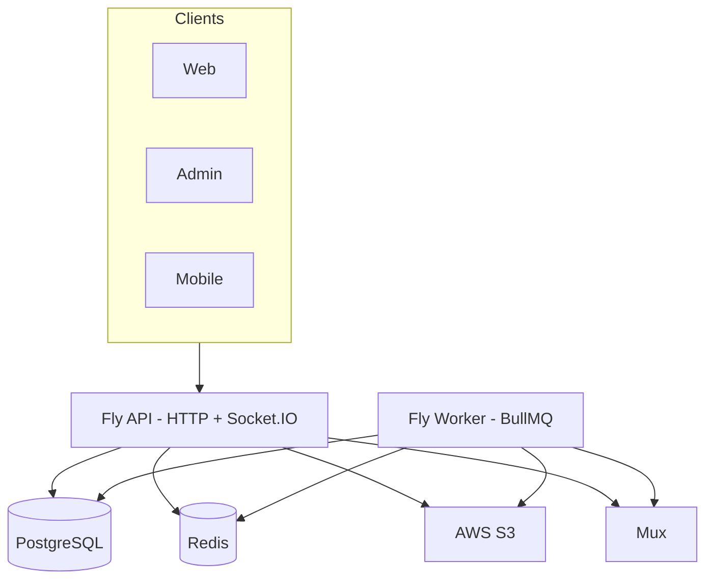

# FORGE — Project Master

**Audience:** Engineering, product, DevOps, design.  
**Client summary:** [CLIENT_OVERVIEW.md](./CLIENT_OVERVIEW.md) · **Index:** [README.md](./README.md)

Update this file when modules, routes, or feature status change. Sync [CLIENT_OVERVIEW.md](./CLIENT_OVERVIEW.md) §4.

---

## 1. Executive summary

**FORGE** is a **skill-first creator platform** powered by **YouTube-style mechanics** — see [FORGE_PRODUCT_STRATEGY.md](./FORGE_PRODUCT_STRATEGY.md) (product SSOT).

Channels (creator identity on `User`), video upload/watch, subscriptions, playlists, comments, live streaming, and Community tab (posts/polls) ship as core YouTube-parity mechanics. Skills/crafts taxonomy, admin-gated creator approval, and selective skill extensions (courses, mentorship, channel points) define vertical positioning.

**Skill extensions** (flag-gated; web/mobile UI shipped 2026-09 per [FORGE_IMPLEMENTATION_ROADMAP.md](./FORGE_IMPLEMENTATION_ROADMAP.md)):

| Module | Flag | MVP scope |
|--------|------|-----------|
| Courses | `FEATURES_COURSES` | Video-lesson collections |
| Mentorship | `FEATURES_MENTORSHIP` | Community matching |
| Channel points | `FEATURES_CHANNEL_POINTS` | Live engagement rewards |
| Full LMS | `FEATURES_SKILL_ECONOMY_LMS` | Quizzes, cohorts, programs, articles, podcasts |

Web/mobile skill surfaces (courses, mentorship, channel points, programs when LMS on) ship behind granular flags via `apps/api/src/common/features/skill-platform.ts` and `GET /platform/config` → `skillFeatures`.

**Communities 2.0** (`CommunitiesModule`) splits into two tiers ([ADR-004](./decisions/ADR-004-communities-extension.md)): **posts + polls + membership tiers are core** — YouTube Community tab + Channel Memberships. **Rooms and events/RSVPs are a labeled skill-community extension** — always on, not a YouTube-parity bug.

| Surface | Stack | Host |
|---------|--------|------|
| API | NestJS 10, TypeORM, BullMQ, Socket.IO | Fly `forge-studios-api` · `:3001` local |
| Worker | Same codebase, `WORKER_ONLY=true` | Fly `forge-studios-worker` |
| Web | Next.js 14 App Router | Vercel · `:3000` |
| Admin | Next.js 14 | Vercel · `:3002` |
| Mobile | Flutter, Riverpod, go_router | iOS / Android |

**Data & infra:** PostgreSQL 16 (Neon) · Redis 7 (BullMQ, cache, sockets) · AWS S3 · **Mux** (live + default VOD) · FFmpeg (optional VOD) · optional CloudFront.

**Monorepo packages:**

| Package | Path | Exports (key) |
|---------|------|----------------|
| `@forge/shared-types` | `packages/shared-types` | `FeedSort`, `SocketEvents`, `Permission`, access helpers, `PlatformPublicConfig`, `ContentVisibility`, entitlements types, `parseFeatureFlags`, JWT/session helpers |
| `@forge/design-system` | `packages/design-system` | Tokens (`forge-narrative.css`), Tailwind theme, React primitives (see §8) |

**API base:** `/api/v1` · Swagger (dev): `/api/docs` · **Full route list:** [§20](#20-api-route-catalog)

---

## 2. Repository layout

```
FORGE/
├── apps/api/              # NestJS API + migrations + workers
├── apps/web/              # Consumer Next.js
├── apps/admin/            # Operator Next.js
├── apps/mobile/           # Flutter
├── packages/
│   ├── shared-types/      # Contracts, flags, access, sockets
│   └── design-system/     # Tokens + React primitives
├── docs/                  # Canonical documentation (see README)
├── scripts/               # Deploy, smoke, DB, secrets
├── infra/observability/   # Grafana/Prometheus examples
├── fly.toml               # API Fly app
├── fly.worker.toml        # Worker Fly app
└── docker-compose.yml     # Local Postgres, Redis, worker
```

---

## 3. System architecture



| Process | Rules |
|---------|--------|
| **API** | No FFmpeg/Mux ingest in production (`ENABLE_VIDEO_WORKER` unset) |
| **Worker** | Video transcode, Mux ingest, analytics ingest, FCM dispatch, subscription maintenance |
| **Redis** | Required for multi-instance Socket.IO adapter + queues |

---

## 4. API modules (mandatory reference)

Registered in `apps/api/src/app.module.ts`. Global prefix: `/api/v1`.

| Module | Controller / entry | Primary routes | Responsibility |
|--------|-------------------|----------------|----------------|
| **AuthModule** | `auth` | signup, login, refresh, logout, sessions, google OAuth, verify-email, forgot/reset password, impersonate (admin) | JWT + refresh rotation, Google Passport |
| **UsersModule** | `users` | `me`, `me/watch-history`, `me/request-creator`, `by-username/:username`, profiles, avatar upload | Profiles, creator request, public channel data |
| **CategoriesModule** | `categories` | list categories, skill tags | Taxonomy for discovery |
| **ContentModule** | `videos`, `podcasts` | presigned-url, complete, multipart/*, view, watch, studio, CRUD, recommended/feed, trending, library, similar, podcast series + episodes + RSS | VOD upload, processing, playback; `ViewCountFlushService`; `RecommendationsService` (personalized + trending); `ContentLibraryService`; `PodcastsService` (series, iTunes RSS) |
| **FeedModule** | `videos` | `feed`, `feed/trending`, `feed/following`, `feed/recommended`, `public`, `by-category/:slug`, `by-skills` | Home/explore feeds (`latest` / `popular` / `forYou`) |
| **EngagementModule** | root | like, comments (CRUD/replies/likes), follow, follow lists | Social engagement |
| **DirectMessagesModule** | `/messages` | DM conversations, send, read receipts | Peer messaging |
| **StreamingModule** | `streams` | start, live, RSVP, polls, clips, replay, checkout, mods, `webhooks/mux`, co-hosts, VIP config, breakout rooms | Mux live + webhooks; multi-host (max 5 co-hosts); VIP room (tier-gated); breakout rooms via `StreamBreakoutService` — see [LIVE.md](./LIVE.md) |
| **LiveBroadcastModule** | `streams/:streamId/broadcast/browser` | token, start, stop | LiveKit browser go-live (RTMP egress to Mux) — see [LIVE.md](./LIVE.md) |
| **EntitlementsModule** | root | `creators/:id/tiers`, `subscriptions/mock`, membership checks | Memberships & tier CRUD — real Stripe Connect destination charges by default; `subscriptions/mock` is a dev-only join path (`BILLING_PROVIDER=stub`), see [MEMBERSHIPS.md](./MEMBERSHIPS.md) |
| **BillingModule** | `billing` | `checkout`, `checkout/event`, `webhook` | Stripe one-off checkout (paid events, super chat) when `BILLING_PROVIDER=stripe` |
| **CommunitiesModule** | root | channels per creator, messages, invites, mentorship profiles + matching | Creator community chat; `MentorshipService` (skill-overlap matching, accept/decline, completion tracking) |
| **StreamChatModule** | `streams/:id/chat` | messages, super-chat, ban/timeout, settings, pin | Live stream chat |
| **PlaylistsModule** | `playlists` | CRUD, `me`, add videos | User playlists |
| **NotificationsModule** | `notifications` | list, read, device register/revoke | In-app + FCM token registry |
| **SearchModule** | `search` | FTS query | Postgres full-text search |
| **ReportsModule** | `reports` | create report | Trust & safety intake |
| **AnalyticsModule** | `analytics` | `events` ingest | Async analytics (BullMQ) |
| **AdminModule** | `admin` | users, creators, videos, reports, categories, stats, impersonate, grant subscription | Operator APIs (`MANAGE_PLATFORM`) |
| **PlatformModule** | `platform` | `config` | Feature flags, auth/firebase/legal public config |
| **ChannelPointsModule** | root | `communities/:communityId/channel-points/*`, `creators/me/communities/:communityId/channel-points/*` | Twitch-style channel points: earn, redeem, reward CRUD, approve/reject redemptions |
| **CoursesModule** | root | `courses/discover`, `creators/me/courses`, `courses/:courseId/catalog`, cohorts, lessons (CRUD + reorder), enroll, progress, certificates, quizzes, assignments + grading | Creator courses: catalog, cohorts, lesson content, progress tracking, quizzes/assignments, certificates |
| **GamificationModule** | root | `communities/:communityId/leaderboard`, `communities/:communityId/gamification/*`, `platform/gamification/*` (me, check-in, leaderboard, achievements, reputation, analytics), `users/:userId/reputation`, `creators/me/communities/:communityId/badge-config` | Platform + per-community XP, streaks, achievements, reputation, leaderboards |
| **CreatorResourcesModule** | root | `creators/me/resources` (CRUD + `upload-url`), `creators/:creatorId/resources`, `resources/:resourceId/download-url` | Creator-uploaded downloadable resources (S3-backed) |
| **FraudDetectionModule** | `admin/fraud` | alerts, user risk, manual check | Billing fraud rules engine (velocity, chargeback, rapid cancel, new-account spend) |
| **ReferralModule** | root | `me/referral`, `me/referral/reward/:referredUserId`, `platform/ambassadors` | Referral tracking, reward payout, ambassador leaderboard |
| **FirebaseModule** | — | — | FCM admin SDK, optional App Check |
| **MailModule** | — | — | SMTP / console mail for verification & reset |
| **WorkersModule** | — | — | BullMQ processors (see §5) |
| **GatewayModule** | `events` (Socket.IO) | join/leave rooms | Realtime events |
| **AccountStrikesModule** | `users/me/strikes`, `account-strikes` | list mine, appeal | Community-guideline + copyright strike ladder (YouTube's published 3-strike numbers) — see [COPYRIGHT_DMCA.md](./COPYRIGHT_DMCA.md) |
| **CopyrightModule** | `copyright` | notices, counter-notices | DMCA §512 notice-and-takedown + counter-notice pipeline |
| **DatabaseModule** | — | — | TypeORM, migrations on boot |
| — | `health` | `GET /health` | DB, Redis, queue depth |
| — | `metrics` | `GET /metrics` | Prometheus when `METRICS_ENABLED` |

**Global guards (order matters):** `JwtAuthGuard` → `RolesGuard` → `ConsumerOnlyGuard` → `PermissionsGuard` → `ThrottlerGuard` → `EmailVerifiedGuard` (mutations).

**Permissions:** `ENGAGE`, `USE_LIBRARY`, `VIEW_DASHBOARD`, `UPLOAD_VIDEO`, `START_STREAM`, `MANAGE_PLATFORM` — see `packages/shared-types/src/access.ts`.

---

## 5. Background workers (BullMQ)

| Queue | Worker | When registered |
|-------|--------|-----------------|
| `video-processing` | `VideoProcessorWorker` | Worker + `VIDEO_TRANSCODE_PROVIDER=ffmpeg` |
| `mux-vod-ingest` | `MuxVodIngestWorker` | Worker + `VIDEO_TRANSCODE_PROVIDER=mux` (default) |
| `video-processing-dlq` | DLQ | Failed FFmpeg jobs |
| `analytics-ingest` | `AnalyticsIngestWorker` | Worker in prod; API+worker in local dev |
| `push-dispatch` | `PushDispatchWorker` | FCM multicast |
| `subscription-maintenance` | `SubscriptionMaintenanceWorker` | Hourly expiry + notifications |
| `analytics-retention` | `AnalyticsRetentionWorker` | Daily analytics purge |
| `stream-mux-sync` | `StreamMuxSyncWorker` | Mux status + idle-end (45s live / 90s idle / 15m dormant) |
| `stream-chat-ingest` | `StreamChatIngestWorker` | Async chat when `STREAM_CHAT_ASYNC=true` |
| `stream-reminder` | `StreamReminderWorker` | RSVP reminders |
| `stream-snapshot-retention` | `StreamSnapshotRetentionWorker` | Snapshot cleanup |
| `premium-content-notify` | `PremiumContentNotifyWorker` | Async tier/subscriber replay fan-out |
| `engagement-reconciliation` | `EngagementReconciliationWorker` | Daily follow-count reconciliation (SQL batch; `DISABLE_ENGAGEMENT_RECONCILIATION`) |
| `scheduled-publish` | `ScheduledPublishWorker` | Every 1m — indexes videos past `scheduledPublishAt` (`DISABLE_SCHEDULED_PUBLISH`) |
| `copyright-reinstatement` | `CopyrightReinstatementWorker` | Hourly — auto-reinstates videos past a counter-notice's 10-business-day window (`DISABLE_COPYRIGHT_REINSTATEMENT`) |

Schedulers register on **worker only** in production. Logic: `apps/api/src/modules/workers/workers.module.ts` · deploy: [LIVE.md](./LIVE.md)

---

## 6. Realtime (Socket.IO)

**Namespace:** `/events` · **Gateway:** `apps/api/src/gateway/events.gateway.ts`

| Client → server | Server → client (`SocketEvents`) |
|-----------------|----------------------------------|
| `join-video` / `leave-video` | `comment:new` |
| `join-stream` / `leave-stream` | `stream:started`, `stream:ended`, `stream:viewer-count` |
| `join-live-feed` | `video:ready` (to `user:{id}`) |
| — | `stream:chat:*`, `channel:message*` |

Auth: JWT in handshake `auth.token` (not client `userId`). Production: Redis adapter required.

---

## 7. Feature flags

Comma-separated in `FEATURE_FLAGS` (API) and `NEXT_PUBLIC_FEATURE_FLAGS` (web). Exposed on `GET /platform/config`.

| Flag | Effect |
|------|--------|
| `multipart_upload` | S3 multipart for videos ≥ 50MB |
| `blueprints_public` | Web route `/blueprints` (Stitch reference gallery) |

Helpers: `@forge/shared-types` `parseFeatureFlags`, `isFeatureEnabled`.

**Extension-layer flags** (direct env booleans, not part of `FEATURE_FLAGS`):

| Flag | Default | Scope |
|------|---------|--------|
| `FEATURES_COURSES` | `false` | Video-lesson courses (`isCoursesEnabled()`, `skill-platform.ts`) |
| `FEATURES_MENTORSHIP` | `false` | Community mentorship (`isMentorshipEnabled()`) |
| `FEATURES_CHANNEL_POINTS` | `false` | Channel points (`isChannelPointsEnabled()`) |
| `FEATURES_SKILL_ECONOMY_LMS` | `false` | **All above** + full LMS: quizzes, cohorts, programs, articles, podcasts, study groups, brands |

`FEATURES_SKILL_ECONOMY_LMS=true` is legacy compat — enables every skill module. Granular flags allow selective rollout (re-audit 2026-09, ADR-006). Guards: `SkillFeatureGuard` + `@RequireSkillFeature()`.

**Re-audit 2026-09:** Skill UI restored on web/mobile (P2–P5). Enable locally via `FEATURES_COURSES` etc. in `apps/api/.env` — see [FORGE_IMPLEMENTATION_ROADMAP.md](./FORGE_IMPLEMENTATION_ROADMAP.md). Mentorship on `FEATURES_MENTORSHIP`; brands/engagement on full LMS flag only.

**Communities 2.0** — posts/polls/tiers core; rooms/events labeled extension (unchanged).

---

## 8. Design system & blueprints

### Design system (`@forge/design-system`)

- **Tokens:** `packages/design-system/tokens/forge-narrative.css` (+ JSON)
- **Tailwind:** `@import '@forge/design-system/tailwind'` in web/admin
- **React (server):** `Button`, `Input`, `PageHeader`, `SkillChip`, `LiveBadge`, `EmptyState`, `StatusPage`, `Icon`, `LoadingSkeleton` (`FeedGridSkeleton`, `ListSkeleton`, …), `Card`, `StatCard`, `ProfileCard`
- **React (client):** `ConfirmDialog`, `FadeIn`, `PageEnter`, `StaggerGrid`, `Dialog`, `Tabs`/`TabPanel`, `DataTable`, `Sparkline`/`TrendChart`, `ToastProvider`/`useToast` — import from `@forge/design-system/client`
- **Mobile tokens:** `apps/mobile/lib/core/theme/forge_tokens.dart`

Product rule: YouTube-replica video platform — prefer YouTube parity in primary chrome; see `.cursor/rules/forge-frontend-ux.mdc` / `.claude/rules/forge-frontend-ux.md`. (Older wording here said "distinct visual identity, not a YouTube clone" — that line has since moved on in the rule itself; corrected 2026-08-09, see [PLATFORM_AUDIT_2026-08-09.md §1](./PLATFORM_AUDIT_2026-08-09.md#1-the-1-open-decision-what-is-forge-actually).)

### Stitch blueprints (UI reference)

| Item | Location |
|------|----------|
| **Web gallery** | `/blueprints` when `blueprints_public` flag enabled (`apps/web/src/app/blueprints/page.tsx`) |
| **Static HTML exports** | Optional local folder (not in repo) — see [DESIGN.md](./DESIGN.md) |
| **Implementation** | Production UI in `apps/web`, `apps/admin`, `apps/mobile` — blueprints are reference only |

Enable locally:

```env
# apps/api/.env
FEATURE_FLAGS=blueprints_public
# apps/web/.env.local
NEXT_PUBLIC_FEATURE_FLAGS=blueprints_public
```

---

## 9. Web app routes (`apps/web`)

| Area | Routes |
|------|--------|
| Discovery | `/`, `/explore`, `/explore/[skill]`, `/explore/skills/[slug]`, `/search`, `/library` |
| Watch | `/watch/[id]`, `/history` |
| Profile | `/profile`, `/profile/settings`, `/[username]`, `/[username]/community` |
| Creator | `/upload`, `/upload/become-creator`, `/upload/step/[step]`, `/upload/success` |
| Studio | `/studio`, `/studio/videos`, `/studio/live`, `/studio/comments`, `/studio/analytics`, `/studio/analytics/details`, `/studio/tiers`, `/studio/community`, `/studio/settings` |
| Live | `/live`, `/live/[id]` |
| Messages | `/messages` |
| Auth | `/login`, `/signup`, `/forgot-password`, `/reset-password`, `/verify-email`, `/waiting-approval`, `/approval-rejected`, `/session-expired`, `/auth/oauth/callback` |
| Legal | `/terms`, `/privacy` — [LEGAL.md](./LEGAL.md) |
| System | `/offline`, `/maintenance`, `/impersonate` (admin token handoff) |
| Design ref | `/blueprints` (flagged) |

**Key libs:** `lib/api.ts`, `lib/auth.tsx`, `lib/socket.ts`, `lib/permissions.ts`, `middleware.ts`

---

## 10. Admin app routes (`apps/admin`)

| Route | Purpose |
|-------|---------|
| `/login`, `/unauthorized` | Admin auth |
| `/dashboard` | Stats |
| `/users`, `/users/[id]` | User hub, videos/reports/history tabs, impersonate |
| `/creator-approvals` | Pending creators |
| `/content` | Video moderation |
| `/reports`, `/reports/[id]` | Reports queue |
| `/categories` | Taxonomy CRUD |
| `/analytics` | Platform analytics |
| `/live` | Live stream management, force-end, grant access |
| `/fraud` | Fraud alerts queue, risk review, manual re-check |
| `/search` | Cross-platform search |
| `/settings` | API URL, health |

Auth: `forge_admin_token` + HttpOnly refresh cookie.

---

## 11. Mobile app (`apps/mobile`)

**Router:** `lib/core/router/` — `/feed`, `/explore`, `/live`, `/library`, `/watch/:id`, `/studio/*`, auth screens, creator gates.

**Upload:** native presign → S3 → complete (`features/upload/`).  
**FCM:** [FIREBASE.md](./FIREBASE.md)

---

## 12. Data model (entities)

| Domain | Tables / entities |
|--------|-------------------|
| Users | `users`, `refresh_tokens`, `password_reset_tokens`, `oauth_accounts` |
| Content | `videos`, `video_skill_tags`, `video_multipart_sessions` |
| Live | `streams`, `stream_event_purchases`, `stream_rsvps`, `stream_moderators`, `stream_polls`, `stream_clips`, `stream_messages`, `stream_analytics_snapshots` |
| Engagement | `likes`, `comments`, `follows`, `watch_history`, `member_xp`, `member_badges` |
| Discovery | `categories`, `subcategories`, `skill_tags` |
| Social | `playlists`, `playlist_videos`, `notifications`, `device_tokens`, `conversations`, `direct_messages` |
| Trust | `reports`, `community_reports`, `community_member_bans` |
| Monetization | `subscription_tiers`, `member_subscriptions`, `tier_entitlements` |
| Community 2.0 | `brands`, `communities`, `community_categories`, `channels`, `channel_members`, `channel_messages`, `community_posts`, `community_post_comments`, `community_post_reactions`, `community_polls`, `community_poll_votes`, `community_roles` |
| Mentorship | `mentorship_profiles`, `mentorship_matches` |
| Channel Points | `channel_points_balances`, `channel_point_rewards`, `channel_point_redemptions` |
| Fraud | `fraud_alerts` |
| Courses | `courses`, `course_cohorts` |
| Access control | `access_session_audit` (runtime sessions in Redis) |
| Analytics | `analytics_events` |
| Podcasts | `podcast_series` (videos with `video_type = 'podcast'` are episodes) |

Migrations: `apps/api/src/database/migrations/` · `migrationsRun: true` on API boot.

**Public JSON:** [API_SCHEMAS.md](./API_SCHEMAS.md) · **Env:** `apps/api/.env.example`

---

## 13. Media pipelines

[MEDIA.md](./MEDIA.md)

1. Presigned S3 upload → `complete` → queue  
2. **Mux (default):** `mux-vod-ingest` → webhook `video.asset.ready`  
3. **FFmpeg:** `video-processing` → HLS on S3/CloudFront  
4. **Live:** `POST /streams/start` → Mux RTMP → HLS playback  

---

## 14. Auth & platform config

[AUTH.md](./AUTH.md)

`GET /platform/config` returns: `featureFlags`, `apiVersion`, `auth`, `firebase`, `legal` (terms/privacy URLs, contact emails).

---

## 15. Legal & compliance

[LEGAL.md](./LEGAL.md) — Terms `/terms`, Privacy `/privacy`, signup `acceptedTerms`, counsel review before regulated launch.

---

## 16. Feature status matrix

High-level snapshot only. **This table is the feature-status SSOT.** The CEOS tracker is a historical task list — do not cite its completion % as product status.

| Domain | API | Web | Admin | Mobile | Worker |
|------|:---:|:---:|:-----:|:------:|:------:|
| Auth & sessions | ✅ | ✅ | ✅ | ✅ | — |
| Google OAuth | ✅ | ✅ | — | ✅ | — |
| Feed & personalized recommendations | ✅ | ✅ | ✅ | ✅ | — |
| VOD upload/playback | ✅ | ✅ | — | ⚠️ | ✅ |
| Podcasts (series, episodes, iTunes RSS) | ✅ | — | — | — | — |
| Live (Mux + LiveKit, co-hosts, VIP, breakout) | ✅ | ✅ | ✅ | ⚠️ | ✅ |
| Engagement (likes, comments, follow) | ✅ | ✅ | — | ✅ | ✅ |
| Direct messages | ✅ | ✅ | — | ✅ | — |
| Playlists | ✅ | ✅ | — | ✅ | — |
| Creator studio | ✅ | ✅ | — | ⚠️ | — |
| Memberships & Stripe billing | ✅ | ✅ | ⚠️ | ⚠️ | ✅ |
| Communities (rooms, posts, events) | ✅ | ✅ | ✅ | ⚠️ | ✅ |
| Community polls | ✅ | ✅ | — | ✅ | ✅ |
| Channel points (earn, redeem, rewards) | ✅ | ✅ | ✅ | ✅ | — |
| Mentorship matching (profiles, scoring, lifecycle) | ✅ | ✅ | ✅ | ✅ | — |
| Gamification API (XP, streaks) | ✅ | — | — | — | — |
| Courses & programs | ✅ | ✅ | ✅ | ✅ | — |
| Creator bundles | ✅ | ✅ | — | ⚠️ | — |
| Stream chat & reactions | ✅ | ✅ | — | ⚠️ | ✅ |
| Access sessions / device caps | ✅ | ✅ | — | ⚠️ | — |
| Reports & moderation | ✅ | ✅ | ✅ | ✅ | ✅ |
| Fraud detection (billing anomalies, velocity, chargeback) | ✅ | — | ✅ | — | — |
| Admin hub | ✅ | impersonate | ✅ | — | — |
| FCM push | ⚠️ | ⚠️ | — | ⚠️ | ✅ |
| Analytics & creator BI | ✅ | ⚠️ | ✅ | ⚠️ | ✅ |
| AI (moderation, copilot) | ⚠️ | ⚠️ | — | ⏳ | ✅ |
| Blueprints gallery | flag | flag | — | — | — |
| Content scan (CSAM vendor) | ⚠️ | — | ⚠️ | — | ⚠️ |

✅ MVP-ready · ⚠️ partial or config-dependent · ⏳ not started / routed away

**Launch blockers (not % complete):** CSAM vendor (R-01), Stripe live keys (R-09), load-test evidence, Neon drill 2026-10-22. See [FORGE_IMPLEMENTATION_ROADMAP.md](./FORGE_IMPLEMENTATION_ROADMAP.md).

**2026-09-03 engineering pass:** Mobile Studio depth (playlists, upload-reliability, analytics-details, go-live parity), ADR-012 scan gate + admin held path, FCM click routing, SEO/a11y. Remaining Studio/Live ⚠️ rows are LiveKit browser go-live / thin surfaces — not missing Studio chrome.

---

## 17. Security & observability

- Production: strong `JWT_*`, `MUX_WEBHOOK_SECRET`, boot validation  
- Rate limits, presigned upload caps, entitlements on playback URLs  
- [OBSERVABILITY.md](./OBSERVABILITY.md) — health, metrics, Sentry, Grafana  

---

## 18. Deploy & CI

[DEPLOY.md](./DEPLOY.md) · [CI_CD.md](./CI_CD.md) — branch → PR → one merge to `main`.

---

## 19. Related docs

| Topic | File |
|-------|------|
| Live streaming | [LIVE.md](./LIVE.md) |
| Enterprise audit | [audits/README.md](./audits/README.md) · **Closed 2026-06** · [deferred backlog](./audits/DEFERRED_BACKLOG.md) |
| Scripts | [SCRIPTS.md](./SCRIPTS.md) |
| Operations runbooks | [operations/README.md](./operations/README.md) |
| Local dev | [GETTING_STARTED.md](./GETTING_STARTED.md) |
| API schemas & versioning policy | [API_SCHEMAS.md](./API_SCHEMAS.md) § API versioning |
| Redis dual-client ops | [operations/REDIS_CONNECTIONS.md](./operations/REDIS_CONNECTIONS.md) |
| Deploy | [DEPLOY.md](./DEPLOY.md) |
| Media | [MEDIA.md](./MEDIA.md) |
| Auth | [AUTH.md](./AUTH.md) |
| Firebase | [FIREBASE.md](./FIREBASE.md) |
| Memberships | [MEMBERSHIPS.md](./MEMBERSHIPS.md) |
| Creator Economy OS tracker | [FORGE_CREATOR_ECONOMY_OS_MASTER_TRACKER.md](./FORGE_CREATOR_ECONOMY_OS_MASTER_TRACKER.md) |
| Legal | [LEGAL.md](./LEGAL.md) |
| QA | [QA.md](./QA.md) |
| Design & blueprints | [DESIGN.md](./DESIGN.md) |

---

## 20. API route catalog

All paths prefixed with `/api/v1`. Auth = JWT unless `@Public`. See Swagger for DTOs.

### `auth`

`POST signup` · `POST login` · `POST refresh` · `POST logout` · `GET google` · `GET google/callback` · `POST oauth/exchange` · `POST impersonate` (admin) · `GET sessions` · `GET login-history` · `DELETE sessions/:id` · `POST forgot-password` · `POST reset-password` · `POST verify-email/resend` · `GET verify-email` · `POST verify-email/otp`

### `users`

`GET me` · `GET me/watch-history` · `POST me/request-creator` · `POST me/mature-content/acknowledge` · `PUT :id` · `GET :id` · `GET by-username/:username` · `GET search` · `GET :id/followers` · `GET :id/following` · `GET :id/videos` · `GET :id/playlists` · `POST :id/avatar-upload-url`

### `categories`

`GET /` · `GET upload-options` · `GET :id/skill-tags` · `GET :id/subcategories`

### `videos` (content + feed)

**Feed:** `GET feed` · `GET feed/trending` · `GET feed/following` · `GET feed/recommended` · `GET public` · `GET by-category/:slug` · `GET by-skills`  
**Recommendations:** `GET recommended/feed` (personalized; falls back to trending for anon) · `GET trending` · `GET :id/similar`  
**Library:** `GET library` (unified content library, filterable by type/category/orderBy) · `GET library/creator/:creatorId`  
**Upload:** `POST presigned-url` · `PUT :id/upload` (proxy) · `POST :id/complete` · `POST :id/cancel-upload` · multipart `progress` / `checkpoint` / `parts` / `complete` · `POST :id/thumbnail/presigned-url`  
**Playback:** `GET :id` · `POST :id/view` · `POST :id/watch` · `PATCH :id` · `DELETE :id`  
**Studio:** `GET studio` · `POST release-stuck-uploads` · `POST :id/retry-transcode` · `POST` (create metadata)

### `streams`

`POST start` · `GET live` · `GET upcoming` · `GET :id` · `GET :id/replay` · `POST :id/end` · `POST :id/checkout` · `POST :id/grant-access` · `PATCH :id/slow-mode` · RSVP `GET/POST :id/rsvp` · `POST :id/rsvp/cancel` · mods `GET/POST :id/moderators` · `POST :id/moderators/:userId/remove` · `GET :id/moderator-status` · `GET :id/reactions` · polls `GET :id/poll` · `POST :id/polls` · `POST :id/polls/:pollId/vote|close` · clips `GET/POST :id/clips` · `GET :id/captions` · `POST webhooks/mux`

**Co-hosts:** `GET :id/co-hosts` · `POST :id/co-hosts` · `DELETE :id/co-hosts/:userId` (max 5)  
**VIP room:** `PATCH :id/vip-config` (set tier gate) · `POST :id/vip-room/join` (entitlement check)  
**Breakout rooms:** `POST :id/breakout-rooms` · `GET :id/breakout-rooms` · `POST :id/breakout-rooms/assign` · `POST :id/breakout-rooms/end`

**Browser go-live:** `POST :streamId/broadcast/browser/token` · `POST …/start` · `POST …/stop` (LiveKit)

**Creator analytics:** `GET creators/me/streams/:streamId/analytics` · `GET creators/me/streams/:streamId/health`

Full live deploy: [LIVE.md](./LIVE.md)

### `streams/:streamId/chat`

`GET /` (messages, optional `fromMs`/`toMs` replay) · `POST /` · `POST super-chat` · `DELETE :messageId` · `POST timeout` · `POST ban` · `POST unban` · `PATCH settings` · `PATCH pin` · `PATCH slow-mode`

### Engagement (root)

`POST videos/:id/like` · `DELETE videos/:id/like` · `POST videos/:id/comments` · `GET videos/:id/comments` · `GET videos/:videoId/comments/:commentId/replies` · `PATCH videos/:videoId/comments/:commentId` · `DELETE videos/:videoId/comments/:commentId` · `POST videos/:videoId/comments/:commentId/like` · `DELETE videos/:videoId/comments/:commentId/like` · `POST follow/:userId` · `DELETE follow/:userId`

### `messages`

`GET conversations` · `GET conversations/:conversationId` · `POST /` (send) · `POST conversations/:conversationId/read`

### `billing`

`POST checkout` · `POST checkout/event` · `GET connect/status` · `POST connect/onboard` · `POST subscriptions/change-tier` · `POST portal` · `POST webhook` (Stripe when `BILLING_PROVIDER=stripe`)

### `playlists`

`POST /` · `GET me` · `GET :id` · `POST :id/videos` · `DELETE :id/videos/:videoId`

### `search`

`GET /` · `GET suggestions`

### `notifications`

`GET /` · `GET unread-count` · `POST read-all` · `POST :id/read` · `POST devices/register` · `DELETE devices`

### Entitlements (root)

`GET creators/:creatorId/tiers` · `POST creators/me/tiers` · `PATCH creators/me/tiers/:tierId` · `DELETE creators/me/tiers/:tierId` · `GET subscriptions/me` · `GET creators/:creatorId/membership/me` · `POST subscriptions/mock` · `DELETE subscriptions/me/:creatorId`

### Communities (root)

`GET creators/:creatorId/communities` · `GET creators/:creatorId/communities/:slug` · `GET communities/id/:communityId` · `GET communities/:creatorId` (legacy) · `POST/PATCH creators/me/communities` · categories/channels CRUD under `creators/me/communities/:communityId/…` · `GET/POST channels/:channelId/messages` · `DELETE channels/:channelId/messages/:messageId` · posts: `GET communities/:communityId/posts` · `GET …/posts/search` · `POST creators/me/communities/:communityId/posts` · polls: `GET communities/:communityId/polls/active` · `POST …/polls/:pollId/vote` · `POST creators/me/communities/:communityId/polls` · moderation: reports, bans, roles under `creators/me/communities/:communityId/…` · `GET creators/me/brands` (+ CRUD) · gamification: `GET/POST communities/:communityId/gamification/…`

**Mentorship:** `PUT communities/:communityId/mentorship/profile` · `GET communities/:communityId/mentorship/mentors` · `POST communities/:communityId/mentorship/run-matching` (creator) · `GET communities/:communityId/mentorship/my-matches` · `POST communities/:communityId/mentorship/matches/:matchId/respond` · `POST communities/:communityId/mentorship/matches/:matchId/complete`

**Wiki, challenges & surveys:** `GET communities/:communityId/wiki` · `POST/PATCH/DELETE creators/me/communities/:communityId/wiki(/:wikiId)` · `GET communities/:communityId/challenges` · `POST/PATCH/DELETE creators/me/communities/:communityId/challenges(/:challengeId)` · `POST communities/:communityId/challenges/:challengeId/join` · `PATCH …/challenges/:challengeId/progress` · `GET communities/:communityId/surveys` · `POST/PATCH/DELETE creators/me/communities/:communityId/surveys(/:surveyId)` · `GET …/surveys/:surveyId/analytics` · `POST communities/:communityId/surveys/:surveyId/respond`

**Events:** `GET communities/:communityId/events` · `GET communities/:communityId/office-hours` · `POST creators/me/communities/:communityId/events` · `POST communities/:communityId/events/:eventId/rsvp` · `GET creators/me/communities/:communityId/events/:eventId/rsvps` · `PATCH/DELETE creators/me/communities/:communityId/events/:eventId`

**Groups:** `POST/GET communities/:communityId/groups` · `GET groups/:groupId` · `POST groups/:groupId/join` · `DELETE groups/:groupId/leave` · `GET groups/:groupId/members` · `DELETE groups/:groupId`

**Member management (creator):** `POST communities/:communityId/join-request` · `GET creators/me/communities/:communityId/members` · `PATCH creators/me/communities/:communityId/members/:userId/approve|reject|suspend|unsuspend` · `GET creators/me/communities/:communityId/members/export`

**Voice/text/stage rooms:** `GET communities/:communityId/rooms(/:roomId)` · `POST/PATCH/DELETE creators/me/communities/:communityId/rooms(/:roomId)` · `POST communities/:communityId/rooms/:roomId/token` (LiveKit) · raise-hand: `POST/DELETE communities/:communityId/rooms/:roomId/raise-hand` · `GET …/raise-hands` · `POST …/raise-hand/:targetUserId/approve` · room chat: `GET/POST communities/:communityId/rooms/:roomId/messages` · `DELETE …/messages/:messageId` · room permissions: `GET/POST creators/me/communities/:communityId/rooms/:roomId/permissions` · `DELETE …/permissions/:targetUserId`

**AI moderation, copilot & audit:** `POST creators/me/ai/moderation/score` · `GET creators/me/communities/:communityId/copilot/health` · `GET creators/me/communities/:communityId/rooms/:roomId/summary` · `GET admin/ai/budget` · `POST creators/me/copilot/insights` · `GET creators/me/audit-logs`

**Discovery, layout & permissions:** `GET communities/search` · `GET communities/discover/featured` · `GET communities/:communityId/layout` · `GET communities/:communityId/permissions/matrix` (display-only, see [COMMUNITY-PERMISSION-MATRIX.md](./COMMUNITY-PERMISSION-MATRIX.md)) · `GET communities/:communityId/live` (linked live streams) · `POST creators/me/channels/:channelId/invite`

**Creator business tools:** `POST creators/me/communities/:communityId/transfer-ownership` · `GET creators/me/moderated-communities` · `GET creators/me/communities/:communityId/analytics` · `GET creators/me/business-analytics` (+ `/export`) · `GET creators/me/attention` · `GET creators/me/ecosystem-tree`

### Channel Points (root)

**Member:** `GET communities/:communityId/channel-points/me` (balance) · `GET communities/:communityId/channel-points/rewards` (catalog) · `POST communities/:communityId/channel-points/redeem`  
**Creator (requires `CreatorApprovedGuard`):** `POST creators/me/communities/:communityId/channel-points/rewards` · `PATCH …/rewards/:rewardId` · `DELETE …/rewards/:rewardId` · `GET …/redemptions` · `POST …/redemptions/:redemptionId/approve` · `POST …/redemptions/:redemptionId/reject`

### `podcasts`

**Public:** `GET podcasts/:seriesId/episodes` · `GET podcasts/:seriesId/rss` (iTunes XML)  
**Creator:** `POST/GET creators/me/podcasts` · `PATCH/DELETE creators/me/podcasts/:seriesId` · `POST creators/me/podcasts/:seriesId/episodes`

### Access sessions (root)

`POST access-sessions/start` · `POST access-sessions/heartbeat` · `DELETE access-sessions/current` · `GET access-sessions/me`

### Courses (root)

**Discovery:** `GET courses/discover/featured` · `GET courses/discover` · `GET courses/:courseId/catalog` · `GET creators/:creatorId/courses`  
**Creator authoring:** `GET/POST creators/me/courses` · `PATCH creators/me/courses/:courseId` · cohorts: `POST/PATCH/GET creators/me/courses/:courseId/cohorts[/:cohortId]` · `POST creators/me/courses/:courseId/bind-community` · lessons: `POST/PATCH/DELETE creators/me/courses/:courseId/lessons[/:lessonId]` · `PATCH creators/me/courses/:courseId/lessons/reorder`  
**Learner:** `GET courses/:courseId/lessons` · `POST courses/:courseId/enroll` · `GET courses/:courseId/progress` · `POST courses/:courseId/lessons/:lessonId/progress` · `POST courses/:courseId/certificate` · `GET me/certificates` · `GET certificates/:certificateId`  
**Quizzes/assignments:** `POST/GET courses/:courseId/quizzes` · `POST quizzes/:quizId/submit` · `GET quizzes/:quizId/my-attempts` · `POST/GET courses/:courseId/assignments` · `POST assignments/:assignmentId/submit` · `PATCH …/submissions/:submissionId/grade` · `GET …/submissions`  
(Legacy programs endpoints also exist: `GET creators/:creatorId/programs[/:slug]` · `POST programs/:programId/enroll` · `POST programs/:programId/checkout` (Stripe) · `GET/POST/PATCH/DELETE creators/me/programs` — register `creators/me/*` before `:creatorId` routes; paid purchases via `program_purchases` + webhook `metadata.type=program`)

### Creator Resources (root)

`POST creators/me/resources/upload-url` · `POST/GET creators/me/resources` · `PATCH/DELETE creators/me/resources/:resourceId` · `GET creators/:creatorId/resources` · `GET resources/:resourceId/download-url`

### Gamification (platform-level, root)

`GET platform/gamification/me` · `POST platform/gamification/check-in` · `GET platform/gamification/leaderboard` · `GET platform/gamification/achievements` · `POST platform/gamification/achievements/:key/unlock` · `GET platform/gamification/reputation` · `GET platform/gamification/analytics` · `GET users/:userId/reputation` · `GET creators/me/communities/:communityId/badge-config`

(Community-scoped gamification — `communities/:communityId/gamification/*`, `communities/:communityId/leaderboard` — listed under Communities above.)

### Entitlements (extended)

`GET creators/me/subscribers/analytics` (subscriber counts + MRR snapshot)

### Referral (root)

`GET me/referral` (my referral code + stats) · `POST me/referral/reward/:referredUserId` (claim reward for a referred signup) · `GET platform/ambassadors` (top-referrer leaderboard)

### `reports`

`POST /` (create report)

### `analytics`

`POST events`

### `platform`

`GET config` (flags, auth, firebase, legal)

### `admin` (role admin, requires `MANAGE_PLATFORM`)

`GET stats` · `GET users` · `GET users/:id` · `GET users/:id/summary|videos|reports|watch-history|playlists` · `PATCH users/:id` · `DELETE users/:id` · `POST users/:id/impersonate` · `POST users/:id/resend-verification` · `GET creators/pending` · `POST creators/:id/approve|reject` · `GET videos` · `PATCH videos/:id` · `GET reports` · `GET reports/:id` · `PATCH reports/:id` · `GET analytics/summary` · `POST categories` · `PATCH categories/:id` · `DELETE categories/:id` · `POST subscriptions/grant` · `GET database/query-stats` · `POST database/query-stats/reset` · `GET streams` · `POST streams/:id/force-end` · `POST streams/:id/grant-access` · `GET/DELETE streams/:id/chat` · `POST streams/backfill-mux-playback-ids`

**Fraud:** `GET fraud/alerts` · `GET fraud/users/:userId/risk` · `POST fraud/users/:userId/check` · `PATCH fraud/alerts/:alertId`

### Health & metrics

`GET /api/v1/health` (readiness alias) · `GET /api/v1/health/ready` · `GET /api/v1/health/live` (liveness — Fly probe) · `GET /metrics` (when `METRICS_ENABLED`)

---

*Last updated: 2026-07-22*
