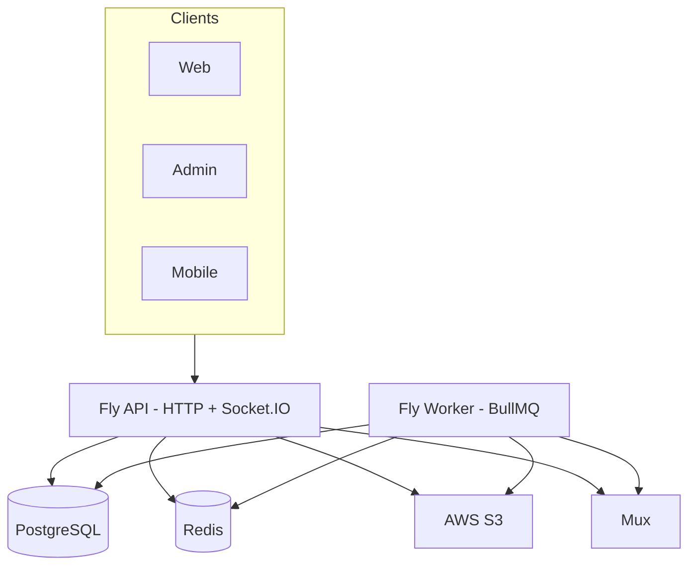

# FORGE — Project Master

**Audience:** Engineering, product, DevOps, design.  
**Client summary:** [CLIENT_OVERVIEW.md](./CLIENT_OVERVIEW.md) · **Index:** [README.md](./README.md)

Update this file when modules, routes, or feature status change. Sync [CLIENT_OVERVIEW.md](./CLIENT_OVERVIEW.md) §4.

---

## 1. Executive summary

**FORGE** is a skill-first creator platform: on-demand lessons, live teaching, categories/skill tags, communities, and mock memberships.

| Surface | Stack | Host |
|---------|--------|------|
| API | NestJS 10, TypeORM, BullMQ, Socket.IO | Fly `forge-studios-api` · `:3001` local |
| Worker | Same codebase, `WORKER_ONLY=true` | Fly `forge-studios-worker` |
| Web | Next.js 14 App Router | Vercel · `:3000` |
| Admin | Next.js 14 | Vercel · `:3002` |
| Mobile | Flutter, Riverpod, go_router | iOS / Android |

**Data & infra:** PostgreSQL 16 (Neon) · Redis 7 (BullMQ, cache, sockets) · AWS S3 · **Mux** (live + default VOD) · FFmpeg (optional VOD) · optional CloudFront.

**Monorepo packages:**

| Package | Path | Exports (key) |
|---------|------|----------------|
| `@forge/shared-types` | `packages/shared-types` | `FeedSort`, `SocketEvents`, `Permission`, access helpers, `PlatformPublicConfig`, `ContentVisibility`, entitlements types, `parseFeatureFlags`, JWT/session helpers |
| `@forge/design-system` | `packages/design-system` | Tokens (`forge-narrative.css`), Tailwind theme, React primitives (see §8) |

**API base:** `/api/v1` · Swagger (dev): `/api/docs` · **Full route list:** [§20](#20-api-route-catalog)

---

## 2. Repository layout

```
FORGE/
├── apps/api/              # NestJS API + migrations + workers
├── apps/web/              # Consumer Next.js
├── apps/admin/            # Operator Next.js
├── apps/mobile/           # Flutter
├── packages/
│   ├── shared-types/      # Contracts, flags, access, sockets
│   └── design-system/     # Tokens + React primitives
├── docs/                  # Canonical documentation (see README)
├── scripts/               # Deploy, smoke, DB, secrets
├── infra/observability/   # Grafana/Prometheus examples
├── fly.toml               # API Fly app
├── fly.worker.toml        # Worker Fly app
└── docker-compose.yml     # Local Postgres, Redis, worker
```

---

## 3. System architecture



| Process | Rules |
|---------|--------|
| **API** | No FFmpeg/Mux ingest in production (`ENABLE_VIDEO_WORKER` unset) |
| **Worker** | Video transcode, Mux ingest, analytics ingest, FCM dispatch, subscription maintenance |
| **Redis** | Required for multi-instance Socket.IO adapter + queues |

---

## 4. API modules (mandatory reference)

Registered in `apps/api/src/app.module.ts`. Global prefix: `/api/v1`.

| Module | Controller / entry | Primary routes | Responsibility |
|--------|-------------------|----------------|----------------|
| **AuthModule** | `auth` | signup, login, refresh, logout, sessions, google OAuth, verify-email, forgot/reset password, impersonate (admin) | JWT + refresh rotation, Google Passport |
| **UsersModule** | `users` | `me`, `me/watch-history`, `me/request-creator`, `by-username/:username`, profiles, avatar upload | Profiles, creator request, public channel data |
| **CategoriesModule** | `categories` | list categories, skill tags | Taxonomy for discovery |
| **ContentModule** | `videos` | presigned-url, complete, multipart/*, view, watch, studio, CRUD | VOD upload, processing orchestration, playback; `ViewCountFlushService` (Redis → Postgres view counts) |
| **FeedModule** | `videos` | `feed`, `feed/trending`, `feed/recommended`, `public`, `by-category/:slug`, `by-skills` | Home/explore feeds (`latest` / `popular` / `forYou`) |
| **EngagementModule** | root | like, comments, follow | Social engagement |
| **StreamingModule** | `streams` | start, live, end, slow-mode, `webhooks/mux` | Mux live + webhooks |
| **EntitlementsModule** | root | `creators/:id/tiers`, `subscriptions/mock`, membership checks | Mock memberships, tier CRUD |
| **BillingModule** | — | (no HTTP yet) | `PaymentProvider` scaffold for Stripe Phase 2 |
| **CommunitiesModule** | root | channels per creator, messages, invites | Creator community chat |
| **StreamChatModule** | `streams/:id/chat` | messages, slow mode sync | Live stream chat |
| **PlaylistsModule** | `playlists` | CRUD, `me`, add videos | User playlists |
| **NotificationsModule** | `notifications` | list, read, device register/revoke | In-app + FCM token registry |
| **SearchModule** | `search` | FTS query | Postgres full-text search |
| **ReportsModule** | `reports` | create report | Trust & safety intake |
| **AnalyticsModule** | `analytics` | `events` ingest | Async analytics (BullMQ) |
| **AdminModule** | `admin` | users, creators, videos, reports, categories, stats, impersonate, grant subscription | Operator APIs (`MANAGE_PLATFORM`) |
| **PlatformModule** | `platform` | `config` | Feature flags, auth/firebase/legal public config |
| **FirebaseModule** | — | — | FCM admin SDK, optional App Check |
| **MailModule** | — | — | SMTP / console mail for verification & reset |
| **WorkersModule** | — | — | BullMQ processors (see §6) |
| **GatewayModule** | `events` (Socket.IO) | join/leave rooms | Realtime events |
| **DatabaseModule** | — | — | TypeORM, migrations on boot |
| — | `health` | `GET /health` | DB, Redis, queue depth |
| — | `metrics` | `GET /metrics` | Prometheus when `METRICS_ENABLED` |

**Global guards (order matters):** `JwtAuthGuard` → `RolesGuard` → `ConsumerOnlyGuard` → `PermissionsGuard` → `ThrottlerGuard` → `EmailVerifiedGuard` (mutations).

**Permissions:** `ENGAGE`, `USE_LIBRARY`, `VIEW_DASHBOARD`, `UPLOAD_VIDEO`, `START_STREAM`, `MANAGE_PLATFORM` — see `packages/shared-types/src/access.ts`.

---

## 5. Background workers (BullMQ)

| Queue | Worker | When registered |
|-------|--------|-----------------|
| `video-processing` | `VideoProcessorWorker` | Worker + `VIDEO_TRANSCODE_PROVIDER=ffmpeg` |
| `mux-vod-ingest` | `MuxVodIngestWorker` | Worker + `VIDEO_TRANSCODE_PROVIDER=mux` (default) |
| `video-processing-dlq` | DLQ | Failed FFmpeg jobs |
| `analytics-ingest` | `AnalyticsIngestWorker` | Worker in prod; API+worker in local dev |
| `push-dispatch` | `PushDispatchWorker` | FCM multicast |
| `subscription-maintenance` | `SubscriptionMaintenanceWorker` | Hourly expiry + notifications |

Logic: `apps/api/src/modules/workers/workers.module.ts`

---

## 6. Realtime (Socket.IO)

**Namespace:** `/events` · **Gateway:** `apps/api/src/gateway/events.gateway.ts`

| Client → server | Server → client (`SocketEvents`) |
|-----------------|----------------------------------|
| `join-video` / `leave-video` | `comment:new` |
| `join-stream` / `leave-stream` | `stream:started`, `stream:ended`, `stream:viewer-count` |
| `join-live-feed` | `video:ready` (to `user:{id}`) |
| — | `stream:chat:*`, `channel:message*` |

Auth: JWT in handshake `auth.token` (not client `userId`). Production: Redis adapter required.

---

## 7. Feature flags

Comma-separated in `FEATURE_FLAGS` (API) and `NEXT_PUBLIC_FEATURE_FLAGS` (web). Exposed on `GET /platform/config`.

| Flag | Effect |
|------|--------|
| `multipart_upload` | S3 multipart for videos ≥ 50MB |
| `blueprints_public` | Web route `/blueprints` (Stitch reference gallery) |

Helpers: `@forge/shared-types` `parseFeatureFlags`, `isFeatureEnabled`.

---

## 8. Design system & blueprints

### Design system (`@forge/design-system`)

- **Tokens:** `packages/design-system/tokens/forge-narrative.css` (+ JSON)
- **Tailwind:** `@import '@forge/design-system/tailwind'` in web/admin
- **React (server):** `Button`, `Input`, `PageHeader`, `SkillChip`, `LiveBadge`, `EmptyState`, `StatusPage`, `Icon`, `LoadingSkeleton` (`FeedGridSkeleton`, `ListSkeleton`, …)
- **React (client):** `ConfirmDialog`, `FadeIn`, `PageEnter`, `StaggerGrid` — import from `@forge/design-system/client`
- **Mobile tokens:** `apps/mobile/lib/core/theme/forge_tokens.dart`

Product rule: familiar video IA, **distinct** visual identity (not a YouTube clone) — see `.cursor/rules/forge-frontend-ux.mdc`.

### Stitch blueprints (UI reference)

| Item | Location |
|------|----------|
| **Web gallery** | `/blueprints` when `blueprints_public` flag enabled (`apps/web/src/app/blueprints/page.tsx`) |
| **Static HTML exports** | Intended path: `docs/design/blueprints/` (add Stitch export HTML here when available) |
| **Implementation** | Production UI in `apps/web`, `apps/admin`, `apps/mobile` — blueprints are reference only |

Enable locally:

```env
# apps/api/.env
FEATURE_FLAGS=blueprints_public
# apps/web/.env.local
NEXT_PUBLIC_FEATURE_FLAGS=blueprints_public
```

---

## 9. Web app routes (`apps/web`)

| Area | Routes |
|------|--------|
| Discovery | `/`, `/explore`, `/explore/[skill]`, `/explore/skills/[slug]`, `/search`, `/library` |
| Watch | `/watch/[id]`, `/history` |
| Profile | `/profile`, `/profile/settings`, `/[username]`, `/[username]/community` |
| Creator | `/upload`, `/upload/become-creator`, `/upload/step/[step]`, `/upload/success` |
| Studio | `/studio`, `/studio/videos`, `/studio/live`, `/studio/comments`, `/studio/analytics`, `/studio/analytics/details`, `/studio/tiers`, `/studio/community`, `/studio/settings` |
| Live | `/live`, `/live/[id]` |
| Auth | `/login`, `/signup`, `/forgot-password`, `/reset-password`, `/verify-email`, `/waiting-approval`, `/approval-rejected`, `/session-expired`, `/auth/oauth/callback` |
| Legal | `/terms`, `/privacy` — [LEGAL.md](./LEGAL.md) |
| System | `/offline`, `/maintenance`, `/impersonate` (admin token handoff) |
| Design ref | `/blueprints` (flagged) |

**Key libs:** `lib/api.ts`, `lib/auth.tsx`, `lib/socket.ts`, `lib/permissions.ts`, `middleware.ts`

---

## 10. Admin app routes (`apps/admin`)

| Route | Purpose |
|-------|---------|
| `/login`, `/unauthorized` | Admin auth |
| `/dashboard` | Stats |
| `/users`, `/users/[id]` | User hub, videos/reports/history tabs, impersonate |
| `/creator-approvals` | Pending creators |
| `/content` | Video moderation |
| `/reports`, `/reports/[id]` | Reports queue |
| `/categories` | Taxonomy CRUD |
| `/analytics` | Platform analytics |
| `/search` | Cross-platform search |
| `/settings` | API URL, health |

Auth: `forge_admin_token` + HttpOnly refresh cookie.

---

## 11. Mobile app (`apps/mobile`)

**Router:** `lib/core/router/` — `/feed`, `/explore`, `/live`, `/library`, `/watch/:id`, `/studio/*`, auth screens, creator gates.

**Upload:** native presign → S3 → complete (`features/upload/`).  
**FCM:** [FIREBASE.md](./FIREBASE.md) · `apps/mobile/FIREBASE_SETUP.md`

---

## 12. Data model (entities)

| Domain | Tables / entities |
|--------|-------------------|
| Users | `users`, `refresh_tokens`, `password_reset_tokens`, `oauth_accounts` |
| Content | `videos`, `video_skill_tags`, `video_multipart_sessions` |
| Live | `streams` |
| Engagement | `likes`, `comments`, `follows`, `watch_history` |
| Discovery | `categories`, `subcategories`, `skill_tags` |
| Social | `playlists`, `playlist_videos`, `notifications`, `device_tokens` |
| Trust | `reports` |
| Monetization | `subscription_tiers`, `member_subscriptions` |
| Community | community channel + message tables (see migrations) |
| Analytics | `analytics_events` |

Migrations: `apps/api/src/database/migrations/` · `migrationsRun: true` on API boot.

**Public JSON:** [API_SCHEMAS.md](./API_SCHEMAS.md) · **Env:** `apps/api/.env.example`

---

## 13. Media pipelines

[MEDIA.md](./MEDIA.md)

1. Presigned S3 upload → `complete` → queue  
2. **Mux (default):** `mux-vod-ingest` → webhook `video.asset.ready`  
3. **FFmpeg:** `video-processing` → HLS on S3/CloudFront  
4. **Live:** `POST /streams/start` → Mux RTMP → HLS playback  

---

## 14. Auth & platform config

[AUTH.md](./AUTH.md)

`GET /platform/config` returns: `featureFlags`, `apiVersion`, `auth`, `firebase`, `legal` (terms/privacy URLs, contact emails).

---

## 15. Legal & compliance

[LEGAL.md](./LEGAL.md) — Terms `/terms`, Privacy `/privacy`, signup `acceptedTerms`, counsel review before regulated launch.

---

## 16. Feature status matrix

| Domain | API | Web | Admin | Mobile | Worker |
|------|:---:|:---:|:-----:|:------:|:------:|
| Auth & sessions | ✅ | ✅ | ✅ | ✅ | — |
| Google OAuth | ✅ | ✅ | — | — | — |
| Feed & search | ✅ | ✅ | ✅ | ✅ | — |
| VOD upload/playback | ✅ | ✅ | — | ⚠️ | ✅ |
| Live (Mux) | ✅ | ⚠️ | — | ⚠️ | — |
| Engagement | ✅ | ✅ | — | ✅ | — |
| Playlists | ✅ | ✅ | — | — | — |
| Creator studio | ✅ | ✅ | — | ✅ | — |
| Memberships (mock) | ✅ | ✅ | — | — | ✅ |
| Communities | ✅ | ✅ | — | — | — |
| Stream chat | ✅ | ✅ | — | — | — |
| Reports | ✅ | — | ✅ | — | — |
| Admin hub | ✅ | impersonate | ✅ | — | — |
| FCM push | ⚠️ | — | — | ⚠️ | ✅ |
| Analytics ingest | ✅ | partial | ✅ | — | ✅ |
| Stripe billing | scaffold | — | — | — | — |
| Blueprints gallery | flag | flag | — | — | — |

✅ MVP-ready · ⚠️ partial or config-dependent

---

## 17. Security & observability

- Production: strong `JWT_*`, `MUX_WEBHOOK_SECRET`, boot validation  
- Rate limits, presigned upload caps, entitlements on playback URLs  
- [OBSERVABILITY.md](./OBSERVABILITY.md) — health, metrics, Sentry, Grafana  

---

## 18. Deploy & CI

[DEPLOY.md](./DEPLOY.md) · [CI_CD.md](./CI_CD.md) — branch → PR → one merge to `main`.

---

## 19. Related docs

| Topic | File |
|-------|------|
| Enterprise audit (14 phases) | [audits/README.md](./audits/README.md) · [Executive summary](./audits/14_EXECUTIVE_SUMMARY.md) |
| Operations runbooks | [operations/README.md](./operations/README.md) |
| Local dev | [GETTING_STARTED.md](./GETTING_STARTED.md) |
| API schemas & versioning policy | [API_SCHEMAS.md](./API_SCHEMAS.md) § API versioning |
| Redis dual-client ops | [operations/REDIS_CONNECTIONS.md](./operations/REDIS_CONNECTIONS.md) |
| Deploy | [DEPLOY.md](./DEPLOY.md) |
| Media | [MEDIA.md](./MEDIA.md) |
| Auth | [AUTH.md](./AUTH.md) |
| Firebase | [FIREBASE.md](./FIREBASE.md) |
| Memberships | [MEMBERSHIPS.md](./MEMBERSHIPS.md) |
| Legal | [LEGAL.md](./LEGAL.md) |
| QA | [QA.md](./QA.md) |
| Blueprint HTML folder | [design/blueprints/README.md](./design/blueprints/README.md) |

---

## 20. API route catalog

All paths prefixed with `/api/v1`. Auth = JWT unless `@Public`. See Swagger for DTOs.

### `auth`

`POST signup` · `POST login` · `POST refresh` · `POST logout` · `GET google` · `GET google/callback` · `POST impersonate` (admin) · `GET sessions` · `GET login-history` · `DELETE sessions/:id` · `POST forgot-password` · `POST reset-password` · `POST verify-email/resend` · `GET verify-email` · `POST verify-email/otp`

### `users`

`GET me` · `GET me/watch-history` · `POST me/request-creator` · `PUT :id` · `GET :id` · `GET by-username/:username` · `GET :id/videos` · `GET :id/playlists` · `POST :id/avatar-upload-url`

### `categories`

`GET /` · `GET upload-options` · `GET :id/skill-tags` · `GET :id/subcategories`

### `videos` (content + feed)

**Feed:** `GET feed` · `GET feed/trending` · `GET feed/recommended` · `GET public` · `GET by-category/:slug` · `GET by-skills`  
**Upload:** `POST presigned-url` · `PUT :id/upload` (proxy) · `POST :id/complete` · `POST :id/cancel-upload` · multipart `progress` / `checkpoint` / `parts` / `complete` · `POST :id/thumbnail/presigned-url`  
**Playback:** `GET :id` · `POST :id/view` · `POST :id/watch` · `PATCH :id` · `DELETE :id`  
**Studio:** `GET studio` · `POST release-stuck-uploads` · `POST :id/retry-transcode` · `POST` (create metadata)

### `streams`

`POST start` · `GET live` · `GET :id` · `POST :id/end` · `PATCH :id/slow-mode` · `POST webhooks/mux` (Mux signature)

### `streams/:streamId/chat`

`GET /` (messages) · `POST /` · `DELETE :messageId` · `POST timeout`

### Engagement (root)

`POST videos/:id/like` · `DELETE videos/:id/like` · `POST videos/:id/comments` · `GET videos/:id/comments` · `POST follow/:userId` · `DELETE follow/:userId`

### `playlists`

`POST /` · `GET me` · `GET :id` · `POST :id/videos` · `DELETE :id/videos/:videoId`

### `search`

`GET /` · `GET suggestions`

### `notifications`

`GET /` · `POST :id/read` · `POST devices/register` · `DELETE devices`

### Entitlements (root)

`GET creators/:creatorId/tiers` · `POST creators/me/tiers` · `PATCH creators/me/tiers/:tierId` · `DELETE creators/me/tiers/:tierId` · `GET subscriptions/me` · `GET creators/:creatorId/membership/me` · `POST subscriptions/mock`

### Communities (root)

`GET communities/:creatorId` · `POST creators/me/channels` · `PATCH creators/me/channels/:channelId` · `POST …/invite` · `GET channels/:channelId/messages` · `POST channels/:channelId/messages`

### `reports`

`POST /` (create report)

### `analytics`

`POST events`

### `platform`

`GET config` (flags, auth, firebase, legal)

### `admin` (role admin)

`GET stats` · `GET users` · `GET users/:id` · `GET users/:id/summary|videos|reports|watch-history|playlists` · `PATCH users/:id` · `DELETE users/:id` · `POST users/:id/impersonate` · `POST users/:id/resend-verification` · `GET creators/pending` · `POST creators/:id/approve|reject` · `GET videos` · `PATCH videos/:id` · `GET reports` · `GET reports/:id` · `PATCH reports/:id` · `GET analytics/summary` · `POST categories` · `PATCH categories/:id` · `DELETE categories/:id` · `POST subscriptions/grant`

### Health & metrics (no `/v1` prefix on metrics)

`GET /api/v1/health` · `GET /metrics` (when `METRICS_ENABLED`)

---

*Last updated: 2026-06-04*
