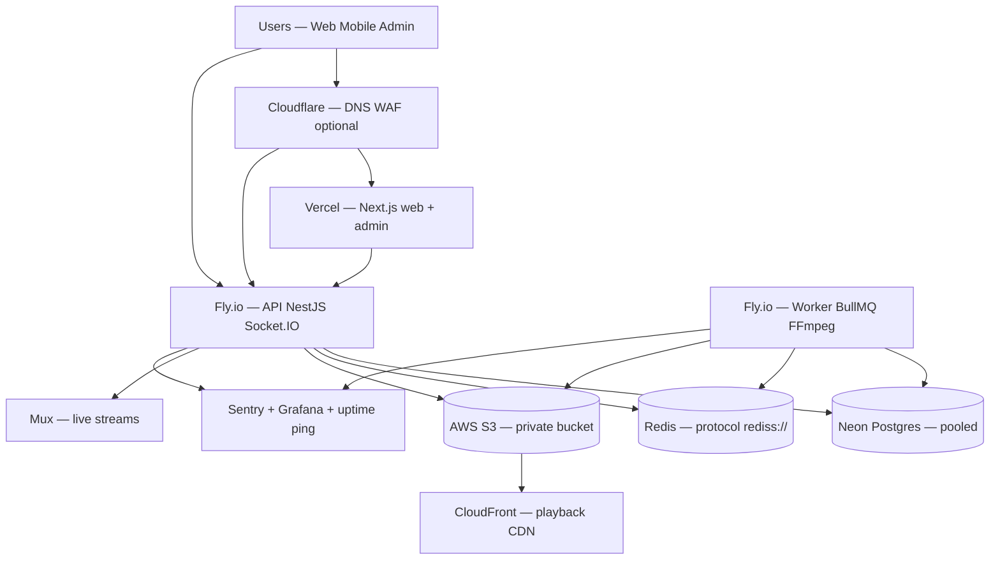

# FORGE — Production infrastructure guide

**Audience:** Founders, lead engineers, and DevOps planning a stable, scalable public production environment.  
**Goal:** Choose the right providers, upgrade from MVP free tiers, and operate FORGE without unnecessary stack rewrites.

**How this doc relates to others:**

| Document | Use when |
|----------|----------|
| **This guide** | Strategy, provider choices, phased roadmap, cost planning |
| [PRODUCTION_UPGRADE_CHECKLIST.md](./PRODUCTION_UPGRADE_CHECKLIST.md) | Hands-on commands per phase (Redis, Neon, Fly secrets, verify) |
| [MVP_GO_LIVE.md](./MVP_GO_LIVE.md) | First-time deploy from zero |
| [AWS_MUX_SETUP.md](./AWS_MUX_SETUP.md) | S3, CloudFront, Mux secrets |
| [CI_CD.md](./CI_CD.md) | GitHub Actions, release workflow |
| [OBSERVABILITY.md](./OBSERVABILITY.md) | Sentry, metrics, Grafana |
| [phase4-platform-evaluation.md](./phase4-platform-evaluation.md) | When to add search, Kafka, K8s |

**Live production reference (2026):**

| Resource | Name / URL |
|----------|------------|
| API (Fly) | `forge-studios-api` → `https://api.forgestudios.net/api/v1` |
| Worker (Fly) | `forge-studios-worker` |
| Web (Vercel) | `https://forgestudios.net` |
| Admin (Vercel) | `https://admin.forgestudios.net` |
| Primary region | Fly `bom` (Mumbai), AWS `ap-south-1`, Neon/Redis near South Asia |

---

## Executive summary

FORGE already uses a **production-shaped architecture** suitable for a skill-first creator platform:

- **Fly.io** — NestJS API + separate FFmpeg/BullMQ worker  
- **Vercel** — Next.js web and admin  
- **Neon** — Serverless Postgres  
- **Redis** — BullMQ, feed cache, Socket.IO adapter  
- **AWS S3 + CloudFront** — VOD storage and delivery  
- **Mux** — Live streaming  

You do **not** need to replatform to Kubernetes, AWS ECS, or microservices to be “production ready.” The highest return is:

1. **Upgrade paid tiers** (especially Redis and Neon).  
2. **Fix Fly production settings** (no cold starts on API).  
3. **Harden video pipeline** (private S3, CloudFront, worker scale).  
4. **Add observability and staging** before chasing new vendors.

**Estimated monthly cost (early production, light–moderate traffic):** ~$100–250 excluding heavy video egress. Video storage and CDN dominate as creators upload more content.

---

## Target architecture



---

## Layer-by-layer recommendations

### 1. Compute — API and worker (Fly.io)

| Component | Recommendation | Why |
|-----------|----------------|-----|
| **API** | Keep `forge-studios-api` on Fly `bom` | Matches NestJS + Socket.IO; CI already deploys via GitHub Actions |
| **Worker** | Keep `forge-studios-worker` separate | FFmpeg is CPU/RAM heavy; scale workers independently of API |
| **VM size** | Start **2GB RAM, 2 shared CPUs** each | Worker needs memory for transcoding |
| **API machines** | `min_machines_running = 1`, **`auto_stop_machines = false`** in prod | Avoid ~5s cold starts on free/stop behavior |
| **Scale order** | Worker replicas first → then 2nd API machine | Queue backlog before horizontal API |

**Do not migrate yet to:** Railway, Render, ECS, or Kubernetes unless you have a dedicated platform team or hard multi-service requirements.

**When to reconsider Fly:** Multi-region active-active API, strict VPC compliance, or FFmpeg moved entirely to AWS MediaConvert / Mux VOD.

---

### 2. Database — Postgres (Neon)

| Setting | Production value |
|---------|------------------|
| **Provider** | [Neon](https://console.neon.tech) — **keep** |
| **Plan** | **Launch** or **Scale** (paid; avoid hobby suspend limits) |
| **Connection** | **Pooled** hostname (`-pooler` in URL) |
| **SSL** | `?sslmode=require` on `DATABASE_URL` |
| **Region** | `ap-south-1` or `ap-southeast-1` (align with Fly `bom`) |
| **Backups** | Point-in-time recovery (PITR) on Scale |
| **Pool sizing** | `DB_POOL_MAX=8–10` per API machine; stay under Neon connection limits |

**Alternatives (defer):**

| Alternative | When | Note |
|-------------|------|------|
| Supabase Postgres | You want bundled Auth/Realtime | FORGE has custom JWT auth — little benefit |
| AWS RDS | API + worker in AWS VPC | Higher ops; pair with ElastiCache |
| PlanetScale | — | MySQL; full migration — **not recommended** |

---

### 3. Redis — cache, queues, Socket.IO (highest priority)

FORGE requires **Redis protocol** (`redis://` or `rediss://`), not REST-only. Code: `apps/api/src/config/resolve-redis-url.ts`.

| Provider | Best for | Rough cost |
|----------|----------|------------|
| **Redis Cloud Essentials** | Production (250MB+); `ap-south-1` near Fly `bom` | ~$10–50/mo |
| **AWS ElastiCache** | API moved to AWS VPC | Later, at larger scale |

**Production rule:** Use **`REDIS_URL` only** (Redis protocol). Upstash REST vars are not supported.

Set `REDIS_URL` on **both** `forge-studios-api` and `forge-studios-worker` (`npm run sync:fly:worker-secrets`).

See also: [REDIS.md](./REDIS.md).

---

### 4. Object storage and CDN — video (largest variable cost)

| Component | Recommendation |
|-----------|----------------|
| **Storage** | AWS S3 private bucket (`ap-south-1`) |
| **Delivery** | CloudFront (`CLOUDFRONT_DOMAIN` on API + worker) |
| **Upload** | Presigned PUT + multipart; API fallback if CORS fails |
| **IAM** | Least privilege (`PutObject`, `GetObject`, `DeleteObject` on prefix) |
| **Lifecycle** | Optional: delete raw uploads after successful transcode |

**Alternatives when egress cost grows:**

| Option | Pros | Cons |
|--------|------|------|
| **Cloudflare R2** | Lower egress with Cloudflare CDN | Migration + code/config changes |
| **Bunny Storage + CDN** | Video-focused pricing | Another vendor |
| **Mux Video (VOD)** | Managed transcode + delivery | Per-minute cost; less DIY control |

**Keep S3 + CloudFront** until video egress is a measured line item (often $500+/mo), then evaluate R2 or managed VOD.

Details: [AWS_MUX_SETUP.md](./AWS_MUX_SETUP.md) · [VIDEO_UPLOAD.md](./VIDEO_UPLOAD.md).

---

### 5. Video processing — worker / FFmpeg

| Stage | Approach |
|-------|----------|
| **Now** | Fly worker + BullMQ + FFmpeg (current) |
| **Scale step 1** | `fly scale count 2 -a forge-studios-worker` |
| **Scale step 2** | Larger VM only if OOM in worker logs |
| **Later** | Mux Video or AWS MediaConvert when queue latency or ops burden wins |

**Live streaming:** Keep **Mux** — already integrated.

Verify: `npm run verify:video-pipeline:prod`

---

### 6. Frontend — web and admin (Vercel)

| Item | Recommendation |
|------|----------------|
| **Hosting** | **Keep Vercel** for `apps/web` and `apps/admin` |
| **Plan** | **Pro** for commercial use, team, bandwidth |
| **Env (production)** | See table in Step 4 below |
| **Deploy** | Merge to `main` → CI → Release workflow ([CI_CD.md](./CI_CD.md)) |

**Alternative:** Cloudflare Pages — only if standardizing on Cloudflare for R2 + WAF; moderate migration effort.

---

### 7. Edge, security, and abuse protection

| Item | Action |
|------|--------|
| **Cloudflare** (optional) | Proxy `api.forgestudios.net` — WAF, rate limits, DDoS |
| **CORS** | Exact `WEB_URL` / `ADMIN_URL` on Fly (no trailing slash) |
| **Secrets** | Rotate `JWT_*`, Neon password, Mux webhook on a schedule |
| **Git** | Never push directly to `main` — one PR = one production deploy |
| **Branch protection** | Require CI on `main` |

Domain setup: [DOMAIN_FORGESTUDIOS.md](./DOMAIN_FORGESTUDIOS.md).

---

### 8. Observability and on-call

| Tool | Purpose |
|------|---------|
| **Sentry** | API + web errors and performance |
| **Grafana / metrics** | `METRICS_ENABLED`, scrape token, dashboard `forge-api` |
| **External uptime** | Ping `GET /api/v1/health` every 1–5 min |
| **Fly logs** | `fly logs -a forge-studios-api` / worker |

Details: [OBSERVABILITY.md](./OBSERVABILITY.md).

---

### 9. Search and discovery (defer)

| Stage | Approach |
|-------|----------|
| **Now** | Postgres full-text search |
| **Later** | Meilisearch or Typesense when p95 > ~200ms or advanced facets needed |
| **Avoid for now** | Elasticsearch, OpenSearch, Kafka |

Criteria: [phase4-platform-evaluation.md](./phase4-platform-evaluation.md).

---

### 10. Email, payments, mobile

| Need | Suggestion |
|------|------------|
| Transactional email | Resend, Postmark, or AWS SES (`ap-south-1`) |
| Payments (future) | Stripe |
| Mobile | Same API URL; EAS/Flutter release pipeline as today |

---

### 11. Staging environment (recommended before major features)

| Layer | Staging |
|-------|---------|
| Fly API | `forge-studios-api-staging` (copy `fly.toml`, new app name) |
| Fly worker | `forge-studios-worker-staging` |
| Neon | **Branch** `staging` from production project |
| Redis | **Separate** database — never share prod Redis |
| Vercel | Preview deployments or `staging.forgestudios.net` |

Workflow: PR → CI → deploy staging → smoke → merge `main` → single production release.

---

## What not to change (yet)

| Change | Why defer |
|--------|-----------|
| Split NestJS into microservices | Monolith + worker is simpler to operate |
| Kubernetes / EKS | High ops cost; no benefit at current scale |
| Kafka | BullMQ + Redis queues are sufficient |
| Full AWS migration (ECS + RDS) | Only when team is AWS-native and scale demands VPC |
| PlanetScale / DB engine change | Postgres + Neon fits the codebase |

---

## Cost planner (monthly, order of magnitude)

| Service | Early production | Notes |
|---------|------------------|-------|
| Fly API + worker | $30–80 | 2× ~2GB machines |
| Neon Scale | $19–69+ | Storage + compute autoscale |
| Redis Cloud | $10–50 | Essentials 250MB+ |
| Vercel | $0–20 | Pro if commercial |
| AWS S3 + CloudFront | $20–500+ | **Dominates** with video traffic |
| Mux | Usage-based | Live streams |
| Sentry | $0–26 | Team tier later |
| Cloudflare | $0–20 | Free plan often enough initially |

---

## Step-by-step implementation roadmap

Work in order. For copy-paste commands and per-phase verification, use [PRODUCTION_UPGRADE_CHECKLIST.md](./PRODUCTION_UPGRADE_CHECKLIST.md) in parallel.

**Estimated effort:** 4–8 hours for Phases 0–9 (excluding DNS propagation).

---

### Step 0 — Baseline (no new spend)

**Goal:** Confirm production is reachable before upgrades.

- [ ] `fly auth whoami`
- [ ] `fly status -a forge-studios-api` — healthy machine(s)
- [ ] `fly status -a forge-studios-worker` — worker running
- [ ] Run smoke:

```bash
npm run smoke:api:prod
npm run check:production
```

- [ ] Confirm CORS URLs:

```bash
fly secrets list -a forge-studios-api | grep -E 'WEB_URL|ADMIN_URL'
```

Expected: `WEB_URL=https://forgestudios.net`, `ADMIN_URL=https://admin.forgestudios.net` (no trailing slash).

**Checkpoint:** Health returns 200; you know current failure modes (Redis quota, cold starts, etc.).

---

### Step 1 — Redis (do first)

**Goal:** Remove command limits; restore BullMQ, feed cache, Socket.IO adapter.

**Choose one:**

| Path | Action |
|------|--------|
| **Redis Cloud** | Console → Connect → copy URL (`redis://` or `rediss://` exactly as shown) |

**Apply secrets:**

```bash
fly secrets set \
  REDIS_URL='rediss://...' \
  --app forge-studios-api

npm run sync:fly:worker-secrets
```

**Verify:**

```bash
curl -sS 'https://api.forgestudios.net/api/v1/health' | jq .
# Expect: redis: ok, videoQueue: ok (when worker up)
```

**Checkpoint:** No `max requests limit exceeded` in logs; feed and queues stable.

→ Full detail: [PRODUCTION_UPGRADE_CHECKLIST.md § Phase 1](./PRODUCTION_UPGRADE_CHECKLIST.md#phase-1--redis-highest-priority)

---

### Step 2 — Neon Postgres

**Goal:** Paid compute, pooling, backups.

- [ ] Upgrade to **Launch** or **Scale**
- [ ] Use **pooled** connection string + `?sslmode=require`
- [ ] Region: **ap-south-1** or **ap-southeast-1**
- [ ] Enable PITR (Scale)

```bash
fly secrets set \
  DATABASE_URL='postgresql://...@ep-xxxx-pooler....neon.tech/neondb?sslmode=require' \
  DB_POOL_MAX='10' \
  --app forge-studios-api

npm run sync:fly:worker-secrets
```

**Verify:**

```bash
curl -sS 'https://api.forgestudios.net/api/v1/health' | jq '.checks.database'
```

**Checkpoint:** DB `ok`; migrations run only from intentional deploys (`npm run db:neon:setup` when needed).

→ [PRODUCTION_UPGRADE_CHECKLIST.md § Phase 2](./PRODUCTION_UPGRADE_CHECKLIST.md#phase-2--neon-postgres)

---

### Step 3 — Fly compute (API + worker)

**Goal:** No API cold starts; capacity for video queue.

**3a — API always warm**

Edit `fly.toml`:

```toml
[http_service]
  auto_stop_machines = false
  min_machines_running = 1
```

Redeploy via your normal branch/PR process (do not push directly to `main` unless emergency).

**3b — Scale worker if queue backs up**

```bash
fly scale count 2 -a forge-studios-worker
```

**3c — Second API machine (only after Redis stable)**

```bash
fly scale count 2 -a forge-studios-api
```

Confirm logs: no `Socket.IO Redis adapter failed`.

**Checkpoint:** Upload → transcode → playback works under load; health `videoQueue` healthy.

→ [PRODUCTION_UPGRADE_CHECKLIST.md § Phase 3](./PRODUCTION_UPGRADE_CHECKLIST.md#phase-3--flyio-compute-api--worker)

---

### Step 4 — Vercel (web + admin)

**Goal:** Correct production env and optional Pro plan.

| Variable | Production value |
|----------|------------------|
| `NEXT_PUBLIC_API_URL` | `https://api.forgestudios.net/api/v1` |
| `API_INTERNAL_URL` | `https://api.forgestudios.net/api/v1` (web only) |
| `NEXT_PUBLIC_APP_URL` | `https://forgestudios.net` |
| `NEXT_PUBLIC_WEB_URL` | `https://forgestudios.net` |
| `NEXT_PUBLIC_ADMIN_URL` | `https://admin.forgestudios.net` (admin) |

- [ ] Redeploy both projects after env changes
- [ ] Upgrade to **Pro** if required for commercial/team use

**Checkpoint:** Login, feed, and upload flows work from production domains.

→ [DOMAIN_FORGESTUDIOS.md](./DOMAIN_FORGESTUDIOS.md)

---

### Step 5 — Complete Fly secrets (API + worker)

**Goal:** All required secrets set; worker synced with API.

**Core (API):** `DATABASE_URL`, `DB_POOL_MAX`, `REDIS_URL`, `JWT_SECRET`, `JWT_REFRESH_SECRET`, `NODE_ENV`, `WEB_URL`, `ADMIN_URL`

**Video:** `AWS_REGION`, `AWS_ACCESS_KEY_ID`, `AWS_SECRET_ACCESS_KEY`, `S3_BUCKET_NAME`, `CLOUDFRONT_DOMAIN`

**Live:** `MUX_TOKEN_ID`, `MUX_TOKEN_SECRET`, `MUX_WEBHOOK_SECRET`

**Observability:** `SENTRY_DSN`, `SENTRY_TRACES_SAMPLE_RATE`, `METRICS_ENABLED`, `METRICS_SCRAPE_TOKEN`

```bash
npm run sync:fly:worker-secrets
npm run deploy:fly:worker   # when worker image changed
```

**Verify video pipeline:**

```bash
npm run verify:video-pipeline:prod
```

→ [PRODUCTION_UPGRADE_CHECKLIST.md § Phase 4–5](./PRODUCTION_UPGRADE_CHECKLIST.md#phase-4--complete-fly-secrets-api)

---

### Step 6 — AWS S3 + CloudFront

**Goal:** Private bucket, CDN playback, correct CORS.

- [ ] S3 bucket **private** (block public access)
- [ ] CORS for `forgestudios.net`, `admin.forgestudios.net`, localhost
- [ ] CloudFront origin → S3; set `CLOUDFRONT_DOMAIN` (https, no trailing slash)
- [ ] Optional: versioning + lifecycle for raw uploads

```bash
./scripts/fix-s3-cors.sh   # if browser uploads fail
```

**Checkpoint:** Creator upload → worker transcode → HLS plays via CloudFront.

→ [AWS_MUX_SETUP.md](./AWS_MUX_SETUP.md)

---

### Step 7 — Security hardening

- [ ] Plan rotation window for `JWT_SECRET` / `JWT_REFRESH_SECRET` (invalidates sessions)
- [ ] Rotate Neon password if compromised; update `DATABASE_URL`
- [ ] Review `RATE_LIMIT_TTL` / `RATE_LIMIT_MAX` under load
- [ ] Optional: Cloudflare in front of API
- [ ] GitHub branch protection + CI required on `main`

---

### Step 8 — Observability and on-call

- [ ] Sentry projects for API and web
- [ ] External uptime on `/api/v1/health`
- [ ] Grafana dashboard + `npm run verify:grafana-metrics`
- [ ] Document who responds to alerts

```bash
fly secrets set METRICS_ENABLED=true METRICS_SCRAPE_TOKEN='...' --app forge-studios-api
```

→ [OBSERVABILITY.md](./OBSERVABILITY.md)

---

### Step 9 — Staging environment

- [ ] Create Fly staging apps (API + worker)
- [ ] Neon branch `staging`
- [ ] Separate Redis instance
- [ ] Vercel preview or staging subdomain
- [ ] PR workflow: staging smoke before merge to `main`

---

### Step 10 — CI/CD secrets (GitHub)

```bash
npm run gh:secrets
npm run gh:secrets:set
```

Required: `FLY_API_TOKEN`, `VERCEL_TOKEN`, `VERCEL_ORG_ID`, `VERCEL_PROJECT_ID_WEB`, `VERCEL_PROJECT_ID_ADMIN`

→ [CI_CD.md](./CI_CD.md)

---

### Step 11 — Final verification

```bash
npm run check:production
npm run verify:video-pipeline:prod
```

Manual QA: [mvp-test-matrix.md](./mvp-test-matrix.md) (guest, viewer, creator upload, admin).

---

## 30-day calendar (suggested)

| Week | Focus | Steps |
|------|-------|-------|
| **1** | Redis + Neon | Steps 1–2 |
| **2** | Fly + Vercel | Steps 3–4 |
| **3** | Secrets + AWS video | Steps 5–6 |
| **4** | Security + observability + staging | Steps 7–9 |

---

## Decision matrices

### Redis quick pick

| Situation | Choose |
|-----------|--------|
| Production Redis | **Redis Cloud** + `REDIS_URL` |
| Hit limits again / need more RAM | **Redis Cloud** Essentials in `ap-south-1` |
| All-in on AWS later | **ElastiCache** (when API is in AWS VPC) |

### When to replatform compute

| Signal | Action |
|--------|--------|
| FFmpeg queue p95 wait too high after 2+ workers | More workers → then MediaConvert or Mux VOD |
| Video egress > ~$500/mo and growing | Evaluate R2 or managed VOD CDN |
| Need multi-region active API | Fly multi-region + global Redis, or AWS |
| Enterprise requires single-cloud VPC | Plan AWS ECS + RDS + ElastiCache migration |

### Search quick pick

| Signal | Choose |
|--------|--------|
| Postgres FTS fast enough | **Keep Postgres** |
| Slow search or need typo tolerance | **Meilisearch** or **Typesense** |
| Complex analytics on search | **OpenSearch** (heavy ops) |

---

## Rollback reference

| Change | Rollback |
|--------|----------|
| Bad Fly deploy | `fly releases -a forge-studios-api` → deploy previous image |
| Bad secret | `fly secrets set` previous value; machines restart |
| Bad DB migration | Neon PITR → branch restore; fix migration; re-run |
| Bad Redis cutover | Revert `REDIS_URL`; `npm run sync:fly:worker-secrets` |

---

## Related scripts

| Command | Purpose |
|---------|---------|
| `npm run smoke:api:prod` | Production API smoke |
| `npm run check:production` | Smoke + metrics + Grafana |
| `npm run sync:fly:worker-secrets` | Copy secrets API → worker |
| `npm run verify:video-pipeline:prod` | End-to-end video checks |
| `npm run db:neon:setup` | Migrate + seed (use intentionally) |
| `npm run gh:secrets` | List required GitHub secrets |

---

## Deferred investments (metrics-driven)

Do **not** implement until observability proves need:

- Meilisearch / Elasticsearch  
- Kubernetes  
- Kafka  
- Vector DB / ML ranking  
- AWS MediaConvert (until FFmpeg queue is the bottleneck)  

See [phase4-platform-evaluation.md](./phase4-platform-evaluation.md).

---

*Last updated: 2026-05-29 — complements [PRODUCTION_UPGRADE_CHECKLIST.md](./PRODUCTION_UPGRADE_CHECKLIST.md) for live `forgestudios.net` production.*
