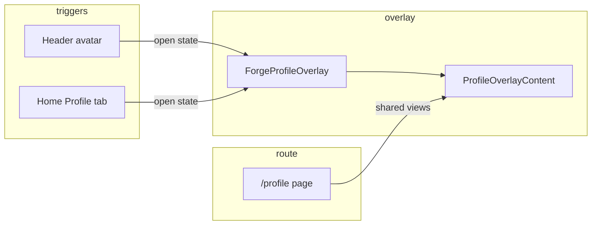

# Profile overlay refactor — architecture plan

Goal: home (and nav) profile opens a **modal overlay** (Settings-style), not route navigation. **Keep `/profile`** as a full-page fallback for bookmarks and refresh. Improve mobile UX and reduce initial JS on home.

---

## 1. Current state (inventory)

| Piece | Location | Role today |
|-------|----------|------------|
| Profile page | `apps/web/src/app/profile/page.tsx` | Full route; `ProfileHeader` + `ProfileMainContent` inline (~340 lines duplicate of overlay) |
| Settings overlay (reference) | `packages/design-system/src/lib/layouts/settings.tsx` → `SettingsOverlay` | Shell: backdrop, slide/scale panel, Esc, close btn, bottom chrome offset |
| Profile overlay (shell only) | `packages/design-system/src/profile/ProfileOverlay.tsx` | Same shell pattern; **hard-coded avatar letter "T"** in header; children slot for content |
| Nav trigger | `apps/web/src/components/Shell/AppHeader.tsx` | `<Link href="/profile">` + avatar; **always navigates** |
| Home bottom tab | `apps/web/src/components/home/HomePageClient.tsx` | `<Link href="/profile">` with `UserCircle`; mobile-only row |
| Data hook | `apps/web/src/hooks/useProfilePage.ts` | Auth gate, `useQuery(['me'])`, mutations, navigation helpers |
| Auth | `AuthProvider` + `ProfileUserButton` in design-system | Login popover path separate from profile overlay |
| Route gating | `AppShellGate.tsx` | `(home)` uses full chrome; `/profile` is full-width page, not in sidebar shell |

**Gap:** Two parallel UIs (`/profile` page vs nothing on web for overlay). Design-system `ProfileOverlay` is unused on web today. Header/home both route to `/profile`.

---

## 2. Target behavior

- **Click profile (header or home tab):** `preventDefault` / button

Read