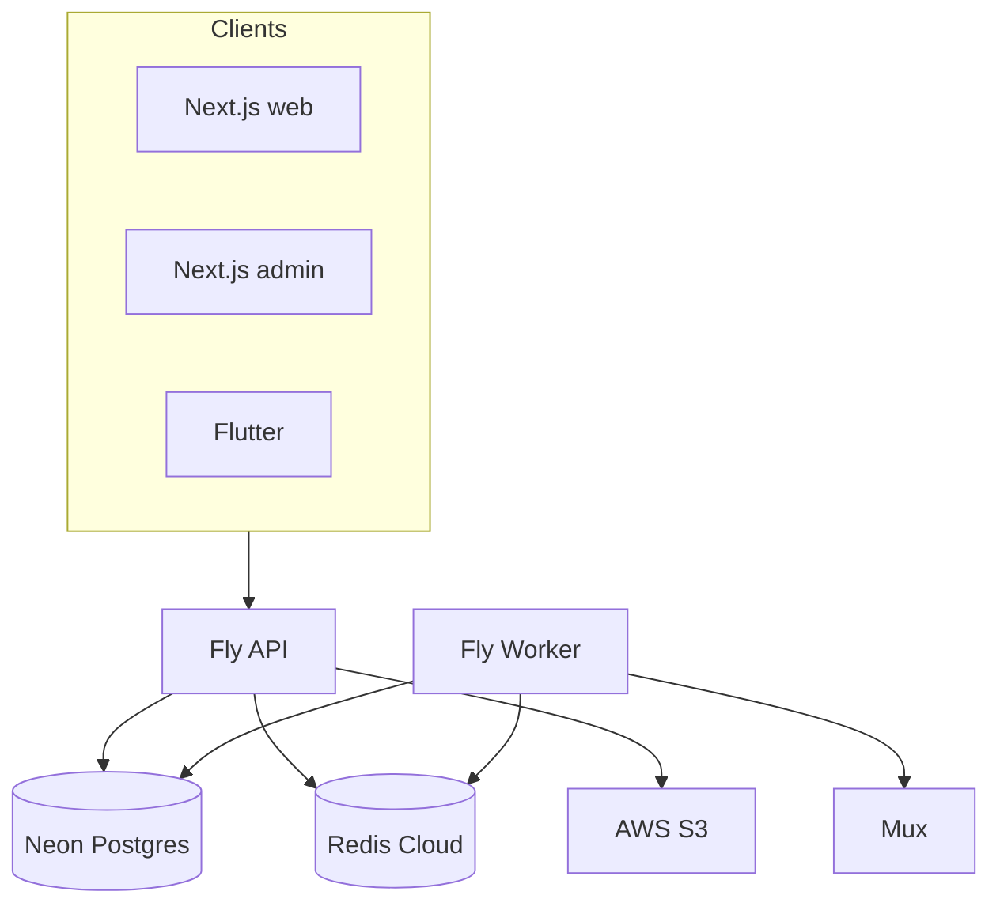

# Phase 2 — Architecture Scorecard

**Audit date:** 2026-06-04

---

## System pattern

**Modular monolith** (NestJS) + **dedicated worker process** (same repo) + **three clients** (web, admin, Flutter). Not microservices. Async work via BullMQ; realtime via Socket.IO with Redis adapter.

---

## Scorecard (1–10)

| Dimension | Score | Rationale |
|-----------|-------|-----------|
| **Scalability** | 6 | Redis adapter + queues + worker split are solid; JWT DB hit per request and live-list N+1 cap horizontal scale; Fly scale-to-zero adds latency |
| **Maintainability** | 8 | Feature modules, `@forge/shared-types`, single API version; docs in FORGE_PROJECT_MASTER |
| **Reliability** | 6 | `/health/ready` checks DB/Redis/queues; no DR runbook; worker has no HTTP health in release smoke |
| **Security** | 7 | Layered guards, prod config validation, refresh rotation; CSRF gap for cookie auth |
| **Extensibility** | 8 | Feature flags, `PaymentProvider` interface, entitlements layer |
| **Developer Experience** | 8 | docker-compose, `ci-local`, Swagger (dev), path-filtered CI |

**Overall architecture:** Production-viable MVP monolith with clear scale-up path; cost/scale debt concentrated in auth hot path and media COGS.

---

## Bottlenecks

| Issue | Type | Evidence |
|-------|------|----------|
| Per-request user DB lookup | Performance / scale | `jwt.strategy.ts` `validate()` → `userRepository.findOne` |
| Live streams entitlement N+1 | Performance / scale | `streaming.service.ts` `getLiveStreams()` — `checkAccess` per stream |
| Entitlements in hot paths | Coupling | Feed, streaming, communities, video playback all call `EntitlementsService` |
| Fly cold start | Latency / UX | `fly.toml` `min_machines_running = 0` |
| Analytics table growth | Storage / cost | `analytics-event.entity.ts` — async ingest but retention not documented |

---

## Architecture strengths

- **Separation of concerns:** HTTP vs worker (`WORKER_ONLY`) prevents blocking API on transcode/FCM.
- **Single contract package:** `@forge/shared-types` reduces client drift.
- **Env-gated VOD paths:** Mux (prod) vs FFmpeg (local) — mutually exclusive in `workers.module.ts`.
- **Global guard pipeline:** JWT → roles → consumer-only → permissions → throttle → email verified.

---

## Anti-patterns avoided

- Running FFmpeg transcode in production (blocked by `validate-production-config.ts`).
- Client-supplied `userId` on sockets (JWT in handshake per `events.gateway.ts`).
- `synchronize: true` on TypeORM (migrations only).

---

## Missing patterns (gaps)

| Pattern | Status | Recommendation |
|---------|--------|----------------|
| Staging environment | Missing | Fly/Vercel preview or dedicated staging Neon branch |
| CQRS / read models | Partial (Redis caches) | Entitlement bitmap cache at scale |
| Event sourcing | No | Not required at MVP; analytics queue sufficient |
| API versioning policy | Single `v1` | Document deprecation process before breaking changes |
| Disaster recovery | Undocumented | Neon PITR + S3 lifecycle runbook |

---

## Findings

### F-201: Tight coupling — entitlements

| Field | Value |
|-------|-------|
| **Severity** | Medium |
| **Evidence** | `EntitlementsService.checkAccess` invoked from streaming, content, communities |
| **Recommendation** | Batch access checks; short-TTL Redis cache keyed `viewerId:creatorId` |
| **Expected impact** | Lower DB/Redis churn at 100K+ MAU; fewer duplicate tier lookups |

### F-202: Dual VOD path (intentional)

| Field | Value |
|-------|-------|
| **Severity** | Info |
| **Evidence** | `VIDEO_TRANSCODE_PROVIDER`; prod must be `mux` |
| **Recommendation** | Keep; ensure CI asserts prod config |
| **Expected impact** | Avoids duplicate Mux + FFmpeg spend in prod |

### F-203: Monolith blast radius at 10M

| Field | Value |
|-------|-------|
| **Severity** | Low (future) |
| **Evidence** | Single Nest deployable for all domains |
| **Recommendation** | See [13_SCALABILITY_ROADMAP.md](./13_SCALABILITY_ROADMAP.md) — extract search/billing when needed |
| **Expected impact** | Long-term team velocity and fault isolation |
