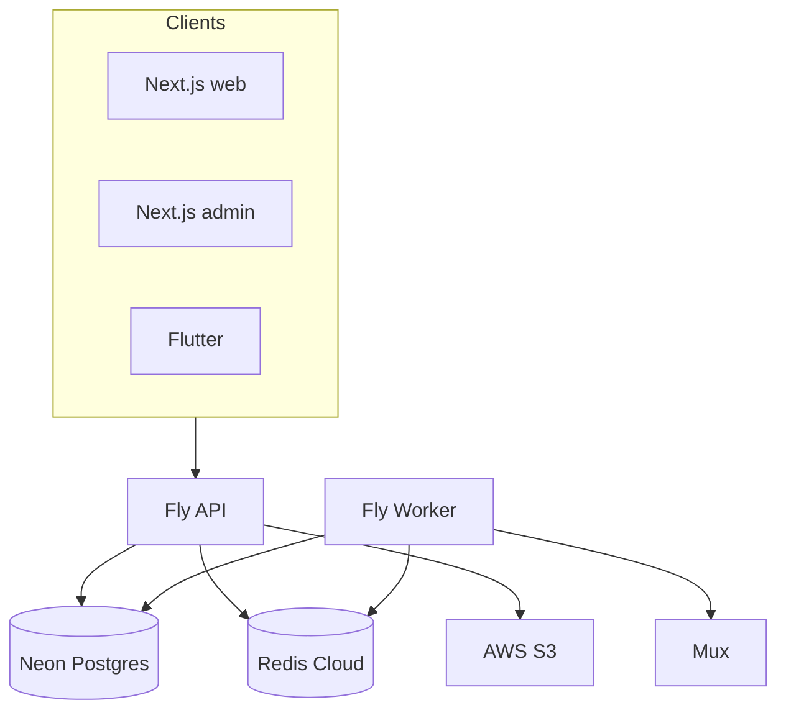

# Phase 2 — Architecture Scorecard

**Audit date:** 2026-06-04 · **Reconciled:** 2026-06-05 (Wave 5 closure)

---

## System pattern

**Modular monolith** (NestJS) + **dedicated worker process** (same repo) + **three clients** (web, admin, Flutter). Not microservices. Async work via BullMQ; realtime via Socket.IO with Redis adapter.

---

## Scorecard (1–10)

| Dimension | Score | Rationale |
|-----------|-------|-----------|
| **Scalability** | 7 | JWT cache, batch entitlements, access/tier Redis caches; Fly `min_machines_running = 1` |
| **Maintainability** | 8 | Feature modules, `@forge/shared-types`, single API version; docs in FORGE_PROJECT_MASTER |
| **Reliability** | 7 | `/health/ready`; DR runbook; staging bootstrap; BullMQ metrics |
| **Security** | 8 | CSRF on refresh; layered guards; CodeQL; coverage gate |
| **Extensibility** | 8 | Feature flags, `PaymentProvider` interface, entitlements layer |
| **Developer Experience** | 8 | docker-compose, `ci-local`, Swagger (dev), path-filtered CI + staging workflow |

**Overall architecture:** Production-viable monolith through ~100K MAU with documented scale path in Phase 13.

---

## Bottlenecks (resolved vs open)

| Issue | Type | Status |
|-------|------|--------|
| Per-request user DB lookup | Performance | **Resolved** F-501 — `auth-user-cache.service.ts` |
| Live streams entitlement N+1 | Performance | **Resolved** F-502 — `checkAccessMany` |
| Community channel N+1 | Performance | **Resolved** F-503 — `checkChannelAccessMany` |
| Entitlements in hot paths | Coupling | **Mitigated** F-1301, F-505 — Redis caches |
| Fly cold start | Latency | **Resolved** F-1002 — `min_machines_running = 1` |
| Analytics table growth | Storage | **Resolved** F-504 — `analytics-retention` worker |

---

## Architecture strengths

- **Separation of concerns:** HTTP vs worker (`WORKER_ONLY`) prevents blocking API on transcode/FCM.
- **Single contract package:** `@forge/shared-types` reduces client drift.
- **Env-gated VOD paths:** Mux (prod) vs FFmpeg (local) — mutually exclusive in `workers.module.ts`.
- **Global guard pipeline:** JWT → roles → consumer-only → permissions → throttle → email verified.

---

## Missing patterns (updated)

| Pattern | Status | Notes |
|---------|--------|-------|
| Staging environment | **Resolved** F-902 | [STAGING.md](../operations/STAGING.md), `deploy-staging.yml` |
| CQRS / read models | Partial | Redis caches + batch access checks |
| API versioning policy | **Resolved** F-601 | `API_SCHEMAS.md` |
| Disaster recovery | **Resolved** F-901 | [DISASTER_RECOVERY.md](../operations/DISASTER_RECOVERY.md); drill cadence in [DEFERRED_BACKLOG.md](./DEFERRED_BACKLOG.md) |

---

## Findings

### F-201: Tight coupling — entitlements — **Mitigated (Waves 1–4)**

| Field | Value |
|-------|-------|
| **Resolution** | `checkAccessMany`, `checkChannelAccessMany`, `ent:access` + tier caches |
| **Evidence** | `entitlements.service.ts`, `streaming.service.ts`, `communities.service.ts` |

### F-202: Dual VOD path (intentional)

| Field | Value |
|-------|-------|
| **Severity** | Info |
| **Evidence** | `VIDEO_TRANSCODE_PROVIDER`; prod must be `mux` |
| **Recommendation** | Keep; CI asserts prod config |

### F-203: Monolith blast radius at 10M

| Field | Value |
|-------|-------|
| **Severity** | Low (future) |
| **Recommendation** | See [13_SCALABILITY_ROADMAP.md](./13_SCALABILITY_ROADMAP.md) |
