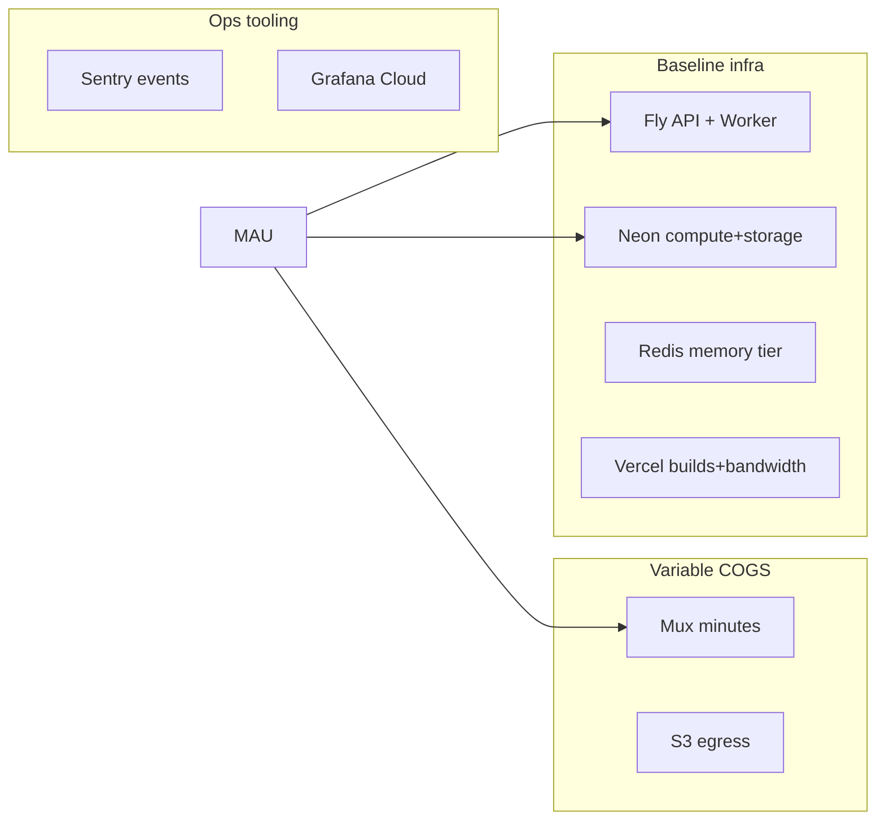

# Phase 10 — Cost Optimization Plan

**Audit date:** 2026-06-04  
**Primary audit lens**  
**Note:** Estimates are qualitative ranges — validate against Mux, Fly, Neon, Redis Cloud, AWS, Vercel invoices.

---

## Cost stack (typical production)

**Largest variable cost at scale:** Mux (transcode + delivery) → then Neon storage (analytics) → Redis tier → Fly compute.

---

## Optimization table

| Service | Current driver | Optimization | Est. savings | Risk |
|---------|----------------|--------------|--------------|------|
| **Mux** | VOD minutes stored, delivered; live hours | Idempotent webhooks; delete errored assets; tier archival policy; avoid duplicate ingest | **High (20–40% media)** if waste exists | Broken playback if assets deleted early |
| **Fly API** | 2GB × hours; scale-to-zero | Set `min_machines_running=1` only if SLO requires; else accept cold start | **Low–medium** (trade latency for $) | UX vs bill |
| **Fly Worker** | Always-on 2GB for queues | Right-size VM; scale count on queue depth only | **Medium** if over-provisioned | Transcode backlog |
| **Neon** | Storage + compute; connection churn | JWT cache (F-501) reduces QPS; analytics retention (F-504); right-size pool | **Medium** at 100K+ | Stale cache if wrong |
| **Redis** | Memory for cache + BullMQ + sockets | TTL audit; connection limits; avoid duplicate large payloads in cache | **Medium** | Cache miss latency |
| **S3** | Storage + egress | Lifecycle for abandoned multipart; CDN only if egress high | **Low–medium** | — |
| **Vercel** | 2 projects, builds, bandwidth | Merge admin into web app (long-term) | **Low** unless high build churn | Admin isolation |
| **Firebase FCM** | Push volume | Batch notifications; disable for inactive devices | **Low** until high MAU | — |
| **Sentry** | Event volume | Sample rate 10–20%; disable default PII | **Low–medium** | Miss rare bugs |
| **OTel** | Trace storage | Sampling 1–5% or off until collector ready | **Low** | — |
| **FFmpeg in prod** | CPU if misconfigured | Enforced `VIDEO_TRANSCODE_PROVIDER=mux` | **Critical avoid** | Duplicate Mux + compute |

---

## Cost leaks to eliminate

| Leak | Severity | Action |
|------|----------|--------|
| FFmpeg worker in production | Critical | CI assert prod config; Fly secret audit |
| Duplicate Mux ingest on webhook retry | High | Idempotency keys on `mux-vod-ingest` jobs |
| Analytics table unbounded | Medium | Monthly partition + archive |
| Fly cold start retries | Medium | Client retry storms → multiplied Mux/API calls |
| Unused `express-rate-limit` dep | Low | Remove package (F-301) |

---

## Scenario modeling (qualitative)

| MAU | Dominant cost | First action |
|-----|---------------|--------------|
| &lt;10K | Fly + Neon baseline | Keep scale-to-zero; monitor Mux trial usage |
| 10K–100K | Mux delivery + Neon reads | F-501 JWT cache; F-502 batch entitlements |
| 100K–1M | Mux + Redis memory tier | CDN review; analytics archive; worker autoscale |
| 1M+ | Mux + multi-service ops | Dedicated search; read replicas; signed URL edge |

---

## Findings

### F-1001: Mux cost controls undocumented

| Field | Value |
|-------|-------|
| **Severity** | High |
| **Evidence** | `docs/MEDIA.md` — technical flow, no finance ops |
| **Recommendation** | Runbook: monthly Mux dashboard review, asset cleanup cron, alert on minutes spike |
| **Expected impact** | Primary COGS control |

### F-1002: Fly scale-to-zero vs SLO

| Field | Value |
|-------|-------|
| **Severity** | High |
| **Evidence** | `fly.toml:18-20` |
| **Recommendation** | Measure cold-start p95; if &gt;2s, set `min_machines_running=1` |
| **Expected impact** | Predictable UX; +~$15–40/mo per machine (order of magnitude, region-dependent) |

### F-1003: Neon storage from analytics

| Field | Value |
|-------|-------|
| **Severity** | Medium |
| **Evidence** | `analytics-event.entity.ts` |
| **Recommendation** | 90-day retention + aggregate rollups for studio |
| **Expected impact** | Storage growth linear → sublinear |

---

## Estimated savings summary (if recommendations implemented)

| Category | Potential |
|----------|-----------|
| Media (Mux hygiene) | High |
| Database (JWT cache + analytics retention) | Medium |
| Compute (Fly right-sizing) | Low–medium |
| SaaS (Sentry sample) | Low |
| **Total** | **Medium overall** at MVP scale; **High** at 100K+ without JWT/analytics fixes |
