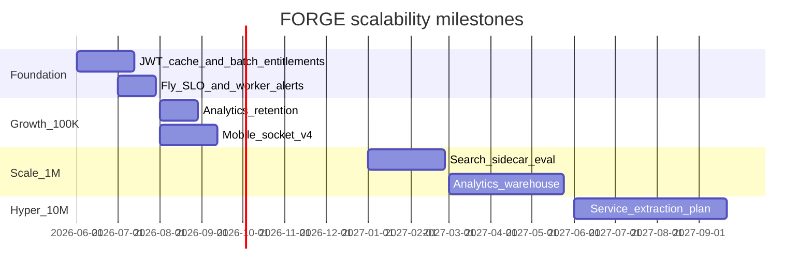

# Phase 13 — Scalability Roadmap

**Audit date:** 2026-06-04  
**Primary lens:** Cost + scale  
**Assumptions:** Modular monolith retained until 1M MAU unless noted.

---

## Growth model

| Tier | Approx. MAU | DAU % | Stress vector |
|------|-------------|-------|---------------|
| Seed | 10K | 20% | Cold start, JWT DB |
| Growth | 100K | 25% | Mux bill, Redis memory, feed DB |
| Scale | 1M | 30% | Socket fanout, analytics writes, search |
| Hyper | 10M | 35% | Monolith blast radius, multi-region |

---

## 10K users — breaking points

| Component | Breaks | Symptom | Mitigation |
|-----------|--------|---------|------------|
| Fly API | Cold start | First API call 2–10s | `min_machines_running=1` or keep-alive ping |
| JWT validate | 1 DB read/request | Neon connection pressure | Redis user snapshot cache (F-501) |
| Single Fly region (BOM) | Latency | Slow for distant users | CDN for static; accept or add region later |

**Architecture upgrade:** None required — configuration + caching.

---

## 100K users — breaking points

| Component | Breaks | Symptom | Mitigation |
|-----------|--------|---------|------------|
| Mux | Delivery minutes | Invoice spike | Asset lifecycle; entitlement batching |
| Neon | Read QPS | Slow feeds | Read replica or cache warming; JWT cache |
| Redis | Memory | Eviction / OOM | Tier upgrade; TTL audit; smaller cache payloads |
| Live list endpoint | N× checkAccess | p95 &gt;500ms | Batch entitlements (F-502) |
| Worker | Queue backlog | Stuck `processing` videos | Horizontal worker machines |

**Architecture upgrade:** Optional Neon read replica; Grafana queue alerts (F-903).

---

## 1M users — breaking points

| Component | Breaks | Symptom | Mitigation |
|-----------|--------|---------|------------|
| Postgres FTS | Query time | Search timeout | Meilisearch/Elastic sidecar |
| `analytics_events` | Table size | Slow inserts/queries | Partition + archive (F-504) |
| Socket.IO | Connection count | Redis adapter CPU | Dedicated socket nodes or managed realtime |
| BullMQ analytics | Write rate | Lag | Batch insert worker; sample events |
| Admin queries | Unbounded lists | OOM | Strict pagination (F-602) |

**Architecture upgrades:**
- Extract **analytics pipeline** to dedicated consumer + warehouse (ClickHouse/BigQuery)
- **Search service** read-only
- Keep core API monolith

---

## 10M users — breaking points

| Component | Breaks | Symptom | Mitigation |
|-----------|--------|---------|------------|
| Monolith deploy | Blast radius | Full outage on bad deploy | Split billing, search, workers; blue/green |
| Single region | DR | Regional outage | Multi-region Fly + Neon global |
| Mux | Global delivery | Cost + latency | Multi-CDN strategy; signed URLs at edge |
| Entitlements | Hot path | DB meltdown | Materialized entitlement cache per viewer |

**Architecture upgrades:**
- Service extraction: **billing**, **search**, **notifications**
- Event bus (Kafka/NATS) for analytics and fanout
- Multi-region active-passive minimum

---

## Roadmap timeline

---

## Existing scale-ready patterns (keep)

| Pattern | Location |
|---------|----------|
| BullMQ async analytics | `analytics-ingest` queue |
| Redis view count buffer | `videos.service.ts` |
| Feed partial index + cache | migrations + `feed.service.ts` |
| Worker split from API | `WORKER_ONLY`, `fly.worker.toml` |
| Socket Redis adapter | `events.gateway.ts` |
| Prod Mux-only transcode | `validate-production-config.ts` |

---

## Findings

### F-1301: Entitlement Redis cache layer — **Resolved (Waves 1 & 4)**

| Field | Value |
|-------|-------|
| **Severity** | High |
| **Evidence** | Hot-path DB reads on auth + entitlements |
| **Resolution** | JWT user cache (F-501); subscription cache; tier cache `ent:tier:*` (F-505); viewer access `ent:access:*` (60s) |
| **Expected impact** | Delays Neon tier jump; stable entitlement p95 |

### F-1302: 1M requires search extraction plan

| Field | Value |
|-------|-------|
| **Severity** | Medium (future) |
| **Evidence** | Postgres FTS only |
| **Recommendation** | Load test search at 500K videos |
| **Expected impact** | Avoid emergency migration |
