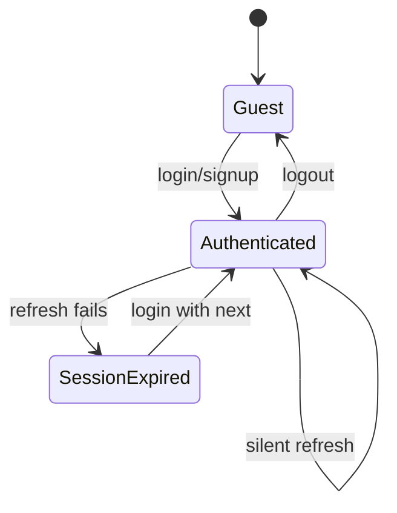

# Session Management Report

## Lifecycle

## Storage (after hardening)

| Token | Web | Admin | Mobile | API |
|-------|-----|-------|--------|-----|
| Access JWT | memory + sessionStorage + cookie mirror for MW | localStorage + cookie | SecureStorage | — |
| Refresh | HttpOnly `forge_refresh` cookie | localStorage + cookie | SecureStorage | DB hash |

## Refresh rotation

- Old refresh row revoked on each refresh.
- **Reuse detection:** revoked token reused → all user sessions revoked.

## Multi-tab

- Web: `storage` events + `forge:auth-session-changed` custom event.

## Multi-device

- API: `GET /auth/sessions`, `DELETE /auth/sessions/:id`.
- Web logout: revokes **current device** by default; “Sign out on all devices” on settings uses `allDevices: true`.

## Known issues (addressed)

| Issue | Fix |
|-------|-----|
| Stale cookie passes middleware | MW checks `isJwtExpired` |
| Double-encoded `next` | Raw path in query; encode once at login link |
| Cookie vs LS race | `syncAuthCookieFromStorage` on API requests |
| Refresh in XSS-readable storage | HttpOnly cookie for refresh on web |

## Remaining risks

- Access token still in localStorage (XSS) — migrate to memory-only in a follow-up.
- Impersonation token in URL — prefer POST body from admin (P2).
