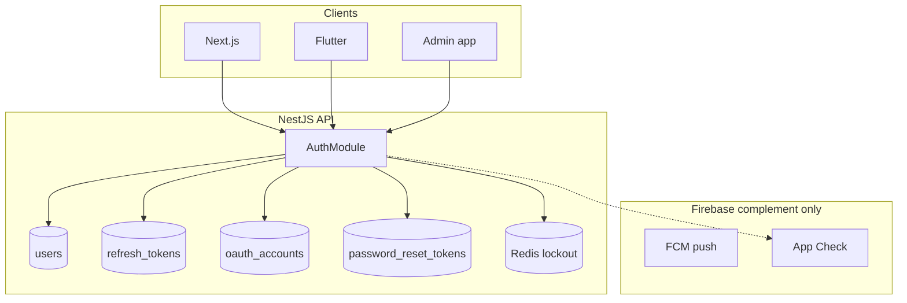

# Authentication Architecture

## Phase 1 — Current audit verdict

| Component | Verdict | Notes |
|-----------|---------|-------|
| Custom JWT + opaque refresh (Postgres) | **KEEP** | Rotation, reuse detection, device sessions |
| Email/password signup & login | **KEEP** | bcrypt(12), strong password DTO |
| Email verification (link) | **KEEP** | 48h token; soft enforcement for viewers |
| Forgot/reset password | **KEEP** | 1h token; revokes all sessions on reset |
| Google OAuth (Passport) | **KEEP** | Account linking by email |
| HttpOnly `forge_refresh` + `forge_session` | **KEEP** | Web middleware marker |
| Firebase Auth as IdP | **DO NOT USE** | Duplicates users; breaks PR #26 architecture |
| Firebase Admin | **KEEP** | FCM + App Check only |
| Disposable email block | **ENHANCED** | Signup blocklist |
| Account lockout | **ENHANCED** | Redis-backed failed login |
| OTP codes | **DEFER** | See OTP_RECOMMENDATION.md |
| MFA / TOTP | **POST-PMF** | |

## System diagram

## Why not Firebase Authentication for email

| Requirement | Custom auth | Firebase Auth primary |
|-------------|-------------|------------------------|
| Single user in Postgres | Native | Sync / dual-write |
| Refresh rotation + session list | Built | Rebuild |
| Admin impersonation | Built | Custom claims |
| Creator RBAC | JWT + guards | Second token type |
| Cost at scale | Postgres + Redis | Per MAU pricing |
| SSR with Next.js | Cookie mirror pattern | Session cookie migration |

**Recommendation:** Enterprise behavior via **enhanced custom auth** + Firebase **App Check/FCM** only.
