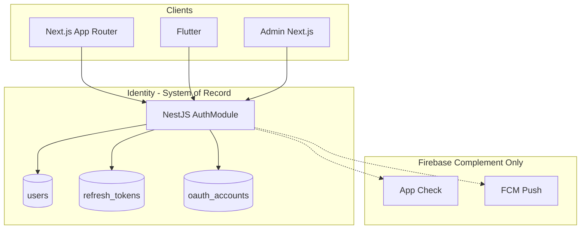
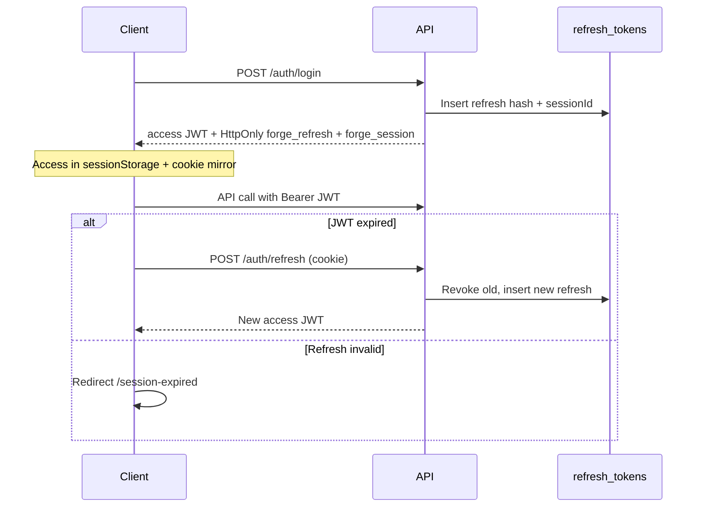
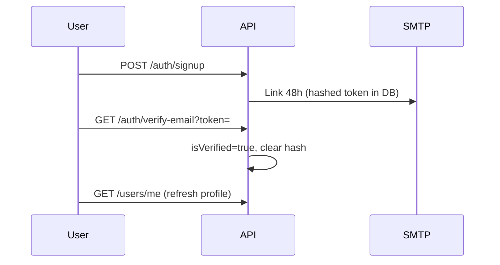
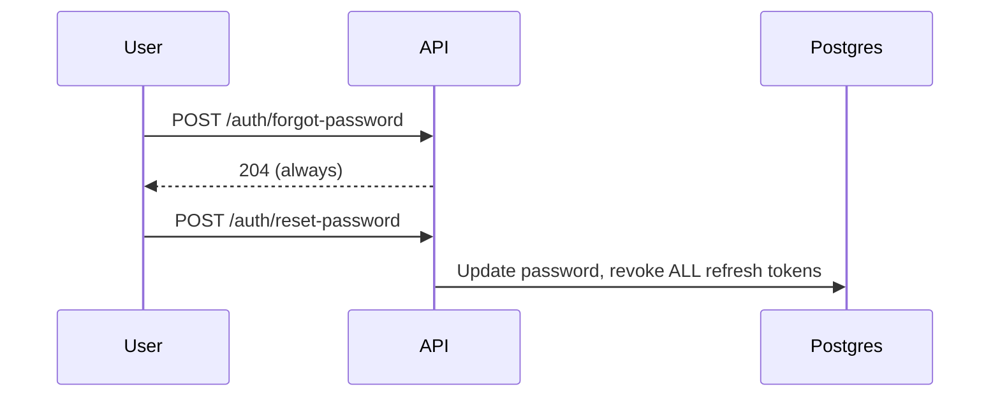
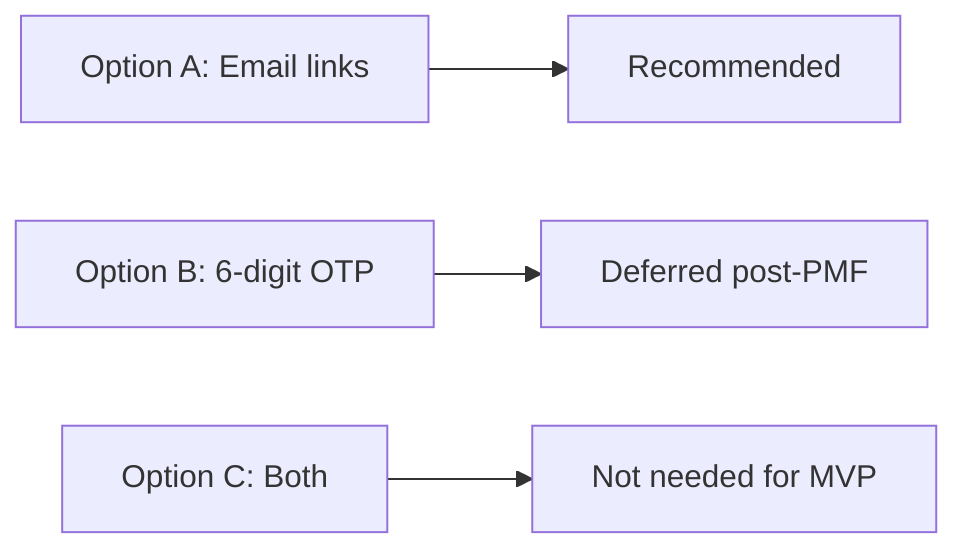

# Phase 13 — Final Deliverables

Consolidated diagrams and reports for the FORGE enterprise authentication audit.

---

## 1. Authentication Architecture



**Decision:** Custom JWT + Postgres — not Firebase Auth primary. See [ARCHITECTURE.md](./ARCHITECTURE.md).

---

## 2. Session Flow



Details: [SESSION_MANAGEMENT.md](./SESSION_MANAGEMENT.md).

---

## 3. Email Verification Flow



- Resend: `POST /auth/verify-email/resend` (JWT, throttled)
- Web middleware blocks creator **upload** until JWT `isVerified`
- API: `CreatorApprovedGuard` + optional `@RequireVerified()`

Details: [EMAIL_SIGNUP_SIGNIN.md](./EMAIL_SIGNUP_SIGNIN.md).

---

## 4. Password Reset Flow



Details: [PASSWORD_RESET.md](./PASSWORD_RESET.md).

---

## 5. OTP Flow

**Not implemented** — recommendation is verification links only.



Details: [OTP_RECOMMENDATION.md](./OTP_RECOMMENDATION.md).

---

## 6. Security Audit Report

| Severity | Finding | Status |
|----------|---------|--------|
| Critical | Middleware JWT not signature-verified | Mitigated — API enforces |
| High | Access token readable in JS | Session cookie + short TTL |
| High | No account lockout | **Fixed** — Redis lockout |
| Medium | Soft verification for viewers | By design; strict mode env |
| Medium | No MFA | Post-PMF |
| Low | No dedicated login audit table | Sessions list = device history |

Full report: [SECURITY.md](./SECURITY.md).

---

## 7. Middleware Architecture

| Class | Web | API |
|-------|-----|-----|
| PUBLIC | `/`, `/login`, `/watch` | `@Public()` |
| AUTH_ONLY | `/library`, `/profile` | JWT |
| VERIFIED_CREATOR | `/upload/*` (not become-creator) | `isVerified` + creator approved |
| ADMIN_ONLY | Blocked on consumer host | `role === admin` |

Details: [MIDDLEWARE_ROUTES.md](./MIDDLEWARE_ROUTES.md).

---

## 8. Firebase CLI Setup Guide

Firebase is used for **FCM + App Check only** — not Authentication.

```bash
firebase login
firebase use forge-studios-prod
# Enable Cloud Messaging + App Check in console
```

Full guide: [FIREBASE_INTEGRATION.md](./FIREBASE_INTEGRATION.md) and [docs/firebase/CLI_SETUP.md](../firebase/CLI_SETUP.md).

---

## 9. Next.js Integration Guide

| Concern | Implementation |
|---------|----------------|
| Login/signup | Client components + `api.post` + `persistAuthSession` |
| Cookies | `forge_refresh`, `forge_session`, `forge_access_token` mirror |
| Middleware | `apps/web/src/middleware.ts` — JWT decode + route classes |
| OAuth callback | `/auth/oauth/callback` |
| App Check | `getAppCheckToken()` on auth requests |
| Session expired | `/session-expired` server page |

Not used: Firebase Auth SDK, `signInWithEmailAndPassword`, Firebase session cookies.

Full guide: [NEXTJS_INTEGRATION.md](./NEXTJS_INTEGRATION.md).

---

## 10. Production Readiness Report

Checklist: [PRODUCTION_READINESS.md](./PRODUCTION_READINESS.md).

**Verdict:** Production-ready for millions of users on custom auth; Firebase remains a complement.
