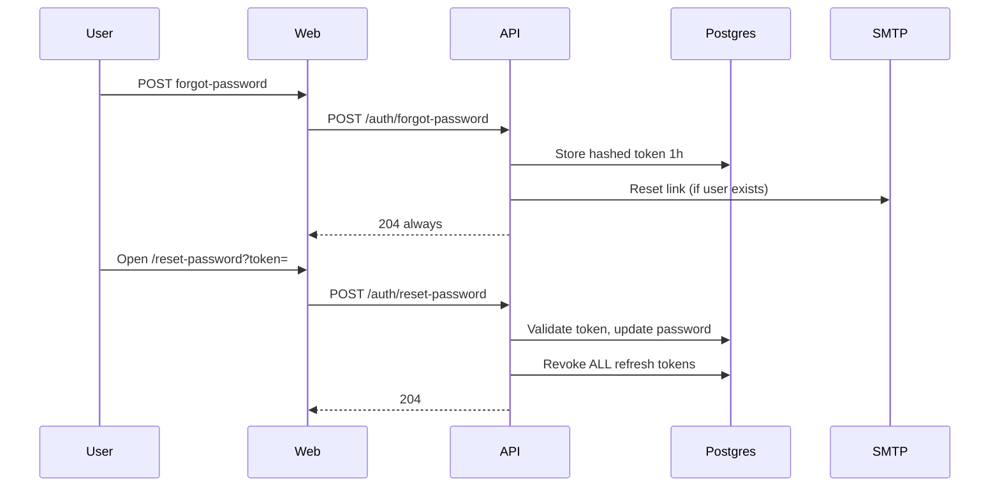

# Password Reset Flow

## Requirements met

| Requirement | Status |
|-------------|--------|
| Expiring links | 1 hour |
| One-time use | `usedAt` set on consume |
| Abuse protection | 5 requests / hour per IP |
| Enumeration safe | Always 204 on forgot |
| Session revoke | All refresh rows revoked |

## Edge cases

- Unknown email: same 204 response
- Expired/used token: 400 generic message
- User resets while logged in elsewhere: other devices lose refresh on next 401
