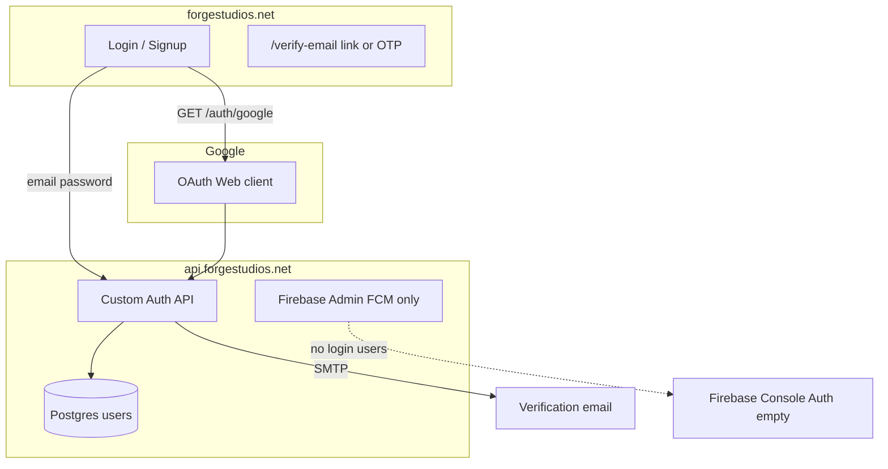

# Production Auth & Firebase Audit

**Date:** 2026-05-31  
**Firebase project:** `forge-studios-prod-61de0` (display: forge-studios-prod)  
**Service account:** `firebase-adminsdk-fbsvc@forge-studios-prod-61de0.iam.gserviceaccount.com`

Run live checks: `bash scripts/audit-production-auth.sh`

---

## 1. What is configured correctly

| Area | Status | Evidence |
|------|--------|----------|
| Firebase Admin on API | OK | `firebase.adminConfigured: true` |
| FCM on API | OK | `fcmEnabled: true` |
| Fly `FIREBASE_*` secrets | OK | All 4 names present |
| Fly Google OAuth secrets | OK | `GOOGLE_OAUTH_*` set |
| Fly SMTP | OK | `mailConfigured: true` |
| Email/password API | OK | `POST /auth/signup`, `POST /auth/login` |
| Email verification (links) | OK | `GET /auth/verify-email?token=`, resend |
| Password reset | OK | forgot + reset flows |
| Web login UI | OK | https://forgestudios.net/login shows email + Google |
| Vercel Firebase client | OK | `NEXT_PUBLIC_FIREBASE_*` + VAPID |
| Mobile `firebase_options.dart` | OK | `forge-studios-prod-61de0` |
| Firebase CLI | OK | `firebase use forge-studios-prod-61de0` |

**Firebase Console → Authentication** will stay **empty** — FORGE uses **custom JWT + Postgres**, not Firebase Auth users.

---

## 2. What is missing or misconfigured

| Issue | Impact | Fix |
|-------|--------|-----|
| **Google OAuth client is Firebase Android type** | Google sign-in fails at Google (wrong client type / redirect URI) | Use **Web application** OAuth JSON — see below |
| **Email OTP not deployed** | Production still `otpVerification: false` | Set `AUTH_EMAIL_OTP_ENABLED=true` in `secrets/auth-deploy.env` → `bash scripts/deploy-auth-secrets.sh` (API + Redis required) |
| **Local dev without `.env`** | No Google button / no SMTP locally | `npm run auth:bootstrap` + fill `apps/api/.env` |
| **Firebase Auth SDK** | Not used (by design) | Do not expect `signInWithEmailAndPassword` in app code |

### Google OAuth — critical

Production redirect uses client id like:

`616295087859-....apps.googleusercontent.com`

If this matches the **Android** client from `google-services.json`, Passport server-side OAuth will **not work**. You need a **Web application** OAuth 2.0 client:

1. [Google Cloud Credentials](https://console.cloud.google.com/apis/credentials?project=forge-studios-prod-61de0)
2. **Create credentials → OAuth client ID → Web application**
3. Authorized redirect URI: `https://api.forgestudios.net/api/v1/auth/google/callback`
4. Download JSON → `bash scripts/import-google-oauth-client.sh ~/Downloads/client_secret_*.json`
5. `bash scripts/deploy-auth-secrets.sh`

---

## 3. Architecture (production)



---

## 4. Verification commands

```bash
npm run firebase:check
npm run auth:verify
bash scripts/audit-production-auth.sh
curl -sI https://api.forgestudios.net/api/v1/auth/google | grep -i location
```

---

## 5. After fixes checklist

- [ ] Google OAuth uses **Web** client id (audit script shows PASS)
- [ ] Sign up with real email → receive link **and** OTP (if OTP enabled)
- [ ] Click link or enter OTP → `isVerified: true`
- [ ] Google sign-in completes → lands on `/` logged in
- [ ] `npm run firebase:check` all OK
