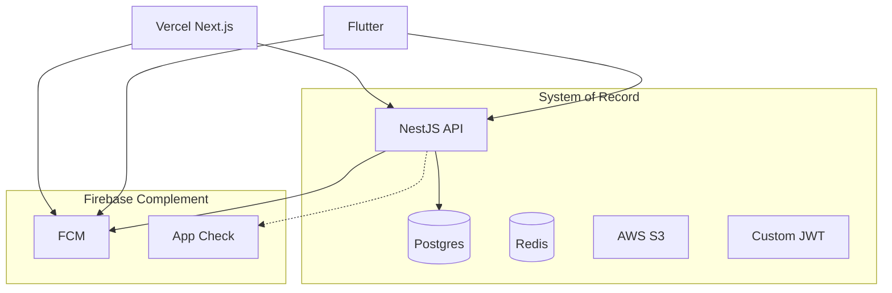

# FORGE Firebase Architecture Report

**Status:** Implemented (code + docs). **Principle:** Firebase complements the stack; it does not replace Postgres, S3, Vercel, or custom JWT auth.

## Executive verdict

| Layer | Current stack | Firebase fit |
|-------|---------------|--------------|
| Identity | Custom JWT + opaque refresh (Postgres) | Do not replace |
| Data | Postgres + TypeORM | Do not use Firestore |
| Media | S3 + CloudFront + Mux | Do not use Firebase Storage |
| Real-time | Socket.IO + Redis adapter | Do not use RTDB |
| Hosting | Vercel + Fly.io | Do not migrate Hosting |
| Errors (API) | Sentry | Keep Sentry |
| Product analytics | BullMQ → `analytics_events` | Enhance in-house |
| Push | FCM (implemented) | Primary Firebase win |
| Feature flags | `FEATURE_FLAGS` + `/platform/config` | Defer Remote Config |

## Adopted Firebase services

- **FCM** — push dispatch via `push-dispatch` BullMQ worker
- **App Check** — optional attestation on public auth/analytics routes
- **Admin SDK** — FCM + App Check verification only

## Rejected Firebase services

Firestore, Realtime Database, Firebase Hosting, Firebase Storage, Firebase Auth (primary), Firebase Analytics (web primary), Crashlytics on API/Next.js.

## Architecture diagram

## Related docs

- [AUTH_DESIGN.md](./AUTH_DESIGN.md)
- [FCM_NOTIFICATIONS.md](./FCM_NOTIFICATIONS.md)
- [MIGRATION_PLAN.md](./MIGRATION_PLAN.md)
