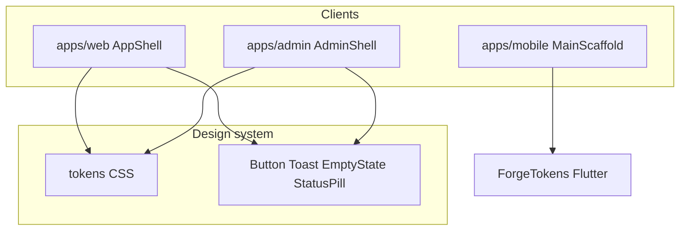

# Phase 01 — UI / UX (Fresh Master Execution Audit)

**Phase:** 01 — UI/UX  
**Date:** 2026-08-29  
**Status:** Fresh analyze → research → audit → docs → roadmap → **validated**  
**Source of truth:** Current codebase only (`apps/web`, `apps/admin`, `apps/mobile`, `packages/design-system`). Prior phase reports are historical.

---

## 1. Objective

Bring FORGE’s viewer / creator / admin / mobile surfaces to **YouTube-parity interaction quality**: chrome modes, design-system consumption, feed/watch/live IA, Studio/admin empty-error states, and mobile nav parity — without Phase 08 player rewrite or Phases 04–07 product feature builds.

---

## 2. Existing state (code-backed)

| Surface | Stack / chrome | DS adoption (sample) |
| --- | --- | --- |
| **web** | Next App Router; `AppShell` modes: minimal / shorts / watch+studio (TopBar) / default (TopBar+SideNav+MobileNav) | ~135 files import DS; `EmptyState` ~30; `Button` ~59; `DataTable`/`Sparkline` 0 |
| **admin** | `AdminShell` + `adminTier` nav gating; `/ai` under Moderation | DS tables/pages; user-detail `useToast` |
| **mobile** | Flutter GoRouter; tabs Home·Shorts·Create·Subs·You; feature `data/` repos | Local Forge tokens (not React DS) |
| **design-system** | Tokens + Button/Toast/EmptyState/StatusPill/`buttonClassName` | `primary-button` only inside DS |

### Chrome architecture (web)

| Mode | Routes | Chrome |
| --- | --- | --- |
| Minimal | auth, offline, maintenance, embed | No TopBar/SideNav |
| Shorts | `/shorts` | Full-bleed |
| Watch / Studio | `/watch/*`, `/studio/*` | TopBar only |
| Default | home, explore, library… | TopBar + SideNav + MobileNav |

SideNav PRIMARY: Home, Shorts, Trending, Subscriptions, Explore, Live.  
SideNav YOU: You, Updates, History, Watch later, Liked + Studio CTA.  
MobileNav: Home · Shorts · Create · Subs · You (YouTube IA).

### Brand

Keep FORGE Narrative purple (functional replica ≠ YouTube trademark red). Reconfirmed: WCAG contrast via semantic tokens; no Critical contrast blockers found in this pass.

---

## 3. Industry research (YouTube → FORGE)

| Pattern | FORGE | Gap |
| --- | --- | --- |
| Guest/signed-in feed-first home | Feed-first (hero removed) | Aligned |
| Watch theater keeps engagement | Comments/info stay; related rail collapses | Aligned |
| Live theater keeps chat | Was `fixed inset-0` overlay (N1) | **Closed** — widen grid, keep chat |
| Mobile Create center tab | Create → upload menu | Aligned |
| Share analytics on share actions | Watch/Shorts/feed wired (Wave 14) | Aligned for video |
| Studio MRR currency consistency | `formatCentsUsd` | Aligned |
| Admin MFA + tiered ops | MFA gate + `AdminTier` | Aligned |

---

## 4. Audit findings

### Critical / High (Aug-23 IDs) — all CLOSED

| ID | Status | Evidence |
| --- | --- | --- |
| C1 MRR currency | CLOSED | `formatCentsUsd` + studio dashboard/analytics |
| H1 `/updates` nav | CLOSED | `SideNav` + library hub |
| H2 Verified badge | CLOSED | `StatusPill tone="primary"` |
| H3 RealtimeToasts | CLOSED | DS `useToast` bridge |
| H4 `primary-button` | CLOSED | 0 hits in web/admin apps |
| H5 Dual Create mobile | CLOSED | TopBar Create `hidden md:block` |
| H6 Theater strips comments | CLOSED | Watch keeps engagement column |
| H7 Touch player controls | CLOSED | `@media(hover:none)` opacity |
| H8 CommentsPanel API | CLOSED | `comments-api.ts` + split |
| H9 Search history | CLOSED | Search page `pushSearchHistory` |
| H10–H11 Upload DnD | CLOSED | Step 2 drop + lost-file |
| H12 Subscribers privacy | CLOSED | Owner/admin + API gate |
| H13 `getMyVideos` | CLOSED | `fetchStudioLibrary` |
| H14 Studio live scope | CLOSED | `?creatorId=` |
| H15–H18 Studio lists | CLOSED | Pagination + errors |
| H19 Admin AI | CLOSED | `/ai` budget + queue |
| H20 Admin mutation toasts | CLOSED | User detail `onError` |
| H21 Admin RBAC tiers | CLOSED | `AdminTier` + UI assign |
| H22 Mobile `data/` | CLOSED | Feature repositories |
| H23 Watch god-file | CLOSED | Split into engage/comments/HLS blocks |

### New residuals (this pass)

| ID | Severity | Finding | Disposition |
| --- | --- | --- | --- |
| N1 | Medium | Live theater `fixed inset-0 z-50` occludes chat | **Closed** — layout widens; chat stays visible |
| N2 | Medium | Studio comments still capped scan (24×8) | **Closed** — `GET /creators/me/comments` (Wave 57) |
| N3 | Medium | DS DataTable/charts unused on web | Defer Phase 02 |
| N4 | Medium | Mobile Trending API unused | **Closed** — `TrendingScreen` + `/trending` (Wave 38) |
| N5 | Low–Med | Studio tiers list shows raw `usd 99` | **Closed** — `formatCentsCurrency` |

### Architecture (text)



### Component hierarchy (web chrome)

```
AppShell
├── TopBar (Create / Search / Notifications / Account)
├── SideNav (md+)
├── MobileNav (default mode)
├── main {children}
└── SiteFooter
StudioShell (under /studio)
AdminShell (admin app)
```

### User / navigation flows

- Guest: browse → sign-in gates on engage.
- Viewer: feed → watch/shorts → library/history → updates.
- Creator: Studio → upload / live / analytics / tiers.
- Admin: dashboard → content/reports/users/AI/copyright.

### Risks

| Risk | Severity | Mitigation |
| --- | --- | --- |
| Live theater regression | Med | Match watch: no fullscreen overlay |
| DS under-adoption drift | Low | Thin EmptyState/Button prefs; no big bang |
| Studio comments completeness | Med | Phase 06 API pagination |

### Acceptance criteria (Phase 01 close)

- [x] All Aug-23 Critical/High CLOSED against current code
- [x] MRR / verified badge / updates nav / admin errors / theater watch / touch controls / upload DnD / privacy / studio scope / AI / RBAC / mobile repos
- [x] N1 live theater chat visible
- [x] N5 tier prices use money formatter
- [x] Docs + roadmap refreshed 2026-08-29
- [x] No new Critical/High open
- [x] Phase report written

---

## 5. Folder structure (UI-relevant)

```
apps/web/src/{app,components,lib}
apps/admin/src/{app,components,lib}
apps/mobile/lib/{features,core,shared}
packages/design-system/{tokens,src/react,tailwind}
docs/phases/01-ui-ux/
```

---

## 6. Testing / optimization / production checklist

**Testing:** Vitest on touched web components; Flutter unit where repos change; manual live theater + Studio tiers display.  
**Optimization:** No bundle work in mop-up; avoid fixed overlay reflows.  
**Production:** Dual-theme tokens only; no secrets in UI; destructive actions keep ConfirmDialog/toasts already shipped.
