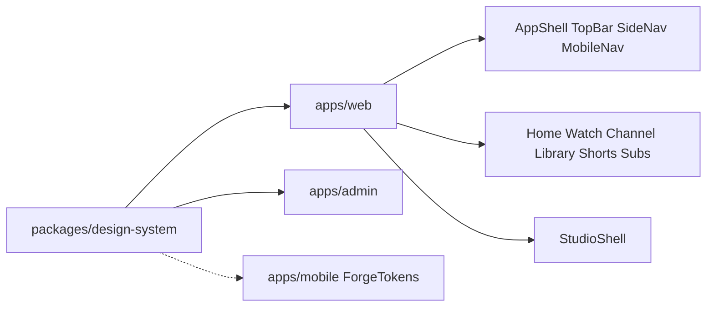

# Phase 01 — UI/UX (Fresh Restart)

**Status:** Complete — proceed to Phase 02  
**Source of truth:** Current codebase (`apps/web`, `apps/mobile`, `packages/design-system`, light Admin shell)  
**Product goal:** YouTube-replica UX on FORGE stack (`forge-youtube-replica`)

---

## 1. Executive objective

Close remaining Phase 01 chrome, design-system, product-voice, and immersive-shell gaps so primary consumer/creator surfaces feel production-grade and YouTube-parity oriented—without swallowing Phases 04–12.

---

## 2. Existing state (Step 1 — Analyze)

### Architecture

### Already YouTube-parity-complete (do not redo)

| Area | Evidence |
| --- | --- |
| Desktop primary IA | SideNav: Home, Shorts, Trending, Subscriptions + You / History / Watch later / Liked |
| Mobile web bottom nav | MobileNav: Home, Shorts, Subs, You (+ Studio when signed in) |
| Product voice (home/footer/meta) | Hero, SiteFooter, root metadata — video/Shorts/live |
| Studio nav IA | Content / Live / Analytics / Memberships / Super Thanks |
| Web theme | ThemeProvider + FOUC script + TopBar toggle; DS `.light` / `.dark` |
| Shorts baseline | Snap feed, double-tap like, engage rail, comments sheet |
| Feed card actions | Not interested, don’t recommend, watch later, playlist save |

### Remaining gaps (code audit)

| ID | Severity | Surface | Finding |
| --- | --- | --- | --- |
| C1 | Critical | web | Dual skip-links + duplicate `#main-content` in `layout.tsx` and `AppShell.tsx` |
| H1 | High | web | Studio nested under consumer AppShell (TopBar + SideNav + Studio sidebar) |
| H2 | High | web | Shorts still shows TopBar; height fudge `100dvh-8rem` |
| H3 | High | mobile | Shorts inside MainScaffold bottom NavigationBar |
| H4 | High | mobile | Dark-only theme; web has light/dark |
| H5 | High | mobile | Approved creators replace You with Studio → Library buried |
| H6 | High | ds/web/mobile | `SkillChip` still canonical export name; TopicChip is alias |
| H7 | High | web | Continue watching mounted twice (HomePageContent + HomeFeedTabs) |
| M1 | Medium | web | `TrendingSkills` filename residue |
| M2 | Medium | web | Explore skill path naming |
| M3 | Medium | web | TopicChip on every FeedCard (non-YT hierarchy) |
| M4 | Medium | web | Home tabs say “Discover” not “For you” |
| M5 | Medium | web | Theme toggle hidden on mobile web |
| M6 | Medium | admin | Channel-points leftover in AdminShell nav |
| L1 | Low | web | FeedCard emoji placeholders |
| L2 | Low | web | Shorts share deep-links to `/watch/:id` |

---

## 3. Research — YouTube pattern baseline (Step 2)

| Pattern | YouTube | FORGE gap |
| --- | --- | --- |
| Skip / landmark | Single main landmark | Dual `#main-content` |
| Studio chrome | Own shell, no consumer side nav | Nested |
| Shorts | Full-bleed vertical, minimal chrome | TopBar / bottom nav remain |
| Theme | Light + dark | Mobile dark-only; mobile-web toggle hidden |
| Bottom nav | Home / Shorts / Subs / You / Create | Creators lose You for Studio |
| Home | For you + continue watching once | Discover + duplicate continue |
| Topic chips | Not on every grid thumb | TopicChip always on cards |

---

## 4. Recommended architecture (Step 4)

### AppShell modes

| Mode | Routes | Chrome |
| --- | --- | --- |
| `minimal` | auth, offline, embed, … | none |
| `immersive` | `/watch/*`, `/shorts/*` | none (full-bleed) |
| `studio` | `/studio/**` | TopBar only (no SideNav/MobileNav/footer) |
| `default` | everything else | TopBar + SideNav + MobileNav + footer |

### Design system voice

- Canonical: `TopicChip` (keep `SkillChip` as deprecated alias for one release if needed).
- Feed grid: no topic chip on thumbnail; Live badge stays.

### Mobile shell

- Bottom nav always: Home, Shorts, Subs, You (+ optional Create/Studio entry elsewhere).
- Shorts route outside ShellRoute bottom bar (full-screen).
- Light + dark ColorScheme mirrored from DS tokens.

---

## 5. Acceptance criteria

- [ ] Single skip-link and single `#main-content`
- [ ] `/studio/**` has no consumer SideNav/MobileNav/footer
- [ ] Web Shorts is full-bleed (no TopBar)
- [ ] Mobile Shorts has no bottom nav
- [ ] TopicChip is the documented/canonical chip; primary surfaces import it
- [ ] One Continue watching rail; home tab labeled “For you”
- [ ] FeedCard grid does not show topic chips
- [ ] Mobile light theme + You always in bottom nav
- [ ] Mobile-web theme toggle reachable
- [ ] Admin shell has no channel-points primary nav item
- [ ] Docs rewritten; report filed

---

## 6. Explicit non-goals

- Rebrand to YouTube red/Roboto
- Rename API `skillTags` / DB columns
- Player engine, Mux, search ranking, recs, monetization depth
- Full Admin platform rebuild (Phase 07)

---

## 7. Risks

| Risk | Mitigation |
| --- | --- |
| Studio loses consumer TopBar search | Keep slim TopBar in studio mode |
| Shorts without TopBar: hard to leave | In-feed back/home control already present or add minimal exit |
| Mobile theme flash | Persist preference; match web `forge-theme` key if practical |
| SkillChip rename breaks imports | Keep alias export |
