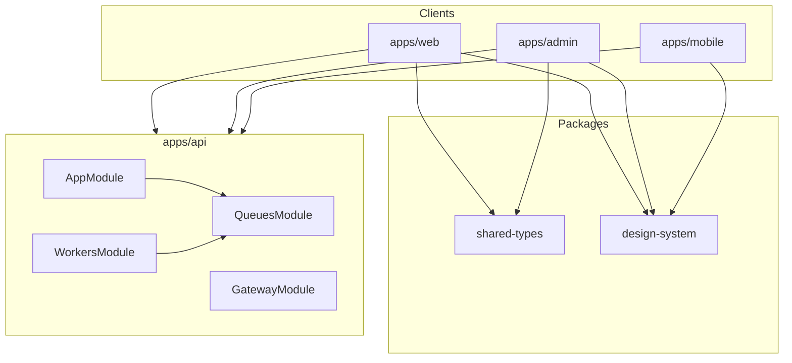

# FORGE module boundary map (Phase 02 — Fresh)

Authoritative for agents/humans. Reflects `AppModule` + client chrome as of Phase 01/02 restart.

## System diagram

## YouTube-core (primary product)

| Module / surface | Path | Notes |
| --- | --- | --- |
| Auth / sessions | `modules/auth` | JWT, OAuth, lockout, OTP |
| Users / channels | `modules/users` | Profiles, channel links, privacy |
| Content / VOD | `modules/content` | Videos, Shorts, Mux VOD, captions |
| Engagement | `modules/engagement` | Like, subscribe, comments, notify level |
| Feed | `modules/feed` | For you / following / diversity |
| Playlists | `modules/playlists` | User + system (liked, watch later) |
| Search | `modules/search` | FTS + suggestions |
| Streaming / live | `modules/streaming`, `live-broadcast`, `stream-chat` | Live + Super Chat |
| Notifications | `modules/notifications` | In-app + push dispatch |
| Analytics | `modules/analytics` | Ingest + retention queues |
| Reports | `modules/reports` | Moderation |
| Admin | `modules/admin` | Ops console |
| Gateway | `gateway/` | Socket.IO realtime |
| Billing / entitlements | `modules/billing`, `entitlements` | Memberships, Super Thanks |
| Categories | `modules/categories` | Topic taxonomy (API may still say skillTags) |

## Soft-retired / feature-flagged (do not promote in chrome)

| Module | Path | Gate |
| --- | --- | --- |
| Courses / programs LMS | `modules/courses` | `CoursesModule.register()` only if `FEATURES_SKILL_ECONOMY_LMS=true`; else empty module. Controllers also guarded by `SkillEconomyLmsGuard` → HTTP 410 |
| Podcasts controller | `content/podcasts.controller` | Same LMS flag |
| Channel points | `modules/channel-points` | `ChannelPointsModule.register()` — empty unless `FEATURES_SKILL_ECONOMY_LMS=true` |
| Gamification | `modules/gamification` | `GamificationModule.register()` — same LMS gate |
| Articles | `modules/articles` | `ArticlesModule.register()` — same LMS gate |
| Q&A sessions | `modules/qa-sessions` | `QaSessionsModule.register()` — same LMS gate |
| Study groups | `modules/study-groups` | `StudyGroupsModule.register()` — same LMS gate |

## Adjacent (retain; secondary surfaces)

| Module | Path |
| --- | --- |
| Communities | `modules/communities` |
| Creator resources | `modules/creator-resources` |
| Referral | `modules/referral` |
| Fraud detection | `modules/fraud-detection` |
| Access sessions | `modules/access-sessions` |
| Direct messages | `modules/direct-messages` |
| Mail / Firebase | `modules/mail`, `modules/firebase` |
| Platform | `modules/platform` |

## Infrastructure

| Concern | Path |
| --- | --- |
| Queue registration | `queues/queues.module.ts` (`QueuesModule`) is the **central** registration hub. Feature modules may also `BullModule.registerQueue(...)` for the same named queues (Nest/Bull allows duplicate register-by-name); do not treat QueuesModule as the exclusive registration site. |
| Workers | `modules/workers` — loaded when `shouldLoadWorkersModule()` (Fly worker / non-Jest) |
| Database / migrations | `database/` |
| Common | `common/` (guards, filters, CLS, throttler, features) |
| Config | `config/configuration.ts` + production zod gate in `env-production.schema.ts` (invoked from `main.ts`) |

## Client chrome contracts (Phase 01)

| Concern | Contract |
| --- | --- |
| Web `AppShell` modes | `minimal` \| `immersive` (watch/shorts) \| `studio` (TopBar only) \| `default` |
| Design chips | Canonical `TopicChip`; `SkillChip` deprecated alias |
| Theme | Web/admin: CSS `.light`/`.dark` + ThemeProvider. Mobile: `AppTheme` + `themeModeProvider` + `ForgePalette` ThemeExtension |

## Dual-theme token strategy

| Platform | Source of truth | Runtime |
| --- | --- | --- |
| Web / Admin | `packages/design-system/tailwind/theme-modes.css` | `html.light` / `html.dark` |
| Mobile | `ForgeTokens` dark consts (parity) + `ForgePalette` light/dark | `ThemeExtension` via `ForgeTokens.of(context)` |
| Parity check | `scripts/check-token-parity.js` | Dark hex only; light* Dart consts are intentional extras |
