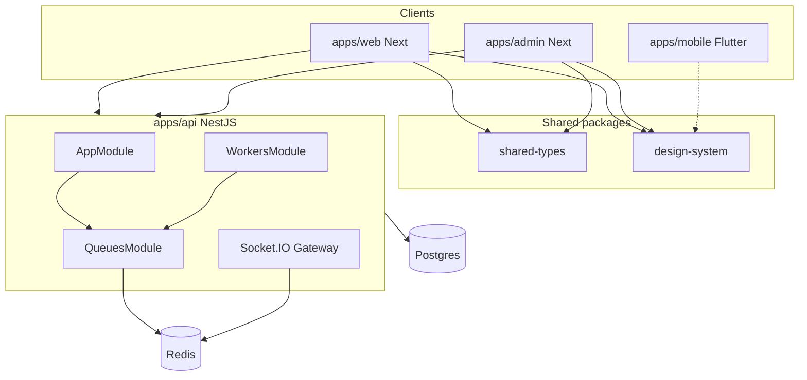

# Phase 02 — Technical Architecture (Fresh Restart Kickoff)

**Status:** Analysis in progress (post Phase 01)  
**Prior doc:** Stale claims below were written before Phase 01 fresh restart — treat this file as the new source of truth for Phase 02 Steps 1–6.

---

## 1. Objective

Harden monorepo architecture boundaries, shared contracts, env validation, dual-theme token strategy (now that Phase 01 shipped light/dark chrome), queue/module boundaries, and system docs—without swallowing Phases 03–10.

---

## 2. Existing state (fresh analyze — 2026-08-03)

| Layer | Current state (code) |
| --- | --- |
| Monorepo | npm workspaces: api, web, admin, packages/*; Flutter mobile separate |
| Design system | `@forge/design-system` with TopicChip canonical; dual CSS `.light`/`.dark` |
| Web chrome | `AppShell` modes: minimal / immersive / studio / default (Phase 01) |
| Web theme | `ThemeProvider` + FOUC script; TopBar toggle |
| Mobile theme | `AppTheme.light` + `dark` + `themeModeProvider`; many screens still hardcode dark `ForgeTokens` consts |
| API | Nest feature modules; `QueuesModule` extracted; `WorkersModule` conditional on Fly worker; `CoursesModule.register()` feature-flagged |
| Economy residue | `ChannelPointsModule`, `GamificationModule` still in AppModule; Admin nav item removed in Phase 01 |

---

## 3. Phase 01 handoff (must account for)

1. **AppShell mode matrix** — document as shared IA contract; Phase 04 routing should not fight immersive/studio lists.
2. **Dual-theme tokens** — promote Flutter `ThemeExtension` / `ForgeTokens.of(context)` so light mode is coherent beyond Material chrome.
3. **TopicChip contract** — remove remaining `SkillChip` call sites in docs/CI; API `skillTags` stays until a data phase.
4. **Shorts immersive** — `/shorts?v=` share identity needs deep-link hydration (routing or Shorts player phase).

---

## 4. Audit findings (initial)

| ID | Severity | Finding |
| --- | --- | --- |
| H1 | High | Flutter token statics ignore ThemeMode → broken light surfaces |
| H2 | High | Domain types split: web `src/types` vs incomplete `shared-types` |
| M1 | Medium | AppModule still imports LMS/economy modules behind flags / soft-retire |
| M2 | Medium | Duplicate ThemeProviders (web vs admin) — acceptable but undocumented |
| M3 | Medium | Module boundary map / ADRs may be stale vs `QueuesModule` + skill-economy guard |
| L1 | Low | Token parity script ignores light Dart consts |

---

## 5. Recommended Phase 02 slices (draft roadmap)

| Slice | Priority | Notes |
| --- | --- | --- |
| A. Architecture docs refresh (MODULE_BOUNDARY_MAP, ADRs) | P0 | Reflect QueuesModule, AppShell modes, LMS soft-retire |
| B. Flutter ThemeExtension / of(context) token access | P0 | Unblocks true light UX |
| C. shared-types expansion plan (Video/User) — no big bang | P1 | Contract strategy only unless cheap |
| D. Env validation consistency (web api client uses zod env) | P1 | Security/reliability |
| E. Economy module load strategy documentation | P1 | Align with FEATURES_SKILL_ECONOMY_LMS |

**Do not implement in Phase 02:** DB migrations (03), full nav IA (04), player engines (08–10).

---

## 6. Acceptance criteria (Phase 02)

- [ ] Fresh MODULE_BOUNDARY_MAP matches AppModule imports
- [ ] Dual-theme architecture documented for web CSS + Flutter
- [ ] Flutter light mode usable on primary shell screens without dark hardcodes (or explicit debt list)
- [ ] Env/client contract gaps listed with fix or defer
- [ ] PHASE_02_REPORT with readiness score

---

## 7. Next step

Validate this roadmap, then implement slices A→B first. Prior stale `PHASE_02_TECH_ARCHITECTURE.md` / `PHASE_02_REPORT.md` claiming “Complete” are superseded by this kickoff until a new report is filed.
