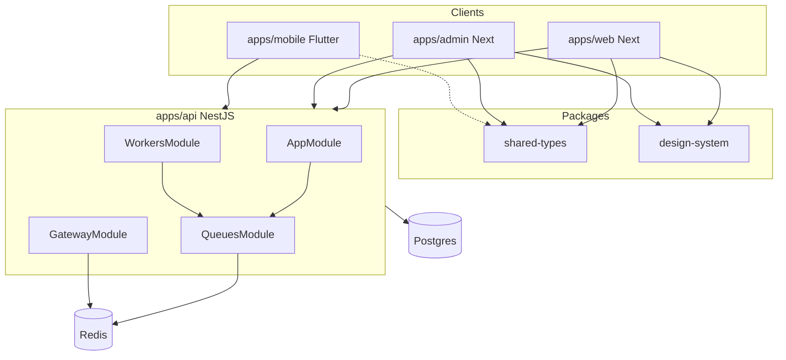

# Phase 02 — Technical Architecture (Fresh · 2026-08-04)

**Status:** Implemented (scoped depth) · Steps 1–10 complete  
**Source of truth:** Live codebase + this doc

---

## 1. Objective

Harden monorepo contracts, theme-token coherence, and module-boundary docs without swallowing Phases 03–10 (DB, video pipeline, streaming, search…).

---

## 2. Existing architecture

| Layer | Stack |
| --- | --- |
| API | NestJS feature modules, BullMQ workers (Fly), Socket.IO, TypeORM, Redis |
| Web / Admin | Next.js App Router, React Query, DS tokens |
| Mobile | Flutter + Riverpod + GoRouter; ForgePalette ThemeExtension |
| Contracts | `@forge/shared-types` (domain, analytics, entitlements, flags) |

---

## 3. Audit findings (this pass)

| ID | Sev | Finding | Resolution |
| --- | --- | --- | --- |
| H1 | High | `shared-types` dist stale — missing `video.impression` | Rebuilt package |
| H2 | High | Web `SubscriptionTier` duplicated locally | Re-export from shared entitlements (aligned fields) |
| H3 | High | Flutter `LiveBadge` used dark `ForgeTokens.live` static | `ForgeTokens.of(context).live` |
| M1 | Med | Module map claimed channel-points always loaded | Corrected: `.register()` LMS-gated |
| M2 | Med | Duplicate ThemeProviders web/admin | Accepted; separate storage keys |
| L1 | Low | Flutter screens mostly already on `ForgeTokens.of` | Confirmed |

---

## 4. Decisions

1. **Keep** dual ThemeProviders (web vs admin) — different default/storage.
2. **Keep** LMS modules behind `register()` — do not delete in Phase 02 (data/safety → later).
3. **SubscriptionTier** canonical home = `shared-types/entitlements` with optional `billingInterval`, `maxConcurrentDevices`, `createdAt`.

---

## 5. Acceptance criteria

- [x] `packages/shared-types` build includes `video.impression`
- [x] Web types re-export `SubscriptionTier` from shared
- [x] `LiveBadge` theme-aware
- [x] MODULE_BOUNDARY_MAP matches `*.register()` gates
- [x] Web `tsc` clean for analytics / types

---

## 6. Deferred

| Item | Phase |
| --- | --- |
| Deep shared-types coverage for every DTO | Ongoing / API phases |
| Remove LMS modules entirely | Product + data migration |
| Split god Nest services | 05–08 as touched |
| Infra / Fly topology redesign | 18 |
